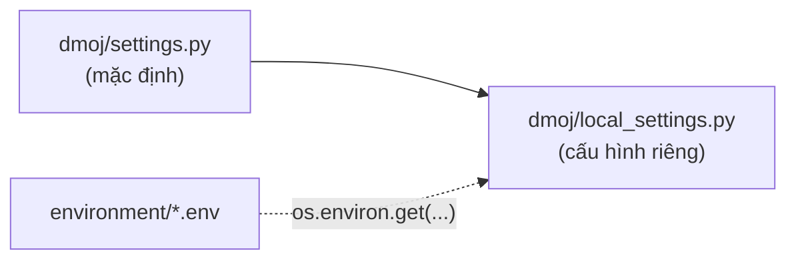

# Biến môi trường

Trang này dành cho người cài đặt và vận hành LCOJ bằng Docker. Bạn sẽ biết có những file cấu hình nào trong `dmoj/environment/`, từng biến dùng để làm gì, giá trị mặc định ra sao và cách áp dụng khi thay đổi.

Tất cả đường dẫn bên dưới tính từ thư mục `dmoj/` của repo [lcoj-docker](https://github.com/luyencode/lcoj-docker).

## Các file môi trường

| File | Tạo từ file mẫu | Được nạp vào dịch vụ | Nội dung |
|---|---|---|---|
| `environment/site.env` | `environment/site.env.example` | site, celery, bridged, wsevent, nginx | Cấu hình website Django |
| `environment/mysql.env` | `environment/mysql.env.example` | db, site, celery, bridged, wsevent | Tên database, user, mật khẩu |
| `environment/mysql-admin.env` | `environment/mysql-admin.env.example` | db | Mật khẩu root của MariaDB |

Các file `*.env` chứa bí mật nên đã được đưa vào `.gitignore`. Chỉ các file `*.example` được commit.

### Tạo file lần đầu

1. Sao chép file mẫu:

   ```sh
   cd dmoj
   cp environment/site.env.example environment/site.env
   cp environment/mysql.env.example environment/mysql.env
   cp environment/mysql-admin.env.example environment/mysql-admin.env
   ```

2. Thay các giá trị `<secret key>` và `<password>` bằng giá trị thật (xem [Tạo SECRET_KEY](#secret-key)).
3. Sửa `HOST`, `SITE_FULL_URL`, `MEDIA_URL` theo tên miền của bạn.

::: tip
`./scripts/initialize` **không** tạo các file `.env`. Script này chỉ tạo thư mục và sao chép file cấu hình mẫu (xem [Các script hỗ trợ](/operate/scripts)).
:::

## Cách LCOJ đọc biến môi trường

Django nạp cấu hình theo thứ tự:



1. `dmoj/repo/dmoj/settings.py` chứa giá trị mặc định. Không sửa file này.
2. Cuối file, `settings.py` chạy `dmoj/repo/dmoj/local_settings.py`. File này được `./scripts/initialize` sao chép từ `dmoj/config/local_settings.py`.
3. Trong `local_settings.py`, một số thiết lập được đọc bằng `os.environ.get('TÊN_BIẾN', 'mặc định')`. Với những thiết lập này, giá trị trong file `.env` được ưu tiên; nếu biến không được đặt thì dùng giá trị mặc định ghi trong code.

Nói cách khác, biến môi trường chỉ ghi đè được **những thiết lập mà `local_settings.py` đọc từ môi trường**, liệt kê ở các bảng dưới đây. Các thiết lập khác phải sửa trực tiếp trong `local_settings.py` (xem [Thiết lập không phải biến môi trường](#hardcoded-settings)).

## `site.env`

| Biến | Bắt buộc? | Mặc định (nếu không đặt) | Ý nghĩa |
|---|---|---|---|
| `HOST` | Có | `localhost` | Tên miền công khai, không kèm `http://`. Dùng cho `ALLOWED_HOSTS = [HOST]` và địa chỉ WebSocket `ws://HOST/event/`, `wss://HOST/event/` |
| `SITE_FULL_URL` | Nên có | `http://localhost/` | URL đầy đủ của site, dùng để tạo link tuyệt đối (ví dụ link trong webhook) |
| `MEDIA_URL` | Có | `http://localhost/` | URL gốc để truy cập file media. nginx phục vụ media ngay tại gốc site (`/martor`, `/pdf`...), nên thường trùng với `SITE_FULL_URL`. Phải kết thúc bằng `/` |
| `DEBUG` | Không | `0` | Chỉ bật khi giá trị **đúng bằng** `1`. Mọi giá trị khác (`true`, `yes`...) đều là tắt |
| `SECRET_KEY` | Có | rỗng | Khóa bí mật của Django. Để trống thì Django không khởi động được |
| `EVENT_DAEMON_POST` | Không | `ws://wsevent:15101/` | Địa chỉ site gửi sự kiện tới wsevent |
| `REDIS_CACHING_URL` | Không | `redis://redis:6379/0` | Redis dùng làm cache |
| `CELERY_BROKER_URL` | Không | `redis://redis:6379/1` | Hàng đợi tác vụ của Celery |
| `CELERY_RESULT_BACKEND` | Không | `redis://redis:6379/1` | Nơi Celery lưu kết quả tác vụ |
| `BRIDGED_HOST` | Không | `bridged` | Tên máy của bridged. Site kết nối tới `BRIDGED_HOST:9998`, bridged lắng nghe judge tại `BRIDGED_HOST:9999` |
| `SOCIAL_AUTH_GOOGLE_OAUTH2_KEY` | Có (trên LCOJ) | rỗng | Client ID của Google OAuth |
| `SOCIAL_AUTH_GOOGLE_OAUTH2_SECRET` | Có (trên LCOJ) | rỗng | Client secret của Google OAuth |
| `MOSS_API_KEY` | Không | rỗng | Khóa [MOSS](https://theory.stanford.edu/~aiken/moss/) để kiểm tra đạo code trong kỳ thi |

Ví dụ `site.env` cho production (giá trị bí mật để dạng placeholder):

```ini
HOST=luyencode.net
SITE_FULL_URL=https://luyencode.net/
MEDIA_URL=https://luyencode.net/

DEBUG=0
SECRET_KEY=<chuỗi ngẫu nhiên dài>

# Event server
EVENT_DAEMON_POST=ws://wsevent:15101/

# Redis and Celery
REDIS_CACHING_URL=redis://redis:6379/0
CELERY_BROKER_URL=redis://redis:6379/1
CELERY_RESULT_BACKEND=redis://redis:6379/1

# Bridge
BRIDGED_HOST=bridged

# Đăng nhập Google
SOCIAL_AUTH_GOOGLE_OAUTH2_KEY=<client-id>.apps.googleusercontent.com
SOCIAL_AUTH_GOOGLE_OAUTH2_SECRET=<client-secret>

# Kiểm tra đạo code (tùy chọn)
MOSS_API_KEY=<moss-user-id>
```

Một số lưu ý:

- **Chỉ có một tên miền.** `ALLOWED_HOSTS` chỉ chứa đúng `HOST`. Nếu cần phục vụ thêm tên miền khác (ví dụ `www.luyencode.net`), hãy sửa `ALLOWED_HOSTS` trong `local_settings.py`.
- **Đăng nhập chỉ qua OAuth.** LCOJ đặt `OAUTH_ONLY = True` trong `local_settings.py`, nên đăng ký bằng mật khẩu bị tắt. Thiếu hai biến Google OAuth thì người dùng mới không có cách nào đăng ký.
- **`SITE_FULL_URL` và dấu `/` cuối.** File mẫu có `/` ở cuối và site vẫn chạy bình thường. Tuy nhiên một số chỗ (webhook) nối chuỗi trực tiếp như `SITE_FULL_URL + '/user/...'`, nên link sinh ra có thể bị `//`. Nếu dùng webhook, cân nhắc bỏ `/` cuối.
- **`MOSS_API_KEY` để trống.** Code chỉ kiểm tra `MOSS_API_KEY is not None`, mà giá trị mặc định là chuỗi rỗng, nên tab MOSS vẫn hiện trong trang kỳ thi (với người có quyền `moss_contest`) dù chưa có khóa, và sẽ lỗi khi chạy.
- **Các giá trị Docker nội bộ** (`EVENT_DAEMON_POST`, `REDIS_*`, `CELERY_*`, `BRIDGED_HOST`) dùng tên dịch vụ trong `docker-compose.yml`. Chỉ đổi khi bạn tách dịch vụ sang máy khác.

::: danger Không bật DEBUG trên production
`DEBUG=1` làm Django hiển thị trang lỗi chi tiết, lộ cấu hình và đường dẫn nội bộ cho bất kỳ ai. Chỉ dùng trên máy phát triển.
:::

### `NGINX_PORT` {#nginx-port}

`docker-compose.yml` publish nginx bằng `${NGINX_PORT:-8071}:80`. Đây là **biến thay thế của Docker Compose**, được đọc khi Compose phân tích file YAML, không phải biến bên trong container.

- Mặc định: `8071` (Cloudflare Tunnel trỏ vào cổng này).
- Compose chỉ lấy giá trị từ biến môi trường của shell hoặc file `dmoj/.env` (nằm cạnh `docker-compose.yml`). Đặt `NGINX_PORT` trong `environment/site.env` **không** đổi được cổng publish; nó chỉ được đưa vào bên trong container nginx và không có tác dụng gì.

Muốn đổi cổng, tạo hoặc sửa `dmoj/.env`:

```ini
NGINX_PORT=8080
```

rồi chạy `docker compose up -d nginx` để tạo lại container nginx.

## `mysql.env` và `mysql-admin.env`

| Biến | File | Bắt buộc? | Mặc định trong Django | Ý nghĩa |
|---|---|---|---|---|
| `MYSQL_HOST` | `mysql.env` | Không | `db` | Máy chủ database mà Django kết nối. Image MariaDB bỏ qua biến này |
| `MYSQL_DATABASE` | `mysql.env` | Có | `dmoj` | Tên database |
| `MYSQL_USER` | `mysql.env` | Có | `dmoj` | User database của ứng dụng |
| `MYSQL_PASSWORD` | `mysql.env` | Có | rỗng | Mật khẩu của `MYSQL_USER` |
| `MYSQL_ROOT_PASSWORD` | `mysql-admin.env` | Có | — | Mật khẩu root MariaDB, chỉ container `db` nhận được |

Ví dụ:

```ini
# environment/mysql.env
MYSQL_HOST=db
MYSQL_DATABASE=dmoj
MYSQL_USER=dmoj
MYSQL_PASSWORD=<mật khẩu mạnh>
```

```ini
# environment/mysql-admin.env
MYSQL_ROOT_PASSWORD=<mật khẩu root khác>
```

Tên database và user mặc định là `dmoj` theo quy ước của DMOJ; bạn có thể giữ nguyên.

::: warning Đổi mật khẩu sau khi đã cài
Image MariaDB chỉ dùng `MYSQL_DATABASE`, `MYSQL_USER`, `MYSQL_PASSWORD`, `MYSQL_ROOT_PASSWORD` để khởi tạo **lần đầu**, khi thư mục `dmoj/database/` còn trống. Sau đó, sửa các biến này không đổi mật khẩu trong database, chỉ làm Django kết nối bằng mật khẩu mới và bị từ chối. Muốn đổi mật khẩu, hãy đổi trong MariaDB trước (`ALTER USER ...`), rồi mới cập nhật file `.env`.
:::

`./scripts/moderate_comments` cũng đọc `MYSQL_USER`, `MYSQL_PASSWORD`, `MYSQL_DATABASE` trực tiếp từ `environment/mysql.env`.

## Thiết lập không phải biến môi trường {#hardcoded-settings}

Những thiết lập sau được ghi cứng trong `local_settings.py`, không đổi được qua file `.env`:

| Thiết lập | Giá trị hiện tại | Ghi chú |
|---|---|---|
| `SITE_NAME` | `'LCOJ'` | Tên ngắn hiển thị trên site |
| `SITE_LONG_NAME` | `'LCOJ: Luyện Code Online Judge'` | Tên đầy đủ |
| `SITE_ADMIN_EMAIL` | `'luyencodeonline@gmail.com'` | Email quản trị |
| `SERVER_EMAIL` | `'LCOJ: Luyện Code Online Judge <luyencodeonline@gmail.com>'` | Người gửi email báo lỗi |
| `LANGUAGE_CODE` | `'vi'` | Ngôn ngữ mặc định |
| `DEFAULT_USER_TIME_ZONE` | `'Asia/Ho_Chi_Minh'` | Múi giờ mặc định của người dùng |
| `OAUTH_ONLY` | `True` | Tắt đăng ký bằng mật khẩu |
| `ALLOWED_HOSTS` | `[HOST]` | Suy ra từ `HOST` |
| `EVENT_DAEMON_GET`, `EVENT_DAEMON_GET_SSL` | `ws://{HOST}/event/`, `wss://{HOST}/event/` | Suy ra từ `HOST` |
| `EVENT_DAEMON_POLL` | `'/channels/'` | Đường dẫn long polling |
| `DMOJ_PROBLEM_DATA_ROOT`, `MEDIA_ROOT`, `STATIC_ROOT` | `/problems/`, `/media/`, `/assets/static/` | Khớp với volume trong `docker-compose.yml` |
| `VNOJ_CP_TICKET` | `5` | Thiết lập kế thừa từ VNOJ |
| Email (`EMAIL_BACKEND`...), `ADMINS` | chưa cấu hình (đang comment) | |

Để thay đổi:

1. Sửa file đang chạy `dmoj/repo/dmoj/local_settings.py`.
2. Sửa cả bản mẫu `dmoj/config/local_settings.py` cho giống, vì chạy lại `./scripts/initialize` sẽ sao chép đè bản mẫu lên bản đang chạy.
3. Khởi động lại các dịch vụ chạy Django:

   ```sh
   cd dmoj
   docker compose restart site celery bridged
   ```

::: tip Đừng ghi bí mật vào local_settings.py
Nếu cần thêm một thiết lập bí mật mới, hãy đọc nó từ môi trường giống cách làm với `MOSS_API_KEY`: `MY_KEY = os.environ.get('MY_KEY', '')`, rồi đặt giá trị trong `site.env`.
:::

::: details Biến dùng cho lệnh `generate_editorials`
Lệnh quản trị `generate_editorials` đọc `OPENAI_API_KEY` (bắt buộc) và `OPENAI_BASE_URL` (tùy chọn) trực tiếp từ môi trường. Hai biến này không có trong file mẫu và không được `docker-compose.yml` nạp sẵn. Nếu cần, truyền khi chạy lệnh, ví dụ `docker compose exec -e OPENAI_API_KEY=<key> site python3 manage.py generate_editorials ...`.
:::

## Áp dụng thay đổi

`docker compose restart` **không** đọc lại file `env_file`. Container giữ nguyên biến môi trường từ lúc được tạo. Sau khi sửa file `.env`, cần tạo lại container bằng `docker compose up -d`:

| Bạn đã sửa | Chạy (trong `dmoj/`) |
|---|---|
| `environment/site.env` | `docker compose up -d site celery bridged` |
| `environment/mysql.env` | `docker compose up -d site celery bridged` (xem cảnh báo đổi mật khẩu ở trên) |
| `dmoj/.env` (`NGINX_PORT`) | `docker compose up -d nginx` |
| `local_settings.py` | `docker compose restart site celery bridged` |

`docker compose up -d` chỉ tạo lại những container có cấu hình thay đổi, các container khác giữ nguyên.

## Tạo SECRET_KEY {#secret-key}

`SECRET_KEY` dùng để ký session và token. Hãy tạo một chuỗi ngẫu nhiên dài, không dùng lại giữa các môi trường (production, dev).

::: code-group

```sh [Máy chủ (Python 3)]
python3 -c 'import secrets; print(secrets.token_urlsafe(50))'
```

```sh [Trong container site]
cd dmoj
docker compose exec site python3 -c 'from django.core.management.utils import get_random_secret_key; print(get_random_secret_key())'
```

:::

Lệnh thứ nhất chỉ sinh các ký tự `A–Z a–z 0–9 - _`, an toàn khi dán vào file `.env`. Lệnh thứ hai là cách Django gợi ý (có trong chú thích của `local_settings.py`) nhưng có thể sinh ký tự `$`, `#`, `(`; nếu dùng, hãy kiểm tra lại giá trị sau khi dán.

::: warning Đổi SECRET_KEY
Đổi `SECRET_KEY` trên site đang chạy sẽ làm mất hiệu lực session hiện tại (mọi người bị đăng xuất). Giữ khóa bí mật, không commit vào git và không dán vào issue hay chat.
:::

::: tip Cần hỗ trợ?
- Tạo issue tại [GitHub Issues](https://github.com/luyencode/lcoj-docker/issues)
- Tham khảo thêm tại [behitek.com](https://behitek.com)
- LCOJ hỗ trợ cài đặt miễn phí: [luyencode.net/about/#lien-he](https://luyencode.net/about/#lien-he)
:::
