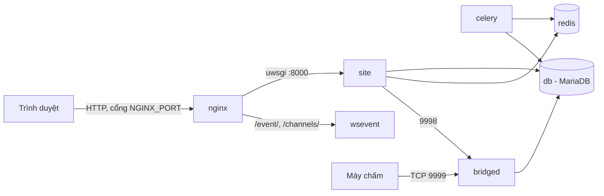

# Cài đặt LCOJ với Docker

Trang này hướng dẫn cài LCOJ từ đầu bằng [lcoj-docker](https://github.com/luyencode/lcoj-docker), đúng cách luyencode.net đang chạy. Cả hệ thống (web, cơ sở dữ liệu, cache, judge bridge, WebSocket) nằm trong Docker Compose, bạn không cần cài Python hay MariaDB lên máy chủ.

::: info Máy chấm (judge) cài riêng
Docker Compose ở đây **không** có máy chấm. Nó chỉ chạy `bridged` để các máy chấm kết nối vào. Sau khi site chạy ổn, xem [Cài đặt Judge](/operate/judge-setup).
:::

## Yêu cầu

| | Tối thiểu | Khuyến nghị |
|---|---|---|
| CPU | 2 nhân | 4 nhân trở lên |
| RAM | 4 GB | 8 GB trở lên |
| Ổ đĩa | 20 GB trống | 50 GB SSD trở lên (dữ liệu test lớn dần theo thời gian) |
| Hệ điều hành | Linux 64-bit (Ubuntu 22.04+ là dễ nhất) | |

Phần mềm cần có: **Docker** với plugin **Docker Compose v2** (lệnh `docker compose`, không phải `docker-compose`) và **Git**.

Hình dưới đây cho thấy các service sẽ được dựng. Chi tiết về từng service xem [Kiến trúc hệ thống](/operate/architecture).



## Bước 1: Cài Docker

Trên Ubuntu/Debian:

```sh
curl -fsSL https://get.docker.com -o get-docker.sh
sudo sh get-docker.sh

# Cho phép user hiện tại dùng docker mà không cần sudo
sudo usermod -aG docker $USER
# Đăng xuất rồi đăng nhập lại để quyền có hiệu lực
```

Kiểm tra:

```sh
docker --version
docker compose version
```

## Bước 2: Tải mã nguồn

```sh
git clone --recursive https://github.com/luyencode/lcoj-docker.git
cd lcoj-docker/dmoj
```

Cờ `--recursive` bắt buộc: mã nguồn Django nằm trong submodule `dmoj/repo` (repo [lcoj-site](https://github.com/luyencode/lcoj-site)). Nếu lỡ clone thiếu, chạy `git submodule update --init --recursive`.

::: tip
Từ đây trở đi, **mọi lệnh đều chạy trong thư mục `dmoj/`**. Các script trong `scripts/` và lệnh `docker compose` đều dựa vào thư mục này.
:::

## Bước 3: Chạy script khởi tạo

```sh
./scripts/initialize
```

Script này chỉ làm hai việc:

1. Tạo thư mục `problems/` (dữ liệu test) và `media/` (file người dùng tải lên).
2. Chép các file cấu hình mẫu từ `config/` vào mã nguồn:

| Nguồn | Đích | Dùng cho |
|---|---|---|
| `config/local_settings.py` | `repo/dmoj/local_settings.py` | Cấu hình Django |
| `config/uwsgi.ini` | `repo/uwsgi.ini` | uWSGI (số worker…) |
| `config/config.js` | `repo/websocket/config.js` | WebSocket server |

::: warning
Chạy lại `initialize` sẽ **ghi đè** ba file đích ở trên. Nếu bạn đã sửa chúng, hãy sao lưu trước.
:::

Chi tiết về các script khác xem [Script hỗ trợ](/operate/scripts).

## Bước 4: Cấu hình

### 4.1. Tạo file môi trường

Các file mẫu nằm sẵn trong `environment/`:

```sh
cp environment/mysql-admin.env.example environment/mysql-admin.env
cp environment/mysql.env.example environment/mysql.env
cp environment/site.env.example environment/site.env
```

Các file `*.env` đã được `.gitignore` loại trừ, không bị commit lên Git.

### 4.2. Cơ sở dữ liệu

Hai file này dành cho MariaDB. `site`, `celery`, `bridged` cũng đọc `mysql.env` để biết cách kết nối, vì vậy **không** khai báo lại `MYSQL_*` trong `site.env`.

::: code-group

```env [environment/mysql.env]
MYSQL_HOST=db
MYSQL_DATABASE=dmoj
MYSQL_USER=dmoj
MYSQL_PASSWORD=<mật khẩu mạnh>
```

```env [environment/mysql-admin.env]
MYSQL_ROOT_PASSWORD=<mật khẩu root khác>
```

:::

MariaDB chỉ tạo database và user theo các biến này **ở lần khởi động đầu tiên**, khi thư mục `database/` còn trống. Đổi mật khẩu sau đó phải làm bằng SQL, xem [Vận hành](/operate/operations#change-db-password).

### 4.3. Site

Ví dụ tối thiểu cho file `environment/site.env` của một bản cài chạy tại `luyencode.net`:

```env
HOST=luyencode.net
SITE_FULL_URL=https://luyencode.net/
MEDIA_URL=https://luyencode.net/

DEBUG=0
SECRET_KEY=<chuỗi ngẫu nhiên dài>

EVENT_DAEMON_POST=ws://wsevent:15101/
REDIS_CACHING_URL=redis://redis:6379/0
CELERY_BROKER_URL=redis://redis:6379/1
CELERY_RESULT_BACKEND=redis://redis:6379/1
BRIDGED_HOST=bridged

# Đăng nhập Google (bắt buộc để người dùng mới đăng ký được, xem 4.4)
SOCIAL_AUTH_GOOGLE_OAUTH2_KEY=<client id>
SOCIAL_AUTH_GOOGLE_OAUTH2_SECRET=<client secret>
```

Vài điểm hay nhầm:

- `DEBUG` chỉ bật khi giá trị đúng bằng `1`. Viết `True` cũng bị coi là tắt. Máy chủ thật luôn để `0`.
- `HOST` là tên miền trần (không có `https://`), được dùng làm `ALLOWED_HOSTS`. Chạy thử trên máy cá nhân thì để `localhost` và hai URL là `http://localhost:8071/`.
- `SITE_NAME`, `SITE_LONG_NAME`, `SITE_ADMIN_EMAIL` **không** phải biến môi trường. Chúng được ghi thẳng trong `local_settings.py`.
- Các biến Redis, Celery, WebSocket, bridge ở trên đã khớp với tên service trong `docker-compose.yml`, giữ nguyên nếu bạn không đổi gì.

Tạo `SECRET_KEY`:

```sh
python3 -c "import secrets; print(secrets.token_urlsafe(50))"
```

Danh sách đầy đủ các biến (kể cả `MOSS_API_KEY` và `NGINX_PORT`) có ở [Biến môi trường](/operate/environment).

::: warning NGINX_PORT không đọc từ site.env
Cổng nginx được publish là `${NGINX_PORT:-8071}` trong `docker-compose.yml`. Docker Compose chỉ thay biến này bằng giá trị từ shell hoặc từ file `dmoj/.env`, **không** lấy từ `environment/site.env`. Muốn đổi cổng, tạo file `dmoj/.env` chứa `NGINX_PORT=8080` (hoặc `export NGINX_PORT=8080` trước khi chạy lệnh), rồi chạy `docker compose up -d nginx`. Nếu không đặt gì, cổng là **8071**.
:::

### 4.4. Đăng nhập Google (OAuth)

`local_settings.py` của LCOJ đặt `OAUTH_ONLY = True`. Khi đó trang đăng ký ẩn form tạo tài khoản bằng mật khẩu, người dùng mới chỉ đăng ký được qua Google. Form **đăng nhập** bằng username/mật khẩu vẫn còn, nên tài khoản quản trị tạo bằng lệnh vẫn đăng nhập bình thường.

Cách lấy khóa:

1. Vào [Google Cloud Console](https://console.cloud.google.com/apis/credentials), tạo **OAuth client ID** loại *Web application*.
2. Thêm **Authorized redirect URI**: `https://luyencode.net/complete/google-oauth2/` (thay bằng tên miền của bạn).
3. Chép *Client ID* và *Client secret* vào `SOCIAL_AUTH_GOOGLE_OAUTH2_KEY` và `SOCIAL_AUTH_GOOGLE_OAUTH2_SECRET` trong `site.env`.

### 4.5. Nginx

Trong `nginx/conf.d/nginx.conf`, sửa `server_name` thành tên miền của bạn:

```nginx
server {
    listen       80;
    server_name  luyencode.net;  # đổi thành tên miền của bạn
    # ... giữ nguyên phần còn lại
}
```

Nginx trong container chỉ nghe HTTP ở cổng 80. HTTPS được xử lý ở lớp phía trước, xem [HTTPS](#https).

## Bước 5: Build image

Image `lcoj/lcoj-base` chứa Python, Node.js và toàn bộ thư viện (`requirements.txt`, `package.json`). Các image `site`, `celery`, `bridged` được build **từ** image này, nên hãy build `base` trước:

```sh
docker compose build base
docker compose build
```

Lần đầu mất khoảng 10–20 phút tùy mạng.

## Bước 6: Khởi tạo cơ sở dữ liệu và static

1. Bật các service cần thiết:

   ```sh
   docker compose up -d site db redis celery
   ```

   Lần đầu MariaDB cần vài chục giây để tạo database. Theo dõi bằng `docker compose logs -f db` cho đến khi thấy `ready for connections`.

2. Tạo bảng:

   ```sh
   ./scripts/migrate
   ```

3. Build CSS và thu thập static (biên dịch SCSS, `collectstatic`, dịch giao diện, chép sang volume `assets` cho nginx):

   ```sh
   ./scripts/copy_static
   ```

4. Nạp dữ liệu ban đầu:

   ```sh
   ./scripts/manage.py loaddata navbar
   ./scripts/manage.py loaddata language_small
   ./scripts/manage.py loaddata demo
   ```

   | Fixture | Nội dung |
   |---|---|
   | `navbar` | Thanh menu mặc định |
   | `language_small` | Một số ngôn ngữ lập trình thông dụng (`language_all` nếu muốn nạp đủ) |
   | `demo` | Dữ liệu mẫu, **kèm tài khoản `admin` mật khẩu `admin`** |

   ::: danger Đổi mật khẩu admin
   Fixture `demo` tạo superuser `admin` / `admin`. Trên máy chủ công khai, hãy đổi mật khẩu hoặc xóa tài khoản này ngay, hoặc bỏ qua fixture `demo`.
   :::

5. Tạo tài khoản quản trị của riêng bạn:

   ```sh
   ./scripts/manage.py createsuperuser
   ```

   Đăng nhập tại `/accounts/login/` bằng username và mật khẩu vừa tạo, không cần Google.

## Bước 7: Bật toàn bộ hệ thống

```sh
docker compose up -d
docker compose ps
```

Các container `lcoj_site`, `lcoj_celery`, `lcoj_bridged`, `lcoj_wsevent`, `lcoj_mysql`, `lcoj_redis`, `lcoj_nginx` phải ở trạng thái **Up**. Service `base` chỉ dùng để build image, nó thoát ngay sau khi khởi động, điều này là bình thường.

Kiểm tra:

```sh
curl -I http://localhost:8071/
```

Mở `http://<ip-máy-chủ>:8071/` trên trình duyệt để thấy trang chủ LCOJ. Nếu đã nạp `demo`, vào **Admin → Sites** để sửa tên miền mặc định (`localhost:8081`) thành tên miền thật.

## Cổng mạng

| Service | Container | Cổng | Mở ra máy chủ? |
|---|---|---|---|
| nginx | `lcoj_nginx` | `${NGINX_PORT:-8071}` → 80 | Có |
| bridged | `lcoj_bridged` | 9999 (máy chấm kết nối), 9998 (site nói chuyện với bridge) | Có |
| site | `lcoj_site` | 8000 (uwsgi) | Không |
| wsevent | `lcoj_wsevent` | 15100, 15101, 15102 | Không, đi qua nginx `/event/`, `/channels/` |
| db | `lcoj_mysql` | 3306 | Không |
| redis | `lcoj_redis` | 6379 | Không |
| celery | `lcoj_celery` | — | Không |

::: warning Tường lửa
Chỉ cho máy chấm truy cập cổng 9999. Cổng 9998 không cần mở ra Internet. Lưu ý: cổng Docker publish **bỏ qua luật `ufw`**, nên hãy chặn bằng tường lửa của nhà cung cấp cloud hoặc chain `DOCKER-USER` của iptables.
:::

## HTTPS

Nginx trong Docker chỉ phục vụ HTTP. Để có HTTPS, đặt một lớp TLS phía trước cổng `NGINX_PORT`.

### Cách luyencode.net đang làm: Cloudflare Tunnel

luyencode.net dùng [Cloudflare Tunnel](https://developers.cloudflare.com/cloudflare-one/connections/connect-networks/). `cloudflared` chạy trên máy chủ, kết nối ra Cloudflare và chuyển request về nginx. Máy chủ không cần mở cổng 80/443 và không cần tự quản lý chứng chỉ.

1. Cài `cloudflared` và tạo tunnel theo tài liệu của Cloudflare.
2. Thêm *Public hostname* `luyencode.net` trỏ tới service `http://localhost:8071` (đúng cổng `NGINX_PORT`).
3. Trong `site.env`, đặt `SITE_FULL_URL` và `MEDIA_URL` dùng `https://`, rồi chạy `docker compose up -d` để các container nhận biến mới.

WebSocket (`/event/`) chạy qua Cloudflare Tunnel mà không cần cấu hình thêm.

### Cách khác: reverse proxy có TLS

Bạn có thể dùng bất kỳ reverse proxy nào trên máy chủ (Caddy, Nginx trên host với certbot…) để nhận HTTPS ở cổng 443 và chuyển tới `http://127.0.0.1:8071`. Nhớ chuyển tiếp header `Upgrade`/`Connection` để WebSocket ở `/event/` hoạt động. Đừng chạy `certbot --nginx` nhắm vào nginx trong container, vì cấu hình của nó nằm trong Docker và không có cổng 443.

## Tinh chỉnh hiệu năng

- **Số worker uWSGI** (xử lý request web): sửa `workers = 8` trong `repo/uwsgi.ini` (bản gốc ở `config/uwsgi.ini`), rồi `docker compose restart site`. Mỗi worker có thể dùng đến 512 MB RAM trước khi bị nạp lại (`reload-on-rss = 512M`).
- **Số tiến trình Celery**: giá trị `--concurrency=2` nằm trong `ENTRYPOINT` của `celery/Dockerfile`. Sửa ở đó rồi `docker compose up -d --build celery`.

## Checklist trước khi mở cho người dùng

- [ ] `DEBUG=0`, `SECRET_KEY` ngẫu nhiên, mật khẩu MariaDB mạnh
- [ ] Đã đổi mật khẩu hoặc xóa tài khoản `admin` của fixture `demo`
- [ ] HTTPS hoạt động, `SITE_FULL_URL`/`MEDIA_URL` dùng `https://`
- [ ] Đăng nhập Google hoạt động
- [ ] Tường lửa chỉ mở cổng cần thiết
- [ ] Đã thiết lập [sao lưu định kỳ](/operate/operations#backup)
- [ ] Đã [kết nối ít nhất một máy chấm](/operate/judge-setup)

## Xem thêm

- [Biến môi trường](/operate/environment)
- [Script hỗ trợ](/operate/scripts)
- [Vận hành hằng ngày](/operate/operations)
- [Cập nhật LCOJ](/operate/updating)
- [Cài đặt Judge](/operate/judge-setup)

::: tip Cần hỗ trợ?
Tạo issue tại [lcoj-docker](https://github.com/luyencode/lcoj-docker/issues), hoặc liên hệ qua [behitek.com](https://behitek.com) và [luyencode.net/about/#lien-he](https://luyencode.net/about/#lien-he).
:::
