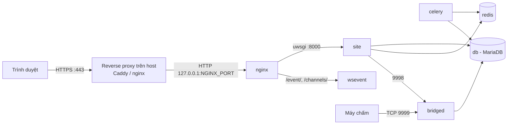
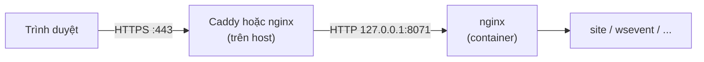

# Cài đặt LCOJ với Docker

> Dựng một bản LCOJ hoàn chỉnh (web, cơ sở dữ liệu, cache, judge bridge, WebSocket) trên một máy chủ Linux bằng Docker Compose, qua 7 bước.
>
> ⏱ ~60 phút (trong đó build image mất 10–20 phút) · 👤 Người vận hành · 🔑 SSH vào máy chủ Linux có quyền `sudo`

Trang này hướng dẫn cài LCOJ từ đầu bằng [lcoj-docker](https://github.com/luyencode/lcoj-docker) trên một VPS có IP public. Cả hệ thống (web, cơ sở dữ liệu, cache, judge bridge, WebSocket) nằm trong Docker Compose, bạn không cần cài Python hay MariaDB lên máy chủ.

::: info Máy chấm (judge) cài riêng
Docker Compose ở đây **không** có máy chấm. Nó chỉ chạy `bridged` để các máy chấm kết nối vào. Sau khi site chạy ổn, xem [Cài đặt Judge](/operate/judge-setup).
:::

## Trước khi bắt đầu

- [ ] Một máy chủ Linux 64-bit đạt cấu hình tối thiểu ở bảng dưới, bạn SSH vào được và có quyền `sudo`
- [ ] Máy chủ ra được Internet (để tải Docker image, gói Python/Node.js và mã nguồn từ GitHub)
- [ ] Một tên miền (ví dụ `lcoj.example.com`) mà bạn tạo được bản ghi DNS A/AAAA trỏ về IP public của VPS, nếu muốn chạy public với HTTPS. Chưa có tên miền thì vẫn thử được qua IP, xem [Chạy thử khi chưa có tên miền](#no-domain)
- [ ] Một tài khoản Google để tạo OAuth client (xem [Bước 4.4](#google-oauth)), vì người dùng mới chỉ đăng ký được bằng Google
- [ ] Biết sơ qua các khái niệm container, image, volume; nếu chưa, xem [Thuật ngữ](/start/glossary)

| | Tối thiểu | Khuyến nghị |
|---|---|---|
| CPU | 2 nhân | 4 nhân trở lên |
| RAM | 4 GB | 8 GB trở lên |
| Ổ đĩa | 20 GB trống | 50 GB SSD trở lên (dữ liệu test lớn dần theo thời gian) |
| Hệ điều hành | Linux 64-bit (Ubuntu 22.04+ là dễ nhất) | |

Phần mềm cần có: **Docker** với plugin **Docker Compose v2** (lệnh `docker compose`, không phải `docker-compose`) và **Git**.

Hình dưới đây cho thấy các service sẽ được dựng. Chi tiết về từng service xem [Kiến trúc hệ thống](/operate/architecture).



## Bước 1: Cài Docker

Trên Ubuntu/Debian:

```sh
curl -fsSL https://get.docker.com -o get-docker.sh
sudo sh get-docker.sh

# Cho phép user hiện tại dùng docker mà không cần sudo
sudo usermod -aG docker $USER
# Đăng xuất rồi đăng nhập lại để quyền có hiệu lực
```

Kiểm tra:

```sh
docker --version
docker compose version
```

## Bước 2: Tải mã nguồn

```sh
git clone --recursive https://github.com/luyencode/lcoj-docker.git
cd lcoj-docker/dmoj
```

Cờ `--recursive` bắt buộc: mã nguồn Django nằm trong submodule `dmoj/repo` (repo [lcoj-site](https://github.com/luyencode/lcoj-site)). Nếu lỡ clone thiếu, chạy `git submodule update --init --recursive`.

::: tip
Từ đây trở đi, **mọi lệnh đều chạy trong thư mục `dmoj/`**. Các script trong `scripts/` và lệnh `docker compose` đều dựa vào thư mục này.
:::

## Bước 3: Chạy script khởi tạo

```sh
./scripts/initialize
```

Script này chỉ làm hai việc:

1. Tạo thư mục `problems/` (dữ liệu test) và `media/` (file người dùng tải lên).
2. Chép các file cấu hình mẫu từ `config/` vào mã nguồn:

| Nguồn | Đích | Dùng cho |
|---|---|---|
| `config/local_settings.py` | `repo/dmoj/local_settings.py` | Cấu hình Django |
| `config/uwsgi.ini` | `repo/uwsgi.ini` | uWSGI (số worker…) |
| `config/config.js` | `repo/websocket/config.js` | WebSocket server |

::: warning
Chạy lại `initialize` sẽ **ghi đè** ba file đích ở trên. Nếu bạn đã sửa chúng, hãy sao lưu trước.
:::

Chi tiết về các script khác xem [Script hỗ trợ](/operate/scripts).

## Bước 4: Cấu hình

### 4.1. Tạo file môi trường

Các file mẫu nằm sẵn trong `environment/`:

```sh
cp environment/mysql-admin.env.example environment/mysql-admin.env
cp environment/mysql.env.example environment/mysql.env
cp environment/site.env.example environment/site.env
```

Các file `*.env` đã được `.gitignore` loại trừ, không bị commit lên Git.

### 4.2. Cơ sở dữ liệu

Hai file này dành cho MariaDB. `site`, `celery`, `bridged` cũng đọc `mysql.env` để biết cách kết nối, vì vậy **không** khai báo lại `MYSQL_*` trong `site.env`.

::: code-group

```env [environment/mysql.env]
MYSQL_HOST=db
MYSQL_DATABASE=dmoj
MYSQL_USER=dmoj
MYSQL_PASSWORD=<mật khẩu mạnh>
```

```env [environment/mysql-admin.env]
MYSQL_ROOT_PASSWORD=<mật khẩu root khác>
```

:::

MariaDB chỉ tạo database và user theo các biến này **ở lần khởi động đầu tiên**, khi thư mục `database/` còn trống. Đổi mật khẩu sau đó phải làm bằng SQL, xem [Vận hành](/operate/operations#change-db-password).

### 4.3. Site

Ví dụ tối thiểu cho file `environment/site.env` của một bản cài chạy tại `lcoj.example.com` (thay bằng tên miền của bạn):

```env
HOST=lcoj.example.com
SITE_FULL_URL=https://lcoj.example.com/
MEDIA_URL=https://lcoj.example.com/

DEBUG=0
SECRET_KEY=<chuỗi ngẫu nhiên dài>

EVENT_DAEMON_POST=ws://wsevent:15101/
REDIS_CACHING_URL=redis://redis:6379/0
CELERY_BROKER_URL=redis://redis:6379/1
CELERY_RESULT_BACKEND=redis://redis:6379/1
BRIDGED_HOST=bridged

# Đăng nhập Google (bắt buộc để người dùng mới đăng ký được, xem 4.4)
SOCIAL_AUTH_GOOGLE_OAUTH2_KEY=<client id>
SOCIAL_AUTH_GOOGLE_OAUTH2_SECRET=<client secret>
```

Vài điểm hay nhầm:

- `DEBUG` chỉ bật khi giá trị đúng bằng `1`. Viết `True` cũng bị coi là tắt. Máy chủ thật luôn để `0`.
- `HOST` là tên miền trần (không có `https://`, không có cổng), được dùng làm `ALLOWED_HOSTS` và để tạo địa chỉ WebSocket. Chạy thử trên máy cá nhân thì để `localhost` và hai URL là `http://localhost:8071/`.
- `SITE_FULL_URL` và `MEDIA_URL` dùng `https://` khi site chạy sau reverse proxy HTTPS (xem [HTTPS trên VPS](#https)).
- `SITE_NAME`, `SITE_LONG_NAME`, `SITE_ADMIN_EMAIL` **không** phải biến môi trường. Chúng được ghi thẳng trong `local_settings.py`.
- Các biến Redis, Celery, WebSocket, bridge ở trên đã khớp với tên service trong `docker-compose.yml`, giữ nguyên nếu bạn không đổi gì.

Tạo `SECRET_KEY`:

```sh
python3 -c "import secrets; print(secrets.token_urlsafe(50))"
```

Danh sách đầy đủ các biến (kể cả `MOSS_API_KEY` và `NGINX_PORT`) có ở [Biến môi trường](/operate/environment).

::: warning NGINX_PORT không đọc từ site.env
Cổng nginx được publish là `${NGINX_PORT:-8071}` trong `docker-compose.yml`. Docker Compose chỉ thay biến này bằng giá trị từ shell hoặc từ file `dmoj/.env`, **không** lấy từ `environment/site.env`. Muốn đổi cổng, tạo file `dmoj/.env` chứa `NGINX_PORT=8080` (hoặc `export NGINX_PORT=8080` trước khi chạy lệnh), rồi chạy `docker compose up -d nginx`. Nếu không đặt gì, cổng là **8071**.
:::

### 4.4. Đăng nhập Google (OAuth) {#google-oauth}

File `local_settings.py` đi kèm đặt `OAUTH_ONLY = True`. Khi đó trang đăng ký ẩn form tạo tài khoản bằng mật khẩu, người dùng mới chỉ đăng ký được qua Google. Form **đăng nhập** bằng username/mật khẩu vẫn còn, nên tài khoản quản trị tạo bằng lệnh vẫn đăng nhập bình thường.

Cách lấy khóa:

1. Vào [Google Cloud Console](https://console.cloud.google.com/apis/credentials), tạo **OAuth client ID** loại *Web application*.
2. Thêm **Authorized redirect URI**: `https://lcoj.example.com/complete/google-oauth2/` (thay bằng tên miền của bạn).
3. Chép *Client ID* và *Client secret* vào `SOCIAL_AUTH_GOOGLE_OAUTH2_KEY` và `SOCIAL_AUTH_GOOGLE_OAUTH2_SECRET` trong `site.env`.

### 4.5. Nginx

Trong `nginx/conf.d/nginx.conf`, sửa `server_name` (mặc định là `luyencode.net`) thành tên miền của bạn:

```nginx
server {
    listen       80;
    server_name  lcoj.example.com;  # tên miền của bạn
    # ... giữ nguyên phần còn lại
}
```

Nginx trong container chỉ nghe HTTP ở cổng 80. HTTPS do một reverse proxy trên host đảm nhận, xem [HTTPS trên VPS](#https).

## Bước 5: Build image

Image `lcoj/lcoj-base` chứa Python, Node.js và toàn bộ thư viện (`requirements.txt`, `package.json`). Các image `site`, `celery`, `bridged` được build **từ** image này, nên hãy build `base` trước:

```sh
docker compose build base
docker compose build
```

Lần đầu mất khoảng 10–20 phút tùy mạng.

## Bước 6: Khởi tạo cơ sở dữ liệu và static

1. Bật các service cần thiết:

   ```sh
   docker compose up -d site db redis celery
   ```

   Lần đầu MariaDB cần vài chục giây để tạo database. Theo dõi bằng `docker compose logs -f db` cho đến khi thấy `ready for connections`.

2. Tạo bảng:

   ```sh
   ./scripts/migrate
   ```

3. Build CSS và thu thập static (biên dịch SCSS, `collectstatic`, dịch giao diện, chép sang volume `assets` cho nginx):

   ```sh
   ./scripts/copy_static
   ```

4. Nạp dữ liệu ban đầu:

   ```sh
   ./scripts/manage.py loaddata navbar
   ./scripts/manage.py loaddata language_small
   ./scripts/manage.py loaddata demo
   ```

   | Fixture | Nội dung |
   |---|---|
   | `navbar` | Thanh menu mặc định |
   | `language_small` | Một số ngôn ngữ lập trình thông dụng (`language_all` nếu muốn nạp đủ) |
   | `demo` | Dữ liệu mẫu, **kèm tài khoản `admin` mật khẩu `admin`** |

   ::: danger Đổi mật khẩu admin
   Fixture `demo` tạo superuser `admin` / `admin`. Trên máy chủ công khai, hãy đổi mật khẩu hoặc xóa tài khoản này ngay, hoặc bỏ qua fixture `demo`.
   :::

5. Tạo tài khoản quản trị của riêng bạn:

   ```sh
   ./scripts/manage.py createsuperuser
   ```

   Đăng nhập tại `/accounts/login/` bằng username và mật khẩu vừa tạo, không cần Google.

## Bước 7: Bật toàn bộ hệ thống

```sh
docker compose up -d
docker compose ps
```

Các container `lcoj_site`, `lcoj_celery`, `lcoj_bridged`, `lcoj_wsevent`, `lcoj_mysql`, `lcoj_redis`, `lcoj_nginx` phải ở trạng thái **Up**. Service `base` chỉ dùng để build image, nó thoát ngay sau khi khởi động, điều này là bình thường.

## Kiểm tra kết quả

1. Tất cả container ở trạng thái **Up** trong `docker compose ps` (trừ `base`, như đã nói ở trên).
2. nginx trả lời trên máy chủ:

   ```sh
   curl -I http://localhost:8071/
   ```

3. Mở `http://<ip-máy-chủ>:8071/` trên trình duyệt để thấy trang chủ LCOJ (nếu `HOST` đang là tên miền, xem [Chạy thử khi chưa có tên miền](#no-domain) để truy cập bằng IP). Nếu đã nạp `demo`, vào **Admin → Sites** để sửa tên miền mặc định (`localhost:8081`) thành tên miền thật.
4. Đăng nhập tại `/accounts/login/` bằng tài khoản vừa tạo ở Bước 6 và mở được trang `/admin/`.
5. Trang chủ chưa có máy chấm là bình thường: bài nộp chỉ được chấm sau khi bạn [kết nối judge](/operate/judge-setup).

## Cổng mạng

| Service | Container | Cổng | Mở ra máy chủ? |
|---|---|---|---|
| nginx | `lcoj_nginx` | `${NGINX_PORT:-8071}` → 80 | Có |
| bridged | `lcoj_bridged` | 9999 (máy chấm kết nối), 9998 (site nói chuyện với bridge) | Có |
| site | `lcoj_site` | 8000 (uwsgi) | Không |
| wsevent | `lcoj_wsevent` | 15100, 15101, 15102 | Không, đi qua nginx `/event/`, `/channels/` |
| db | `lcoj_mysql` | 3306 | Không |
| redis | `lcoj_redis` | 6379 | Không |
| celery | `lcoj_celery` | — | Không |

::: warning Tường lửa
Chỉ cho máy chấm truy cập cổng 9999. Cổng 9998 và cổng nginx (`8071`) không cần mở ra Internet. Lưu ý: cổng Docker publish **bỏ qua luật `ufw`**. Cách giới hạn các cổng này xem [Bước H2](#bind-localhost) và [Bước H6](#firewall).
:::

## HTTPS trên VPS {#https}

Nginx trong Docker chỉ phục vụ HTTP: cổng 80 trong container, được publish ra máy chủ ở `${NGINX_PORT:-8071}`. Để chạy public với HTTPS, hãy đặt một **reverse proxy có TLS chạy trực tiếp trên VPS**. Proxy nhận HTTPS ở cổng 80/443, tự lấy chứng chỉ Let's Encrypt và chuyển tiếp tới `127.0.0.1:8071`:



Các bước dưới đây dùng tên miền ví dụ `lcoj.example.com` và cổng mặc định `8071`. Hãy thay bằng giá trị của bạn.

::: warning Không chạy certbot vào nginx trong container
Cấu hình của nginx trong container nằm trong Docker và không có cổng 443. Chứng chỉ phải do proxy trên host quản lý.
:::

### Bước H1: Trỏ tên miền về VPS

Tại nhà cung cấp DNS, tạo bản ghi **A** trỏ `lcoj.example.com` về IPv4 public của VPS (và bản ghi **AAAA** nếu VPS có IPv6). Kiểm tra:

```sh
dig +short lcoj.example.com
```

Kết quả phải là IP của VPS. Let's Encrypt chỉ cấp chứng chỉ khi tên miền đã trỏ đúng và cổng 80 của VPS truy cập được từ Internet.

### Bước H2: Chỉ mở cổng nginx cho localhost {#bind-localhost}

Mặc định Compose publish nginx trên mọi địa chỉ của máy chủ, nên ai cũng vào được `http://<IP-VPS>:8071` mà không qua HTTPS. Tạo file `dmoj/docker-compose.override.yml` (Compose tự đọc file này cùng `docker-compose.yml`):

```yaml
services:
  nginx:
    ports: !override
      - "127.0.0.1:${NGINX_PORT:-8071}:80"
  bridged:
    ports: !override
      - "127.0.0.1:9998:9998"
      - "9999:9999"
```

- `!override` thay hẳn danh sách `ports` gốc thay vì cộng thêm vào. Tag này cần Docker Compose **v2.24.4** trở lên (`docker compose version`).
- Cổng 9998 chỉ dùng giữa `site` và `bridged`, nên bind vào `127.0.0.1` là đủ.
- Nếu mọi máy chấm chạy trên chính VPS này (`--network=host`, kết nối `localhost:9999`), đổi dòng cuối thành `"127.0.0.1:9999:9999"`. Nếu có máy chấm ở máy khác, giữ `"9999:9999"` và giới hạn IP ở [Bước H6](#firewall).

Áp dụng và kiểm tra:

```sh
docker compose up -d nginx bridged
docker compose ps nginx bridged
```

Cột `PORTS` của nginx phải hiện `127.0.0.1:8071->80/tcp`.

### Bước H3: Cài reverse proxy có TLS

Chọn **một** trong hai cách. Cả hai đều cần cổng 80 và 443 của VPS còn trống, nên đừng đặt `NGINX_PORT` là 80 hay 443.

#### Cách A: Caddy (đơn giản nhất)

Caddy tự lấy và gia hạn chứng chỉ, tự chuyển hướng HTTP sang HTTPS, chuyển tiếp WebSocket và tự đặt các header `X-Forwarded-For`, `X-Forwarded-Proto`.

1. Cài Caddy trên Ubuntu/Debian (theo [tài liệu chính thức](https://caddyserver.com/docs/install#debian-ubuntu-raspbian)):

   ```sh
   sudo apt install -y debian-keyring debian-archive-keyring apt-transport-https curl
   curl -1sLf 'https://dl.cloudsmith.io/public/caddy/stable/gpg.key' | sudo gpg --dearmor -o /usr/share/keyrings/caddy-stable-archive-keyring.gpg
   curl -1sLf 'https://dl.cloudsmith.io/public/caddy/stable/debian.deb.txt' | sudo tee /etc/apt/sources.list.d/caddy-stable.list
   sudo apt update
   sudo apt install caddy
   ```

2. Thay toàn bộ nội dung `/etc/caddy/Caddyfile` bằng:

   ```txt
   lcoj.example.com {
       reverse_proxy 127.0.0.1:8071
   }
   ```

   Chỉ một dòng `reverse_proxy` là đủ cho cả trang web lẫn WebSocket ở `/event/`.

3. Nạp lại cấu hình và xem log lấy chứng chỉ:

   ```sh
   sudo systemctl reload caddy
   sudo journalctl -u caddy -f
   ```

#### Cách B: nginx trên host + certbot

1. Cài nginx và certbot:

   ```sh
   sudo apt install -y nginx certbot python3-certbot-nginx
   ```

2. Tạo file `/etc/nginx/sites-available/lcoj`:

   ```nginx
   server {
       listen 80;
       listen [::]:80;
       server_name lcoj.example.com;

       client_max_body_size 64M;

       location / {
           proxy_pass http://127.0.0.1:8071;
           proxy_set_header Host $host;
           proxy_set_header X-Real-IP $remote_addr;
           proxy_set_header X-Forwarded-For $proxy_add_x_forwarded_for;
           proxy_set_header X-Forwarded-Proto $scheme;
           proxy_read_timeout 600;
       }

       # WebSocket cập nhật trực tiếp
       location /event/ {
           proxy_pass http://127.0.0.1:8071;
           proxy_http_version 1.1;
           proxy_set_header Upgrade $http_upgrade;
           proxy_set_header Connection "upgrade";
           proxy_set_header Host $host;
           proxy_set_header X-Forwarded-For $proxy_add_x_forwarded_for;
           proxy_set_header X-Forwarded-Proto $scheme;
           proxy_read_timeout 86400;
       }
   }
   ```

   `client_max_body_size 64M` và `proxy_read_timeout 600` khớp với giới hạn của nginx trong container, để tải file test lớn và request chạy lâu không bị proxy cắt ngang.

3. Bật site và nạp lại nginx:

   ```sh
   sudo ln -s /etc/nginx/sites-available/lcoj /etc/nginx/sites-enabled/lcoj
   sudo rm -f /etc/nginx/sites-enabled/default
   sudo nginx -t && sudo systemctl reload nginx
   ```

4. Lấy chứng chỉ. certbot tự thêm `listen 443 ssl` và chuyển hướng HTTP sang HTTPS vào file trên:

   ```sh
   sudo certbot --nginx -d lcoj.example.com
   sudo certbot renew --dry-run   # kiểm tra gia hạn tự động
   ```

### Bước H4: Chuyển `site.env` sang https

Trong `environment/site.env`:

```env
HOST=lcoj.example.com
SITE_FULL_URL=https://lcoj.example.com/
MEDIA_URL=https://lcoj.example.com/
```

`HOST` không có `https://` và không có cổng. Chạy `docker compose up -d` (không phải `restart`) để các container nhận giá trị mới.

Địa chỉ WebSocket không cần khai báo riêng: `local_settings.py` tạo `EVENT_DAEMON_GET = 'ws://<HOST>/event/'` và `EVENT_DAEMON_GET_SSL = 'wss://<HOST>/event/'` từ `HOST`. Site dùng địa chỉ `wss://` khi nhận ra request là HTTPS, điều này cần `SECURE_PROXY_SSL_HEADER` ở bước tiếp theo.

### Bước H5: Cấu hình Django cho HTTPS {#django-https}

Mở `repo/dmoj/local_settings.py` (bản đang chạy) và thêm vào cuối file:

```python
# Chạy sau reverse proxy HTTPS
CSRF_TRUSTED_ORIGINS = ['https://lcoj.example.com']
SECURE_PROXY_SSL_HEADER = ('HTTP_X_FORWARDED_PROTO', 'https')
```

Rồi khởi động lại site:

```sh
docker compose restart site
```

- **`CSRF_TRUSTED_ORIGINS` là bắt buộc.** Django kiểm tra header `Origin` của mọi form gửi đi. Nếu không khai báo, form gửi từ `https://lcoj.example.com` bị từ chối. Trang xử lý lỗi CSRF của LCOJ chỉ chuyển hướng về chính trang đó mà không báo gì, nên triệu chứng là **bấm Nộp bài, Lưu, Đăng nhập mà trang chỉ tải lại, không có gì thay đổi**. Nếu phục vụ thêm tên miền khác (ví dụ `www`), thêm cả tên miền đó vào danh sách này và vào `ALLOWED_HOSTS`.
- **`SECURE_PROXY_SSL_HEADER` nên bật.** Nó cho Django biết request gốc là HTTPS dựa vào header `X-Forwarded-Proto`. Không có nó, trang HTTPS sẽ kết nối WebSocket bằng `ws://`, trình duyệt chặn (mixed content) và kết quả chấm không tự cập nhật. Chỉ bật khi cổng nginx của container **không** truy cập được từ bên ngoài ([Bước H2](#bind-localhost)) và proxy luôn đặt header này. Caddy đặt sẵn; cấu hình nginx ở Cách B có `X-Forwarded-Proto $scheme`. Nếu không, người ngoài có thể giả header để Django tưởng request là HTTPS.

::: tip Giữ thay đổi khi chạy lại `initialize`
`./scripts/initialize` chép đè `config/local_settings.py` lên `repo/dmoj/local_settings.py`. Hãy thêm hai dòng trên vào cả `config/local_settings.py` để không bị mất.
:::

### Bước H6: Tường lửa {#firewall}

| Cổng | Mở ra Internet? | Ghi chú |
|---|---|---|
| 22 | Có | SSH |
| 80, 443 | Có | Reverse proxy. Cổng 80 cần cho việc lấy/gia hạn chứng chỉ và chuyển hướng sang HTTPS |
| `8071` (`NGINX_PORT`) | Không | Chỉ `127.0.0.1` ([Bước H2](#bind-localhost)) |
| 9998 | Không | Chỉ dùng giữa `site` và `bridged` |
| 9999 | Chỉ khi có máy chấm ở máy khác | Chỉ cho IP của các máy chấm |
| 3306, 6379 | — | `db` và `redis` không được publish ra máy chủ |

Với `ufw`:

```sh
sudo ufw allow 22/tcp
sudo ufw allow 80/tcp
sudo ufw allow 443/tcp
sudo ufw enable
```

::: warning ufw không chặn được cổng do Docker publish
Docker tự thêm luật iptables cho các cổng trong `ports:`, nên `ufw` không có tác dụng với `8071`, `9998`, `9999`. Hãy bind chúng vào `127.0.0.1` ([Bước H2](#bind-localhost)). Để giới hạn cổng 9999 theo IP máy chấm, dùng tường lửa của nhà cung cấp VPS (cách dễ nhất), hoặc chain `DOCKER-USER` của iptables:

```sh
# eth0 là card mạng public; <IP-máy-chấm> là IP được phép
sudo iptables -I DOCKER-USER -i eth0 -p tcp -m conntrack --ctorigdstport 9999 --ctdir ORIGINAL ! -s <IP-máy-chấm> -j DROP
```

Luật iptables này mất khi khởi động lại máy; dùng gói `iptables-persistent` để lưu lại.
:::

### Kiểm tra HTTPS

1. `curl -I https://lcoj.example.com/` trả `200`, còn `curl -I http://lcoj.example.com/` trả chuyển hướng (`301`/`308`) sang `https://`.
2. Từ một máy khác, `curl -m 5 http://<IP-VPS>:8071/` phải thất bại (timeout hoặc bị từ chối).
3. Đăng nhập, sửa và lưu hồ sơ của bạn: thay đổi phải được lưu.
4. Mở một trang bài nộp, bật DevTools → **Network** → lọc **WS**: kết nối `wss://lcoj.example.com/event/` có trạng thái `101`.

### Chạy thử khi chưa có tên miền {#no-domain}

Khi chưa có tên miền, bạn có thể thử site qua IP bằng HTTP (không mã hóa, chỉ nên dùng để thử). Làm **trước** Bước H2, vì cổng `8071` cần mở ra ngoài. Trong `environment/site.env`:

```env
HOST=<IP-VPS>
SITE_FULL_URL=http://<IP-VPS>:8071/
MEDIA_URL=http://<IP-VPS>:8071/
```

Chạy `docker compose up -d`, rồi mở `http://<IP-VPS>:8071/`. Ở chế độ này:

- Form hoạt động mà không cần `CSRF_TRUSTED_ORIGINS`, vì trình duyệt gửi `Origin: http://...` khớp với request HTTP. Đừng bật `SECURE_PROXY_SSL_HEADER`.
- Địa chỉ WebSocket tạo từ `HOST` không có cổng (`ws://<IP-VPS>/event/`). Để cập nhật trực tiếp chạy được, thêm `EVENT_DAEMON_GET = 'ws://<IP-VPS>:8071/event/'` vào cuối `repo/dmoj/local_settings.py` rồi `docker compose restart site`. Xóa dòng này khi chuyển sang tên miền.
- Nhà cung cấp VPS có thể chặn cổng `8071` bằng tường lửa của họ; nếu vậy, mở tạm cổng này.

Khi đã có tên miền, làm lần lượt Bước H1 đến H6.

## Tinh chỉnh hiệu năng

- **Số worker uWSGI** (xử lý request web): sửa `workers = 8` trong `repo/uwsgi.ini` (bản gốc ở `config/uwsgi.ini`), rồi `docker compose restart site`. Mỗi worker có thể dùng đến 512 MB RAM trước khi bị nạp lại (`reload-on-rss = 512M`).
- **Số tiến trình Celery**: giá trị `--concurrency=2` nằm trong `ENTRYPOINT` của `celery/Dockerfile`. Sửa ở đó rồi `docker compose up -d --build celery`.

## Checklist trước khi mở cho người dùng

- [ ] `DEBUG=0`, `SECRET_KEY` ngẫu nhiên, mật khẩu MariaDB mạnh
- [ ] Đã đổi mật khẩu hoặc xóa tài khoản `admin` của fixture `demo`
- [ ] HTTPS hoạt động, `SITE_FULL_URL`/`MEDIA_URL` dùng `https://`
- [ ] Đã thêm `CSRF_TRUSTED_ORIGINS` (và `SECURE_PROXY_SSL_HEADER`) vào `local_settings.py`
- [ ] Cổng nginx của Docker chỉ bind vào `127.0.0.1`
- [ ] Đăng nhập Google hoạt động
- [ ] Tường lửa chỉ mở cổng cần thiết
- [ ] Đã thiết lập [sao lưu định kỳ](/operate/operations#backup)
- [ ] Đã [kết nối ít nhất một máy chấm](/operate/judge-setup)

## Sự cố thường gặp

| Triệu chứng | Cách xử lý |
|---|---|
| `permission denied` khi chạy `docker` | Bạn chưa đăng xuất/đăng nhập lại sau `usermod -aG docker` (Bước 1) |
| Thư mục `dmoj/repo` trống, build báo thiếu file | Quên `--recursive` khi clone: chạy `git submodule update --init --recursive` |
| `./scripts/migrate` báo không kết nối được database | MariaDB chưa khởi tạo xong: đợi `ready for connections` trong `docker compose logs -f db` rồi chạy lại |
| Build `site`/`celery`/`bridged` báo không tìm thấy `lcoj/lcoj-base` | Chạy `docker compose build base` trước (Bước 5) |
| Trang web hiện nhưng không có CSS | Chạy lại `./scripts/copy_static` |
| Bấm Nộp bài / Lưu / Đăng nhập không có tác dụng, trang chỉ tải lại | Thiếu hoặc sai `CSRF_TRUSTED_ORIGINS` trong `repo/dmoj/local_settings.py`: phải có đúng `https://<tên-miền>`, rồi `docker compose restart site` ([Bước H5](#django-https)) |
| Kết quả chấm không tự cập nhật, console trình duyệt báo lỗi `Mixed Content` hoặc `ws://` | Thiếu `SECURE_PROXY_SSL_HEADER` ([Bước H5](#django-https)), hoặc proxy không chuyển tiếp header `Upgrade`/`Connection` cho `/event/` |
| Caddy/certbot không lấy được chứng chỉ | Tên miền chưa trỏ đúng IP VPS (`dig +short <tên-miền>`), hoặc cổng 80/443 bị tường lửa của nhà cung cấp chặn |
| Proxy trên host trả 502 | Container nginx không chạy hoặc sai cổng: `curl -I http://127.0.0.1:8071/` trên VPS |
| Lỗi 502 Bad Gateway | `site` đang khởi động hoặc lỗi khi nạp Django: xem `docker compose logs --tail=100 site` ([chi tiết](/operate/architecture#uwsgi)) |
| Lỗi 400 Bad Request | `HOST` trong `site.env` không khớp tên miền bạn đang truy cập |
| Cổng 8071 đã bị dùng | Đổi cổng bằng `NGINX_PORT` trong `dmoj/.env` (xem cảnh báo ở Bước 4.3) |
| Sửa `site.env` mà không có tác dụng | Chạy `docker compose up -d` (không phải `restart`) để tạo lại container |

## Tiếp theo

- [Cài đặt Judge](/operate/judge-setup): kết nối máy chấm để bài nộp được chấm.
- [Cấu hình trang web](/admin/site-config): đổi tên miền, menu và nội dung trang chủ.
- [Vận hành hằng ngày](/operate/operations): khởi động lại, xem log, sao lưu.
- Tham khảo thêm: [Biến môi trường](/operate/environment), [Script hỗ trợ](/operate/scripts), [Cập nhật LCOJ](/operate/updating).

::: tip Cần hỗ trợ?
Tạo issue tại [lcoj-docker](https://github.com/luyencode/lcoj-docker/issues), hoặc liên hệ qua [behitek.com](https://behitek.com) và [luyencode.net/about/#lien-he](https://luyencode.net/about/#lien-he).
:::
