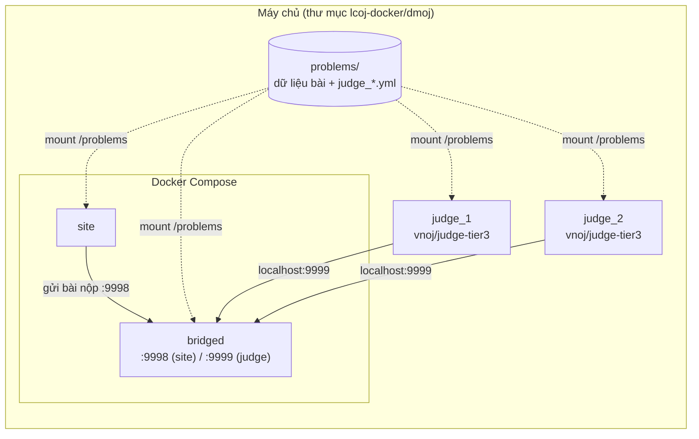

# Cài đặt judge

> Đăng ký judge (máy chấm) trên website, chạy judge bằng Docker, chạy nhiều judge cùng lúc và kiểm tra judge đã kết nối.
>
> ⏱ ~20 phút · 👤 Người vận hành · 🔑 SSH + quyền chạy `docker` trên máy chấm, tài khoản superuser trên website

Judge (máy chấm) là chương trình nhận bài nộp, biên dịch, chạy với từng test rồi gửi kết quả về website. Trong LCOJ, judge **không nằm trong Docker Compose**: mỗi judge là một container riêng, tự kết nối tới dịch vụ `bridged` (cầu nối giữa website và các judge) qua cổng `9999`. Các thuật ngữ khác xem ở [Thuật ngữ](/start/glossary).

## Trước khi bắt đầu

- [ ] Đã cài xong website theo [Cài đặt với Docker](/operate/installation) và dịch vụ `bridged` đang chạy.
- [ ] Máy chạy judge dùng **Linux** (sandbox của judge cần kernel Linux) và đã cài Docker.
- [ ] Bạn có tài khoản quản trị (superuser) trên website.

## Judge kết nối vào hệ thống như thế nào



Những điểm cần nhớ:

- `bridged` mở cổng `9999` ra máy chủ (`ports: 9999:9999`). Judge chạy với `--network host` nên chỉ cần kết nối tới `localhost:9999`.
- Thư mục `dmoj/problems` được mount vào `site` và `bridged` tại `/problems` (`DMOJ_PROBLEM_DATA_ROOT = '/problems/'`). Judge cũng mount **đúng thư mục này** vào `/problems`. Nhờ vậy, khi bạn tải test lên website, judge thấy ngay dữ liệu mới.
- Judge đăng nhập vào bridge bằng **tên** và **khóa xác thực** (auth key). Hai giá trị này phải khớp với bản ghi judge trên website.

## Chọn Docker image

Hướng dẫn này dùng image **`vnoj/judge-tier3`**, là image judge của dự án upstream [VNOJ](https://github.com/VNOI-Admin/judge-server). Các image được chia theo "tier" (mức độ đầy đủ ngôn ngữ):

| Image | Nội dung |
|---|---|
| `vnoj/judge-tier1` | Bộ ngôn ngữ cơ bản: C/C++ (GCC), Python 2/3, Java, Pascal |
| `vnoj/judge-tier2` | Tier 1 cộng thêm một số ngôn ngữ phổ biến khác |
| `vnoj/judge-tier3` | Đầy đủ nhất, gần như mọi runtime mà judge hỗ trợ. **Khuyến nghị**, các lệnh bên dưới dùng image này |

Nội dung chính xác của từng tier được định nghĩa trong image nền `vnoj/runtimes-tier1/2/3` (xem các `Dockerfile` trong `judge-server/.docker/`). Danh sách ngôn ngữ **thực tế** trên site của bạn là những gì judge báo lên, xem [Ngôn ngữ được hỗ trợ](/reference/languages).

::: tip Tự build image (không bắt buộc)
Nếu muốn dùng mã judge của LCOJ ([luyencode/judge-server](https://github.com/luyencode/judge-server)) thay vì bản upstream:

```sh
git clone https://github.com/luyencode/judge-server.git
cd judge-server/.docker
make judge-tier3
```

`Makefile` gắn tag `vnoj/judge-tier3` và `vnoj/judge-tier3:latest`, nên các lệnh bên dưới giữ nguyên. `Dockerfile` của tier3 tải mã nguồn từ `luyencode/judge-server` theo biến `GIT_TAG` (mặc định `master`), ví dụ `make judge-tier3 GIT_TAG=master TAG=latest`.
:::

## Bước 1: Đăng ký judge trên website

Mỗi judge cần một bản ghi trên website gồm **tên** và **khóa xác thực**. Chọn một trong hai cách.

### Cách A: Qua trang quản trị

1. Đăng nhập bằng tài khoản superuser, mở `https://<tên-miền>/admin/judge/judge/`.
2. Bấm **Add judge** (Thêm judge).
3. Điền **Name**, ví dụ `judge1`. Nên đặt kiểu hostname: chữ, số, dấu gạch ngang, không dấu cách.
4. Ở ô **Authentication key**, bấm **Regenerate** để trình duyệt tạo một khóa ngẫu nhiên, rồi sao chép khóa này lại.
5. Bấm **Save**.

### Cách B: Bằng management command

Chạy trong thư mục `dmoj/`:

```sh
./scripts/manage.py addjudge <name> <key>
```

Lệnh `addjudge` nhận hai tham số: tên judge và khóa xác thực. Bạn tự tạo khóa, ví dụ bằng `openssl rand -base64 48`.

::: warning Giữ bí mật khóa xác thực
Ai có tên và khóa đều có thể kết nối vào bridge như một judge hợp lệ. Không đưa khóa lên Git, không dán vào issue hay tài liệu.
:::

::: info Trường "tier" trong trang quản trị
Bản ghi judge có trường **Judge tier** (mặc định `1`). Đây là mức ưu tiên dự phòng: bridge chỉ giao bài cho các judge đang online có tier **nhỏ nhất**. Trường này không liên quan tới tên image `judge-tier3`. Nếu không cần cơ chế dự phòng, cứ để mọi judge ở tier `1`.
:::

## Bước 2: Tạo file cấu hình

Đặt file cấu hình ngay trong thư mục `dmoj/problems`, để judge đọc được qua đường dẫn `/problems/...` trong container. Ví dụ tạo `dmoj/problems/judge_judge1.yml`:

```yaml
# Trùng với tên judge trên website
id: "judge1"
# Khóa xác thực tạo ở Bước 1
key: "<key>"
# Thư mục chứa bài: mọi thư mục khớp glob và có file init.yml là một bài
problem_storage_globs:
  - /problems/*
```

Không cần khai báo ngôn ngữ: image Docker đã tự dò các runtime lúc build. Giải thích chi tiết từng khóa có tại [Cấu hình judge](/operate/judge-configuration).

::: tip
File `judge_*.yml` nằm cạnh các thư mục bài nhưng không bị nhận nhầm thành bài, vì judge chỉ coi một thư mục là bài khi bên trong có `init.yml`.
:::

## Bước 3: Chạy judge

Chạy trong thư mục `dmoj/` để `$PWD/problems` trỏ đúng tới thư mục bài dùng chung:

```sh
cd lcoj-docker/dmoj

docker run \
    --name judge_judge1 \
    --network=host \
    -v "$PWD/problems":/problems \
    --cap-add=SYS_PTRACE \
    -d \
    --restart=always \
    vnoj/judge-tier3 \
    run -p 9999 -c /problems/judge_judge1.yml -a 12345 \
    localhost judge1 "<key>"
```

Tham số của `docker run`:

| Tham số | Ý nghĩa |
|---|---|
| `--name judge_judge1` | Tên container, mỗi judge một tên |
| `--network=host` | Dùng mạng của máy chủ, để `localhost:9999` trỏ tới cổng mà `bridged` đã mở |
| `-v "$PWD/problems":/problems` | Mount thư mục bài dùng chung (cùng thư mục mà `site` và `bridged` dùng) |
| `--cap-add=SYS_PTRACE` | Bắt buộc: sandbox của judge dùng `ptrace` để giám sát chương trình của thí sinh |
| `-d`, `--restart=always` | Chạy nền và tự khởi động lại khi máy chủ reboot hoặc judge bị lỗi |
| `vnoj/judge-tier3` | Image judge |

Phần sau tên image là tham số của judge. Từ khóa `run` chạy lệnh `dmoj` (script `entry` của image cũng nhận `cli` và `test`). Các tham số của `dmoj`:

| Tham số | Ý nghĩa |
|---|---|
| `-p 9999` | Cổng của bridge (mặc định `9999`) |
| `-c /problems/judge_judge1.yml` | Đường dẫn file cấu hình **bên trong container** |
| `-a 12345` | Cổng API nội bộ của judge. Khi đã có `-a`, API chỉ lắng nghe trên `127.0.0.1`. Nếu bỏ `-a`, image Docker mặc định mở API trên `0.0.0.0:15001` |
| `localhost` | Địa chỉ bridge (tham số vị trí `server_host`, bắt buộc) |
| `judge1` | Tên judge (tùy chọn). Nếu có, ghi đè `id` trong file cấu hình |
| `"<key>"` | Khóa xác thực (tùy chọn). Nếu có, ghi đè `key` trong file cấu hình |

Tên và khóa có thể để trong file cấu hình **hoặc** truyền trên dòng lệnh. Nếu đã khai báo trong file, bạn có thể bỏ hai tham số cuối. Nên đặt khóa trong ngoặc kép, vì khóa sinh bằng **Regenerate** có thể chứa `+`, `/`, `=`.

::: details Judge chạy ở máy khác
Judge không nhất thiết phải chạy trên máy chủ website. Khi chạy ở máy khác:

1. Thay `localhost` bằng IP hoặc tên miền của máy chủ website.
2. Máy judge cần có bản sao dữ liệu bài ở `/problems` (ví dụ đồng bộ `dmoj/problems` bằng `rsync` hoặc dùng ổ mạng), vì judge đọc test từ ổ đĩa của chính nó.
3. Chỉ mở cổng `9999` trên firewall cho IP của các máy judge. Cổng do Docker publish không chịu tác động của `ufw`, xem [Cài đặt: tường lửa](/operate/installation#firewall).
:::

::: warning Cổng 9998
`docker-compose.yml` cũng mở cổng `9998` ra máy chủ. Cổng này dành cho `site` gửi lệnh tới `bridged` và **không cần** truy cập từ bên ngoài. Hãy bind `9998` (và `9999` nếu không có judge ở máy khác) vào `127.0.0.1`, xem [Cài đặt: chỉ mở cổng cho localhost](/operate/installation#bind-localhost). Judge chạy với `--network=host` trên cùng máy vẫn kết nối được `localhost:9999`.
:::

## Chạy nhiều judge

Mỗi judge xử lý một bài nộp tại một thời điểm. Muốn chấm nhanh hơn thì chạy thêm judge. Mỗi judge cần:

1. **Một bản ghi riêng trên website** (tên và khóa khác nhau), tạo như Bước 1.
2. **Một file cấu hình riêng** trong `dmoj/problems`, ví dụ `judge_judge2.yml` với `id: "judge2"`.
3. **Một container riêng** với `--name` khác nhau.
4. **Một cổng API `-a` khác nhau**, vì mọi judge đều dùng mạng của máy chủ.

Ví dụ judge thứ hai:

```sh
docker run \
    --name judge_judge2 \
    --network=host \
    -v "$PWD/problems":/problems \
    --cap-add=SYS_PTRACE \
    -d \
    --restart=always \
    vnoj/judge-tier3 \
    run -p 9999 -c /problems/judge_judge2.yml -a 12346 \
    localhost judge2 "<key2>"
```

::: tip Nên chạy bao nhiêu judge?
Mỗi judge dùng khoảng một nhân CPU khi chấm. Một quy tắc đơn giản là số judge không vượt quá số nhân CPU trừ đi một hai nhân dành cho website và cơ sở dữ liệu. Chạy quá nhiều judge trên cùng máy làm thời gian chạy đo được kém ổn định.
:::

## Kiểm tra kết quả

1. **Xem log của judge:**

   ```sh
   docker logs -f judge_judge1
   ```

   Judge tự kiểm tra (self-test) từng ngôn ngữ, in `Running live judge...`, rồi báo kết nối thành công bằng dòng dạng `Judge "judge1" online: [localhost]:9999`.

2. **Xem log của bridge** (trong thư mục `dmoj/`):

   ```sh
   docker compose logs -f bridged
   ```

   Khi judge đăng nhập thành công sẽ có dòng `Judge authenticated: ...`. Nếu sai khóa sẽ có `Judge authentication failure: ...`.

3. **Xem trên website:**
   - Trang `/status/` liệt kê các judge đang online cùng runtime của chúng. Quản trị viên thấy cả judge offline.
   - Trang `/admin/judge/judge/` có cột **Online**, ping, tải hệ thống và IP kết nối gần nhất.

4. **Nộp thử một bài đã có dữ liệu test** và xem kết quả trả về. Bài `aplusb` trong fixture `demo` chỉ có đề, bạn cần tải test lên trước (xem [Quản lý bài tập](/setter/managing-problems)).

## Quản lý judge hằng ngày

| Việc cần làm | Cách làm |
|---|---|
| Xem log | `docker logs -f judge_judge1` |
| Khởi động lại (sau khi sửa file cấu hình) | `docker restart judge_judge1` |
| Dừng hẳn và xóa container | `docker rm -f judge_judge1` |
| Cập nhật image | `docker pull vnoj/judge-tier3` (hoặc build lại), sau đó xóa rồi chạy lại container |
| Tạm ngừng giao bài cho một judge | Trang quản trị judge → nút **Disable** |
| Chặn judge không cho kết nối | Trang quản trị judge → đánh dấu **Block judge** |

::: info
Website không cho xóa hay đổi tên một judge **đang online**. Hãy dừng container trước.
:::

## Sự cố thường gặp

| Triệu chứng | Nguyên nhân thường gặp | Cách xử lý |
|---|---|---|
| Log judge lặp lại `Attempting reconnection in ...` | Không tới được bridge | Chạy `docker compose ps bridged` trong `dmoj/` để chắc bridge đang chạy. Kiểm tra judge có `--network=host` và `-p 9999` |
| Bridge báo `Judge authentication failure` | Tên hoặc khóa không khớp | So lại `id`/`key` (hoặc tham số dòng lệnh) với bản ghi ở `/admin/judge/judge/`. Kiểm tra judge chưa bị **Block** |
| Judge thoát ngay với `no problems available to grade` | Thiếu `problem_storage_globs` | Thêm `problem_storage_globs` vào file cấu hình |
| Judge online nhưng bài báo **No judge is available for this problem** | Judge không thấy thư mục bài, hoặc không có ngôn ngữ mà bài cho phép | Kiểm tra `docker exec judge_judge1 ls /problems/<mã bài>` có `init.yml`. Kiểm tra ngôn ngữ trong `/status/` |
| Judge thứ hai không chạy được | Trùng cổng API | Dùng `-a` khác nhau cho từng judge |
| Judge không đọc được test | Sai quyền đọc | Trong container, judge chạy bằng user `judge` (không phải root). Cấp quyền đọc: `chmod -R a+rX dmoj/problems` |
| Bài bị **IE** hàng loạt | Lỗi cấu hình bài hoặc judge gặp sự cố | Xem `docker logs judge_judge1` và thông báo lỗi trên trang bài nộp |

Kiểm tra nhanh dữ liệu một bài từ phía judge:

```sh
docker exec judge_judge1 ls -la /problems/aplusb
docker exec judge_judge1 cat /problems/aplusb/init.yml
```

## Tiếp theo

- [Cấu hình judge](/operate/judge-configuration): giải thích từng khóa trong file `judge_*.yml`.
- [Ngôn ngữ được hỗ trợ](/reference/languages): ngôn ngữ nào có sẵn và cách bật cho bài.
- [Quản lý bài tập](/setter/managing-problems): tải test lên để judge có dữ liệu chấm.
- [Vận hành LCOJ](/operate/operations): xem log `bridged` và các thao tác hằng ngày.

::: tip Cần hỗ trợ?
- Tạo issue tại [GitHub Issues](https://github.com/luyencode/lcoj-docker/issues)
- Tham khảo thêm tại [behitek.com](https://behitek.com)
- LCOJ hỗ trợ cài đặt miễn phí: [luyencode.net/about/#lien-he](https://luyencode.net/about/#lien-he)
:::
