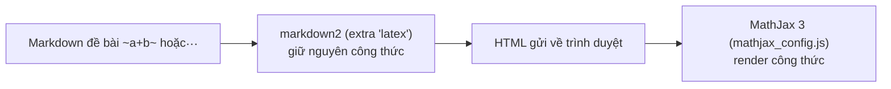

# Công thức toán học (MathJax và Mathoid)

> LCOJ hiển thị công thức toán bằng MathJax ngay trong trình duyệt, không cần cài thêm dịch vụ. Trang này giải thích cơ chế, cú pháp viết công thức và vì sao không nên bật Mathoid.
>
> ⏱ ~10 phút · 👤 Người vận hành, người ra đề · 🔑 Chỉ cần trình duyệt; SSH + docker nếu phải sửa lỗi file tĩnh

::: info Bạn có cần trang này không?
Trang này giải thích **cách LCOJ hiển thị công thức toán** trong đề bài, blog, bình luận và **vì sao bạn không cần cài Mathoid**.

- LCOJ hiển thị công thức **ngay khi cài xong**, bằng MathJax chạy trong trình duyệt. Không cần dịch vụ nào thêm.
- Mathoid là dịch vụ render công thức phía server từ DMOJ. LCOJ hiện **không dùng Mathoid khi render Markdown**. Bật nó lên còn có thể làm công thức **không hiển thị** (xem [bên dưới](#mathoid-trong-lcoj-hien-tai)).

Nếu bạn là người ra đề, chỉ cần đọc phần [Cú pháp viết công thức](#cu-phap-viet-cong-thuc).
:::

## Trạng thái trong LCOJ

| Thành phần | Trạng thái trong cấu hình đi kèm (`dmoj/config/local_settings.py`) |
|---|---|
| MathJax 3.2.0 (trong trình duyệt) | **Đang bật**, file tĩnh nằm ở `/static/vnoj/mathjax/3.2.0/` |
| Mathoid (`MATHOID_URL`) | **Tắt**: không khai báo, dùng mặc định `False` của `dmoj/settings.py` |
| Dịch vụ Mathoid trong `docker-compose.yml` | **Không có** |

## Cách LCOJ hiển thị công thức



1. Server dùng thư viện `markdown2` (bản fork của VNOI) với extra `latex`. Extra này nhận diện `~...~` và `$$...$$` để **giữ nguyên** công thức, không để Markdown làm hỏng các ký tự như `_`, `*`, `\`.
2. HTML được gửi về trình duyệt kèm công thức gốc.
3. MathJax (cấu hình trong `resources/mathjax_config.js`) render công thức ngay trên trình duyệt.

## Cú pháp viết công thức

| Loại | Cú pháp | Ghi chú |
|---|---|---|
| Công thức trong dòng (inline) | `~...~` | Cách chính, nên dùng |
| Công thức riêng dòng (display) | `$$...$$` | Căn giữa, cỡ lớn |
| Inline (cách khác) | `\(...\)` | MathJax hỗ trợ, nhưng Markdown có thể nuốt dấu `\`, nên ưu tiên `~...~` |

::: warning Dấu `$` đơn KHÔNG phải công thức
`$a+b$` sẽ hiển thị nguyên văn là `$a+b$`. Dùng `~a+b~` cho công thức trong dòng và `$$...$$` cho công thức riêng dòng.
:::

### Công thức trong dòng

```markdown
Cho hai số nguyên ~a~ và ~b~ ~(1 \le a, b \le 10^9)~.
```

### Công thức riêng dòng

```markdown
Dãy Fibonacci được định nghĩa:

$$F(n) = \begin{cases}
0, & n = 0 \\
1, & n = 1 \\
F(n-1) + F(n-2), & n \ge 2
\end{cases}$$
```

### Ví dụ đầy đủ

```markdown
Cho số nguyên ~N~ ~(1 \le N \le 10^{18})~, tìm số Fibonacci thứ ~N~
modulo ~10^9 + 7~.

$$F(n) = F(n-1) + F(n-2)$$

**Lưu ý:** Với ~30\%~ số điểm, ~N \le 10^6~.
```

### Ký hiệu thường dùng

| Mục đích | Viết | Mục đích | Viết |
|---|---|---|---|
| Nhỏ hơn hoặc bằng | `~a \le b~` | Phân số | `~\frac{a}{b}~` |
| Lớn hơn hoặc bằng | `~a \ge b~` | Mũ, chỉ số | `~a^{10}~`, `~a_{i,j}~` |
| Khác | `~a \ne b~` | Tổng | `~\sum_{i=1}^{n} a_i~` |
| Nhân | `~a \times b~` | Tích | `~\prod_{i=1}^{n} a_i~` |
| Đồng dư | `~a \equiv b \pmod{m}~` | Căn | `~\sqrt{x}~`, `~\sqrt[3]{x}~` |
| Làm tròn xuống/lên | `~\lfloor x \rfloor~`, `~\lceil x \rceil~` | Logarit | `~\log n~` |

::: tip Tô màu
Cấu hình MathJax của LCOJ nạp gói `color`, nên bạn có thể viết `~\color{red}{x}~`.
:::

## Mathoid trong LCOJ hiện tại

Mathoid ([mã nguồn upstream](https://gitlab.wikimedia.org/repos/mediawiki/services/mathoid), trước đây ở `github.com/wikimedia/mathoid`) là dịch vụ Node.js của Wikimedia, render TeX thành SVG/MathML. DMOJ từng dùng nó để render công thức phía server.

LCOJ hiện không dùng Mathoid khi render Markdown. Đặt `MATHOID_URL` chỉ ảnh hưởng tới hai việc:

1. Hiện lựa chọn **Math engine** trong trang sửa hồ sơ.
2. Khi người dùng để engine là `auto` (mặc định) và trình duyệt hỗ trợ MathML, engine chuyển thành `mml`. Lúc đó trang **không nạp MathJax**, trong khi server cũng không render công thức. Kết quả: công thức hiện ra dạng thô `~...~`.

::: danger Không bật Mathoid
Hiện tại, đặt `MATHOID_URL` **không** giúp công thức đẹp hơn mà còn có thể làm công thức mất hiển thị với nhiều trình duyệt. Hãy giữ nguyên cấu hình mặc định.
:::

### Nếu bạn phát triển lại tính năng này (tùy chọn, dành cho lập trình viên)

Chỉ làm trên máy dev, sau khi đã nối lớp `MathoidMathParser` (trong `judge/utils/mathoid.py` của `dmoj/repo`) vào bộ render Markdown.

1. Tự build image Mathoid từ mã nguồn upstream theo README của họ. Mathoid lắng nghe cổng **10044** theo `config.dev.yaml`. LCOJ không cung cấp sẵn image này.
2. Thêm service vào `dmoj/docker-compose.override.yml` (Compose tự gộp file này với `docker-compose.yml` khi chạy trong `dmoj/`) và cho nó vào network `site` để container `site` gọi được:

   ```yaml
   services:
     mathoid:
       image: my-mathoid:latest   # image bạn tự build
       restart: unless-stopped
       networks: [site]
   ```

3. Khai báo trong file settings (xem [Biến môi trường và cấu hình](/operate/environment)):

   ```python
   MATHOID_URL = 'http://mathoid:10044/'
   MATHOID_CACHE_ROOT = '/cache/mathoid/'   # thư mục mà site ghi được
   MATHOID_CACHE_URL = '/mathoid/'          # URL public của thư mục trên (cần thêm location nginx)
   ```

4. Chạy `docker compose up -d mathoid` rồi `docker compose restart site`.

Các setting còn lại và giá trị mặc định (trong `dmoj/settings.py`): `MATHOID_GZIP = False`, `MATHOID_MML_CACHE = None`, `MATHOID_CSS_CACHE = 'default'`, `MATHOID_DEFAULT_TYPE = 'auto'`, `MATHOID_MML_CACHE_TTL = 86400`.

## Kiểm tra kết quả

1. Mở một đề bài có công thức viết bằng `~...~` hoặc `$$...$$`: công thức hiển thị dạng toán, không còn ký tự `~` thô.
2. Mở DevTools (tab Network), tải lại trang: file `/static/vnoj/mathjax/3.2.0/es5/tex-chtml.min.js` trả về mã 200.
3. Trong `dmoj/config/local_settings.py` không có dòng `MATHOID_URL` (giữ mặc định `False`).

## Sự cố thường gặp

| Triệu chứng | Nguyên nhân thường gặp | Cách xử lý |
|---|---|---|
| Hiện nguyên `$a+b$` | Dùng dấu `$` đơn | Đổi thành `~a+b~` |
| Hiện nguyên `~a+b~` trên mọi trang | MathJax không tải được | Mở DevTools, kiểm tra `/static/vnoj/mathjax/3.2.0/es5/tex-chtml.min.js`; nếu 404 thì chạy `./scripts/copy_static` rồi `docker compose restart nginx` |
| Hiện nguyên `~a+b~` sau khi đặt `MATHOID_URL` | Engine chuyển sang `mml`, MathJax không được nạp | Bỏ `MATHOID_URL`, rồi `docker compose restart site` |
| Công thức báo lỗi đỏ | Sai cú pháp LaTeX | Thử công thức trên một trình soạn LaTeX trực tuyến |
| Đổi cấu hình mà đề bài cũ vẫn hiển thị như trước | HTML đề bài được cache tới 1 ngày | Lưu lại đề bài (cache được xóa khi lưu), hoặc chờ cache hết hạn |

## Tiếp theo

- [Định dạng bài tập](/setter/problem-format): viết đề bài hoàn chỉnh, gồm công thức.
- [Sơ đồ TikZ (Texoid)](/operate/texoid): dịch vụ render hình TikZ/LaTeX phía server.
- [Các script hỗ trợ](/operate/scripts): `copy_static` khi file tĩnh MathJax bị 404.

::: tip Cần hỗ trợ?
Tạo issue tại [github.com/luyencode/lcoj-docker/issues](https://github.com/luyencode/lcoj-docker/issues), xem thêm tại [behitek.com](https://behitek.com) hoặc liên hệ qua [luyencode.net/about/#lien-he](https://luyencode.net/about/#lien-he).
:::
