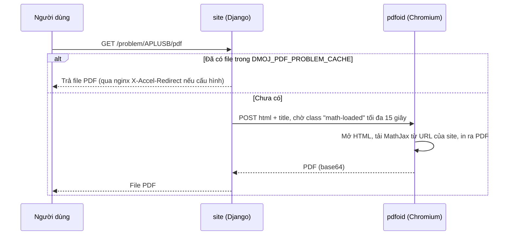

# Xuất đề bài ra PDF (Pdfoid)

> Cài Pdfoid (tùy chọn) để server tự tạo file PDF đề bài tại `/problem/<mã>/pdf`. Không cài thì LCOJ vẫn cho người dùng in đề ra PDF bằng trình duyệt.
>
> ⏱ ~45 phút · 👤 Người vận hành · 🔑 SSH + quyền chạy docker trên máy chủ

::: info Bạn có cần trang này không?
Pdfoid là dịch vụ của DMOJ, dùng Chromium chạy ngầm (headless) để chuyển HTML đề bài thành file PDF trên server.

- **LCOJ chạy tốt khi không có Pdfoid.** Nút **Xem dạng PDF** trên trang đề bài khi đó mở bản in `/problem/<mã>/raw` rồi gọi hộp thoại in của trình duyệt, người dùng chọn "Lưu dưới dạng PDF".
- Chỉ cài Pdfoid khi bạn cần **link PDF cố định** (`/problem/<mã>/pdf`) do server tạo, ví dụ để phát đề hoặc in hàng loạt cho kỳ thi offline.
- Nếu bạn đã có sẵn file PDF đề bài, không cần Pdfoid: dùng trường tải lên file PDF đề (`statement_file`) khi sửa bài.
:::

## Trạng thái trong LCOJ

| Thành phần | Trạng thái trong cấu hình đi kèm |
|---|---|
| `DMOJ_PDF_PDFOID_URL` | **Tắt**: chỉ có dòng ví dụ bị comment trong `dmoj/config/local_settings.py` |
| `DMOJ_PDF_PROBLEM_CACHE`, `DMOJ_PDF_PROBLEM_INTERNAL` | **Tắt**: bị comment |
| Dịch vụ Pdfoid trong `docker-compose.yml` | **Không có** |
| Nút "Xem dạng PDF" | Dùng chế độ in của trình duyệt |

## Cách hoạt động



Một số điểm cần biết:

- HTML gửi sang Pdfoid là template `problem/raw.html`. Template này tải MathJax **qua URL đầy đủ của site** (ví dụ `https://luyencode.net/static/...`), nên container Pdfoid **phải truy cập được website của bạn**.
- Nếu đặt `DMOJ_PDF_PROBLEM_CACHE`, file PDF được lưu với tên `<MÃ>.<ngôn ngữ>.pdf` và **tự bị xóa khi bài được lưu lại**. Lần xem sau sẽ render lại.
- Việc render diễn ra ngay trong request của uWSGI (không qua Celery).

## Trước khi bắt đầu

- [ ] Bạn thực sự cần link PDF do server tạo (nếu không, nút in của trình duyệt là đủ).
- [ ] Có quyền SSH và chạy `docker compose` trong thư mục `dmoj/`.
- [ ] Máy chủ còn đủ RAM cho Chromium chạy ngầm, vì mỗi lượt render (khi chưa có cache) khởi động một Chromium mới.
- [ ] Container Pdfoid sẽ truy cập được website của bạn (để tải MathJax).
- [ ] Đã biết cách sửa settings: xem [Biến môi trường và cấu hình](/operate/environment).

## Cài đặt (tùy chọn)

Pdfoid không có trong `docker-compose.yml`. Bạn chạy nó thành một container riêng, cùng network `site` với container `site`.

### Bước 1: Tạo image Pdfoid

Pdfoid không có trên PyPI, cài trực tiếp từ [github.com/DMOJ/pdfoid](https://github.com/DMOJ/pdfoid). Nó cần Chromium, ChromeDriver và exiftool, đọc đường dẫn từ biến `CHROME_PATH`, `CHROMEDRIVER_PATH`, `EXIFTOOL_PATH`.

Tạo `dmoj/addons/pdfoid/Dockerfile` (mẫu, chưa được kiểm thử trên LCOJ):

```dockerfile
FROM python:3.11-slim
RUN apt-get update && \
    apt-get install -y --no-install-recommends \
        chromium chromium-driver libimage-exiftool-perl \
        fonts-dejavu fonts-liberation git && \
    rm -rf /var/lib/apt/lists/* && \
    pip install --no-cache-dir git+https://github.com/DMOJ/pdfoid.git && \
    useradd -m pdfoid
ENV CHROME_PATH=/usr/bin/chromium \
    CHROMEDRIVER_PATH=/usr/bin/chromedriver \
    EXIFTOOL_PATH=/usr/bin/exiftool
USER pdfoid
EXPOSE 8888
CMD ["pdfoid", "--port=8888", "--address=0.0.0.0"]
```

::: warning
Pdfoid mặc định chỉ nghe trên `localhost`. Trong container bắt buộc phải có `--address=0.0.0.0`.
:::

### Bước 2: Thêm service vào Compose

Tạo (hoặc bổ sung) `dmoj/docker-compose.override.yml`. Compose tự gộp file này với `docker-compose.yml` khi bạn chạy lệnh trong thư mục `dmoj/`.

```yaml
services:
  pdfoid:
    build: ./addons/pdfoid
    restart: unless-stopped
    networks: [site]
```

### Bước 3: Khai báo settings

Site đọc cấu hình từ `dmoj/repo/dmoj/local_settings.py`. File này được `./scripts/initialize` chép từ `dmoj/config/local_settings.py`. Hãy sửa file trong `config/` rồi chép lại (hoặc sửa cả hai), xem [Biến môi trường và cấu hình](/operate/environment).

```python
DMOJ_PDF_PDFOID_URL = 'http://pdfoid:8888/'
```

### Bước 4: Khởi động

```sh
cd dmoj
docker compose up -d --build pdfoid
docker compose restart site
```

## Bật cache PDF (khuyến nghị khi đã dùng Pdfoid)

Không có cache, mỗi lượt xem PDF đều khởi động một Chromium mới. Để cache:

1. Thêm một volume dùng chung cho `site` và `nginx` trong `dmoj/docker-compose.override.yml`:

   ```yaml
   services:
     site:
       volumes:
         - pdfcache:/pdfcache/
     nginx:
       volumes:
         - pdfcache:/pdfcache/
   volumes:
     pdfcache:
   ```

2. Thêm location nội bộ vào `dmoj/nginx/conf.d/nginx.conf`, giống cách `/userdatacache` đang làm:

   ```nginx
   location /pdfcache {
       internal;
       root /;
   }
   ```

3. Khai báo settings:

   ```python
   DMOJ_PDF_PROBLEM_CACHE = '/pdfcache'      # thư mục phải tồn tại và site ghi được
   DMOJ_PDF_PROBLEM_INTERNAL = '/pdfcache'   # đường dẫn nginx dùng cho X-Accel-Redirect
   ```

4. Tạo lại container `site` và `nginx` để gắn volume mới (nginx cũng đọc lại cấu hình khi được tạo lại):

   ```sh
   docker compose up -d site nginx
   ```

## Kiểm tra kết quả

1. Mở một bài bất kỳ, ví dụ `https://luyencode.net/problem/APLUSB`.
2. Nút **Xem dạng PDF** giờ trỏ tới `/problem/APLUSB/pdf`.
3. Bấm vào, sau vài giây trình duyệt hiển thị file PDF.
4. Nếu đã bật cache: thư mục cache có file `APLUSB.<ngôn ngữ>.pdf`, và lần mở thứ hai trả về gần như ngay lập tức.

## Các setting có thật

| Setting | Mặc định (`dmoj/settings.py`) | Ý nghĩa |
|---|---|---|
| `DMOJ_PDF_PDFOID_URL` | `None` | URL của Pdfoid. Khác `None` thì bật tính năng |
| `DMOJ_PDF_PROBLEM_CACHE` | `None` | Thư mục cache PDF (tùy chọn) |
| `DMOJ_PDF_PROBLEM_INTERNAL` | `None` | Đường dẫn nội bộ nginx trỏ tới thư mục cache (tùy chọn) |

::: warning Các setting không tồn tại
Tài liệu cũ có nhắc `DMOJ_PDF_PROBLEM_TIMEOUT`, `DMOJ_PDF_PROBLEM_EXTRA_CSS`, `DMOJ_PDF_PROBLEM_HEADER`, `DMOJ_PDF_PROBLEM_FOOTER`, `DMOJ_PDF_PROBLEM_CACHE_TIME`, `DMOJ_PDF_PROBLEM_COMPRESS`, `DMOJ_PDF_PDFOID_URLS`. LCOJ **không đọc** các setting này. Thời gian chờ MathJax (15 giây) được viết cứng trong `judge/utils/pdfoid.py`.
:::

## Sử dụng

| Cách | Ví dụ |
|---|---|
| Theo ngôn ngữ giao diện hiện tại | `https://luyencode.net/problem/APLUSB/pdf` |
| Chỉ định ngôn ngữ (`vi` hoặc `en`) | `https://luyencode.net/problem/APLUSB/pdf/vi` |
| Lệnh quản trị, ghi ra `APLUSB.pdf` trong `dmoj/repo/` | `./scripts/manage.py render_pdf APLUSB -l vi` |

::: tip
Trang PDF kiểm tra quyền xem bài giống trang đề: ai không có quyền xem bài sẽ nhận lỗi 404.
:::

## Sự cố thường gặp

| Triệu chứng | Nguyên nhân thường gặp | Cách xử lý |
|---|---|---|
| `/problem/<mã>/pdf` trả 404 | `DMOJ_PDF_PDFOID_URL` chưa đặt, hoặc chưa restart `site` | Kiểm tra settings, chạy `docker compose restart site` |
| Lỗi 500, log `site` có `ConnectionError` | Site không gọi được Pdfoid | `docker compose ps pdfoid`; kiểm tra service ở network `site` và nghe `0.0.0.0` |
| Log có `PDF rendering timed out` | Chromium không tải được MathJax từ URL site trong 15 giây | Kiểm tra container Pdfoid truy cập được website (DNS, internet, Cloudflare) |
| Log Pdfoid báo Chromium không khởi động (sandbox) | Hạn chế của Docker với sandbox Chromium | Chạy bằng user thường (như Dockerfile trên); nếu vẫn lỗi, xem tài liệu Chromium về sandbox trong container |
| Chữ tiếng Việt lỗi font | Thiếu font trong image | Cài thêm font (`fonts-dejavu`, `fonts-noto`) rồi build lại |
| Sửa đề mà PDF cũ vẫn còn | File cache chỉ bị xóa khi bài được lưu | Lưu lại bài, hoặc xóa file `<MÃ>.<ngôn ngữ>.pdf` trong thư mục cache |

Xem log: `docker compose logs -f pdfoid` và `docker compose logs -f site` (logger `judge.problem.pdf`).

## Tiếp theo

- [Công thức toán học](/operate/mathoid): MathJax cũng là thứ Pdfoid phải chờ tải xong.
- [Kiến trúc hệ thống](/operate/architecture): vị trí của `site`, `nginx` và các network trong stack.
- [Lệnh quản trị](/reference/management-commands): lệnh `render_pdf` và các lệnh khác.

::: tip Cần hỗ trợ?
Tạo issue tại [github.com/luyencode/lcoj-docker/issues](https://github.com/luyencode/lcoj-docker/issues), xem thêm tại [behitek.com](https://behitek.com) hoặc liên hệ qua [luyencode.net/about/#lien-he](https://luyencode.net/about/#lien-he).
:::
