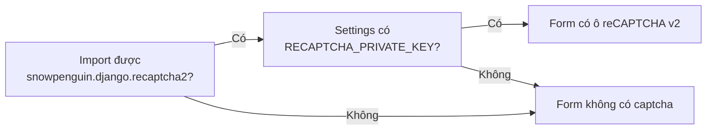

# Chống spam đăng ký với reCAPTCHA

> Bật ô "I'm not a robot" (reCAPTCHA v2) cho form đăng ký bằng mật khẩu. Chỉ cần khi bạn đã tắt `OAUTH_ONLY`; cấu hình mặc định của LCOJ không cần bước này.
>
> ⏱ ~30 phút · 👤 Người vận hành · 🔑 SSH + quyền chạy docker trên máy chủ, tài khoản Google

::: info Bạn có cần trang này không?
reCAPTCHA thêm ô "I'm not a robot" vào **form đăng ký bằng tên đăng nhập và mật khẩu**, giúp chặn bot tạo tài khoản rác.

- **LCOJ hiện không cần reCAPTCHA.** Cấu hình đi kèm đặt `OAUTH_ONLY = True`, nên form đăng ký truyền thống bị ẩn và người dùng chỉ đăng ký qua OAuth (Google). Google đã xác thực tài khoản thay bạn.
- Chỉ đọc tiếp nếu bạn **tắt `OAUTH_ONLY`** để mở lại đăng ký bằng mật khẩu.
:::

## Trạng thái trong LCOJ

| Thành phần | Trạng thái |
|---|---|
| `OAUTH_ONLY` trong `dmoj/config/local_settings.py` | `True`: form đăng ký truyền thống bị ẩn |
| Gói Python `django-recaptcha2` | **Chưa cài**: không có trong `requirements.txt` hay `additional_requirements.txt` |
| `RECAPTCHA_PUBLIC_KEY`, `RECAPTCHA_PRIVATE_KEY` | **Không khai báo** |
| Kết quả | reCAPTCHA **tắt** |

## LCOJ tích hợp reCAPTCHA thế nào

Code nằm ở `judge/utils/recaptcha.py` và `judge/views/register.py` trong `dmoj/repo`:

1. LCOJ thử import `snowpenguin.django.recaptcha2`. Module này thuộc gói PyPI **`django-recaptcha2`**.
2. Nếu import được **và** settings có thuộc tính `RECAPTCHA_PRIVATE_KEY`, form đăng ký có thêm trường `captcha` (widget reCAPTCHA **v2 checkbox**).
3. Nếu thiếu một trong hai điều kiện, form không có captcha và không báo lỗi gì.



::: warning Không nhầm hai gói
- Code LCOJ dùng **`django-recaptcha2`** (module `snowpenguin.django.recaptcha2`), chỉ hỗ trợ reCAPTCHA v2.
- Gói **`django-recaptcha`** (module `django_recaptcha`, có reCAPTCHA v3) **không** được code LCOJ dùng. Cài gói này không làm hiện captcha.
:::

::: details Ghi chú về `OAUTH_ONLY`
`OAUTH_ONLY` chỉ được dùng trong template `registration/registration_form.html` để ẩn các ô nhập liệu. View `/accounts/register/` không tự kiểm tra `OAUTH_ONLY`.
:::

## Trước khi bắt đầu

- [ ] Bạn đã quyết định tắt `OAUTH_ONLY` để mở lại đăng ký bằng mật khẩu (xem [OAuth](/start/glossary)).
- [ ] Có quyền SSH vào máy chủ và chạy `docker compose` trong thư mục `dmoj/`.
- [ ] Có tài khoản Google để tạo key reCAPTCHA.
- [ ] Có máy dev để thử trước (gói `django-recaptcha2` chưa được kiểm thử với Django 4.2).

## Bật reCAPTCHA (chỉ khi đã tắt `OAUTH_ONLY`)

::: warning Chưa được kiểm thử trên LCOJ
`django-recaptcha2` (bản mới nhất 1.4.1) chỉ công bố hỗ trợ tới Django 2.1, còn LCOJ chạy Django 4.2. Hãy thử trên máy dev trước khi bật trên production.
:::

### Bước 1: Lấy key từ Google

1. Vào [reCAPTCHA admin](https://www.google.com/recaptcha/admin) và đăng nhập tài khoản Google.
2. Tạo site mới:
   - **Label**: `LCOJ`
   - **Loại**: reCAPTCHA **v2**, chọn _"I'm not a robot" Checkbox_
   - **Domains**: `luyencode.net` (thêm domain dev nếu cần)
3. Lưu lại **Site key** (công khai) và **Secret key** (bí mật).

### Bước 2: Cài gói Python

Thêm một dòng vào `dmoj/repo/additional_requirements.txt`:

```text
django-recaptcha2
```

Rồi build lại image (từ thư mục `dmoj/`):

```sh
docker compose up -d --build base site celery
```

### Bước 3: Đưa key vào cấu hình

`local_settings.py` **không** tự đọc `RECAPTCHA_*` từ biến môi trường. Để không ghi secret vào file, hãy đọc từ env một cách tường minh.

1. Thêm vào `dmoj/environment/site.env`:

   ```env
   RECAPTCHA_PUBLIC_KEY=<site key>
   RECAPTCHA_PRIVATE_KEY=<secret key>
   ```

2. Thêm vào `dmoj/config/local_settings.py`, rồi chép sang `dmoj/repo/dmoj/local_settings.py` (file site thực sự đọc):

   ```python
   if os.environ.get('RECAPTCHA_PRIVATE_KEY'):
       INSTALLED_APPS += ('snowpenguin.django.recaptcha2',)
       RECAPTCHA_PUBLIC_KEY = os.environ['RECAPTCHA_PUBLIC_KEY']
       RECAPTCHA_PRIVATE_KEY = os.environ['RECAPTCHA_PRIVATE_KEY']
   ```

   - Khối `if` quan trọng: LCOJ bật captcha ngay khi `RECAPTCHA_PRIVATE_KEY` **tồn tại**, kể cả khi giá trị rỗng.
   - `INSTALLED_APPS` cần app này để tìm template `snowpenguin/recaptcha/recaptcha_init.html`.

3. Đặt `OAUTH_ONLY = False` nếu muốn mở lại form đăng ký bằng mật khẩu.

Xem thêm [Biến môi trường và cấu hình](/operate/environment).

### Bước 4: Khởi động lại

`docker compose restart` **không** đọc lại `site.env`. Dùng `up -d` để tạo lại container:

```sh
cd dmoj
docker compose up -d site celery
```

## Kiểm tra kết quả

1. Mở `https://luyencode.net/accounts/register/` trong cửa sổ ẩn danh.
2. Cuối form có ô "I'm not a robot".
3. Thử đăng ký một tài khoản test.

## Sự cố thường gặp

| Triệu chứng | Nguyên nhân | Cách xử lý |
|---|---|---|
| Không thấy ô captcha | `OAUTH_ONLY = True` (form bị ẩn), chưa cài `django-recaptcha2`, hoặc thiếu `RECAPTCHA_PRIVATE_KEY` | Kiểm tra từng điều kiện ở trên |
| Lỗi 500 `TemplateDoesNotExist` | Thiếu `'snowpenguin.django.recaptcha2'` trong `INSTALLED_APPS` | Thêm vào như Bước 3 |
| Lỗi import khi khởi động `site` | Gói không tương thích Django 4.2 | Gỡ khỏi `additional_requirements.txt`, build lại, giữ `OAUTH_ONLY = True` |
| Google báo "Invalid domain for site key" | Domain chưa khai báo trong reCAPTCHA admin | Thêm domain rồi thử lại |
| Luôn báo captcha sai | Sai secret key, hoặc container không ra được internet | Kiểm tra `site.env`, xem `docker compose logs -f site` |

## Bảo mật

- Không commit secret key vào git. Để trong `dmoj/environment/site.env` (đã được gitignore).
- Theo dõi số tài khoản mới để phát hiện spam sớm.

## Tiếp theo

- [Biến môi trường và cấu hình](/operate/environment): cách `site.env` và `local_settings.py` phối hợp với nhau.
- [Cập nhật LCOJ](/operate/updating): build lại image sau khi đổi `additional_requirements.txt`.
- [Quản lý người dùng](/admin/users): xử lý tài khoản rác nếu đã lọt qua.

::: tip Cần hỗ trợ?
Tạo issue tại [github.com/luyencode/lcoj-docker/issues](https://github.com/luyencode/lcoj-docker/issues), xem thêm tại [behitek.com](https://behitek.com) hoặc liên hệ qua [luyencode.net/about/#lien-he](https://luyencode.net/about/#lien-he).
:::
