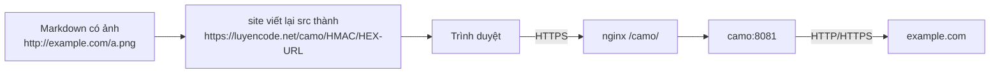

# Proxy ảnh ngoài qua HTTPS (Camo)

> Cài Camo (tùy chọn) để ảnh nhúng từ website khác được tải qua máy chủ của bạn bằng HTTPS, tránh cảnh báo "mixed content" và không lộ IP người xem.
>
> ⏱ ~45 phút · 👤 Người vận hành · 🔑 SSH + quyền chạy docker trên máy chủ, quyền sửa `dmoj/environment/` và `nginx.conf`

::: info Bạn có cần trang này không?
Khi đề bài, blog hay bình luận nhúng ảnh từ website khác (nhất là ảnh `http://`), trình duyệt có thể chặn hoặc cảnh báo "mixed content" vì LCOJ chạy HTTPS. Ngoài ra, website chứa ảnh sẽ thấy IP của người xem.

[Camo](https://github.com/atmos/camo) là proxy ảnh: LCOJ viết lại link ảnh ngoài để trình duyệt tải ảnh qua máy chủ Camo của bạn, bằng HTTPS.

- **LCOJ chạy bình thường khi không có Camo.** Ảnh ngoài vẫn hiện nếu nguồn ảnh dùng HTTPS.
- Cách đơn giản hơn: khuyến khích mọi người **tải ảnh lên LCOJ** bằng nút chèn ảnh trong trình soạn thảo, thay vì dùng link ngoài.
:::

## Trạng thái trong LCOJ

| Thành phần | Trạng thái |
|---|---|
| `DMOJ_CAMO_URL`, `DMOJ_CAMO_KEY`, `DMOJ_CAMO_EXCLUDE`, `DMOJ_CAMO_HTTPS` | **Bị comment** trong `dmoj/config/local_settings.py` (tắt) |
| Dịch vụ Camo trong `docker-compose.yml` | **Không có** |
| `location /camo/` trong `dmoj/nginx/conf.d/nginx.conf` | **Không có** |

## Cách hoạt động



- Khi render Markdown, LCOJ (file `judge/utils/camo.py`) viết lại thuộc tính `src` và `data-src` của thẻ ``, và `data` của thẻ `<object>`.
- URL mới có dạng `<DMOJ_CAMO_URL>/<chữ ký HMAC-SHA1>/<URL gốc mã hóa hex>`. Camo kiểm tra chữ ký bằng `CAMO_KEY`, nên người ngoài không thể dùng Camo của bạn để proxy link tùy ý.
- **Không** viết lại: đường dẫn tương đối (ví dụ `/martor/a.png`), URL bắt đầu bằng `DMOJ_CAMO_URL`, và URL bắt đầu bằng một tiền tố trong `DMOJ_CAMO_EXCLUDE`.
- Tất cả kiểu Markdown của LCOJ (đề bài, blog, bình luận, hồ sơ...) đều bật `use_camo`, nên chỉ cần cấu hình là áp dụng ở mọi nơi.

## Trước khi bắt đầu

- [ ] Bạn thật sự cần proxy ảnh ngoài (nếu không, khuyến khích tải ảnh lên LCOJ là đủ).
- [ ] Có quyền SSH và chạy `docker compose` trong thư mục `dmoj/`.
- [ ] Máy chủ có `openssl` để tạo secret key, và container Camo ra được internet.
- [ ] Chấp nhận tốn thêm băng thông, vì mọi ảnh ngoài sẽ đi qua server của bạn.
- [ ] Đã biết cách sửa settings: xem [Biến môi trường và cấu hình](/operate/environment).

## Cài đặt (tùy chọn)

Camo không có trong `docker-compose.yml`. Bạn chạy nó thành container riêng trên network `nginx`, để nginx chuyển tiếp `/camo/` tới nó.

### Bước 1: Tạo secret key

```sh
openssl rand -hex 32
```

Key này dùng chung cho Camo (`CAMO_KEY`) và LCOJ (`DMOJ_CAMO_KEY`).

### Bước 2: Lưu key vào file env

Tạo `dmoj/environment/camo.env` (thư mục này đã được gitignore):

```env
CAMO_KEY=<key vừa tạo>
```

Thêm vào `dmoj/environment/site.env`:

```env
DMOJ_CAMO_KEY=<cùng key đó>
```

::: warning
Dùng file env riêng cho Camo. Đừng cho container Camo đọc `site.env`, vì file đó chứa secret của site.
:::

### Bước 3: Thêm service vào Compose

Repo [atmos/camo](https://github.com/atmos/camo) có sẵn `Dockerfile` (dựa trên `node:8.4`, khá cũ). Compose build được thẳng từ Git. Tạo hoặc bổ sung `dmoj/docker-compose.override.yml`:

```yaml
services:
  camo:
    build: https://github.com/atmos/camo.git
    restart: unless-stopped
    env_file: [environment/camo.env]
    environment:
      CAMO_LENGTH_LIMIT: "5242880"   # giới hạn 5 MB (mặc định)
    networks: [nginx]
```

### Bước 4: Thêm location vào nginx

Trong khối `server` của `dmoj/nginx/conf.d/nginx.conf`:

```nginx
location /camo/ {
    proxy_pass http://camo:8081/;
}
```

Dấu `/` cuối `proxy_pass` giúp bỏ tiền tố `/camo` trước khi gửi sang Camo.

### Bước 5: Khai báo settings cho LCOJ

Thêm vào `dmoj/config/local_settings.py`, rồi chép sang `dmoj/repo/dmoj/local_settings.py` (file site thực sự đọc; xem [Biến môi trường và cấu hình](/operate/environment)):

```python
DMOJ_CAMO_URL = 'https://luyencode.net/camo'
DMOJ_CAMO_KEY = os.environ.get('DMOJ_CAMO_KEY')
# Tiền tố URL không cần proxy. PHẢI là tuple (không dùng list).
DMOJ_CAMO_EXCLUDE = ('https://luyencode.net/', 'http://luyencode.net/')
# URL dạng //host/... sẽ được coi là https://
DMOJ_CAMO_HTTPS = True
```

| Setting | Mặc định (`dmoj/settings.py`) | Ghi chú |
|---|---|---|
| `DMOJ_CAMO_URL` | `None` | URL public của Camo, không cần `/` ở cuối |
| `DMOJ_CAMO_KEY` | `None` | Phải trùng `CAMO_KEY`. Thiếu URL hoặc key thì Camo tắt |
| `DMOJ_CAMO_EXCLUDE` | `()` | Tuple **tiền tố URL** (có cả `https://`), không phải tên miền trần |
| `DMOJ_CAMO_HTTPS` | `False` | Dùng `https:` cho URL bắt đầu bằng `//` |

### Bước 6: Khởi động

```sh
cd dmoj
docker compose up -d --build camo
docker compose up -d site nginx      # tạo lại site để đọc site.env mới
docker compose restart nginx         # nạp location /camo/ nếu nginx không bị tạo lại
```

## Kiểm tra kết quả

1. Sinh một URL Camo bằng lệnh quản trị:

   ```sh
   ./scripts/manage.py camo http://example.com/image.png
   ```

   Lệnh in ra URL dạng `https://luyencode.net/camo/<hmac>/<hex>`. Nếu báo `Camo not available` thì `DMOJ_CAMO_URL` hoặc `DMOJ_CAMO_KEY` chưa có giá trị.
2. Mở URL đó trong trình duyệt, ảnh phải hiện ra.
3. Tạo một bình luận thử có ảnh ngoài, xem mã nguồn trang: `src` phải bắt đầu bằng `https://luyencode.net/camo/`.

::: tip Trang cũ chưa đổi link?
HTML của đề bài và một số trang được cache tới 1 ngày. Lưu lại bài hoặc chờ cache hết hạn.
:::

## Biến môi trường của Camo

Theo README của [atmos/camo](https://github.com/atmos/camo#configuration):

| Biến | Mặc định | Ý nghĩa |
|---|---|---|
| `PORT` | `8081` | Cổng Camo lắng nghe |
| `CAMO_KEY` | một key mặc định công khai | Key kiểm tra chữ ký HMAC. **Luôn phải đặt**, không dùng mặc định |
| `CAMO_LENGTH_LIMIT` | `5242880` | `Content-Length` tối đa (byte) được proxy |
| `CAMO_MAX_REDIRECTS` | `4` | Số lần redirect tối đa |
| `CAMO_SOCKET_TIMEOUT` | `10` | Số giây chờ trước khi bỏ cuộc |
| `CAMO_LOGGING_ENABLED` | `disabled` | Đặt `debug` để xem log chi tiết |
| `CAMO_HEADER_VIA` | `Camo Asset Proxy <version>` | Giá trị header `Via` và `User-Agent` gửi tới nguồn ảnh |
| `CAMO_TIMING_ALLOW_ORIGIN` | (không đặt) | Giá trị header `Timing-Allow-Origin` trả về trình duyệt |
| `CAMO_HOSTNAME` | `unknown` | Giá trị header `Camo-Host` |
| `CAMO_KEEP_ALIVE` | `false` | Bật keep-alive |

Camo **tự lọc** loại nội dung theo danh sách MIME ảnh có sẵn (`mime-types.json`), không có biến để đổi danh sách này.

## Cache và giới hạn tải

Camo **không có cache riêng**. `CAMO_HEADER_VIA` và `CAMO_TIMING_ALLOW_ORIGIN` chỉ là header, không liên quan tới cache. Nếu cần:

- **Giới hạn tốc độ** bằng nginx. Đặt `limit_req_zone` ở đầu `nginx.conf` (ngoài khối `server`), rồi dùng trong location:

  ```nginx
  limit_req_zone $binary_remote_addr zone=camo:10m rate=10r/s;

  server {
      # ...
      location /camo/ {
          limit_req zone=camo burst=20;
          proxy_pass http://camo:8081/;
      }
  }
  ```

- **Cache** bằng `proxy_cache` của nginx hoặc quy tắc cache của Cloudflare cho đường dẫn `/camo/`.

## Sự cố thường gặp

| Triệu chứng | Nguyên nhân | Cách xử lý |
|---|---|---|
| Link ảnh không bị viết lại | Thiếu `DMOJ_CAMO_URL`/`DMOJ_CAMO_KEY`, hoặc trang đang được cache | Chạy `./scripts/manage.py camo <url>` để kiểm tra; lưu lại bài |
| Lỗi `TypeError` liên quan `startswith` | `DMOJ_CAMO_EXCLUDE` là list | Đổi thành tuple |
| `/camo/...` trả 404 từ LCOJ | Thiếu `location /camo/` trong nginx | Thêm location, `docker compose restart nginx` |
| `/camo/...` trả 502 | Container Camo không chạy hoặc không ở network `nginx` | `docker compose ps camo`, `docker compose logs -f camo` |
| Camo trả 404 (đặt `CAMO_LOGGING_ENABLED=debug` sẽ thấy log `checksum mismatch`) | `CAMO_KEY` khác `DMOJ_CAMO_KEY` | Đặt cùng một key, tạo lại container |
| Một số ảnh vẫn không hiện | Nguồn ảnh chặn proxy, ảnh quá 5 MB, hoặc không phải ảnh | Tải ảnh lên LCOJ thay vì dùng link ngoài |

## Lưu ý

- Camo tốn băng thông của bạn vì mọi ảnh ngoài đều đi qua server.
- Camo chỉ proxy nội dung ảnh, không dùng cho video.

## Tiếp theo

- [Kiến trúc hệ thống](/operate/architecture): network `nginx` và cách nginx chuyển tiếp request.
- [Vận hành LCOJ](/operate/operations): xem log, khởi động lại dịch vụ.
- [Lệnh quản trị](/reference/management-commands): lệnh `camo` và các lệnh khác.

::: tip Cần hỗ trợ?
Tạo issue tại [github.com/luyencode/lcoj-docker/issues](https://github.com/luyencode/lcoj-docker/issues), xem thêm tại [behitek.com](https://behitek.com) hoặc liên hệ qua [luyencode.net/about/#lien-he](https://luyencode.net/about/#lien-he).
:::
