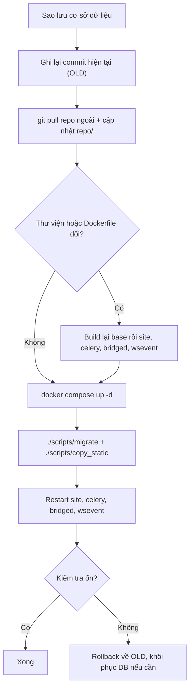

# Cập nhật LCOJ

> Đưa bản cài Docker lên phiên bản mới: lấy code, build lại khi cần, chạy migration và khởi động lại đúng service.
>
> ⏱ ~15–30 phút (lâu hơn nếu phải build lại image) · 👤 Người vận hành · 🔑 SSH + quyền chạy `docker` và `git` trên máy chủ

::: warning Luôn sao lưu trước
Trước khi cập nhật, hãy [sao lưu cơ sở dữ liệu](/operate/operations#backup). Code cũ có thể lấy lại bằng Git, nhưng migration đã chạy thì không tự đảo ngược được.
:::

## Trước khi bắt đầu

- [ ] Đã [sao lưu cơ sở dữ liệu](/operate/operations#backup) (và tốt nhất cả `problems/`, `media/`).
- [ ] Chọn giờ ít người dùng, không có kỳ thi đang diễn ra.
- [ ] Có SSH vào máy chủ, chạy được `docker compose` và `git` trong `lcoj-docker/dmoj/`.
- [ ] Biết bản cài của bạn theo nhánh nào của lcoj-site (các ví dụ trong trang này dùng nhánh `prod/luyencode`).
- [ ] Hiểu *migration* là gì (thay đổi cấu trúc cơ sở dữ liệu do Django tạo). Xem [Thuật ngữ](/start/glossary).

Tổng quan quy trình:



## Hai repo cần cập nhật

Bản cài gồm hai repo Git lồng nhau:

| Thư mục | Repo | Chứa |
|---|---|---|
| `lcoj-docker/` | [lcoj-docker](https://github.com/luyencode/lcoj-docker) | `docker-compose.yml`, Dockerfile, script, cấu hình mẫu, nginx |
| `lcoj-docker/dmoj/repo/` | [lcoj-site](https://github.com/luyencode/lcoj-site) (submodule) | Toàn bộ code Django, template, CSS/JS, WebSocket |

### Submodule và "detached HEAD"

Repo ngoài không lưu nhánh của submodule, nó chỉ ghim `dmoj/repo` vào **một commit cụ thể**. Vì vậy:

- `git submodule update` checkout đúng commit được ghim, nên `dmoj/repo` rơi vào trạng thái **detached HEAD** (không nằm trên nhánh nào). `git pull` bên trong sẽ báo lỗi cho đến khi bạn checkout một nhánh.
- `.gitmodules` không khai báo `branch`, nên `git submodule update --remote` sẽ lấy nhánh mặc định của lcoj-site (`master`), **không phải** nhánh `prod/luyencode`.
- Các lệnh trong trang này theo nhánh **`prod/luyencode`** của lcoj-site. Nếu bạn theo nhánh khác, hãy thay tên nhánh cho phù hợp.

Kiểm tra trạng thái hiện tại:

```sh
git -C repo status | head -1   # "On branch prod/luyencode" hoặc "HEAD detached at ..."
```

Nếu đang detached HEAD và muốn theo nhánh `prod/luyencode`:

```sh
git -C repo fetch origin
git -C repo checkout prod/luyencode
```

## Các bước cập nhật

Chạy mọi lệnh trong `lcoj-docker/dmoj/`.

1. **Ghi lại commit hiện tại** của cả hai repo để biết những gì thay đổi và để rollback nếu cần:

   ```sh
   OLD=$(git -C repo rev-parse HEAD); echo $OLD
   OLD_DOCKER=$(git rev-parse HEAD); echo $OLD_DOCKER
   ```

2. **Cập nhật repo ngoài** (Dockerfile, script, cấu hình mẫu):

   ```sh
   git pull --ff-only
   ```

3. **Cập nhật code site.** Chọn một trong hai cách:

   ::: code-group

   ```sh [Theo nhánh prod/luyencode]
   git -C repo fetch origin
   git -C repo checkout prod/luyencode
   git -C repo pull --ff-only origin prod/luyencode
   ```

   ```sh [Theo commit repo ngoài ghim]
   git submodule update --init --recursive
   # repo/ sẽ ở trạng thái detached HEAD, điều này là bình thường
   ```

   :::

4. **Xem những gì đã thay đổi:**

   ```sh
   git -C repo diff --stat $OLD HEAD
   git diff --stat $OLD_DOCKER HEAD -- .   # thay đổi trong lcoj-docker/dmoj
   ```

5. **Làm theo bảng dưới đây** tùy phần nào thay đổi.

### Việc cần làm theo từng loại thay đổi

| Thay đổi | Việc cần làm |
|---|---|
| `requirements.txt`, `additional_requirements.txt`, `package.json`, `package-lock.json` | Build lại image `base` rồi các image dựa trên nó (xem [bên dưới](#rebuild)) |
| `dmoj/base/Dockerfile`, `dmoj/site/Dockerfile`, `dmoj/celery/Dockerfile`, `dmoj/bridged/Dockerfile`, `dmoj/wsevent/Dockerfile` | `docker compose build <service>` rồi `docker compose up -d` |
| Model mới / file trong `*/migrations/` | `./scripts/migrate` |
| SCSS, JS, ảnh trong `resources/`, file dịch trong `locale/` | `./scripts/copy_static` |
| Code Python, template | `docker compose restart site celery bridged` |
| `websocket/*.js` | `docker compose restart wsevent` |
| `docker-compose.yml`, `environment/*.env.example` | So sánh với file `.env` của bạn, thêm biến mới, rồi `docker compose up -d` |
| `config/local_settings.py`, `config/uwsgi.ini`, `config/config.js` | Tự chép phần thay đổi sang bản trong `repo/` (xem cảnh báo dưới), rồi restart service tương ứng |
| `nginx/conf.d/nginx.conf` | `docker compose restart nginx` |

Code **không** cần build lại image vì thư mục `./repo` được mount thẳng vào container. Chỉ khởi động lại là đủ.

::: warning Cấu hình trong repo/ không tự cập nhật
`repo/dmoj/local_settings.py`, `repo/uwsgi.ini` và `repo/websocket/config.js` được `.gitignore` bỏ qua trong lcoj-site, nên `git pull` không đụng tới chúng. Nếu bản mẫu trong `config/` thay đổi, hãy so sánh (`diff config/local_settings.py repo/dmoj/local_settings.py`) rồi sửa bằng tay. Chạy lại `./scripts/initialize` sẽ ghi đè mất các chỉnh sửa riêng của bạn.
:::

### Build lại khi thư viện thay đổi {#rebuild}

Python, Node.js và toàn bộ thư viện nằm trong image `lcoj/lcoj-base`. Image `site`, `celery`, `bridged` được build từ image này, còn `wsevent` tự cài `package.json` riêng. Nếu chỉ build lại `site`, thư viện mới **không** được cài.

```sh
docker compose build base
docker compose build site celery bridged wsevent
docker compose up -d
```

Nếu nghi ngờ Docker dùng cache cũ, thêm `--no-cache` cho lệnh build `base`.

### Kết thúc cập nhật

Nếu không chắc phần nào thay đổi, cứ chạy đủ các bước sau, tất cả đều an toàn khi chạy lại:

```sh
./scripts/migrate
./scripts/copy_static
docker compose restart site celery bridged wsevent
docker compose ps
```

## Script cập nhật mẫu

Script dưới đây làm theo đúng các bước trên cho nhánh `prod/luyencode`. Lưu thành `dmoj/update.sh` (tên `*.sh` trong `dmoj/` đã được `.gitignore` bỏ qua) rồi `chmod +x`.

```bash
#!/usr/bin/env bash
set -euo pipefail
cd "$(dirname "$0")"                 # thư mục dmoj/
export COMPOSE_EXEC_FLAGS=-T         # các script trong scripts/ chạy được khi không có terminal
BRANCH=prod/luyencode
STAMP=$(date +%F_%H%M%S)

echo "1. Sao lưu cơ sở dữ liệu"
mkdir -p backups
docker compose exec -T db sh -c \
  'MYSQL_PWD="$MYSQL_ROOT_PASSWORD" exec mariadb-dump -u root --single-transaction "$MYSQL_DATABASE"' \
  | gzip > "backups/db_before_update_$STAMP.sql.gz"

echo "2. Lấy code mới"
OLD=$(git -C repo rev-parse HEAD)
git pull --ff-only
git -C repo fetch origin
git -C repo checkout "$BRANCH"
git -C repo pull --ff-only origin "$BRANCH"
NEW=$(git -C repo rev-parse HEAD)

if [ "$OLD" = "$NEW" ]; then
  echo "Code site không đổi."
else
  echo "Cập nhật $OLD -> $NEW"
  CHANGED=$(git -C repo diff --name-only "$OLD" "$NEW")

  if echo "$CHANGED" | grep -qE '^(requirements\.txt|additional_requirements\.txt|package(-lock)?\.json)$'; then
    echo "3. Thư viện thay đổi: build lại image"
    docker compose build base
    docker compose build site celery bridged wsevent
  fi
fi

echo "4. Khởi động (tạo lại container nếu image hoặc cấu hình đổi)"
docker compose up -d

echo "5. Migration và static"
./scripts/migrate
./scripts/copy_static

echo "6. Khởi động lại để nạp code mới"
docker compose restart site celery bridged wsevent
docker compose ps

echo "Xong. Theo dõi log: docker compose logs -f site"
```

Script không tự so sánh `config/` với các file cấu hình trong `repo/`. Hãy xem phần diff ở bước 4 phía trên sau mỗi lần cập nhật.

## Kiểm tra kết quả

1. `docker compose ps`: mọi service (trừ `base`) đều **Up**.
2. `docker compose logs --tail=50 site celery bridged`: không có traceback.
3. Mở trang web, đăng nhập, xem một bài tập, nộp thử một bài.
4. Trong `docker compose logs bridged`, thấy máy chấm kết nối lại.

## Sự cố thường gặp

| Triệu chứng | Cách xử lý |
|---|---|
| `git pull` trong `repo/` báo lỗi vì không ở nhánh nào | `repo/` đang detached HEAD. Chạy `git -C repo checkout prod/luyencode` rồi pull lại (xem [Submodule và "detached HEAD"](#submodule-va-detached-head)) |
| `ModuleNotFoundError` sau khi cập nhật | Thư viện mới chưa được cài: build lại `base` trước, rồi các image khác ([Build lại](#rebuild)) |
| Mất CSS hoặc giao diện cũ | `./scripts/copy_static` rồi `docker compose restart site` |
| Lỗi bảng/cột không tồn tại | Chưa chạy migration: `./scripts/migrate` |
| Biến mới trong `.env` không có tác dụng | Dùng `docker compose up -d`, không phải `restart` |
| Tính năng mới cần cấu hình nhưng không chạy | So sánh `config/` với bản trong `repo/` và sửa bằng tay (xem cảnh báo ở trên) |
| Site lỗi nặng, không sửa nhanh được | Làm theo [Rollback](#rollback) bên dưới |

## Rollback

::: danger
Quay lại code cũ **không** đảo ngược migration đã chạy. Nếu bản mới có migration, cách an toàn nhất là khôi phục bản sao lưu cơ sở dữ liệu tạo trước khi cập nhật.
:::

1. Dừng các service ghi dữ liệu:

   ```sh
   docker compose stop site celery bridged
   ```

2. Đưa code về commit cũ (`$OLD` ghi lại ở bước 1):

   ```sh
   git -C repo checkout <OLD>
   ```

3. Nếu có migration mới, [khôi phục cơ sở dữ liệu](/operate/operations#restore) từ bản sao lưu trước khi cập nhật.
4. Nếu thư viện đã thay đổi, build lại như ở [phần trên](#rebuild).
5. Khởi động lại:

   ```sh
   docker compose up -d
   ./scripts/copy_static
   docker compose restart site celery bridged wsevent
   ```

Khi đã sửa xong lỗi, quay lại nhánh bằng `git -C repo checkout prod/luyencode`.

## Lời khuyên

- Cập nhật vào giờ ít người dùng, tránh lúc đang có kỳ thi.
- Báo trước cho người dùng. Trong lúc `site` dừng, nginx hiển thị trang `502.html` (xem [Trang bảo trì](/operate/operations#maintenance)).
- Nếu có thể, thử bản mới trên một máy thử nghiệm trước.

## Tiếp theo

- [Vận hành LCOJ](/operate/operations): xem log, xóa cache, sao lưu định kỳ.
- [Biến môi trường](/operate/environment): khi bản mới thêm biến vào `environment/*.env.example`.
- [Management Commands](/reference/management-commands): các lệnh `./scripts/manage.py` có thể cần sau cập nhật.

::: tip Cần hỗ trợ?
Tạo issue tại [lcoj-docker](https://github.com/luyencode/lcoj-docker/issues), hoặc liên hệ qua [behitek.com](https://behitek.com) và [luyencode.net/about/#lien-he](https://luyencode.net/about/#lien-he).
:::
