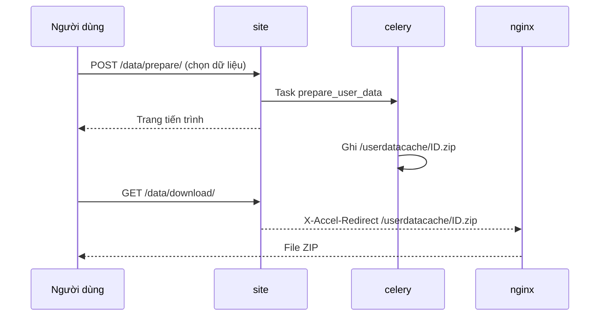

# Tải dữ liệu người dùng

::: info Bạn có cần trang này không?
Tính năng này cho phép mỗi người dùng tự tải về một file ZIP chứa **mã nguồn các bài nộp** và **bình luận** của chính họ.

- **LCOJ đã bật sẵn tính năng này** và cấu hình xong cả nginx lẫn volume Docker. Bạn không cần làm gì để nó chạy.
- Đọc trang này nếu bạn muốn **đổi giới hạn tần suất**, **tắt tính năng**, **dọn file cũ**, hoặc xử lý khi người dùng báo lỗi.
:::

## Trạng thái trong LCOJ

| Thành phần | Giá trị trong cấu hình đi kèm |
|---|---|
| `DMOJ_USER_DATA_DOWNLOAD` | `True` (mặc định trong `dmoj/settings.py` là `False`) |
| `DMOJ_USER_DATA_CACHE` | `'/userdatacache'` |
| `DMOJ_USER_DATA_INTERNAL` | `'/userdatacache'` |
| `DMOJ_USER_DATA_DOWNLOAD_RATELIMIT` | `datetime.timedelta(days=1)` |
| Volume `userdatacache` | Gắn vào `site`, `celery` và `nginx` tại `/userdatacache/` |
| nginx | Đã có `location /userdatacache { internal; root /; }` |

## Cách hoạt động



1. File ZIP được tạo bởi **Celery**, không phải bởi `site`. Vì vậy `celery` cũng cần đọc được thư mục cache.
2. Mỗi người dùng chỉ có **một file**, tên là `<profile id>.zip`. Lần tạo sau ghi đè lần trước.
3. Location nginx được đánh dấu `internal`, nên không ai tải trực tiếp được file qua URL `/userdatacache/...`. File chỉ được trả qua `/data/download/`, trang này yêu cầu đăng nhập và chỉ trả file của chính người đó.

## Hướng dẫn cho người dùng

1. Đăng nhập, mở **Chỉnh sửa hồ sơ** (`/edit/profile/`).
2. Bấm liên kết **Download your data** (chưa có bản dịch tiếng Việt). Liên kết dẫn tới `/data/prepare/`.
3. Chọn dữ liệu muốn tải:
   - **Download comments?**: bình luận.
   - **Download submissions?**: bài nộp. Có thể lọc theo mã bài (glob, ví dụ `APLUS*`, mặc định `*`) và theo kết quả (AC, WA...; để trống là lấy tất cả).
4. Gửi form, chờ trang tiến trình chạy xong.
5. Bấm nút tải file. File tải về có tên `<username>-data.zip`.

::: tip Giới hạn tần suất
Sau mỗi lần yêu cầu, người dùng phải đợi hết `DMOJ_USER_DATA_DOWNLOAD_RATELIMIT` (1 ngày) mới tạo được file mới. File đã tạo thì vẫn tải lại được bất cứ lúc nào. Nếu file bị xóa khỏi cache, người dùng được phép tạo lại ngay.
:::

## Nội dung file ZIP

```text
<username>-data.zip
├── submissions/
│   ├── info.json          # thông tin mọi bài nộp, theo id
│   ├── 123456.cpp         # mã nguồn, đuôi file theo ngôn ngữ
│   └── ...
└── comments/
    ├── info.json          # thông tin mọi bình luận, theo id
    ├── 789.txt            # nội dung bình luận
    └── ...
```

Mỗi mục trong `submissions/info.json`:

```json
{
    "123456": {
        "problem": "APLUSB",
        "date": "2026-01-01T00:00:00+00:00",
        "time": 0.01,
        "memory": 2048.0,
        "language": "CPP17",
        "status": "D",
        "result": "AC",
        "case_points": 100.0,
        "case_total": 100.0
    }
}
```

Mỗi mục trong `comments/info.json` có các trường `date`, `related_object` (`problem`, `contest`, `blog post` hoặc `problem editorial`), `page` và `score`.

## Thay đổi cấu hình

Các setting nằm trong `dmoj/config/local_settings.py`. Site đọc bản sao ở `dmoj/repo/dmoj/local_settings.py` (do `./scripts/initialize` chép sang). Sửa file trong `config/` rồi chép lại, hoặc sửa cả hai. `local_settings.py` **không** đọc các setting này từ biến môi trường. Xem [Biến môi trường và cấu hình](/operate/environment).

| Muốn | Sửa |
|---|---|
| Cho tạo lại mỗi 7 ngày | `DMOJ_USER_DATA_DOWNLOAD_RATELIMIT = datetime.timedelta(days=7)` |
| Tắt tính năng | `DMOJ_USER_DATA_DOWNLOAD = False` (liên kết biến mất, `/data/...` trả 404) |

Sau khi sửa, khởi động lại cả `site` và `celery` (celery tạo file nên cũng cần cấu hình mới):

```sh
cd dmoj
docker compose restart site celery
```

::: warning Không đổi đường dẫn nếu không cần
`/userdatacache` phải khớp với volume trong `docker-compose.yml` và location trong `nginx.conf`. Nếu đổi `DMOJ_USER_DATA_CACHE` hoặc `DMOJ_USER_DATA_INTERNAL`, phải đổi cả hai nơi đó rồi chạy `docker compose up -d site celery nginx`.
:::

## Dọn file cũ

LCOJ **không tự xóa** file ZIP. Mỗi người chỉ có một file nên dung lượng không tăng vô hạn, nhưng file của người đã tải xong vẫn nằm lại trong volume. Nên dọn định kỳ.

Chạy thủ công (từ thư mục `dmoj/`):

```sh
docker compose exec -T site find /userdatacache/ -type f -name '*.zip' -mtime +2 -delete
```

Hoặc thêm cron trên máy host (`crontab -e`), thay đường dẫn cho đúng:

```cron
0 */4 * * * cd /path/to/lcoj-docker/dmoj && docker compose exec -T site find /userdatacache/ -type f -name '*.zip' -mtime +2 -delete
```

- `0 */4 * * *`: chạy vào phút 0, mỗi 4 giờ.
- `-mtime +2`: chỉ xóa file cũ hơn khoảng 2 ngày.

::: tip Chọn thời gian giữ file
Giữ file **lâu hơn** `DMOJ_USER_DATA_DOWNLOAD_RATELIMIT`. Vì file bị xóa thì người dùng được tạo lại ngay, xóa quá sớm sẽ vô hiệu hóa giới hạn tần suất.
:::

## Xử lý sự cố

| Triệu chứng | Nguyên nhân | Cách xử lý |
|---|---|---|
| Không thấy liên kết "Download your data" | Tính năng tắt, hoặc tài khoản đang bị mute (người bị mute nhận 404) | Kiểm tra `DMOJ_USER_DATA_DOWNLOAD`, trạng thái mute |
| Trang tiến trình đứng mãi | Celery không chạy | `docker compose ps celery`, `docker compose logs -f celery` |
| Task lỗi `No such file or directory` | Celery không thấy `/userdatacache` | Kiểm tra volume `userdatacache` đã gắn vào `celery` |
| `/data/download/` trả 404 | File chưa được tạo hoặc đã bị dọn | Tạo lại từ `/data/prepare/` |
| Tải về file rỗng hoặc lỗi 404 từ nginx | nginx không thấy file | Kiểm tra volume đã gắn vào `nginx` và location `/userdatacache` có trong `nginx.conf` |
| Báo phải chờ | Chưa hết thời gian `DMOJ_USER_DATA_DOWNLOAD_RATELIMIT` | Chờ, hoặc tải lại file đã tạo trước đó |

::: tip Cần hỗ trợ?
Tạo issue tại [github.com/luyencode/lcoj-docker/issues](https://github.com/luyencode/lcoj-docker/issues), xem thêm tại [behitek.com](https://behitek.com) hoặc liên hệ qua [luyencode.net/about/#lien-he](https://luyencode.net/about/#lien-he).
:::
