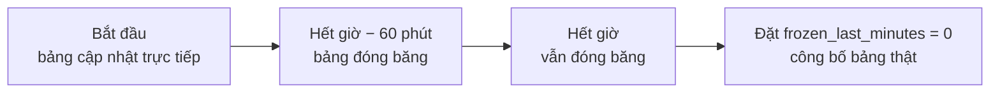

# Các định dạng kỳ thi

Định dạng kỳ thi (contest format) quyết định **cách tính điểm** và **cách xếp hạng khi bằng điểm** trên bảng xếp hạng. LCOJ có sẵn 7 định dạng, kế thừa từ DMOJ và VNOJ.

## Nên chọn định dạng nào?

| Khoá (`format_name`) | Tên hiển thị | Điểm mỗi bài | Phá hoà (khi bằng điểm) | Phạt mặc định | Đóng băng bảng | Nhãn bài | Phù hợp với |
|---|---|---|---|---|---|---|---|
| `default` | Mặc định | Điểm cao nhất | Tổng thời điểm nộp **cuối cùng** ở các bài có điểm | Không | Không | 1, 2, 3… | Bài luyện tập, kỳ thi đơn giản |
| `ioi` | IOI (pre-2016) | Điểm cao nhất của một lần nộp | Tuỳ chọn (mặc định: không phá hoà) | Không | Không | 1, 2, 3… | Kỳ thi kiểu IOI cũ, bài không chia subtask |
| `ioi16` | IOI | Tổng điểm tốt nhất của **từng subtask** qua mọi lần nộp | Tuỳ chọn (mặc định: không phá hoà) | Không | Không | 1, 2, 3… | Kỳ thi kiểu Olympic, bài có subtask |
| `ecoo` | ECOO | Điểm lần nộp **cuối cùng** + điểm thưởng | Tuỳ chọn (mặc định: không phá hoà) | Không (có thưởng) | Không | 1, 2, 3… | Kỳ thi có thưởng AC sớm |
| `atcoder` | AtCoder | Điểm cao nhất | Thời điểm thay đổi điểm cuối cùng + phạt | 5 phút/lần sai | Không | 1, 2, 3… | Kỳ thi kiểu AtCoder |
| `icpc` | ICPC | Điểm cao nhất | Tổng thời gian + phạt, rồi thời điểm AC cuối | 20 phút/lần sai | **Có** | A, B, C… | Kỳ thi đồng đội kiểu ICPC |
| `vnoj` | VNOJ | Điểm cao nhất | Tổng thời gian + phạt (hoặc chỉ lần cuối nếu bật `LSO`), rồi thời điểm AC cuối | 5 phút/lần sai | **Có** | 1, 2, 3… | Kỳ thi kiểu VNOJ/Codeforces, cần đóng băng bảng |

::: tip Gợi ý nhanh
- Kỳ thi thông thường, không cần phạt: **`default`**.
- Bài có subtask, chấm điểm từng phần: **`ioi16`**.
- Muốn phạt nộp sai và đóng băng bảng xếp hạng ở cuối giờ: **`vnoj`** (thời gian tính theo giây, nhãn bài dạng số) hoặc **`icpc`** (thời gian tính theo phút, nhãn bài dạng chữ cái).
:::

## Thiết lập định dạng

Định dạng được cấu hình trong trang quản trị Django (**Admin → Kỳ thi → chọn kỳ thi**), mục **Format**:

| Trường | Nhãn tiếng Việt | Ý nghĩa |
|---|---|---|
| `format_name` | định dạng kỳ thi | Chọn một trong các khoá ở bảng trên. Mặc định `default`. |
| `format_config` | cấu hình dạng kỳ thi | Một đối tượng JSON chứa tuỳ chọn của định dạng. Để trống để dùng giá trị mặc định. |
| `frozen_last_minutes` | số phút đóng băng | Số phút cuối giờ đóng băng bảng xếp hạng. Chỉ có tác dụng với `icpc` và `vnoj`. `0` = không đóng băng. |
| `problem_label_script` | — | (Tuỳ chọn) Hàm Lua tự sinh nhãn bài, ghi đè nhãn mặc định của định dạng. |

Một số trường liên quan khác:

- `points_precision` (mặc định `3`): số chữ số thập phân khi làm tròn điểm.
- `show_short_display` (**Hiển thị các cài đặt của kỳ thi**): hiện tóm tắt luật tính điểm của định dạng trên trang kỳ thi.

Quy tắc kiểm tra `format_config` (áp dụng cho mọi định dạng có tuỳ chọn):

- Phải là đối tượng JSON (hoặc để trống).
- Khoá không có trong danh sách tuỳ chọn của định dạng sẽ bị **từ chối** (`unknown config key`). Vì vậy **không** thể gộp tuỳ chọn của nhiều định dạng vào một cấu hình.
- Kiểu giá trị phải khớp với giá trị mặc định: số nguyên (`5`, không phải `5.0`) hoặc boolean (`true`/`false`).
- `default` chỉ chấp nhận cấu hình trống (`null` hoặc `{}`).

::: warning Chấm lại toàn bộ
Khi lưu kỳ thi mà `format_name`, `format_config` hoặc `frozen_last_minutes` thay đổi, LCOJ sẽ tính lại điểm của mọi lượt tham gia. Với kỳ thi lớn, việc này có thể mất một lúc.
:::

## Cách xếp hạng chung

Mọi định dạng đều ghi ba giá trị cho mỗi thí sinh: **điểm** (`score`), **thời gian tích luỹ** (`cumtime`) và **giá trị phá hoà** (`tiebreaker`). Bảng xếp hạng sắp theo thứ tự:

1. Thí sinh bị loại (disqualified) luôn nằm cuối.
2. `score` giảm dần.
3. `cumtime` tăng dần.
4. `tiebreaker` tăng dần.

Hai thí sinh bằng nhau cả ba giá trị thì **đồng hạng**. Các định dạng chỉ khác nhau ở cách tính ba giá trị này.

Trong các phần dưới, "thời gian" của một lần nộp là số giây (hoặc phút với `icpc`) tính từ lúc thí sinh bắt đầu tham gia. "Lần nộp sai" chỉ tính các lần nộp có kết quả, **không tính** lỗi biên dịch (CE) và lỗi hệ thống (IE).

## Default (`default`)

**Tính điểm:** điểm mỗi bài là điểm cao nhất trong các lần nộp; tổng điểm là tổng các bài.

**Phá hoà:** `cumtime` = tổng thời điểm của **lần nộp cuối cùng** ở mỗi bài có điểm lớn hơn 0. Nộp thêm vào một bài đã có điểm (kể cả khi không tăng điểm) sẽ làm tăng thời gian.

**Cấu hình:** không có tuỳ chọn. `format_config` phải để trống.

**Ví dụ:**

| Thí sinh | Bài 1 | Bài 2 | Bài 3 | Tổng điểm | `cumtime` |
|---|---|---|---|---|---|
| An | 100 (nộp cuối phút 10) | 80 (phút 25) | 60 (phút 40) | 240 | 75 phút |
| Bình | 100 (phút 15) | 80 (phút 20) | 60 (phút 35) | 240 | 70 phút |

Bình xếp trên vì tổng thời gian nhỏ hơn.

## IOI (pre-2016) (`ioi`)

Định dạng IOI kiểu cũ: mỗi bài lấy điểm của **lần nộp có điểm cao nhất** (không cộng dồn subtask giữa các lần nộp).

**Cấu hình:**

| Tuỳ chọn | Kiểu | Mặc định | Ý nghĩa |
|---|---|---|---|
| `cumtime` | boolean | `false` | Phá hoà bằng tổng thời điểm **đầu tiên** đạt điểm cao nhất ở mỗi bài có điểm. |
| `last_score_altering` | boolean | `false` | Phá hoà bằng thời điểm của lần nộp thay đổi điểm **muộn nhất**. |

| `cumtime` | `last_score_altering` | Cách phá hoà |
|---|---|---|
| `false` | `false` | Không phá hoà: bằng điểm là đồng hạng. |
| `true` | `false` | Tổng thời gian đạt điểm cao nhất ở các bài. |
| `false` | `true` | Thời điểm thay đổi điểm cuối cùng. |
| `true` | `true` | Tổng thời gian, sau đó đến thời điểm thay đổi điểm cuối cùng. |

```json
{
  "cumtime": true,
  "last_score_altering": false
}
```

## IOI (`ioi16`)

Định dạng IOI từ năm 2016: với mỗi **subtask** (batch test), LCOJ lấy điểm tốt nhất của subtask đó qua **tất cả** các lần nộp đã chấm xong, rồi cộng lại thành điểm bài.

::: tip Chỉ dùng khi bài có subtask
Định dạng này tính theo batch. Các test không thuộc batch nào bị gộp chung thành một nhóm, thường không cho kết quả mong muốn. Hãy chia test thành batch cho mọi bài trong kỳ thi (xem [Định dạng bài tập](/setter/problem-format)).
:::

**Ví dụ:** bài có 2 subtask (30 và 70 điểm):

| Lần nộp | Subtask 1 | Subtask 2 | Điểm lần nộp |
|---|---|---|---|
| Lần 1 | 30 | 0 | 30 |
| Lần 2 | 0 | 70 | 70 |
| **Điểm bài** | **30** | **70** | **100** |

**Cấu hình:**

| Tuỳ chọn | Kiểu | Mặc định | Ý nghĩa |
|---|---|---|---|
| `cumtime` | boolean | `false` | Phá hoà bằng tổng thời gian. Thời gian của một bài là thời điểm muộn nhất trong các thời điểm **đầu tiên** đạt điểm tốt nhất của từng subtask. |

Khi `cumtime` là `false`, bằng điểm là đồng hạng. `ioi16` không nhận tuỳ chọn `last_score_altering`.

```json
{
  "cumtime": true
}
```

::: info
Kỳ thi dùng `ioi16` không hỗ trợ tính năng xem lại diễn biến bảng xếp hạng (replay).
:::

## ECOO (`ecoo`)

**Tính điểm:** mỗi bài lấy điểm của **lần nộp cuối cùng** (bỏ qua CE và IE), cộng điểm thưởng. Điểm thưởng chỉ được cộng khi lần nộp cuối có điểm lớn hơn 0:

- **Thưởng AC lần đầu:** nếu bài chỉ có đúng một lần nộp (không tính CE/IE) và lần đó đạt điểm tối đa, cộng `first_ac_bonus` điểm.
- **Thưởng thời gian:** cộng ⌊số phút còn lại đến khi hết thời gian làm bài của thí sinh ÷ `time_bonus`⌋ điểm.

**Cấu hình:**

| Tuỳ chọn | Kiểu | Mặc định | Ý nghĩa |
|---|---|---|---|
| `cumtime` | boolean | `false` | Phá hoà bằng tổng thời điểm nộp cuối cùng ở **tất cả** các bài (kể cả bài 0 điểm). |
| `first_ac_bonus` | số nguyên ≥ 0 | `10` | Điểm thưởng khi AC ngay lần nộp đầu tiên. |
| `time_bonus` | số nguyên ≥ 0 | `5` | Cứ mỗi `time_bonus` phút nộp sớm trước khi hết giờ được +1 điểm. `0` = tắt. |

```json
{
  "cumtime": false,
  "first_ac_bonus": 10,
  "time_bonus": 5
}
```

**Ví dụ:** lần nộp cuối được 50/100 điểm, nộp khi còn 23 phút, `time_bonus = 5`: thưởng ⌊23 ÷ 5⌋ = 4, điểm bài = 54. Không có thưởng AC lần đầu vì chưa đạt điểm tối đa.

## AtCoder (`atcoder`)

**Tính điểm:** điểm cao nhất của mỗi bài.

**Phạt:** ở mỗi bài có điểm, mỗi lần nộp (không tính CE/IE) **trước** lần đầu tiên đạt điểm cao nhất bị phạt `penalty` phút. Bài 0 điểm không bị phạt (nhưng số lần nộp vẫn được hiển thị).

**Phá hoà:** `cumtime` = thời điểm muộn nhất trong các thời điểm đạt điểm cao nhất (lần thay đổi điểm cuối cùng) + tổng phạt.

**Cấu hình:**

| Tuỳ chọn | Kiểu | Mặc định | Ý nghĩa |
|---|---|---|---|
| `penalty` | số nguyên ≥ 0 | `5` | Số phút phạt cho mỗi lần nộp sai. `0` = không phạt. |

```json
{
  "penalty": 5
}
```

**Ví dụ:** Bài 1 đạt điểm tối đa ở phút 10 (0 lần sai), bài 2 ở phút 25 (2 lần sai), bài 3 ở phút 50 (1 lần sai). `cumtime` = 50 + 3 × 5 = **65 phút**.

## ICPC (`icpc`)

**Tính điểm:** điểm cao nhất của mỗi bài. Để có luật ICPC cổ điển (đếm số bài giải được), đặt mỗi bài 1 điểm và tắt chấm điểm từng phần.

**Phạt:** giống AtCoder, mặc định 20 phút cho mỗi lần nộp sai trước lần đầu đạt điểm cao nhất.

**Phá hoà:**
1. `cumtime` = tổng thời điểm (tính bằng **phút**, làm tròn xuống) đạt điểm cao nhất ở các bài có điểm + tổng phạt.
2. `tiebreaker` = thời điểm đạt điểm cao nhất muộn nhất.

**Nhãn bài:** A, B, …, Z, AA, AB…

**Đóng băng bảng:** hỗ trợ (xem [bên dưới](#dong-bang-bang-xep-hang)).

**Cấu hình:**

| Tuỳ chọn | Kiểu | Mặc định | Ý nghĩa |
|---|---|---|---|
| `penalty` | số nguyên ≥ 0 | `20` | Số phút phạt cho mỗi lần nộp sai. `0` = không phạt. |

```json
{
  "penalty": 20
}
```

**Ví dụ:**

| Bài | Thời điểm AC | Số lần sai | Phạt |
|---|---|---|---|
| A | phút 10 | 0 | 0 |
| B | phút 25 | 2 | 40 |
| C | phút 50 | 1 | 20 |

`cumtime` = 10 + 25 + 50 + 60 = **145 phút**, `tiebreaker` = 50.

## VNOJ (`vnoj`)

Định dạng do VNOJ phát triển, gần giống ICPC nhưng tính thời gian theo giây, phạt nhẹ hơn và có tuỳ chọn chỉ tính lần nộp cuối.

**Tính điểm:** điểm cao nhất của mỗi bài.

**Phạt:** mỗi lần nộp (không tính CE/IE) trước lần đầu đạt điểm cao nhất ở bài có điểm bị phạt `penalty` phút.

**Phá hoà:**
1. `cumtime` = tổng thời điểm đạt điểm cao nhất ở các bài có điểm + tổng phạt. Nếu bật `LSO`, chỉ lấy thời điểm **muộn nhất** thay vì tổng.
2. `tiebreaker` = thời điểm đạt điểm cao nhất muộn nhất.

**Nhãn bài:** 1, 2, 3…

**Đóng băng bảng:** hỗ trợ. Với bài có lần nộp sau thời điểm đóng băng, bảng hiển thị kết quả trước khi đóng băng kèm số lần nộp đang chờ. Nếu thí sinh đã đạt điểm tối đa trước khi đóng băng, bảng hiển thị kết quả thật.

**Cấu hình:**

| Tuỳ chọn | Kiểu | Mặc định | Ý nghĩa |
|---|---|---|---|
| `penalty` | số nguyên ≥ 0 | `5` | Số phút phạt cho mỗi lần nộp sai. `0` = không phạt. |
| `LSO` | boolean | `false` | *Last Submission Only*: `cumtime` chỉ dùng thời điểm đạt điểm muộn nhất, không cộng dồn. |

```json
{
  "penalty": 5,
  "LSO": false
}
```

**Ví dụ:** dùng lại số liệu ở ví dụ ICPC với `penalty = 5`: tổng phạt = 3 × 5 = 15 phút.

- `LSO = false`: `cumtime` = 10 + 25 + 50 + 15 = **100 phút**.
- `LSO = true`: `cumtime` = 50 + 15 = **65 phút**.

## Đóng băng bảng xếp hạng {#dong-bang-bang-xep-hang}

Chỉ `icpc` và `vnoj` hỗ trợ đóng băng. Đặt **số phút đóng băng** (`frozen_last_minutes`) lớn hơn 0 để bật. Ví dụ với `frozen_last_minutes = 60`:



- Từ thời điểm `hết giờ − frozen_last_minutes`, thí sinh và khách chỉ thấy kết quả của các lần nộp **trước** thời điểm đó.
- Người có quyền sửa kỳ thi (tác giả, người quản lý kỳ thi) luôn thấy bảng thật.
- Bảng **vẫn đóng băng sau khi kỳ thi kết thúc**. Để công bố kết quả, đặt lại `frozen_last_minutes = 0` và lưu; LCOJ sẽ tính lại bảng.
- Khi đang đóng băng, danh sách toàn bộ bài nộp của kỳ thi bị ẩn với người không có quyền sửa.
- Chỉ kỳ thi có `frozen_last_minutes = 0` mới xem lại được diễn biến bảng xếp hạng (replay).
