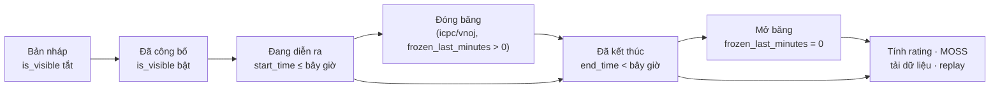

# Tạo và quản lý kỳ thi

> Tài liệu tham khảo đầy đủ về kỳ thi trên LCOJ: ai được tạo, tạo ở đâu, ý nghĩa từng trường, việc cần làm trong lúc thi và sau khi thi (rating, MOSS, loại thí sinh, tải dữ liệu).
>
> ⏱ ~30 phút · 👤 Ban tổ chức kỳ thi, giáo viên · 🔑 `judge.add_contest`, `judge.edit_own_contest` (hoặc `judge.create_private_contest` cho kỳ thi của tổ chức)

::: tip Mới tạo kỳ thi lần đầu?
Làm theo bài hướng dẫn ngắn [Tạo kỳ thi đầu tiên](/tutorials/first-contest) trước, rồi quay lại đây khi cần tra cứu một trường hoặc một tính năng cụ thể.
:::

## Trước khi bắt đầu

- [ ] Tài khoản của bạn có quyền phù hợp (xem [Ai được tạo và sửa kỳ thi](#ai-duoc-tao-va-sua-ky-thi)).
- [ ] Các bài tập sẽ dùng đã có sẵn và đã được chấm thử (xem [Quản lý bài tập](/setter/managing-problems)).
- [ ] Bạn đã chọn định dạng tính điểm (xem [Các định dạng kỳ thi](/organize/contest-formats)).
- [ ] Nếu kỳ thi dành cho một lớp: [tổ chức](/organize/organizations) của lớp đã tồn tại và bạn là quản trị viên của tổ chức đó.

## Vòng đời của một kỳ thi

| Giai đoạn | Điều kiện | Ai thấy gì |
|---|---|---|
| Bản nháp | **Hiển thị công khai** (`is_visible`) tắt | Chỉ tác giả, curator, tester và người có `see_private_contest` / `edit_all_contest`. |
| Đã công bố | `is_visible` bật, chưa tới `start_time` | Người được phép (theo [quyền truy cập](#hien-thi-va-quyen-truy-cap)) thấy trang kỳ thi và đăng ký (nếu có), chưa thấy đề. |
| Đang diễn ra | `start_time` ≤ bây giờ ≤ `end_time` | Thí sinh bấm **Tham gia kỳ thi** để bắt đầu tính giờ. |
| Đóng băng | Chỉ `icpc`/`vnoj`, trong `frozen_last_minutes` phút cuối | Thí sinh chỉ thấy bảng xếp hạng tại thời điểm đóng băng. Bảng **vẫn đóng băng sau khi thi kết thúc**. |
| Đã kết thúc | `end_time` < bây giờ | Ai cũng xem lại được đề (nếu thấy kỳ thi) và có thể **Tham gia ảo**. |

## Ai được tạo và sửa kỳ thi {#ai-duoc-tao-va-sua-ky-thi}

| Việc | Quyền cần có |
|---|---|
| Tạo kỳ thi ở `/contests/new` | `judge.add_contest` |
| Tạo kỳ thi riêng của tổ chức | Là quản trị viên tổ chức (hoặc có `edit_all_organization`) **và** có `judge.create_private_contest` |
| Sửa kỳ thi mình là tác giả/curator (trên site hoặc admin) | `judge.edit_own_contest` |
| Sửa mọi kỳ thi | `judge.edit_all_contest` |
| Mở trang quản trị `/admin/judge/contest/` | Tài khoản **staff** + `edit_own_contest` hoặc `edit_all_contest` |
| Đặt kỳ thi riêng tư / riêng tổ chức trong admin | `judge.create_private_contest` |
| Công khai kỳ thi bất kỳ trong admin | `judge.change_contest_visibility` |
| Đặt mã truy cập trong admin | `judge.contest_access_code` |
| Bật rating, bấm **Rate** | `judge.contest_rating` |
| Nhân bản kỳ thi | `judge.clone_contest` |
| Chạy MOSS | `judge.moss_contest` |
| Khóa bài nộp (`locked_after`) | `judge.lock_contest` |
| Sửa script nhãn bài | `judge.contest_problem_label` |
| Đặt thời lượng dài hơn `VNOJ_CONTEST_DURATION_LIMIT` | `judge.long_contest_duration` |

Chi tiết từng quyền và cách cấp: xem [Hệ thống phân quyền](/admin/permissions).

::: info Tác giả, curator và tester
- **Tác giả** (`authors`) và **curator** (`curators`) sửa được kỳ thi (khi có `edit_own_contest`). Curator không được liệt kê là tác giả.
- **Tester** (`testers`) xem được kỳ thi và đề trước giờ thi nhưng không sửa được.
- Tác giả, curator và tester **không thi chính thức** được: khi bấm tham gia, họ chỉ được **Theo dõi kỳ thi** (spectate) và không bị xếp hạng.
:::

## Chọn nơi tạo kỳ thi

Có ba nơi, khác nhau ở số trường được hiển thị:

| Nơi | Đường dẫn | Dùng khi |
|---|---|---|
| Trang tạo trên site | `/contests/new` (tab **Thêm kỳ thi** ở `/contests/`) | Kỳ thi thông thường; cần các trường cơ bản. |
| Trang của tổ chức | `/organization/<slug>/contest-create` (tab **Tạo kỳ thi mới** trong tổ chức) | Kỳ thi chỉ dành cho thành viên tổ chức. |
| Django admin | `/admin/judge/contest/add/` | Cần **mọi** trường: đăng ký, giới hạn thời gian, đóng băng, rating, pretest, v.v. |

Trang tạo/sửa trên site chỉ có: mã, tên, thời gian bắt đầu/kết thúc, hiển thị công khai, dùng làm rõ thay bình luận, ẩn thẻ, ẩn tác giả, hiển thị tóm tắt cài đặt, chế độ hiển thị bảng điểm, định dạng, mô tả, mã truy cập, riêng tư và danh sách thí sinh riêng tư, cộng với bảng bài (bài, điểm, thứ tự, số lần nộp tối đa). Người dùng **staff** thấy thêm liên kết **Sửa contest này ở admin panel để có nhiều tùy chỉnh hơn** trên trang sửa.

### Cách 1: Tạo trên site

1. Vào `/contests/` và bấm tab **Thêm kỳ thi** (*Add new contest*).
2. Điền **Mã kỳ thi**, **Tên kỳ thi**, **Thời gian bắt đầu**, **Thời gian kết thúc**.
3. Chọn **định dạng kỳ thi** và các tùy chọn hiển thị.
4. Ở phần **Danh sách bài**, thêm từng bài: chọn bài, nhập **điểm**, **thứ tự** (mỗi bài một số khác nhau) và **Số lượng submission** tối đa (để trống nếu không giới hạn). Nút **Switch to drag and drop mode** cho phép kéo thả để sắp thứ tự.
5. Bấm **Tạo**. Bạn tự động trở thành tác giả của kỳ thi.
6. Nếu cần thêm tùy chỉnh (giới hạn thời gian, đóng băng, rating, pretest…), mở kỳ thi trong admin.

### Cách 2: Kỳ thi riêng của tổ chức

1. Vào trang tổ chức `/organization/<slug>` và bấm tab **Tạo kỳ thi mới**. Tab chỉ hiện với quản trị viên tổ chức có `create_private_contest`.
2. Ô **Mã kỳ thi** đã điền sẵn tiền tố của tổ chức, ví dụ tổ chức có slug `lop-10a1` cho tiền tố `lop10a1_`. **Giữ nguyên tiền tố** rồi gõ tiếp phần còn lại, ví dụ `lop10a1_kiemtra1`.
3. Điền các trường như Cách 1. Danh sách **Các thành viên có thể tham gia kỳ thi** chỉ gợi ý thành viên của tổ chức.
4. Bấm **Tạo**. Kỳ thi tự được đặt **dành riêng cho tổ chức** và gắn với tổ chức này.
5. Bật **Hiển thị công khai** (trên form hoặc sau đó) để thành viên tổ chức thấy kỳ thi.

::: warning Quy tắc tiền tố mã
Tiền tố là slug của tổ chức viết thường, bỏ mọi ký tự không phải chữ/số, rồi thêm `_`. Trang **sửa** kỳ thi của tổ chức luôn kiểm tra quy tắc này và báo lỗi **Mã kỳ thi phải bắt đầu bằng `<tiền tố>`** nếu mã sai. Trang tạo hiện **không** kiểm tra, nên nếu bạn xóa tiền tố khi tạo thì lần sửa sau sẽ bị chặn cho đến khi đổi mã.
:::

### Cách 3: Django admin

1. Vào `/admin/judge/contest/` và bấm **Thêm**.
2. Điền các trường theo nhóm (xem các mục bên dưới). Các trường bạn không có quyền sửa sẽ hiện ở dạng chỉ đọc.
3. Ở khối **Danh sách bài** bên dưới, thêm bài và kéo thả để sắp thứ tự.
4. Bấm **Lưu**. Admin không tự thêm bạn làm tác giả; hãy chọn tác giả trong trường **Authors**.

## Thông tin cơ bản

| Trường (admin) | Nhãn tiếng Việt | Ý nghĩa |
|---|---|---|
| `key` | Mã kỳ thi | Duy nhất, tối đa 32 ký tự, chỉ gồm `a-z`, `0-9`, `_`. Xuất hiện trong URL `/contest/<key>`. |
| `name` | Tên kỳ thi | Tối đa 100 ký tự. |
| `authors`, `curators`, `testers` | Authors, Curators, Testers (chưa dịch) | Xem [khung ở trên](#ai-duoc-tao-va-sua-ky-thi). |
| `description` | Mô tả | Markdown, hiển thị ở trang kỳ thi. |
| `terms` | terms | Điều khoản. Nếu có, thí sinh phải tích **I agree to the terms and conditions** trước khi tham gia hoặc đăng ký. |
| `summary` | summary | Văn bản thuần cho thẻ meta (chia sẻ mạng xã hội). |
| `og_image`, `logo_override_image` | Ảnh OpenGraph, Logo | Ảnh chia sẻ và logo thay logo trang khi thí sinh ở trong kỳ thi. Nếu trống, dùng logo của tổ chức (nếu có). |
| `tags` | thẻ kỳ thi | Thẻ phân loại, tạo ở `/admin/judge/contesttag/`. |

## Thời gian

| Trường | Nhãn tiếng Việt | Ý nghĩa |
|---|---|---|
| `start_time` | Thời gian bắt đầu | Từ lúc này thí sinh tham gia được. |
| `end_time` | Thời gian kết thúc | Phải sau `start_time`. Sau thời điểm này mọi lượt thi chính thức kết thúc. |
| `time_limit` | Giới hạn thời gian | (Chỉ admin) Để trống: mọi thí sinh thi đến `end_time`. Có giá trị (ví dụ `03:00:00`): mỗi thí sinh có đúng chừng đó thời gian **kể từ lúc bấm tham gia**, nhưng không quá `end_time`. |
| `registration_start`, `registration_end` | (xem ghi chú) | (Chỉ admin) Nếu đặt ít nhất một trường, kỳ thi **yêu cầu đăng ký**: thí sinh bấm **Đăng ký** trong khung thời gian này. Sau khi hết hạn đăng ký, chỉ người đã đăng ký mới tham gia được. Khung đăng ký phải bắt đầu trước `start_time` và kết thúc trước `end_time`. |

Với `time_limit`, `start_time`–`end_time` trở thành một **cửa sổ**: thí sinh tự chọn lúc bắt đầu trong cửa sổ đó. Người vào muộn sẽ có ít thời gian hơn nếu phần còn lại của cửa sổ ngắn hơn `time_limit`. Thí sinh ảo (tham gia sau khi kỳ thi kết thúc) có `time_limit`, hoặc cả độ dài kỳ thi nếu không đặt.

::: info Nhãn dịch sai
Trong admin tiếng Việt, cả `registration_start` và `registration_end` đều hiện nhãn **Thời gian tạo**. Trường thứ nhất là *bắt đầu đăng ký*, trường thứ hai là *kết thúc đăng ký*.
:::

::: warning Giới hạn thời lượng
Trên trang tạo/sửa ở site, kỳ thi không được kéo dài quá `VNOJ_CONTEST_DURATION_LIMIT` ngày (trên luyencode.net: **14 ngày**) trừ khi bạn có `long_contest_duration`. Giới hạn này không áp dụng trong admin. Lưu ý: sau khi kỳ thi kết thúc, thí sinh vẫn luyện được bài, nên không cần đặt thời lượng dài.
:::

## Hiển thị và quyền truy cập {#hien-thi-va-quyen-truy-cap}

| Trường | Nhãn tiếng Việt | Ý nghĩa |
|---|---|---|
| `is_visible` | Hiển thị công khai | Phải bật để **bất kỳ ai ngoài ban tổ chức** thấy kỳ thi, kể cả kỳ thi riêng tư hoặc riêng tổ chức. |
| `is_private` | Kỳ thi riêng tư cho một số thành viên | Chỉ những người trong `private_contestants` thấy kỳ thi. |
| `private_contestants` | Các thành viên có thể tham gia kỳ thi | Danh sách người được phép. Có thể dán một danh sách tên đăng nhập vào ô này. |
| `is_organization_private` | dành riêng cho tổ chức | Chỉ thành viên của `organization` thấy kỳ thi. |
| `organization` | tổ chức | Tổ chức sở hữu kỳ thi. |
| `access_code` | mã truy cập | Nếu có, thí sinh phải nhập mã khi bấm tham gia/đăng ký (người sửa được kỳ thi không cần nhập). |
| `view_contest_scoreboard` | xem bảng điểm | Những người này luôn xem được bảng xếp hạng đầy đủ và vào được kỳ thi dù kỳ thi riêng tư. |
| `banned_users` | các người dùng bị cấm | Không được tham gia kỳ thi (nhóm **Công lý** trong admin). |
| `disallow_virtual` | Không cho phép tham gia ảo | Chặn **Tham gia ảo** sau khi kỳ thi kết thúc. |
| `banned_judges` | Cấm máy chấm | Không để các máy chấm này chấm bài của kỳ thi. |

Ai vào được một kỳ thi đã bật `is_visible`:

| `is_private` | `is_organization_private` | Người được vào |
|---|---|---|
| Tắt | Tắt | Mọi người, kể cả khách chưa đăng nhập |
| Tắt | Bật | Thành viên tổ chức |
| Bật | Tắt | Người trong `private_contestants` |
| Bật | Bật | Người vừa là thành viên tổ chức **vừa** có trong `private_contestants` |

Ngoài ra, ban tổ chức (tác giả, curator, tester), người trong `view_contest_scoreboard` và người có `see_private_contest` hoặc `edit_all_contest` luôn vào được.

::: warning Quyền trong admin
Trong admin, người không có `create_private_contest` không sửa được `is_private`, `private_contestants`, `is_organization_private`, `organization`; người không có cả `change_contest_visibility` lẫn `create_private_contest` không sửa được `is_visible`. Người chỉ có `create_private_contest` chỉ được công khai kỳ thi riêng tư/riêng tổ chức. Admin cũng có thao tác hàng loạt **Đánh dấu các kỳ thi là có thể thấy** / **Đánh dấu các kỳ thi là ẩn**.
:::

## Bảng xếp hạng và tùy chọn hiển thị

| Trường | Nhãn tiếng Việt | Ý nghĩa |
|---|---|---|
| `scoreboard_visibility` | Chế độ hiển thị bảng điểm | Xem bảng dưới. |
| `ranking_access_code` | mã truy cập bảng xếp hạng | Mở [bảng xếp hạng công khai](#bang-xep-hang-chinh-thuc-cong-khai-va-dong-bang) bằng mã. |
| `show_submission_list` | Show submission list | Cho thí sinh xem bài nộp của người khác trong giờ thi. Sau khi thi, danh sách luôn mở (trừ khi bảng đang đóng băng hoặc bị ẩn). |
| `scoreboard_cache_timeout` | scoreboard cache timeout | Số giây lưu tạm bảng xếp hạng; `0` = không lưu tạm. Nên đặt vài giây cho kỳ thi đông. |
| `hide_problem_tags` | ẩn các thẻ đầu bài | Ẩn thẻ bài theo mặc định. |
| `hide_problem_authors` | ẩn tác giả | Ẩn tác giả bài theo mặc định. |
| `show_short_display` | Hiển thị các cài đặt của kỳ thi | Hiện tóm tắt luật chơi trên trang kỳ thi. |
| `points_precision` | precision points | Số chữ số thập phân khi làm tròn điểm (0–10, mặc định 3). |
| `use_clarifications` | không bình luận | Dùng hệ thống làm rõ thay cho bình luận (mặc định bật). Xem [Trong khi thi](#trong-khi-thi-thong-bao-va-lam-ro). |
| `push_announcements` | Gửi thông báo đến thí sinh | Gửi thông báo bật lên cho thí sinh khi có thông báo mới. |

Các chế độ **Chế độ hiển thị bảng điểm**:

| Giá trị | Nhãn tiếng Việt | Hành vi |
|---|---|---|
| `V` | Có thể xem | Bảng xếp hạng mở suốt kỳ thi. |
| `C` | Ẩn khi kỳ thi đang diễn ra | Ẩn đến khi kỳ thi kết thúc; trong giờ thi, thí sinh chỉ thấy dòng của mình. |
| `P` | Ẩn khi thí sinh đang tham gia kỳ thi ảo | Như `C`, nhưng thí sinh **đã hết giờ làm bài** (ví dụ khi có `time_limit`) được xem bảng đầy đủ trước khi kỳ thi kết thúc. Nhãn tiếng Việt dễ gây hiểu nhầm: chế độ này nói về lượt thi chính thức, không phải kỳ thi ảo. |
| `H` | Luôn luôn ẩn | Không bao giờ công khai; chỉ ban tổ chức và người trong `view_contest_scoreboard` thấy. |

## Định dạng

Nhóm **Format** trong admin gồm **định dạng kỳ thi**, **số phút đóng băng**, **cấu hình dạng kỳ thi** (JSON) và **script nhãn bài**. Trang tạo trên site chỉ có **định dạng kỳ thi**. Cách chọn và cấu hình từng định dạng: xem [Các định dạng kỳ thi](/organize/contest-formats).

## Bài trong kỳ thi

| Trường | Nhãn tiếng Việt | Có trên site? | Ý nghĩa |
|---|---|---|---|
| `problem` | vấn đề | Có | Bài tập. Trên site chỉ chọn được bài bạn thấy. |
| `points` | điểm | Có | Điểm tối đa của bài **trong kỳ thi** (số nguyên), độc lập với điểm của bài ngoài kỳ thi. |
| `order` | thứ tự | Có | Thứ tự hiển thị; mỗi bài một giá trị khác nhau. |
| `max_submissions` | Số lượng submission | Có | Số lần nộp tối đa; để trống = không giới hạn. |
| `partial` | một phần | Chỉ admin | Cho điểm từng phần (mặc định bật). Chỉ có tác dụng khi bài cũng bật chấm điểm từng phần. |
| `is_pretested` | có pretest? | Chỉ admin | Bài có pretest. Chỉ có tác dụng khi kỳ thi bật `run_pretests_only`. |
| `output_prefix_override` | ghi đè độ dài output prefix | Chỉ admin | Số ký tự đầu của output được hiện cho thí sinh trong kết quả chấm; ghi đè cấu hình của bài. |

Chấm pretest:

1. Trong admin, tích **có pretest?** cho các bài có pretest và bật **chỉ chấm pretests** (`run_pretests_only`) ở nhóm **Cài đặt**.
2. Trong giờ thi, bài nộp chỉ được chấm trên pretest.
3. Sau khi thi, **tắt** `run_pretests_only`, lưu, rồi bấm **Chấm lại** ở từng bài trong khối **Danh sách bài** để chấm toàn bộ test.

::: tip Chấm lại và tính lại điểm
Trong admin, mỗi dòng bài có nút **Chấm lại** (chấm lại mọi bài nộp của bài đó trong kỳ thi) và **Rescore** (tính lại điểm mà không chấm lại). Khi lưu kỳ thi trong admin mà đổi định dạng, cấu hình định dạng, số phút đóng băng hoặc bảng bài, LCOJ tự tính lại toàn bộ bảng. **Trang sửa trên site không tự tính lại**; nếu đổi điểm hoặc định dạng trên site khi đã có bài nộp, hãy dùng **Rescore** trong admin.
:::

Sau kỳ thi, trên trang kỳ thi người sửa được sẽ thấy nút **Make All Problems Public**: công khai mọi bài riêng tư trong kỳ thi (bạn phải sửa được các bài đó) và công khai lời giải của các bài bạn sửa được.

## Nhân bản kỳ thi

Tab **Nhân bản** trên trang kỳ thi (cần `clone_contest` và quyền sửa kỳ thi) tạo bản sao với mã mới:

1. Nhập mã mới ở ô **Nhập mã mới cho kỳ thi nhân bản:** rồi bấm **Nhân bản!**.
2. Bản sao giữ nguyên cài đặt, bài và điểm, thẻ, tổ chức, danh sách thí sinh riêng tư và `view_contest_scoreboard`; bị **ẩn**, **mở khóa**, và chỉ có **bạn** làm tác giả (không sao chép curator, tester).
3. Bạn được chuyển tới trang sửa để chỉnh thời gian.

Với kỳ thi của tổ chức, mã mới cũng phải theo [quy tắc tiền tố](#cach-2-ky-thi-rieng-cua-to-chuc).

::: warning Nhân bản trên site hiện chưa dùng được
Tab **Nhân bản** (`/contest/<key>/clone`) hiện báo lỗi máy chủ. Trong thời gian này, hãy tạo kỳ thi mới và thêm bài thủ công.
:::

## Trong khi thi: thông báo và làm rõ {#trong-khi-thi-thong-bao-va-lam-ro}

**Thông báo** (announcement) dành cho mọi thí sinh:

1. Trên trang kỳ thi, ở mục **Thông báo**, bấm **Tạo thông báo** (`/contest/<key>/announce`).
2. Nhập **tiêu đề thông báo** và **nội dung thông báo** (Markdown), bấm **Thông báo**.
3. Nếu kỳ thi bật **Gửi thông báo đến thí sinh** (`push_announcements`), mọi người đang thi chính thức và đang theo dõi nhận thông báo bật lên ngay (qua Celery và WebSocket). Thí sinh ảo không nhận.

Thông báo cũng tạo/sửa được trong admin (khối thông báo cuối trang kỳ thi); nút **Resend** gửi lại một thông báo.

**Làm rõ** (clarification) gắn với từng bài:

1. Mở bài trong admin (`/admin/judge/problem/<id>/change/`) và thêm một mục làm rõ với **nội dung làm rõ**.
2. Làm rõ hiện ở mục **Làm rõ** trên trang kỳ thi và trang bài (khi xem trong kỳ thi). Làm rõ **không** gửi thông báo bật lên; nếu cần, hãy tạo thêm một thông báo.

Khi `use_clarifications` bật, bình luận trên trang kỳ thi bị khóa trong giờ thi (và với người đang ở trong kỳ thi).

## Bảng xếp hạng chính thức, công khai và đóng băng {#bang-xep-hang-chinh-thuc-cong-khai-va-dong-bang}

| Loại | Đường dẫn | Ghi chú |
|---|---|---|
| Bảng thường | `/contest/<key>/ranking/` | Tuân theo `scoreboard_visibility`. Có ô **Hiển thị xếp hạng của virtual**, bộ lọc tổ chức và **Tải bảng xếp hạng dưới dạng CSV**. |
| Bảng công khai | `/contest/<key>/public_ranking/?code=<mã>` | Hiện bảng đầy đủ cho ai có `ranking_access_code`, bỏ qua `scoreboard_visibility`. Người xem vẫn phải vào được kỳ thi (kỳ thi riêng tư vẫn bị chặn). |
| Bảng chính thức | `/contest/<key>/official_ranking/` | Tab **Bảng xếp hạng chính thức**, chỉ hiện khi trường **official ranking** (`csv_ranking`, nhóm **Bảng xếp hạng** trong admin) có dữ liệu: CSV xuất từ CMS (cột `Username`, `User`, tùy chọn `Team`, các cột bài, `Global`), hoặc một URL bắt đầu bằng `http` để chuyển hướng. |

**Đóng băng:** chỉ có ở `icpc` và `vnoj`. Trong `frozen_last_minutes` phút cuối, thí sinh chỉ thấy kết quả trước thời điểm đóng băng; ban tổ chức vẫn thấy bảng thật. Bảng vẫn đóng băng sau khi thi. Để công bố, đặt `frozen_last_minutes = 0` và lưu trong admin. Xem [Đóng băng bảng xếp hạng](/organize/contest-formats#dong-bang-bang-xep-hang).

## Xem lại diễn biến (replay) và thí sinh bóng ma

Kỳ thi **xem lại được** khi đồng thời: khách chưa đăng nhập vào được (công khai, không riêng tư), đã kết thúc, `frozen_last_minutes = 0`, bảng xếp hạng đang hiển thị, và định dạng không phải `ioi16`. Khi đó trang bảng xếp hạng có thanh trượt thời gian (⏱) để xem bảng tại mọi thời điểm, nút **End** để về cuối, và (với `icpc`/`vnoj`) ô **Freeze min** để thử số phút đóng băng. Thí sinh ảo trong kỳ thi xem lại được thấy bảng tại đúng thời điểm của mình (nút **Live**).

- Dữ liệu replay được sinh ở lần xem đầu tiên và lưu thành `MEDIA_ROOT/contest_replay/<key>_v<phiên bản>.json`, trình duyệt lưu tạm vĩnh viễn. Trên luyencode.net, `DMOJ_CONTEST_REPLAY_INTERNAL` không được đặt, nên file do Django phục vụ trực tiếp.
- Nếu bạn chấm lại hoặc sửa kết quả sau khi replay đã được sinh, mở kỳ thi trong admin và bấm **Invalidate Replay** (cần `change_contest`) để tăng phiên bản và sinh lại.
- **Thí sinh bóng ma** (ghost): người vận hành có thể ghép thí sinh của một kỳ thi khác (ví dụ kỳ thi gốc của một bản mirror) vào replay bằng lệnh [`merge_replay_data`](/reference/management-commands#merge-replay-data). Khi đó bảng xếp hạng có thêm ô **Show ghost participations**.

## Sau kỳ thi

### Tính rating

Rating **không tự tính**. Người có `contest_rating` làm như sau:

1. Trong admin, đảm bảo nhóm **Rating** đã bật **Kỳ thi có tính rating** (`is_rated`) và chỉnh các tùy chọn:

   | Trường | Nhãn tiếng Việt | Ý nghĩa |
   |---|---|---|
   | `rate_all` | Rate tất cả | Tính rating cả người không nộp bài nào. |
   | `rate_disqualified` | bị loại | Tính rating cả người bị loại (mặc định **bật**; họ xếp cuối). |
   | `rating_floor`, `rating_ceiling` | (không dịch) / Rating cao nhất có thể tham gia kỳ thi | Bỏ qua người có rating hiện tại thấp hơn / cao hơn. |
   | `rate_exclude` | những người không xếp hạng | Loại từng người khỏi rating (chỉ chọn được người đã tham gia). |

2. Sau khi kỳ thi kết thúc, mở kỳ thi trong admin và bấm nút **Rate** ở thanh dưới cùng.
3. LCOJ xóa rating của kỳ thi này **và mọi kỳ thi có rating kết thúc sau nó**, rồi tính lại lần lượt theo thời gian kết thúc. Chỉ lượt thi chính thức (không tính thi ảo) được tính.

Nút **Rate all ratable contests** ở trang danh sách kỳ thi trong admin xóa **toàn bộ** rating và tính lại từ đầu; chỉ dùng khi thật cần.

### Kiểm tra đạo code bằng MOSS

1. Trên trang kỳ thi, mở tab **MOSS** (`/contest/<key>/moss`). Tab hiện khi bạn sửa được kỳ thi và có `moss_contest`. Chức năng MOSS cần khóa `MOSS_API_KEY` hợp lệ do người vận hành cấu hình; nếu chưa có, tab vẫn hiện nhưng chạy MOSS sẽ lỗi.
2. Bấm **MOSS kỳ thi**. LCOJ chạy nền và hiện trang tiến độ.
3. Kết quả là bảng theo bài × ngôn ngữ (C, C++, Java, Python, Pascal), mỗi ô có liên kết tới báo cáo MOSS. Với mỗi thí sinh, LCOJ gửi bài nộp có điểm cao nhất; ô chỉ có kết quả khi có ít nhất 2 bài nộp.
4. **Delete MOSS results** xóa kết quả cũ; chạy lại sẽ thay kết quả cũ.

Người vận hành cũng có thể chạy lệnh [`runmoss`](/reference/management-commands#runmoss).

### Loại thí sinh và tự động khóa tài khoản

- Trên bảng xếp hạng, người sửa được kỳ thi thấy biểu tượng thùng rác (**Disqualify**) cạnh mỗi thí sinh; bấm và xác nhận để loại. Bấm biểu tượng hoàn tác (**Un-Disqualify**) để bỏ loại. Có thể làm tương tự trong admin tại `/admin/judge/contestparticipation/` (ô **bị loại**).
- Thí sinh bị loại: điểm thành `-9999` (xếp cuối), bị đẩy khỏi kỳ thi nếu đang thi và bị thêm vào **các người dùng bị cấm** của kỳ thi. Nếu kỳ thi đã có rating, rating được tính lại ngay.
- **Tự động khóa tài khoản**: khi `VNOJ_SHOULD_BAN_FOR_CHEATING_IN_CONTESTS` bật, người bị loại ở từ `VNOJ_MAX_DISQUALIFICATIONS_BEFORE_BANNING` kỳ thi **không** riêng tổ chức (bắt đầu từ `VNOJ_BAN_COUNT_FROM_DATE`) sẽ bị khóa tài khoản. Bỏ loại cho đến dưới ngưỡng sẽ mở khóa (nếu lý do khóa đúng là thông điệp này).

| Cài đặt | Mặc định | luyencode.net |
|---|---|---|
| `VNOJ_SHOULD_BAN_FOR_CHEATING_IN_CONTESTS` | `False` | `False`: **không** tự khóa |
| `VNOJ_MAX_DISQUALIFICATIONS_BEFORE_BANNING` | `3` | `3` |
| `VNOJ_BAN_COUNT_FROM_DATE` | `2026-01-01` (UTC) | `2026-01-01` |
| `VNOJ_CONTEST_CHEATING_BAN_MESSAGE` | `Banned for multiple cheating offenses during contests` | như mặc định |

### Khóa bài nộp

Trường **contest lock** (`locked_after`, cần `lock_contest`) ngăn chấm lại bài nộp của kỳ thi sau thời điểm này. Thao tác hàng loạt **Lock contest submissions** / **Unlock contest submissions** trong danh sách admin khóa ngay hoặc mở khóa.

### Tải dữ liệu

Tác giả kỳ thi tải được toàn bộ mã nguồn bài nộp thành file ZIP. Xem [Tải dữ liệu kỳ thi](/organize/contest-data-download).

## Cài đặt toàn trang liên quan

Các cài đặt này do người vận hành đặt trong `local_settings.py` (xem [Biến môi trường và cấu hình](/operate/environment)):

| Cài đặt | luyencode.net | Tác dụng |
|---|---|---|
| `VNOJ_CONTEST_DURATION_LIMIT` | `14` | Thời lượng tối đa (ngày) trên form site, trừ khi có `long_contest_duration`. |
| `MAX_CONTEST_PROBLEMS_COUNT` | `None` | Số bài tối đa trong một kỳ thi (trên form site); `None` = không giới hạn. |
| `VNOJ_OFFICIAL_CONTEST_MODE` | `False` | Chế độ thi chính thức toàn trang: ẩn bình luận (trừ superuser), chặn tạo/sửa blog, chặn sửa phần giới thiệu và họ tên, không cho thí sinh tự hủy bài nộp, bỏ hộp xác nhận khi tham gia, và ghi IP mỗi lần nộp bài. Chỉ bật cho máy chủ riêng dùng cho một kỳ thi chính thức. |
| `DMOJ_CONTEST_DATA_DOWNLOAD` | `True` | Cho phép tải dữ liệu kỳ thi. |
| `MOSS_API_KEY` | từ biến môi trường | Khóa MOSS; cần hợp lệ để chạy MOSS. |

## Kiểm tra kết quả

- [ ] Kỳ thi xuất hiện ở `/contests/` khi đăng nhập bằng một tài khoản thí sinh (hoặc ở `/organization/<slug>/contests/` với kỳ thi của tổ chức).
- [ ] Trang kỳ thi hiện đúng giờ bắt đầu/kết thúc theo múi giờ của bạn.
- [ ] Một tài khoản tester mở được đề trước giờ thi; một tài khoản không được phép bị từ chối.
- [ ] Nộp thử một bài: kết quả xuất hiện trên bảng xếp hạng với số điểm đúng.
- [ ] Sau kỳ thi: đã mở băng (nếu có), đã bấm **Rate** (nếu có rating) và đã chạy MOSS (nếu cần).

## Sự cố thường gặp

| Triệu chứng | Nguyên nhân và cách xử lý |
|---|---|
| Thí sinh không thấy kỳ thi | Chưa bật **Hiển thị công khai**; hoặc kỳ thi riêng tư/riêng tổ chức mà thí sinh không thuộc danh sách/tổ chức. |
| **Mã kỳ thi phải bắt đầu bằng `…`** | Kỳ thi của tổ chức có mã sai tiền tố. Đổi mã theo tiền tố được báo. |
| **Thời gian diễn ra contest không được kéo dài quá 14 ngày** | Rút ngắn kỳ thi, sửa trong admin, hoặc xin quyền `long_contest_duration`. |
| **Các bài tập phải có thứ tự khác nhau.** | Hai bài có cùng **thứ tự**. Đặt mỗi bài một số khác nhau. |
| Tab **Nhân bản** báo lỗi máy chủ | Nhân bản trên site hiện chưa dùng được; tạo kỳ thi mới và thêm bài thủ công, xem [Nhân bản kỳ thi](#nhan-ban-ky-thi). |
| Không thấy nút **Rate** | Cần `contest_rating`, kỳ thi phải bật `is_rated` và đã kết thúc. |
| Không thấy tab **MOSS** | Thiếu `moss_contest`, hoặc không sửa được kỳ thi. |
| Chạy MOSS bị lỗi | Máy chủ chưa có `MOSS_API_KEY` hợp lệ. Nhờ người vận hành cấu hình khóa. |
| Bảng xếp hạng vẫn đóng băng sau khi thi | Hành vi đúng. Đặt `frozen_last_minutes = 0` trong admin. |
| Đổi điểm/định dạng trên site nhưng bảng không đổi | Trang site không tự tính lại. Dùng **Rescore** trong admin hoặc lưu kỳ thi trong admin. |
| Replay hiện kết quả cũ sau khi chấm lại | Bấm **Invalidate Replay** trong admin. |
| Không có thanh replay | Kỳ thi không thỏa điều kiện xem lại (riêng tư, đang đóng băng, bảng ẩn, hoặc định dạng `ioi16`). |
| Tác giả không thi được | Hành vi đúng: ban tổ chức chỉ được **Theo dõi kỳ thi**. Dùng tài khoản khác để thi thử. |
| Thí sinh thấy trang **Đăng ký** với câu "Bạn không có quyền chỉnh sửa kỳ thi này." khi bấm tham gia | Bản dịch sai của thông báo *You are not registered for this contest.* Kỳ thi yêu cầu đăng ký, thí sinh chưa đăng ký và đã hết hạn đăng ký. Thêm khung đăng ký dài hơn hoặc bỏ trống cả hai trường đăng ký. |

## Tiếp theo

- [Tạo kỳ thi đầu tiên](/tutorials/first-contest): bài hướng dẫn từng bước.
- [Các định dạng kỳ thi](/organize/contest-formats): cách tính điểm, phạt và đóng băng.
- [Tổ chức (nhóm, lớp học)](/organize/organizations): kỳ thi riêng cho lớp học.
- [Tải dữ liệu kỳ thi](/organize/contest-data-download).
- [Hệ thống phân quyền](/admin/permissions).
