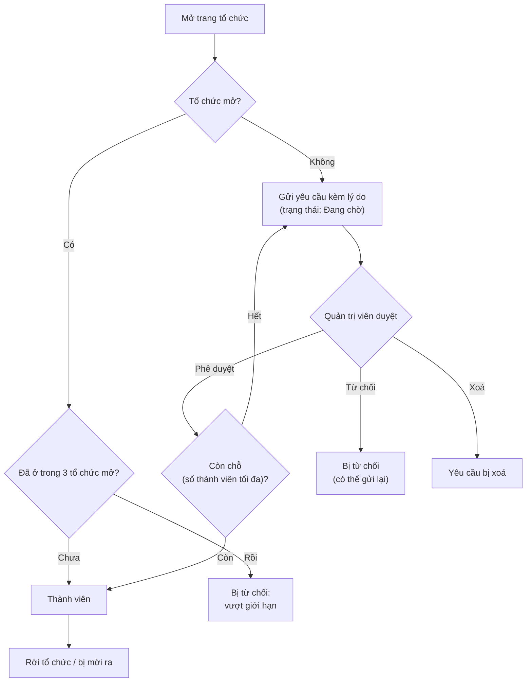

# Tổ chức (nhóm, lớp học)

> Tổ chức gom một nhóm người dùng (một lớp, một đội tuyển, một câu lạc bộ) lại với nhau để có bảng xếp hạng riêng, bài tập, kỳ thi, bài trắc nghiệm và bài đăng chỉ dành cho thành viên. Trang này dành cho cả thành viên lẫn người quản lý tổ chức.
>
> ⏱ ~20 phút · 👤 Giáo viên, trưởng câu lạc bộ, thành viên · 🔑 Không cần quyền để tham gia; `judge.add_organization` để tạo tổ chức

## Trước khi bắt đầu

- [ ] Bạn đã có tài khoản LCOJ và đã đăng nhập (xem [Tài khoản](/learn/account)).
- [ ] Nếu muốn **tham gia**: biết tên hoặc đường dẫn của tổ chức (dạng `https://luyencode.net/organization/<slug>`).
- [ ] Nếu muốn **quản lý**: bạn là quản trị viên của tổ chức, hoặc đã liên hệ quản trị viên LCOJ để được tạo tổ chức.

## Tổ chức là gì

Mỗi tổ chức có một trang riêng tại `/organization/<slug>` với các tab **Trang chủ**, **Thành viên**, **Danh sách bài**, **Danh sách kỳ thi** và **Các bài nộp**.

| Cách dùng | Ví dụ |
|---|---|
| Lớp học | Giáo viên giao bài tập và kiểm tra riêng cho lớp 10A1, xem từng học sinh đã giải bài nào. |
| Đội tuyển | Đội tuyển tin học của trường có kỳ thi thử riêng, bảng xếp hạng nội bộ. |
| Câu lạc bộ | Thông báo hoạt động bằng bài đăng chỉ thành viên đọc được. |

Thành viên và khách thấy những gì:

| Nội dung | Khách / người ngoài | Thành viên | Quản trị viên tổ chức |
|---|---|---|---|
| Trang giới thiệu, danh sách thành viên | ✅ | ✅ | ✅ |
| Bài đăng của tổ chức | ❌ | ✅ (bài đã công bố) | ✅ (kể cả bài nháp của mình) |
| Danh sách bài, kỳ thi, bài nộp của tổ chức | ❌ | ✅ | ✅ |
| Duyệt yêu cầu, mời ra, sửa tổ chức, xem chi phí | ❌ | ❌ | ✅ |

## Tham gia và rời tổ chức

Tổ chức có hai kiểu, quyết định bởi ô **tổ chức công khai** (`is_open`):

- **Mở** (`is_open` bật): bấm **Tham gia tổ chức** là vào ngay.
- **Đóng** (`is_open` tắt): bấm **Yêu cầu tư cách thành viên**, ghi lý do và chờ quản trị viên duyệt.



### Tham gia tổ chức mở

1. Vào `/organizations/` (hoặc đường dẫn tổ chức bạn được gửi).
2. Mở tổ chức, ở khung **Quản lý** bấm **Tham gia tổ chức**.

Bạn cũng có thể chọn tổ chức mở trong ô tổ chức ở trang sửa hồ sơ `/edit/profile/`.

::: info Giới hạn số tổ chức
Mỗi người chỉ được ở tối đa `DMOJ_USER_MAX_ORGANIZATION_COUNT` tổ chức **mở** (trên luyencode.net: **3**). Tổ chức đóng không tính vào giới hạn này.
:::

### Xin vào tổ chức đóng

1. Mở trang tổ chức và bấm **Yêu cầu tư cách thành viên**.
2. Điền **Lý do tham gia:** (bắt buộc), ví dụ "Em là Nguyễn Văn A, lớp 10A1", rồi bấm **Yêu cầu!**.
3. Bạn được chuyển tới trang **Chi tiết yêu cầu tham gia** (`/organization/<slug>/request/<id>`) để theo dõi **trạng thái**: **Đang chờ**, **Phê duyệt** hoặc **Bị từ chối**. LCOJ không gửi thông báo khi yêu cầu được duyệt; hãy quay lại trang tổ chức để kiểm tra.

Trong lúc một yêu cầu đang chờ, bạn không gửi thêm được yêu cầu khác. Nếu bị từ chối, bạn có thể gửi lại.

### Rời tổ chức

Bấm **Rời khỏi tổ chức** trên trang tổ chức. Quản trị viên không rời được tổ chức của mình (**Bạn không thể rời tổ chức của chính mình.**).

## Tạo tổ chức

Việc tạo tổ chức thường do quản trị viên LCOJ làm. Có hai cách:

| Cách | Đường dẫn | Quyền |
|---|---|---|
| Trên site | `/organizations/create` (tab **Tạo tổ chức mới** ở `/organizations/`) | `judge.add_organization` |
| Django admin | `/admin/judge/organization/add/` | Staff + `judge.add_organization` |

Các trường chính:

| Trường | Nhãn tiếng Việt | Ý nghĩa |
|---|---|---|
| `name` | tên tổ chức | Tên hiển thị, tối đa 128 ký tự. |
| `slug` | tên viết tắt trên đường dẫn | Dùng trong URL `/organization/<slug>` và làm [tiền tố mã](#tien-to-ma) cho bài và kỳ thi. Duy nhất, phải bắt đầu bằng chữ cái; chỉ gồm chữ, số, `-`, `_`. |
| `short_name` | tên viết tắt | Tối đa 20 ký tự, hiện bên cạnh tên thí sinh trong kỳ thi. Khi tạo trên site, LCOJ tự đặt bằng 20 ký tự đầu của slug; chỉ đổi được trong admin. |
| `about` | mô tả tổ chức | Bắt buộc. Markdown, hiện ở trang chủ tổ chức. |
| `is_open` | tổ chức công khai | Mở hay đóng (xem trên). |
| `is_unlisted` | tổ chức ẩn | (Chỉ admin) Ẩn khỏi danh sách `/organizations/`. **Mặc định bật**, nên tổ chức mới không hiện trong danh sách cho đến khi ai đó tắt ô này trong admin. |
| `slots` | số thành viên tối đa | (Chỉ admin) Giới hạn số thành viên, chỉ kiểm tra khi duyệt yêu cầu vào tổ chức đóng. |
| `admins` | quản trị viên | Người quản lý tổ chức. |
| `logo_override_image` | Logo | URL ảnh thay logo trang khi xem tổ chức. |
| `paid_credit`, `monthly_free_credit_limit` | — | Credit chấm bài, xem [Dung lượng, hạn mức và credit](#dung-luong-han-muc-va-credit). |

::: warning Người tạo không tự thành quản trị viên
Ô **quản trị viên** (cùng hai ô credit) trên form site chỉ hiện với người có `judge.organization_admin`. Nếu bạn tạo tổ chức mà không có quyền này, tổ chức sẽ **không có quản trị viên nào**, kể cả bạn. Hãy nhờ quản trị viên LCOJ thêm bạn trong admin. Tương tự, trong admin, trường **quản trị viên**, **tổ chức công khai** và **số thành viên tối đa** chỉ sửa được khi có `organization_admin`.
:::

::: info Giới hạn và nhóm quyền "Org Admin"
- Người đã là quản trị viên của `VNOJ_ORGANIZATION_ADMIN_LIMIT` tổ chức (trên luyencode.net: **3**) không tạo thêm được trên site. Quyền `spam_organization` dùng để bỏ giới hạn này, nhưng hiện chỉ có tác dụng với superuser (xem [Hệ thống phân quyền](/admin/permissions)).
- Khi lưu form tổ chức **trên site**, mọi quản trị viên được thêm vào nhóm Django tên `GROUP_PERMISSION_FOR_ORG_ADMIN` (mặc định `Org Admin`). Người vận hành cần tạo sẵn nhóm này và gán cho nó các quyền quản trị viên tổ chức cần, ví dụ `create_organization_problem`, `create_private_contest`, `edit_organization_post`. Nếu nhóm chưa tồn tại, lưu form sẽ lỗi. Thêm quản trị viên **trong Django admin** thì **không** tự vào nhóm; khi đó hãy thêm người đó vào nhóm bằng tay.
:::

## Việc của quản trị viên tổ chức

Quản trị viên tổ chức là người trong danh sách **quản trị viên** (hoặc người có `edit_all_organization`). Các nút quản lý nằm ở khung **Quản lý** trên trang chủ tổ chức và ở các tab bên phải.

### Duyệt yêu cầu tham gia

1. Trên trang tổ chức, bấm **Xem yêu cầu** (số trên nhãn là số yêu cầu đang chờ). Trang ở `/organization/<slug>/requests/pending`.
2. Với mỗi yêu cầu, đọc **lý do** (bấm thời gian để xem chi tiết), rồi đổi **trạng thái** thành **Phê duyệt** hoặc **Bị từ chối**, hoặc tích **Xoá?** để xoá yêu cầu.
3. Bấm **Cập nhật**. Người được phê duyệt trở thành thành viên ngay.
4. Xem lại lịch sử ở các tab **Nhật ký**, **Phê duyệt**, **Bị từ chối**.

Nếu tổ chức có **số thành viên tối đa** và số người được phê duyệt vượt số chỗ còn lại, LCOJ từ chối cả lần cập nhật và báo số chỗ còn lại.

::: info
Chỉ người trong danh sách **quản trị viên** mới vào được trang duyệt yêu cầu; quyền `edit_all_organization` không đủ.
:::

### Mời thành viên ra khỏi tổ chức

1. Mở tab **Thành viên** (`/organization/<slug>/users/`).
2. Bấm nút **Loại** ở dòng của người đó và xác nhận.

Không mời ra được quản trị viên khác.

### Sửa thông tin tổ chức

Bấm **Chỉnh sửa tổ chức** (`/organization/<slug>/edit`). Trên site, quản trị viên sửa được tên, slug, **tổ chức công khai**, mô tả và logo. Người có `organization_admin` sửa thêm được danh sách quản trị viên và credit. Người có `add_organizationquota` thấy thêm mục **Quota Grants** (xem [bên dưới](#dung-luong-han-muc-va-credit)). Các trường khác (tên viết tắt, ẩn khỏi danh sách, số thành viên tối đa) chỉ sửa được ở **Quản trị tổ chức** (trang admin).

::: warning Đổi slug
Đổi slug làm đổi URL của tổ chức và đổi [tiền tố mã](#tien-to-ma) cho bài và kỳ thi mới. Bài và kỳ thi cũ giữ mã cũ, nhưng sẽ không sửa được trên site cho đến khi đổi mã cho khớp tiền tố mới.
:::

### Tiền tố mã {#tien-to-ma}

Bài tập và kỳ thi tạo trong tổ chức phải có mã bắt đầu bằng **tiền tố của tổ chức**: slug viết thường, bỏ mọi ký tự không phải chữ/số, thêm `_`. Ví dụ slug `THPT-Chuyen-A` cho tiền tố `thptchuyena_`. Ô mã trên form tạo đã điền sẵn tiền tố.

### Bài tập riêng của tổ chức

1. Trên trang tổ chức, bấm tab **Tạo bài mới** (`/organization/<slug>/problem-create`). Cần quyền `create_organization_problem`.
2. Giữ tiền tố trong ô mã bài. Sai tiền tố sẽ báo **Mã bài tập phải bắt đầu bằng `<tiền tố>`**.
3. Bài được đặt là riêng của tổ chức. Tích công khai để mọi thành viên thấy, hoặc để riêng tư và chọn **Các thành viên riêng tư** được xem bài.
4. Gắn **thẻ của tổ chức** cho bài (xem [Thẻ bài tập](#the-bai-tap-cua-to-chuc)).

Thành viên thấy bài công khai của tổ chức ở tab **Danh sách bài**, cùng các bài mình là tác giả, curator hoặc tester. Cách soạn đề và test: xem [Quản lý bài tập](/setter/managing-problems).

### Kỳ thi riêng của tổ chức

Bấm tab **Tạo kỳ thi mới** (`/organization/<slug>/contest-create`, cần `create_private_contest`). Kỳ thi tự được đặt **dành riêng cho tổ chức**; nhớ bật **Hiển thị công khai** để thành viên thấy. Kỳ thi của tổ chức hiện ở tab **Danh sách kỳ thi** và cả ở `/contests/` (người dùng có thể tích **Ẩn các kỳ thi riêng tư** để ẩn chúng). Chi tiết: xem [Tạo và quản lý kỳ thi](/organize/contest-setup#cach-2-ky-thi-rieng-cua-to-chuc).

### Bài trắc nghiệm riêng của tổ chức

Không có trang tạo trắc nghiệm riêng trong tổ chức. Khi soạn bài trắc nghiệm, tích **Hiển thị công khai** và **Dành riêng cho tổ chức**, rồi chọn tổ chức. Xem [Tạo và quản lý bài trắc nghiệm](/setter/quiz-authoring).

### Bài đăng của tổ chức

1. Bấm **Tạo blog** trong khung **Quản lý** (`/organization/<slug>/post/new`). Cần quyền `edit_organization_post`.
2. Viết bài và đặt thời điểm công bố (mặc định là bây giờ).

Bài đăng hiện ở trang chủ tổ chức, chỉ thành viên đọc được. Không cần đủ số bài đã giải như khi viết blog cá nhân.

### Thẻ bài tập của tổ chức {#the-bai-tap-cua-to-chuc}

Tổ chức có bộ thẻ riêng, tách biệt với thẻ bài tập chung của LCOJ.

1. Bấm tab **Manage tags** (`/organization/<slug>/tags/`).
2. Bấm **Create new tag**, nhập tên (duy nhất trong tổ chức) và lưu. Sửa tên hoặc xoá thẻ ở cột **Actions**; cột **Problems** cho biết số bài đang dùng thẻ.
3. Gắn thẻ khi tạo/sửa bài của tổ chức.

Thành viên lọc bài theo thẻ (hoặc bài chưa gắn thẻ) ở tab **Danh sách bài**.

### Xem bài đã giải của thành viên

Ở tab **Thành viên**, quản trị viên thấy thêm cột **Solved problems**; bấm **View** (`/organization/<slug>/user/<username>/solved`) để xem các bài **của tổ chức** mà người đó đã giải, nhóm theo thẻ tổ chức (bài chưa gắn thẻ nằm cuối).

## Bảng xếp hạng thành viên và điểm tổ chức

Tab **Thành viên** là bảng xếp hạng nội bộ, mặc định sắp theo điểm hiệu suất (performance points); có thể sắp theo điểm, số bài đã giải hoặc rating. Người dùng đặt chế độ ẩn (unlisted) không hiện ở đây. Đường dẫn `/organization/<slug>/users/find?handle=<username>` nhảy thẳng tới trang có người đó.

**Điểm** của tổ chức (cột **Điểm** ở `/organizations/`) được tính từ điểm hiệu suất của 100 thành viên cao nhất:

```text
điểm tổ chức = VNOJ_ORG_PP_SCALE × (pp[0] + 0.95 × pp[1] + 0.95² × pp[2] + … + 0.95⁹⁹ × pp[99])
```

với `pp[i]` là điểm hiệu suất của thành viên đứng thứ `i` (tính từ 0). Các hằng số: `VNOJ_ORG_PP_STEP = 0.95`, `VNOJ_ORG_PP_ENTRIES = 100`, `VNOJ_ORG_PP_SCALE = 1` (luyencode.net dùng giá trị mặc định). Điểm cập nhật khi có người vào/ra tổ chức; admin có thao tác **Tính lại điểm**.

## Dung lượng, hạn mức và credit {#dung-luong-han-muc-va-credit}

Quản trị viên bấm **Chi phí sử dụng tổ chức** (`/organization/<slug>/usage`) để xem:

- **Hạn mức**: số bài và dung lượng test đang dùng so với giới hạn, cùng các gói hạn mức đang hiệu lực (**Active Quota Grants**).
- **Biểu đồ tròn** số bài và dung lượng theo thời điểm nộp bài gần nhất (chưa có bài nộp, trên 12 tháng, 9–12, 6–9, 3–6, dưới 3 tháng), giúp tìm bài cũ để dọn.
- **Bảng bài** sắp theo dung lượng test, lọc theo tác giả (trong số quản trị viên) hoặc thời điểm nộp gần nhất.
- **Xoá hàng loạt**: tích các bài rồi bấm **Delete Selected** (tối đa 200 bài một lần). Người không phải superuser chỉ xoá được bài mình là tác giả hoặc curator. Bài chỉ bị đánh dấu xoá (xoá mềm); tác vụ dọn rác định kỳ xoá hẳn sau `VNOJ_PROBLEM_DELETION_GRACE_PERIOD` (7 ngày).
- **Credit chấm bài**: biểu đồ **Số giờ chấm bài hàng tháng** và **Chi phí chấm bài hàng tháng**, cùng số credit miễn phí và credit đã mua còn lại.

**Hạn mức:** số bài tối đa = `VNOJ_ORGANIZATION_DEFAULT_MAX_PROBLEMS` + các gói đang hiệu lực; dung lượng tối đa = `VNOJ_ORGANIZATION_DEFAULT_MAX_STORAGE` + các gói. Dung lượng là tổng kích thước file zip test của các bài chưa xoá. Người có `add_organizationquota` thêm gói ở trang **Chỉnh sửa tổ chức** (mục **Add Quota Grant**: ngày bắt đầu, **Number of packages**, ngày kết thúc, mặc định một năm) hoặc trong admin (dung lượng tính bằng GB).

**Credit:** mỗi bài nộp vào bài riêng của tổ chức, hoặc trong kỳ thi riêng của tổ chức, tiêu tốn credit bằng tổng thời gian chấm. Credit miễn phí hằng tháng được dùng trước, sau đó tới credit đã mua. Biểu đồ chi phí tính `(số giây dùng − VNOJ_MONTHLY_FREE_CREDIT) / 3600 × VNOJ_PRICE_PER_HOUR` nghìn đồng.

| Cài đặt | Mặc định | luyencode.net | Ý nghĩa |
|---|---|---|---|
| `VNOJ_ENABLE_ORGANIZATION_CREDIT_LIMITATION` | `False` | `False` | Nếu bật, chặn nộp bài khi tổ chức hết credit. luyencode.net **không** chặn; credit chỉ để theo dõi. |
| `VNOJ_MONTHLY_FREE_CREDIT` | `10800` (3 giờ) | 3 giờ | Credit miễn phí mỗi tháng (giây). |
| `VNOJ_PRICE_PER_HOUR` | `50` | `50` | Giá mỗi giờ chấm vượt mức miễn phí (nghìn đồng), chỉ dùng cho biểu đồ. |
| `VNOJ_ORGANIZATION_DEFAULT_MAX_PROBLEMS` | `1000` | `1000` | Số bài tối đa mặc định. |
| `VNOJ_ORGANIZATION_DEFAULT_MAX_STORAGE` | 5 GB | 5 GB | Dung lượng test tối đa mặc định. |
| `VNOJ_QUOTA_ENFORCEMENT_ENABLED` | `False` | `False` | Nếu bật, chặn tạo bài/tải test khi vượt hạn mức. luyencode.net chỉ **cảnh báo**. |
| `VNOJ_QUOTA_WARNING_THRESHOLD` | `0.8` | `0.8` | Cảnh báo khi dùng từ 80% hạn mức. |
| `VNOJ_QUOTA_WARNING_SUFFIX` | `''` | `''` | Đoạn HTML thêm vào cuối cảnh báo (ví dụ liên kết hướng dẫn). |
| `VNOJ_QUOTA_PACKAGE_PROBLEMS`, `VNOJ_QUOTA_PACKAGE_STORAGE` | `1000`, 5 GB | như mặc định | Mỗi gói hạn mức thêm bao nhiêu bài và dung lượng. |

::: info Cho người vận hành
Việc chốt số liệu và cấp lại credit miễn phí vào ngày 1 hằng tháng là tác vụ định kỳ `organization_monthly_reset` của Celery beat. Cấu hình Docker của LCOJ chỉ chạy Celery worker, nên tác vụ này (cũng như tác vụ dọn rác bài đã xoá) không tự chạy nếu bạn chưa bổ sung beat. Các lệnh [`backfill_current_credit`](/reference/management-commands#backfill-current-credit) và [`backfill_monthly_credit`](/reference/management-commands#backfill-monthly-credit) tính lại số liệu credit.
:::

## Tên miền phụ cho tổ chức

LCOJ có sẵn `OrganizationSubdomainMiddleware` để mở tổ chức qua tên miền phụ (ví dụ `<slug>.example.com`), nhưng middleware này **không** được bật trong `MIDDLEWARE` mặc định, nên tính năng **không hoạt động** trên luyencode.net. Nếu người vận hành muốn bật, cần thêm middleware, cấu hình DNS/proxy cho tên miền phụ, và thêm các tên miền phụ không phải tổ chức vào `VNOJ_IGNORED_ORGANIZATION_SUBDOMAINS` (mặc định `['oj', 'www', 'localhost']`). Với luyencode.net, phần đầu của tên miền là `luyencode`, nên phải thêm `luyencode` (và `dev`) vào danh sách, nếu không mọi trang sẽ báo 404.

## Kiểm tra kết quả

- [ ] Tổ chức hiện ở `/organizations/` (nếu đã tắt **tổ chức ẩn**) hoặc mở được qua `/organization/<slug>`.
- [ ] Một tài khoản thành viên thấy tab **Danh sách bài** và **Danh sách kỳ thi**; một tài khoản ngoài tổ chức bị báo **Không thể xem các dữ liệu riêng tư của tổ chức**.
- [ ] Yêu cầu tham gia thử xuất hiện ở **Xem yêu cầu** và được duyệt thành công.
- [ ] Trang **Chi phí sử dụng tổ chức** hiện đúng số bài và dung lượng.

## Sự cố thường gặp

| Triệu chứng | Nguyên nhân và cách xử lý |
|---|---|
| Không thấy tổ chức ở `/organizations/` | Tổ chức đang **ẩn** (mặc định khi tạo). Nhờ quản trị viên tắt **tổ chức ẩn** trong admin, hoặc gửi thẳng đường dẫn. |
| **You may not be part of more than 3 public organizations.** | Đã ở 3 tổ chức mở. Rời bớt một tổ chức mở. |
| Không có nút **Tham gia tổ chức**, chỉ có **Yêu cầu tư cách thành viên** | Tổ chức đóng. Gửi yêu cầu và chờ duyệt. |
| Gửi yêu cầu lần hai bị chặn | Đã có một yêu cầu đang chờ. Chờ quản trị viên xử lý. |
| Duyệt yêu cầu báo tổ chức chỉ nhận thêm N thành viên | Đã đầy **số thành viên tối đa**. Tăng giới hạn trong admin hoặc duyệt ít người hơn. |
| Tạo tổ chức xong nhưng không quản lý được | Người tạo không tự thành quản trị viên. Nhờ quản trị viên LCOJ thêm bạn vào **quản trị viên**. |
| Trang **Không thể tạo tổ chức** liệt kê các tổ chức bạn quản lý | Đã quản trị 3 tổ chức (`VNOJ_ORGANIZATION_ADMIN_LIMIT`). Nhờ superuser tạo giúp. |
| Lưu form tổ chức trên site bị lỗi máy chủ | Nhóm `Org Admin` chưa tồn tại. Người vận hành tạo nhóm ở `/admin/auth/group/`. |
| Quản trị viên không thấy tab **Tạo bài mới** / **Tạo kỳ thi mới** / nút **Tạo blog** | Thiếu `create_organization_problem` / `create_private_contest` / `edit_organization_post`. Gán các quyền này cho nhóm `Org Admin` hoặc trực tiếp. |
| **Mã bài tập phải bắt đầu bằng `…`** | Mã bài sai tiền tố. Xem [Tiền tố mã](#tien-to-ma). |
| **Loại** báo người đó là admin của tổ chức | Không mời ra được quản trị viên. Gỡ họ khỏi **quản trị viên** trong admin trước. |
| Thành viên không thấy bài của tổ chức | Bài đang riêng tư. Tích công khai, hoặc thêm họ vào **Các thành viên riêng tư**. |

## Tiếp theo

- [Tạo và quản lý kỳ thi](/organize/contest-setup): kỳ thi riêng cho lớp.
- [Quản lý bài tập](/setter/managing-problems): soạn bài cho tổ chức.
- [Tạo và quản lý bài trắc nghiệm](/setter/quiz-authoring): trắc nghiệm dành riêng cho tổ chức.
- [Hệ thống phân quyền](/admin/permissions): quyền cho quản trị viên tổ chức.
