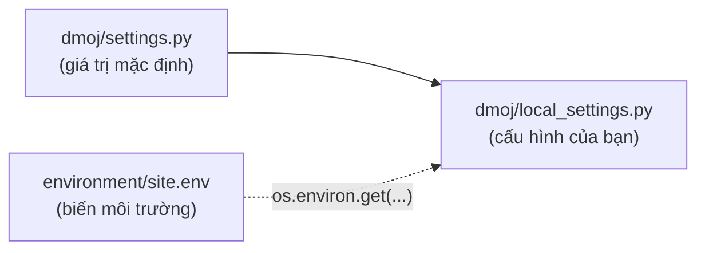

# Tham khảo cấu hình

> Bảng tra các thiết lập Django riêng của LCOJ, VNOJ và DMOJ: giá trị mặc định trong `settings.py`, giá trị trên luyencode.net, tác dụng của từng thiết lập và trang tài liệu giải thích chi tiết.
>
> ⏱ ~5 phút · 👤 Người vận hành · 🔑 Quyền sửa `local_settings.py` trên máy chủ

## Khi nào cần trang này

- Bạn muốn biết một hành vi của site (giới hạn nộp bài, số bài test tối đa, điều kiện để bình luận...) do thiết lập nào quyết định.
- Bạn định bật một tính năng đang tắt (tải dữ liệu kỳ thi, MOSS, API đồng bộ, webhook Discord...).
- Bạn gặp một thiết lập trong mã nguồn và muốn biết cấu hình đi kèm có ghi đè nó hay không.

Trang này chỉ liệt kê các thiết lập riêng của hệ thống chấm bài. Thiết lập chung của Django (`SECRET_KEY`, `DEBUG`, `DATABASES`, `CACHES`...) và các biến trong file `.env` được mô tả ở [Biến môi trường](/operate/environment).

Cách đọc các bảng:

- **Mặc định**: giá trị trong `dmoj/repo/dmoj/settings.py`. "không khai báo" nghĩa là `settings.py` không có dòng này, code tự dùng giá trị dự phòng.
- **luyencode.net**: giá trị trong `local_settings.py` đi kèm (bản mẫu `dmoj/config/local_settings.py`), cũng là cấu hình đang chạy trên luyencode.net. `=` nghĩa là file này không ghi đè mặc định. `env X` nghĩa là giá trị được đọc từ biến môi trường `X`. `` `<secret>` `` là giá trị bí mật mà bạn tự đặt.

## Cách thay đổi một thiết lập

Django nạp cấu hình theo ba lớp, lớp sau ghi đè lớp trước:



1. `dmoj/repo/dmoj/settings.py` chứa giá trị mặc định. Không sửa file này; nó thuộc submodule lcoj-site.
2. File đang chạy là `dmoj/repo/dmoj/local_settings.py`. `./scripts/initialize` sao chép file này từ bản mẫu `dmoj/config/local_settings.py`, và **chạy lại `initialize` sẽ ghi đè** bản đang chạy. Vì vậy, khi sửa, hãy sửa cả hai file cho giống nhau.
3. Một số thiết lập trong `local_settings.py` được đọc từ biến môi trường (`HOST`, `SITE_FULL_URL`, `MEDIA_URL`, `EVENT_DAEMON_POST`, `CELERY_BROKER_URL`, `BRIDGED_HOST`, `MOSS_API_KEY`, khóa OAuth Google...). Với những thiết lập này, hãy sửa `environment/site.env`, xem [Biến môi trường](/operate/environment).

Thêm một thiết lập mới vào cuối `local_settings.py` (phần `Custom Configuration`), ví dụ:

```python
DMOJ_SUBMISSION_LIMIT = 3
```

Thiết lập bí mật thì đọc từ môi trường thay vì ghi thẳng giá trị:

```python
GLOBAL_API_KEY = os.environ.get('GLOBAL_API_KEY', '')
```

Sau khi sửa `local_settings.py`, khởi động lại các dịch vụ chạy Django (chạy trong `dmoj/`):

```sh
docker compose restart site celery
# thêm bridged nếu bạn sửa BRIDGED_* hoặc thiết lập liên quan tới hàng đợi chấm
docker compose restart bridged
```

Sửa file `.env` thì phải tạo lại container bằng `docker compose up -d ...`, vì `restart` không đọc lại `env_file` (xem [Áp dụng thay đổi](/operate/environment#applying-changes)).

## Site và thương hiệu

| Thiết lập | Mặc định | luyencode.net | Tác dụng | Tài liệu |
|---|---|---|---|---|
| `SITE_NAME` | `'DMOJ'` | `'LCOJ'` | Tên ngắn trên tiêu đề trang, thanh điều hướng, email | [Cấu hình site](/admin/site-config) |
| `SITE_LONG_NAME` | `'DMOJ: Modern Online Judge'` | `'LCOJ: Luyện Code Online Judge'` | Tên đầy đủ của site | [Cấu hình site](/admin/site-config) |
| `HOST` | không khai báo | env `HOST` (mặc định `'localhost'`) | Tên miền của site; dùng để sinh `ALLOWED_HOSTS` và `EVENT_DAEMON_GET(_SSL)` | [Biến môi trường](/operate/environment) |
| `SITE_FULL_URL` | `None` | env `SITE_FULL_URL` (mặc định `'http://localhost/'`) | URL gốc tuyệt đối, dùng để dựng link trong webhook Discord và link tới file PDF, file bài nộp | [Biến môi trường](/operate/environment) |
| `MEDIA_URL` | `''` (Django) | env `MEDIA_URL` | URL gốc của file người dùng tải lên | [Biến môi trường](/operate/environment) |
| `SITE_ADMIN_EMAIL` | `''` | `'luyencodeonline@gmail.com'` | Email liên hệ quản trị hiển thị trên site | |
| `SERVER_EMAIL` | `'root@localhost'` (Django) | `'LCOJ: Luyện Code Online Judge <luyencodeonline@gmail.com>'` | Địa chỉ người gửi email báo lỗi | [Biến môi trường](/operate/environment#hardcoded-settings) |
| `LANGUAGE_CODE` | `'en'` | `'vi'` | Ngôn ngữ giao diện mặc định | |
| `DEFAULT_USER_TIME_ZONE` | `'America/Toronto'` | `'Asia/Ho_Chi_Minh'` | Múi giờ của tài khoản mới | |
| `DMOJ_SSL` | `1` | = | Giao thức của link canonical: `0` luôn `http`, `1` theo request, `2` luôn `https` | [Thiết lập đáng chú ý](#gotchas) |
| `DMOJ_CANONICAL` | `'oj.luyencode.net'` | = | Tên miền trong thẻ `<link rel="canonical">` và `og:url` | [Thiết lập đáng chú ý](#gotchas) |
| `TIMEZONE_MAP` | ảnh trên `static.dmoj.ca` | ảnh Blue Marble trên Wikimedia | Bản đồ dùng để chọn múi giờ trên trang hồ sơ | |
| `ACE_URL`, `JQUERY_JS`, `SELECT2_JS_URL`, `SELECT2_CSS_URL` | bản trong `/static/vnoj/` và Google CDN | bản trên `cdnjs.cloudflare.com` | Nơi tải trình soạn code Ace, jQuery và Select2 | |
| `DMOJ_THEME_CSS`, `DMOJ_THEME_DEFAULT_ACE_THEME`, `DMOJ_SELECT2_THEME` | CSS `style.css` / `dark/style.css`, Ace `github` / `twilight`, Select2 `dmoj` | = | File CSS và theme trình soạn code cho giao diện sáng/tối | |
| `SITE_THEME_COOKIE_NAME`, `SITE_THEME_COOKIE_AGE` | `'site_theme'`, 1 năm | = | Cookie nhớ giao diện sáng/tối của khách chưa đăng nhập | |
| `VNOJ_HOMEPAGE_TOP_USERS_COUNT` | `5` | = | Số người trong bảng xếp hạng thu gọn ở trang chủ | |
| `DMOJ_BLOG_NEW_PROBLEM_COUNT` | `7` | = | Số bài mới ở cột bên trang chủ và trang tổ chức | |

## Tài khoản và đăng nhập

| Thiết lập | Mặc định | luyencode.net | Tác dụng | Tài liệu |
|---|---|---|---|---|
| `OAUTH_ONLY` | `False` | `True` | Ẩn form đăng ký bằng mật khẩu, chỉ còn nút đăng ký bằng Google | [Tài khoản](/learn/account) |
| `REGISTRATION_OPEN` | `True` | = | `False` thì ẩn link **Đăng ký** và chặn trang `/accounts/register/` | [Quản lý người dùng](/admin/users) |
| `ACCOUNT_ACTIVATION_DAYS` | `7` | = | Số ngày link kích hoạt qua email còn hiệu lực | |
| `SEND_ACTIVATION_EMAIL` | không khai báo (code coi là `True`) | = | `False` thì tài khoản đăng ký bằng mật khẩu được kích hoạt ngay, không gửi email | |
| `TERMS_OF_SERVICE_URL` | `None` | `None` | Link điều khoản sử dụng trên form đăng ký | |
| `BAD_MAIL_PROVIDERS`, `BAD_MAIL_PROVIDER_REGEX` | `()`, `()` | `set()`, = | Tên miền email (hoặc regex) bị từ chối khi đăng ký bằng mật khẩu | |
| `SOCIAL_AUTH_GOOGLE_OAUTH2_KEY`, `SOCIAL_AUTH_GOOGLE_OAUTH2_SECRET` | không khai báo | `<secret>` (env cùng tên) | Thông tin ứng dụng OAuth Google cho đăng nhập/đăng ký | [Biến môi trường](/operate/environment) |
| `DMOJ_REQUIRE_STAFF_2FA` | `True` | = | Không cho staff tự tắt xác thực hai lớp (2FA) cuối cùng của mình | [Thiết lập đáng chú ý](#gotchas) |
| `DMOJ_2FA_HARDCORE` | `False` | = | Hiện cảnh báo rằng quản trị viên sẽ không khôi phục 2FA giúp người dùng | |
| `DMOJ_TOTP_TOLERANCE_HALF_MINUTES` | `1` | = | Độ lệch thời gian cho phép của mã TOTP, tính theo bước 30 giây | [Tài khoản](/learn/account) |
| `DMOJ_SCRATCH_CODES_COUNT` | `5` | = | Số mã dự phòng sinh ra khi bật 2FA | [Tài khoản](/learn/account) |
| `WEBAUTHN_RP_ID` | `None` | = | Tên miền cho khóa bảo mật (WebAuthn); `None` thì ẩn tính năng này | [Tài khoản](/learn/account) |
| `DMOJ_PASSWORD_RESET_LIMIT_WINDOW`, `DMOJ_PASSWORD_RESET_LIMIT_COUNT` | `3600`, `10` | = | Mỗi địa chỉ IP gửi tối đa 10 yêu cầu đặt lại mật khẩu trong 3600 giây | |
| `IMPERSONATE_REQUIRE_SUPERUSER`, `IMPERSONATE_DISABLE_LOGGING` | `True`, `True` | = | Dự định giới hạn mạo danh cho superuser và tắt nhật ký, nhưng **không có tác dụng** | [Quản lý người dùng](/admin/users) |
| `DMOJ_USER_DATA_DOWNLOAD` | `False` | `True` | Cho người dùng tải về dữ liệu của mình | [Tải dữ liệu người dùng](/operate/user-data-download) |
| `DMOJ_USER_DATA_CACHE`, `DMOJ_USER_DATA_INTERNAL` | `''`, `''` | `'/userdatacache'`, `'/userdatacache'` | Thư mục lưu file ZIP và đường dẫn nội bộ nginx (X-Accel-Redirect) để gửi file | [Tải dữ liệu người dùng](/operate/user-data-download) |
| `DMOJ_USER_DATA_DOWNLOAD_RATELIMIT` | 1 ngày | 1 ngày | Khoảng cách tối thiểu giữa hai lần yêu cầu dữ liệu | [Tải dữ liệu người dùng](/operate/user-data-download) |
| `VNOJ_DISPLAY_RANKS` | `user`, `setter`, `daor`, `staff`, `banned`, `admin`, `teacher` | = | Danh sách danh hiệu hiển thị cạnh tên người dùng | [Quản lý người dùng](/admin/users) |
| `DMOJ_NEWSLETTER_ID_ON_REGISTER` | `None` | = | Tự đăng ký người dùng mới vào một bản tin (cần app `newsletter`, không được cài sẵn) | |
| `IP_BASED_AUTHENTICATION_HEADER` | `'REMOTE_ADDR'` | = | Header chứa IP cho đăng nhập theo IP; chỉ có tác dụng khi thêm `IPBasedAuthMiddleware` (không có trong `MIDDLEWARE` mặc định) | |

## Bài tập và dữ liệu test

| Thiết lập | Mặc định | luyencode.net | Tác dụng | Tài liệu |
|---|---|---|---|---|
| `DMOJ_PROBLEM_DATA_ROOT` | `None` | `'/problems/'` | Thư mục chứa dữ liệu test trong container, khớp với volume `problems` | [Quản lý bài tập](/setter/managing-problems) |
| `DMOJ_PROBLEM_DATA_INTERNAL` | không khai báo | = | Đường dẫn nội bộ nginx để gửi file test; không khai báo thì Django tự gửi file | |
| `DMOJ_PROBLEM_MIN_TIME_LIMIT`, `DMOJ_PROBLEM_MAX_TIME_LIMIT` | `0.01`, `60` (giây) | = | Khoảng hợp lệ của giới hạn thời gian | [Quản lý bài tập](/setter/managing-problems) |
| `DMOJ_PROBLEM_MIN_MEMORY_LIMIT`, `DMOJ_PROBLEM_MAX_MEMORY_LIMIT` | `0`, `1048576` (KB) | = | Khoảng hợp lệ của giới hạn bộ nhớ | [Quản lý bài tập](/setter/managing-problems) |
| `DMOJ_PROBLEM_MIN_PROBLEM_POINTS` | `0` | = | Điểm tối thiểu của một bài | |
| `VNOJ_PROBLEM_TIMELIMIT_LIMIT` | `5` (giây) | = | Giới hạn thời gian tối đa được đặt nếu không có quyền `high_problem_timelimit` | [Phân quyền](/admin/permissions) |
| `VNOJ_TESTCASE_HARD_LIMIT` | `100` | = | Số test tối đa nếu không có quyền `create_mass_testcases` | [Phân quyền](/admin/permissions) |
| `VNOJ_TESTCASE_SOFT_LIMIT` | `50` | = | Vượt số test này thì hiện cảnh báo (với người không có quyền trên) | [Phân quyền](/admin/permissions) |
| `VNOJ_TESTCASE_VISIBLE_LENGTH` | `60` | = | Số byte đầu của file test được hiển thị khi xem trước | |
| `DMOJ_PROBLEM_STATEMENT_DISALLOWED_CHARACTERS` | ngoặc kép cong, dấu trừ Unicode, chữ ghép `fi`, `fl`... | = | Ký tự bị cấm trong đề bài, lưu đề sẽ báo lỗi nếu có | [Quản lý bài tập](/setter/managing-problems) |
| `DMOJ_PROBLEM_HOT_PROBLEM_COUNT` | `7` | = | Số "bài hot" (tính theo 24 giờ gần nhất) trên danh sách bài | |
| `VNOJ_TAG_PROBLEM_MIN_RATING` | `1900` | = | Rating tối thiểu để được gắn tag cho bài | [Cộng đồng](/learn/community) |
| `ENABLE_FTS` | `False` | `False` | Bật tìm kiếm toàn văn trong danh sách bài | |
| `DATA_UPLOAD_MAX_NUMBER_FIELDS` | `3000` | = | Số trường tối đa của một form, được nâng lên để lưu bảng test dài | |
| `VNOJ_PROBLEM_DELETION_GRACE_PERIOD` | 7 ngày | = | Bài bị xóa mềm quá thời gian này thì tác vụ dọn rác được phép xóa hẳn | [Tổ chức](/organize/organizations) |
| `VNOJ_PROBLEM_GARBAGE_COLLECTOR_TIME_LIMIT` | 1 giờ | = | Thời gian chạy tối đa của một lần dọn rác | |
| `VNOJ_PROBLEM_GARBAGE_COLLECTOR_CRONTAB_KWARGS` | `{'minute': 0, 'hour': 0}` | = | Lịch chạy dọn rác (cần Celery beat, xem [lưu ý](#gotchas)) | |

## Nộp bài và chấm bài

| Thiết lập | Mặc định | luyencode.net | Tác dụng | Tài liệu |
|---|---|---|---|---|
| `DMOJ_SUBMISSION_LIMIT` | `2` | = | Số bài nộp đang chờ chấm tối đa của một người, nếu không có quyền `spam_submission` | [Phân quyền](/admin/permissions) |
| `DMOJ_SUBMISSIONS_REJUDGE_LIMIT` | `10` | = | Số bài nộp chấm lại một lần trong trang quản trị, nếu không có quyền `rejudge_submission_lot` | [Phân quyền](/admin/permissions) |
| `DMOJ_SUBMISSION_SOURCE_VISIBILITY` | `'all-solved'` | = | Ai xem được mã nguồn người khác với bài để chế độ "theo cấu hình chung": `'all'`, `'all-solved'` hoặc `'only-own'` | [Quản lý bài tập](/setter/managing-problems) |
| `DEFAULT_USER_LANGUAGE` | `'CPP20'` | = | Ngôn ngữ lập trình mặc định của tài khoản mới | |
| `BRIDGED_JUDGE_ADDRESS` | `[('localhost', 9999)]` | `[(env BRIDGED_HOST, 9999)]`, mặc định host `bridged` | Địa chỉ bridged lắng nghe kết nối từ máy chấm | [Cài đặt máy chấm](/operate/judge-setup) |
| `BRIDGED_DJANGO_ADDRESS` | `[('localhost', 9998)]` | `[(env BRIDGED_HOST, 9998)]`, mặc định host `bridged` | Địa chỉ bridged nhận lệnh chấm từ site | [Kiến trúc](/operate/architecture) |
| `BRIDGED_DJANGO_CONNECT`, `BRIDGED_JUDGE_PROXIES` | `None`, `None` | = | Địa chỉ site dùng để gọi bridged (nếu khác địa chỉ lắng nghe); danh sách proxy tin cậy trước máy chấm | |
| `VNOJ_LONG_QUEUE_ALERT_THRESHOLD` | `10` | = | Hàng đợi chấm vượt ngưỡng này thì gửi webhook `on_long_queue` | |
| `VNOJ_LOW_POWER_MODE` | `False` | = | Chế độ tiết kiệm: giới hạn số trang danh sách bài nộp và bỏ bản đồ nhiệt với người nộp quá nhiều | |
| `VNOJ_LOW_POWER_MODE_CONFIG` | `{'max_page': 5, 'heat_map_limit': 20000}` | = | Tham số của chế độ tiết kiệm | |
| `DMOJ_STATS_SUBMISSION_RESULT_COLORS` | màu cho `AC`, `WA`, `TLE`... | = | Màu các kết quả trong biểu đồ thống kê | |

## Kỳ thi và xếp hạng

| Thiết lập | Mặc định | luyencode.net | Tác dụng | Tài liệu |
|---|---|---|---|---|
| `VNOJ_CONTEST_DURATION_LIMIT` | `14` (ngày) | = | Thời lượng kỳ thi tối đa nếu không có quyền `long_contest_duration` | [Tạo kỳ thi](/organize/contest-setup) |
| `MAX_CONTEST_PROBLEMS_COUNT` | `None` | = | Số bài tối đa trong một kỳ thi; `None` là không giới hạn | [Tạo kỳ thi](/organize/contest-setup) |
| `VNOJ_OFFICIAL_CONTEST_MODE` | `False` | = | Chế độ thi chính thức: khóa sửa tên và phần giới thiệu, ghi IP mỗi lần nộp, không bắt đổi mật khẩu | [Tạo kỳ thi](/organize/contest-setup) |
| `VNOJ_SHOULD_BAN_FOR_CHEATING_IN_CONTESTS` | `False` | = | Tự khóa tài khoản bị loại (disqualify) nhiều lần | [Quản lý người dùng](/admin/users) |
| `VNOJ_MAX_DISQUALIFICATIONS_BEFORE_BANNING` | `3` | = | Số lần bị loại trước khi bị khóa | [Quản lý người dùng](/admin/users) |
| `VNOJ_CONTEST_CHEATING_BAN_MESSAGE` | `'Banned for multiple cheating offenses during contests'` | = | Lý do khóa ghi vào hồ sơ | [Quản lý người dùng](/admin/users) |
| `VNOJ_BAN_COUNT_FROM_DATE` | 1/1/2026 (UTC) | = | Chỉ đếm các lần bị loại từ kỳ thi bắt đầu sau ngày này; `None` là đếm tất cả | [Quản lý người dùng](/admin/users) |
| `DMOJ_CONTEST_DATA_DOWNLOAD` | `False` | `True` | Cho phép tải dữ liệu kỳ thi | [Tải dữ liệu kỳ thi](/organize/contest-data-download) |
| `DMOJ_CONTEST_DATA_CACHE`, `DMOJ_CONTEST_DATA_INTERNAL` | `''`, `''` | `'/contestdatacache'`, `'/contestdatacache'` | Thư mục lưu file ZIP và đường dẫn nội bộ nginx để gửi file | [Tải dữ liệu kỳ thi](/organize/contest-data-download) |
| `DMOJ_CONTEST_DATA_DOWNLOAD_RATELIMIT` | 1 ngày | 1 ngày | Khoảng cách tối thiểu giữa hai lần yêu cầu dữ liệu kỳ thi | [Tải dữ liệu kỳ thi](/organize/contest-data-download) |
| `CONTEST_REPLAY_MEDIA_DIR`, `DMOJ_CONTEST_REPLAY_INTERNAL` | `'contest_replay'`, `None` | = | Thư mục (trong `MEDIA_ROOT`) chứa dữ liệu replay bảng xếp hạng; đường dẫn nội bộ nginx để gửi file | [Tạo kỳ thi](/organize/contest-setup) |
| `DMOJ_PP_STEP`, `DMOJ_PP_ENTRIES` | `0.98514`, `300` | = | Hệ số giảm dần và số bài tốt nhất được tính vào điểm (performance points) của người dùng | |
| `DMOJ_PP_BONUS_FUNCTION` | `0.05 * n` | = | Điểm thưởng theo số bài đã giải `n` | |
| `DMOJ_RATING_COLORS` | `True` | = | Tô màu tên người dùng theo rating | |

## Tổ chức và hạn mức

| Thiết lập | Mặc định | luyencode.net | Tác dụng | Tài liệu |
|---|---|---|---|---|
| `DMOJ_USER_MAX_ORGANIZATION_COUNT` | `3` | = | Số tổ chức công khai (mở) tối đa một người được tham gia | [Tổ chức](/organize/organizations) |
| `VNOJ_ORGANIZATION_ADMIN_LIMIT` | `3` | = | Số tổ chức tối đa một người làm quản trị mà vẫn được tạo tổ chức mới, nếu không có quyền `spam_organization` | [Tổ chức](/organize/organizations) |
| `VNOJ_ORG_PP_STEP`, `VNOJ_ORG_PP_ENTRIES`, `VNOJ_ORG_PP_SCALE` | `0.95`, `100`, `1` | = | Công thức điểm của tổ chức, tính từ điểm của các thành viên tốt nhất | [Tổ chức](/organize/organizations) |
| `VNOJ_ENABLE_ORGANIZATION_CREDIT_LIMITATION` | `False` | = | Bật hệ thống credit: tổ chức hết credit thì không nộp được bài riêng | [Tổ chức](/organize/organizations) |
| `VNOJ_MONTHLY_FREE_CREDIT` | `10800` (3 giờ chấm) | = | Credit miễn phí mỗi tháng của một tổ chức | [Tổ chức](/organize/organizations) |
| `VNOJ_PRICE_PER_HOUR` | `50` | = | Đơn giá (nghìn đồng) mỗi giờ chấm vượt credit miễn phí, dùng cho biểu đồ chi phí | [Tổ chức](/organize/organizations) |
| `VNOJ_ORGANIZATION_DEFAULT_MAX_PROBLEMS`, `VNOJ_ORGANIZATION_DEFAULT_MAX_STORAGE` | `1000`, 5 GB | = | Hạn mức mặc định về số bài và dung lượng test của tổ chức mới | [Tổ chức](/organize/organizations) |
| `VNOJ_QUOTA_WARNING_THRESHOLD` | `0.8` | = | Dùng quá 80% hạn mức thì hiện cảnh báo | [Tổ chức](/organize/organizations) |
| `VNOJ_QUOTA_WARNING_SUFFIX` | `''` | = | Đoạn HTML thêm vào cuối mọi cảnh báo hạn mức (ví dụ link hướng dẫn) | [Tổ chức](/organize/organizations) |
| `VNOJ_QUOTA_ENFORCEMENT_ENABLED` | `False` | = | `True` thì chặn tạo bài / tải test khi vượt hạn mức; `False` chỉ cảnh báo | [Tổ chức](/organize/organizations) |
| `VNOJ_QUOTA_PACKAGE_STORAGE`, `VNOJ_QUOTA_PACKAGE_PROBLEMS` | 5 GB, `1000` | = | Dung lượng và số bài mỗi gói hạn mức cộng thêm | [Tổ chức](/organize/organizations) |
| `GROUP_PERMISSION_FOR_ORG_ADMIN` | `'Org Admin'` | = | Nhóm quyền Django tự gán cho quản trị viên tổ chức | [Phân quyền](/admin/permissions) |
| `DESCRIPTION_MAX_LENGTH` | `200` | = | Độ dài mô tả (thẻ meta) lấy từ phần giới thiệu tổ chức | |
| `VNOJ_IGNORED_ORGANIZATION_SUBDOMAINS` | `['oj', 'www', 'localhost']` | = | Tên miền con không bị coi là tổ chức; chỉ có tác dụng khi thêm `OrganizationSubdomainMiddleware` (không có trong `MIDDLEWARE` mặc định) | |

## Bình luận, blog và điểm đóng góp

| Thiết lập | Mặc định | luyencode.net | Tác dụng | Tài liệu |
|---|---|---|---|---|
| `VNOJ_INTERACT_MIN_PROBLEM_COUNT` | `5` | = | Số bài phải giải để được bình luận, bình chọn và sửa hồ sơ | [Cộng đồng](/learn/community) |
| `VNOJ_BLOG_MIN_PROBLEM_COUNT` | `10` | = | Số bài phải giải để được viết blog | [Cộng đồng](/learn/community) |
| `VNOJ_COMMENT_MIN_CONTRIBUTION` | `-20` | = | Điểm đóng góp tối thiểu để bình luận (không áp dụng cho staff) | [Cộng đồng](/learn/community) |
| `VNOJ_COMMENT_MIN_LENGTH`, `VNOJ_COMMENT_MAX_LENGTH` | `10`, `8196` | = | Độ dài bình luận tối thiểu/tối đa (không áp dụng cho staff) | [Cộng đồng](/learn/community) |
| `VNOJ_COMMENT_BLACKLIST_TERMS` | `[]` | = | Từ bị cấm trong bình luận, không phân biệt hoa thường | |
| `VNOJ_COMMENT_RATE_LIMIT_COUNT`, `VNOJ_COMMENT_RATE_LIMIT_WINDOW` | `None`, 600 giây | = | Số bình luận tối đa trong một khoảng thời gian; `None` là không giới hạn | |
| `DMOJ_COMMENT_VOTE_HIDE_THRESHOLD` | `-5` | = | Bình luận có điểm từ ngưỡng này trở xuống bị thu gọn | [Cộng đồng](/learn/community) |
| `DMOJ_COMMENT_REPLY_TIMEFRAME` | 365 ngày | = | Chỉ được trả lời bình luận đăng trong khoảng thời gian này (trừ người có quyền sửa bình luận) | [Cộng đồng](/learn/community) |
| `VNOJ_CP_COMMENT` | `1` | = | Điểm đóng góp cho mỗi điểm bình chọn của bình luận và blog | [Cộng đồng](/learn/community) |
| `VNOJ_CP_TICKET` | `10` | `5` | Điểm đóng góp cho mỗi ticket được đánh dấu có ích | [Cộng đồng](/learn/community) |
| `VNOJ_CP_EDITORIAL_REVEAL` | không khai báo (code dùng `1`) | = | Điểm đóng góp bị trừ mỗi lần mở lời giải khi chưa giải bài | [Lời giải](/setter/editorials) |
| `TICKET_AUTOFILL_REPLIES` | danh sách câu trả lời mẫu | = | Câu trả lời soạn sẵn khi xử lý ticket của người khác | |
| `NOFOLLOW_EXCLUDED` | `set()` | = | Tên miền không bị gắn `rel="nofollow"` khi hiển thị Markdown | |
| `GOOGLE_SEARCH_ENGINE_URL` | `None` | = | URL Google Custom Search để hiện ô tìm kiếm trên trang chủ | |

## Quiz, thư viện đề và rút gọn link

Quiz không có thiết lập riêng; mọi cấu hình quiz nằm trong trang quản trị (xem [Soạn quiz](/setter/quiz-authoring)).

| Thiết lập | Mặc định | luyencode.net | Tác dụng | Tài liệu |
|---|---|---|---|---|
| `URLSHORTENER_DOMAIN` | không khai báo | = | Tên miền riêng cho link rút gọn; không đặt thì link sao chép ra chỉ là `/<mã>` | [Rút gọn link](/admin/url-shortener) |
| `PDF_STATEMENT_MAX_FILE_SIZE` | `5242880` (5 MB) | = | Dung lượng tối đa của file PDF đề bài và đề trong thư viện | [Thư viện đề](/learn/exam-library) |
| `PDF_STATEMENT_SAFE_EXTS` | `{'pdf'}` | = | Đuôi file được phép tải lên | [Thư viện đề](/learn/exam-library) |
| `PDF_STATEMENT_UPLOAD_MEDIA_DIR`, `PDF_STATEMENT_UPLOAD_URL_PREFIX` | `'pdf'`, `'/pdf'` | = | Thư mục (trong `MEDIA_ROOT`) và tiền tố URL của file PDF đã tải lên | [Thư viện đề](/learn/exam-library) |

## Hiển thị (công thức, PDF, hình ảnh)

| Thiết lập | Mặc định | luyencode.net | Tác dụng | Tài liệu |
|---|---|---|---|---|
| `MATHOID_URL` | `False` | = | URL dịch vụ Mathoid; `False` thì công thức được MathJax hiển thị trên trình duyệt | [Mathoid](/operate/mathoid) |
| `MATHOID_GZIP`, `MATHOID_MML_CACHE`, `MATHOID_CSS_CACHE`, `MATHOID_DEFAULT_TYPE`, `MATHOID_MML_CACHE_TTL`, `MATHOID_CACHE_ROOT`, `MATHOID_CACHE_URL` | `False`, `None`, `'default'`, `'auto'`, `86400`, `''`, `False` | = | Cache và kiểu kết quả của Mathoid | [Mathoid](/operate/mathoid) |
| `TEXOID_URL` | không khai báo | = | URL dịch vụ Texoid (vẽ TikZ); hiện chưa được nối vào bộ render đề | [Texoid](/operate/texoid) |
| `TEXOID_GZIP`, `TEXOID_META_CACHE`, `TEXOID_META_CACHE_TTL`, `TEXOID_CACHE_ROOT`, `TEXOID_CACHE_URL` | `False`, `'default'`, `86400`, không khai báo, không khai báo | = | Cache của Texoid | [Texoid](/operate/texoid) |
| `DMOJ_PDF_PDFOID_URL` | `None` | = | URL dịch vụ Pdfoid; khác `None` thì bật tải đề bài dạng PDF | [Pdfoid](/operate/pdfoid) |
| `DMOJ_PDF_PROBLEM_CACHE`, `DMOJ_PDF_PROBLEM_INTERNAL` | `None`, `None` | = | Thư mục cache PDF và đường dẫn nội bộ nginx để gửi file | [Pdfoid](/operate/pdfoid) |
| `DMOJ_CAMO_URL`, `DMOJ_CAMO_KEY` | `None`, `None` | = | Proxy ảnh Camo cho ảnh bên ngoài trong Markdown; khóa là `<secret>` | [Proxy nội dung SSL](/operate/ssl-content-proxy) |
| `DMOJ_CAMO_HTTPS`, `DMOJ_CAMO_EXCLUDE` | `False`, `()` | = | Dùng `https` cho link không ghi giao thức; tên miền không đi qua Camo | [Proxy nội dung SSL](/operate/ssl-content-proxy) |

## Tích hợp và API

| Thiết lập | Mặc định | luyencode.net | Tác dụng | Tài liệu |
|---|---|---|---|---|
| `MOSS_API_KEY` | `None` | `<secret>` (env `MOSS_API_KEY`, mặc định `''`) | Khóa MOSS để kiểm tra đạo code trong kỳ thi | [Tạo kỳ thi](/organize/contest-setup) |
| `MOSS_HOST`, `MOSS_PORT` | `'moss.stanford.edu'`, `7690` | = | Máy chủ MOSS | |
| `OPENAI_API_KEY`, `OPENAI_BASE_URL` | không phải thiết lập Django | biến môi trường khi chạy lệnh | Khóa và URL API tương thích OpenAI mà lệnh `generate_editorials` đọc trực tiếp từ môi trường | [Lời giải](/setter/editorials), [Lệnh quản trị](/reference/management-commands) |
| `VNOJ_ENABLE_SYNC_API` | `False` | = | Bật API đồng bộ kỳ thi dưới `/api/v2/` | [API](/reference/api) |
| `GLOBAL_API_KEY` | giá trị thử nghiệm công khai | = | Khóa chung mà mọi request API đồng bộ phải gửi kèm | [API](/reference/api) |
| `DISCORD_WEBHOOK` | mọi khóa là `None` | = | URL webhook Discord cho từng sự kiện (ticket, bình luận, bài mới, hàng đợi dài...); giá trị là `<secret>` | [Thiết lập đáng chú ý](#gotchas) |
| `VNOJ_DISCORD_WEBHOOK_THROTTLING` | `(10, 60)` | = | Tối đa 10 tin báo lỗi qua Discord trong 60 giây | |
| `OJ_PROBLEM_PRESET`, `OJ_LIST` | Codeforces, Codeforces Gym, AtCoder, VNOJ, Kattis | = | Các OJ ngoài và mẫu link bài tương ứng mà tính năng tag bài nhận diện | |
| `OJ_REQUESTS_TIMEOUT`, `OJAPI_CACHE_TIMEOUT` | `5` giây, `3600` giây | = | Thời gian chờ và thời gian cache khi gọi API của OJ ngoài | |

## Tác vụ nền và cache

| Thiết lập | Mặc định | luyencode.net | Tác dụng | Tài liệu |
|---|---|---|---|---|
| `CELERY_BROKER_URL`, `CELERY_RESULT_BACKEND` | không khai báo | env cùng tên, mặc định `redis://redis:6379/1` | Hàng đợi và nơi lưu kết quả tác vụ Celery | [Biến môi trường](/operate/environment) |
| `CELERY_BROKER_URL_SECRET` | không khai báo | = | Nếu có, ghi đè URL broker (dùng khi URL chứa mật khẩu) | |
| `CELERY_TIMEZONE`, `CELERY_WORKER_HIJACK_ROOT_LOGGER` | `'UTC'`, `False` | = | Múi giờ lịch tác vụ định kỳ; không để Celery chiếm logger gốc | |
| `CACHES` | `{}` | Redis, env `REDIS_CACHING_URL` | Cache của Django | [Biến môi trường](/operate/environment) |
| `EVENT_DAEMON_USE` | `False` | `True` | Bật cập nhật trực tiếp (kết quả chấm, bảng xếp hạng) qua wsevent | [Kiến trúc](/operate/architecture) |
| `EVENT_DAEMON_POST` | `'ws://localhost:9997/'` | env `EVENT_DAEMON_POST` (mặc định `'ws://wsevent:15101/'`) | Địa chỉ site gửi sự kiện tới wsevent | [Biến môi trường](/operate/environment) |
| `EVENT_DAEMON_GET`, `EVENT_DAEMON_GET_SSL` | `'ws://localhost:9996/'`, không khai báo | `ws://{HOST}/event/`, `wss://{HOST}/event/` | Địa chỉ WebSocket mà trình duyệt kết nối | [Biến môi trường](/operate/environment#hardcoded-settings) |
| `EVENT_DAEMON_POLL` | `'/channels/'` | `'/channels/'` | Đường dẫn long polling khi WebSocket không dùng được | |
| `EVENT_DAEMON_KEY`, `EVENT_DAEMON_AMQP`, `EVENT_DAEMON_AMQP_EXCHANGE` | `None`, không khai báo, `'dmoj-events'` | = | Khóa xác thực với wsevent; cấu hình event server dạng AMQP (không dùng khi chạy wsevent) | |
| `EVENT_DAEMON_SUBMISSION_KEY`, `EVENT_DAEMON_CONTEST_KEY`, `EVENT_DAEMON_TICKET_KEY`, `EVENT_DAEMON_NOTIFICATION_KEY` | chuỗi cố định trong `settings.py` | = | Khóa HMAC để sinh tên kênh sự kiện riêng của từng bài nộp, kỳ thi, ticket, thông báo | [Thiết lập đáng chú ý](#gotchas) |
| `DMOJ_EMAIL_THROTTLING` | `(10, 60)` | = | Tối đa 10 email báo lỗi trong 60 giây | |

## Thiết lập đáng chú ý {#gotchas}

- **`IMPERSONATE_*` bị bỏ qua.** django-impersonate (bản 1.9.x trong image) chỉ đọc dict `IMPERSONATE = {...}`, không đọc `IMPERSONATE_REQUIRE_SUPERUSER` hay `IMPERSONATE_DISABLE_LOGGING`. Kết quả là mọi staff đều mạo danh được người dùng không phải superuser, và nhật ký mạo danh vẫn được ghi. Cách sửa có trong [Quản lý người dùng](/admin/users).
- **Đặt `MATHOID_URL` làm hỏng công thức.** Khi có `MATHOID_URL`, bộ render chuyển sang kiểu `mml` và MathJax không được nạp, nên nhiều trình duyệt hiện nguyên `~a+b~`. Giữ mặc định `False` (xem [Mathoid](/operate/mathoid)).
- **`TEXOID_URL` được kiểm tra bằng `hasattr`.** Muốn tắt thì xóa hẳn dòng này; đặt `TEXOID_URL = None` vẫn bị coi là đã bật.
- **`GLOBAL_API_KEY` mặc định là giá trị công khai.** Giá trị trong `settings.py` nằm trong kho mã công khai và `local_settings.py` đi kèm không ghi đè. API đồng bộ đang tắt nên chưa sao, nhưng trước khi đặt `VNOJ_ENABLE_SYNC_API = True` phải đặt khóa riêng, đọc từ biến môi trường (xem [API](/reference/api)).
- **Các khóa `EVENT_DAEMON_*_KEY` cũng là giá trị công khai.** Chúng dùng để sinh tên kênh sự kiện riêng; ai biết khóa thì tự tính được tên kênh. Nên đặt giá trị riêng, đọc từ biến môi trường.
- **`DMOJ_REQUIRE_STAFF_2FA` chỉ chặn việc tắt 2FA.** Staff chưa bật 2FA vẫn đăng nhập và làm việc bình thường; thiết lập này chỉ ngăn staff tắt phương thức 2FA cuối cùng (TOTP hoặc khóa bảo mật).
- **`OAUTH_ONLY` chỉ ẩn form.** Thiết lập này chỉ được template trang đăng ký dùng để ẩn các ô nhập; view `/accounts/register/` vẫn nhận POST. Muốn chặn hẳn đăng ký bằng mật khẩu, đặt thêm `REGISTRATION_OPEN = False` (việc này cũng ẩn link **Đăng ký** trên thanh điều hướng). Form đăng nhập bằng mật khẩu vẫn hoạt động trong cả hai trường hợp.
- **`MOSS_API_KEY` rỗng vẫn bị coi là đã cấu hình.** Code kiểm tra `MOSS_API_KEY is not None`, còn `local_settings.py` đi kèm đọc `os.environ.get('MOSS_API_KEY', '')`. Khi chưa đặt biến môi trường, giá trị là `''` nên tab **MOSS** vẫn hiện với người có quyền `moss_contest`, nhưng chạy MOSS sẽ lỗi.
- **`DMOJ_SSL = 1` khi HTTPS được xử lý trước nginx.** Nếu một proxy, CDN hay load balancer đứng trước nginx xử lý HTTPS rồi chuyển tiếp bằng HTTP, Django không biết request gốc là HTTPS (`SECURE_PROXY_SSL_HEADER` không được đặt). Hệ quả: link canonical dùng `http://`, và trang nhận địa chỉ `EVENT_DAEMON_GET` (`ws://`) thay vì `EVENT_DAEMON_GET_SSL`. Nếu site chỉ phục vụ qua HTTPS, đặt `DMOJ_SSL = 2`; muốn trang dùng `wss://`, hãy cấu hình proxy gửi header giao thức và đặt `SECURE_PROXY_SSL_HEADER` tương ứng. Dòng `#DMOJ_HTTPS` trong `local_settings.py` chỉ là chú thích; code đọc `DMOJ_SSL`.
- **`DMOJ_CANONICAL` mặc định là `oj.luyencode.net`.** Giá trị này nằm trong `settings.py`, không phải `HOST`. Nếu bạn tự chạy site trên tên miền khác, đặt `DMOJ_CANONICAL` thành tên miền của bạn, nếu không link canonical và `og:url` sẽ trỏ sang tên miền khác.
- **Không có Celery beat.** Container `celery` chỉ chạy `celery worker`, không chạy beat. Các tác vụ định kỳ (dọn bài đã xóa mềm theo `VNOJ_PROBLEM_GARBAGE_COLLECTOR_CRONTAB_KWARGS`, cấp lại credit tổ chức ngày 1 hằng tháng, thống kê thời gian chờ hằng ngày) không tự chạy, nên sửa các thiết lập lịch này không có tác dụng.
- **`DISCORD_WEBHOOK['default']` không phải giá trị dự phòng.** Code chỉ đọc đúng khóa của từng sự kiện (`on_new_ticket`, `on_new_ticket_message`, `on_new_comment`, `on_new_problem`, `on_new_tag_problem`, `on_new_tag`, `on_new_contest`, `on_new_blogpost`, `on_long_queue`, `queue_time_stats`, `on_error`). Webhook cũng chỉ gửi khi `SITE_FULL_URL` khác `None`; link trong tin nhắn được ghép kiểu `SITE_FULL_URL + '/user/...'`, nên URL có dấu `/` ở cuối sẽ sinh ra `//`.
- **`VNOJ_DISPLAY_RANKS` được dùng trong migration.** Đổi danh sách này cần tạo migration mới (`./scripts/manage.py makemigrations`).
- **`NGINX_PORT` không phải thiết lập Django.** Đây là biến của Docker Compose, đặt trong `dmoj/.env`, không phải trong `local_settings.py` hay `site.env` (xem [Biến môi trường](/operate/environment#nginx-port)).

## Tiếp theo

- [Biến môi trường](/operate/environment): các thiết lập đọc từ `site.env` và cách áp dụng khi sửa.
- [Kiến trúc](/operate/architecture): các dịch vụ `site`, `celery`, `bridged`, `wsevent` dùng những thiết lập trên như thế nào.
- [Cấu hình site](/admin/site-config): những cấu hình đổi được ngay trong trang quản trị, không cần sửa file.
- [Lệnh quản trị](/reference/management-commands): các lệnh như `generate_editorials`, `backfill_current_credit`.
