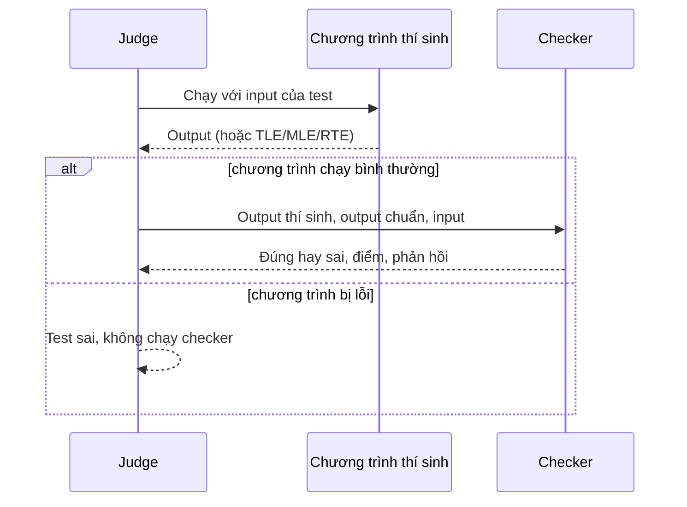

# Checker

> Chọn checker có sẵn hoặc tự viết checker (C++/testlib, Python) để quyết định output của thí sinh đúng hay sai và được bao nhiêu điểm.
>
> ⏱ ~15 phút · 👤 Người ra đề · 🔑 Quyền sửa bài (checker Python: bài phải bật **manually managed**)

## Khi nào cần trang này

Dùng trang này khi bài có nhiều đáp án đúng, output là số thực, thứ tự output không quan trọng, hoặc cần cho điểm thành phần trong một test. Với bài chỉ có một đáp án duy nhất, checker mặc định `standard` là đủ và bạn không cần đổi gì.

**Checker** quyết định output của thí sinh ở một test có đúng hay không. Checker chạy sau khi chương trình của thí sinh đã kết thúc; nó chỉ đọc output và không bao giờ trao đổi với chương trình. (Nếu cần trao đổi với chương trình trong lúc nó chạy, hãy dùng [grader tương tác](/setter/graders).)



## Chọn checker

- **Trong trình sửa test trên web** (**Sửa đổi test**), chọn checker ở danh sách **Trình chấm**. Danh sách gồm `standard`, `floats`, `floatsabs`, `floatsrel`, `identical`, `linecount` và chương trình checker tự viết (`bridged`). Xem [Quản lý bài tập](/setter/managing-problems#buoc-4-chon-checker).
- **Trong `init.yml`**, đặt key `checker` ở cấp ngoài cùng (áp dụng cho mọi test) hoặc ở từng test. Mọi checker trong trang này đều dùng được theo cách này.

Không có tham số:

```yaml
checker: floats
```

Có tham số:

```yaml
checker:
  name: floats
  args:
    precision: 4
```

## Checker có sẵn

| Tên | Có trên web | Tóm tắt |
|---|---|---|
| `standard` | có | So từng token, bỏ qua mọi khoảng trắng. **Mặc định.** |
| `floats` | có | So số thực với sai số cho phép. |
| `floatsabs` | có | `floats` chỉ xét sai số tuyệt đối. |
| `floatsrel` | có | `floats` chỉ xét sai số tương đối. |
| `identical` | có | So từng byte. |
| `linecount` | có | So theo từng dòng. |
| `sorted` | không | Bỏ qua thứ tự các dòng hoặc token. |
| `unordered` | không | Tên cũ (không nên dùng) của `sorted` với `split_on: whitespace`. |
| `easy` | không | So số lần xuất hiện của từng ký tự, bỏ qua khoảng trắng và hoa thường. |
| `linematches` | không | Cho điểm thành phần theo từng dòng khớp. |
| `rstripped` | không | So từng dòng, bỏ qua khoảng trắng cuối dòng. |
| `bridged` | có (Trình chấm ngoài) | Chạy chương trình checker của bạn. |

### `standard`

Checker mặc định khi không đặt `checker`.

1. Tách cả hai output thành các token, ngăn cách bởi mọi loại khoảng trắng (dấu cách, tab, xuống dòng).
2. So lần lượt từng token; các token phải giống hệt nhau.

Xuống dòng và dòng trống thừa không ảnh hưởng, nên với output chuẩn `1 2 3` thì cả `1 2\n3` lẫn `1\n2 3` đều được chấp nhận. Phản hồi sẽ cho thí sinh biết token nào khác.

### `floats`

Dành cho output có số thực. Các token là số trong output chuẩn được so với sai số cho phép; các token khác phải giống hệt.

**Tham số:**

| Tham số | Mặc định | Ý nghĩa |
|---|---|---|
| `precision` | `6` | Sai số cho phép là ε = 10<sup>-precision</sup>. |
| `error_mode` | `default` | `default`, `absolute` hoặc `relative`. |

Gọi `p` là số của thí sinh và `j` là số trong output chuẩn, token được chấp nhận khi:

| `error_mode` | Chấp nhận nếu |
|---|---|
| `absolute` | \|p − j\| ≤ ε |
| `relative` | p nằm giữa j·(1 − ε) và j·(1 + ε) |
| `default` | \|p − j\| ≤ ε, **hoặc** \|j\| ≥ ε và \|1 − p/j\| ≤ ε |

Quy tắc thêm:

- Hai output phải có cùng số dòng khác rỗng, và mỗi dòng phải có cùng số token. Nếu không, kết quả là lỗi trình bày (Presentation Error).
- `NaN` không bao giờ được chấp nhận.

```yaml
checker:
  name: floats
  args:
    precision: 4
    error_mode: absolute
```

Trình sửa test trên web chỉ cho đặt `precision`; chế độ luôn là `default`.

### `floatsabs` và `floatsrel`

Cách viết tắt của `floats` với `error_mode: absolute` và `error_mode: relative`. Cả hai đều nhận tham số `precision`.

### `identical`

Output phải giống hệt output chuẩn đến từng byte, kể cả khoảng trắng.

| Tham số | Mặc định | Ý nghĩa |
|---|---|---|
| `pe_allowed` | `true` | Nếu output lẽ ra qua được `standard` nhưng khác khoảng trắng, hiện phản hồi "Presentation Error, check your whitespace". Test vẫn bị tính sai. |

### `linecount`

So output theo từng dòng. Trong mỗi dòng, các token ngăn cách bằng khoảng trắng phải giống hệt nhau, và số token trên mỗi dòng phải bằng nhau. Phản hồi cho biết dòng và token đầu tiên bị khác. Checker này không có tham số.

### `sorted`

Chấp nhận output nếu nó chứa đúng các phần tử như output chuẩn, theo thứ tự bất kỳ.

| Tham số | Mặc định | Ý nghĩa |
|---|---|---|
| `split_on` | `lines` | `lines`: so các dòng như một tập hợp có lặp (token trong một dòng vẫn giữ thứ tự). `whitespace`: so mọi token như một tập hợp có lặp. |

`unordered` là tên cũ (không nên dùng) của `sorted` với `split_on: whitespace`.

### `easy`

Xóa mọi khoảng trắng, chuyển hết về chữ thường, rồi kiểm tra mỗi ký tự xuất hiện cùng số lần ở hai output. Chỉ dùng khi thứ tự thực sự không quan trọng.

### `linematches`

Cho điểm thành phần theo từng dòng khớp hoàn toàn.

| Tham số | Mặc định | Ý nghĩa |
|---|---|---|
| `point_distribution` | `[1]` | Trọng số của từng dòng. Độ dài phải bằng số dòng khác rỗng của output chuẩn. |
| `filler_lines_required` | `true` | Nếu `true`, output phải có đúng số dòng khác rỗng như output chuẩn. |

Test nhận `điểm test × (tổng trọng số các dòng khớp) / (tổng mọi trọng số)`.

### `rstripped`

So từng dòng sau khi bỏ khoảng trắng ở cuối mỗi dòng. Đặt `filter_new_line: true` để bỏ qua các dòng trống.

## Chương trình checker tự viết (`bridged`)

Checker tự viết là một chương trình (C++, Pascal, Java, ...) mà judge biên dịch và chạy cho từng test. Đây chính là lựa chọn **Trình chấm ngoài** trên web: tải lên file `.cpp`, `.pas` hoặc `.java` rồi chọn loại checker.

Trong `init.yml`:

```yaml
checker:
  name: bridged
  args:
    files: checker.cpp
    lang: CPP20
    type: testlib
```

**Tham số:**

| Tham số | Mặc định | Ý nghĩa |
|---|---|---|
| `files` | bắt buộc | File mã nguồn checker, hoặc danh sách file (file đầu tiên là file chính). Tính từ thư mục bài. |
| `lang` | `CPP17` | Ngôn ngữ biên dịch, ví dụ `CPP20`, `PAS`, `JAVA8`. Trình sửa test đặt `CPP20` cho file `.cpp`. |
| `type` | `default` | Cách gọi checker và cách đọc kết quả (xem bên dưới). |
| `time_limit` | `20` | Giới hạn thời gian của checker, tính bằng giây. |
| `memory_limit` | `524288` | Giới hạn bộ nhớ của checker, tính bằng KB. |
| `compiler_time_limit` | mặc định của judge | Giới hạn thời gian biên dịch, tính bằng giây. |
| `flags` | không có | Cờ biên dịch thêm. |
| `feedback` | `true` | Hiện stdout của checker làm phản hồi và stderr làm phản hồi mở rộng. |
| `args_format_string` | tùy `type` | Thứ tự tham số tùy chỉnh, ví dụ `'{input_file} {output_file} {answer_file}'`. |
| `treat_checker_points_as_percentage` | `false` | Chỉ cho `testlib`: đọc điểm thành phần dưới dạng phần trăm (0-100) số điểm của test. |

::: tip testlib đã được cài sẵn
Image của judge có sẵn [testlib](https://github.com/VNOI-Admin/testlib) tại `/usr/include/testlib.h`, nên `#include "testlib.h"` dùng được ngay mà không cần tải header lên.
:::

### Các loại checker {#cac-loai-checker}

| `type` | Tham số dòng lệnh | Kết quả |
|---|---|---|
| `default` | `input_file output_file answer_file` | Mã thoát 0 = đúng, 1 = sai. |
| `testlib` | `input_file output_file answer_file` | 0 = đúng, 1 = sai, 2 = lỗi trình bày, 3 = checker lỗi, 7 = điểm thành phần (xem bên dưới). |
| `coci` | `input_file output_file answer_file` | Giống `testlib`, nhưng với mã thoát 7 thì stderr phải có dòng `partial A/B`, tức được A/B số điểm. |
| `cms` | `input_file answer_file output_file` | Mã thoát 0, và stdout bắt đầu bằng một số từ 0 đến 1 (tỉ lệ điểm). Biên dịch với `-DCMS`. |
| `peg` | `answer_file output_file input_file` | 0 = đúng, 1 = sai. Điểm thành phần: in hai dòng `a` và `b` ra stdout để được a/b số điểm. |
| `themis` | không có; hai dòng qua stdin | Xem bên dưới. Biên dịch với `-DTHEMIS`. |

Ở đây `output_file` là output của thí sinh, còn `answer_file` là output chuẩn.

Với mọi loại trừ `default`, các mã thoát khác (hoặc checker bị crash, quá thời gian) làm test bị tính sai với phản hồi `Checker exitcode N`. Với `default`, chúng gây ra Internal Error.

**Điểm thành phần với testlib:** thoát với mã 7 và ghi một dòng `points X` ra stderr. Hàm `quitp(X, ...)` của testlib làm đúng việc này. `X` là số điểm (từ 0 đến số điểm của test), hoặc phần trăm từ 0 đến 100 nếu bật `treat_checker_points_as_percentage`.

**Checker kiểu Themis:** checker đọc hai dòng từ stdin: thư mục chứa file input và file đáp án (giữ nguyên tên trong `in` và `out`), và thư mục chứa output của thí sinh (đặt tên giống `out`). Checker phải thoát với mã 0, và dòng cuối stdout là một số từ 0 đến 1, tức tỉ lệ điểm. Test phải có cả `in` lẫn `out`.

### Ví dụ: checker testlib

Đề bài: cho `n`, in ra hai số nguyên không âm có tổng bằng `n`. Cặp nào thỏa mãn cũng đúng.

```cpp
#include "testlib.h"

int main(int argc, char* argv[]) {
    registerTestlibCmd(argc, argv);

    long long n = inf.readLong();   // file input
    long long a = ouf.readLong();   // output của thí sinh
    long long b = ouf.readLong();

    if (a < 0 || b < 0)
        quitf(_wa, "numbers must be non-negative");
    if (a + b != n)
        quitf(_wa, "%lld + %lld != %lld", a, b, n);
    quitf(_ok, "%lld + %lld = %lld", a, b, n);
}
```

Dùng `ans` để đọc file output chuẩn khi cần.

### Ví dụ: checker C++ thuần (loại `default`)

```cpp
#include <fstream>
#include <iostream>

int main(int argc, char* argv[]) {
    std::ifstream input(argv[1]);    // file input
    std::ifstream output(argv[2]);   // output của thí sinh
    std::ifstream answer(argv[3]);   // output chuẩn

    long long n, a, b;
    input >> n;
    if (!(output >> a >> b) || a < 0 || b < 0 || a + b != n) {
        std::cout << "Wrong answer" << std::endl;   // phản hồi
        return 1;                                   // WA
    }
    std::cout << "OK" << std::endl;
    return 0;                                       // AC
}
```

## Checker viết bằng Python {#checker-viet-bang-python}

Checker Python là một file `.py` trong thư mục bài. Trình sửa test trên web không tải được file này, nên bài phải được bật **manually managed** (quản lý test thủ công) và dùng `init.yml` tự viết (xem [Cấu trúc bài tập](/setter/problem-format)):

```yaml
checker: checker.py
```

Các key thêm trong `args` được truyền vào hàm của bạn dưới dạng tham số từ khóa:

```yaml
checker:
  name: checker.py
  args:
    tolerance: 3
```

File phải định nghĩa hàm `check`:

```python
def check(process_output, judge_output, **kwargs):
    ...
```

`process_output` (output của thí sinh) và `judge_output` (output chuẩn) có kiểu `bytes`.

**Các tham số từ khóa do judge truyền vào:**

| Tên | Ý nghĩa |
|---|---|
| `judge_input` | Input của test (bytes). |
| `point_value` | Số điểm của test. |
| `submission_source` | Mã nguồn của thí sinh (bytes). |
| `submission_language` | Mã ngôn ngữ, ví dụ `CPP17`. |
| `case_position` | Vị trí của test, bắt đầu từ 0. |
| `batch` | Số batch, hoặc 0 nếu test không thuộc batch. |
| `execution_time` | Thời gian chạy, tính bằng giây. |
| `binary_data` | Test có đặt `binary_data` hay không. |
| `problem_id` | Mã bài. |
| `case` | Đối tượng test case. |
| `result` | Đối tượng `Result` của test này, trước khi chấm. |
| `input_name` / `output_name` | Tên file `in` và `out`, nếu test có. |

Hãy luôn nhận `**kwargs` để checker vẫn chạy được nếu sau này có thêm tham số.

**Giá trị trả về:** hoặc một giá trị boolean (`True` = trọn điểm, `False` = 0 điểm), hoặc một `CheckerResult`:

```python
from dmoj.result import CheckerResult

CheckerResult(passed, points, feedback=None, extended_feedback=None)
```

`passed` phải là `bool`, `points` là một số, còn các phản hồi là chuỗi (hoặc `None`).

**Chạy cả khi lỗi:** mặc định checker không được gọi nếu chương trình bị TLE, MLE, RTE, ... Đặt `check.run_on_error = True` để vẫn gọi checker.

### Ví dụ

Vẫn là bài "hai số không âm có tổng bằng `n`", viết bằng checker Python:

```python
from dmoj.result import CheckerResult
from dmoj.utils.unicode import utf8text


def check(process_output, judge_output, judge_input, point_value, **kwargs):
    n = int(utf8text(judge_input).split()[0])
    tokens = utf8text(process_output).split()

    if len(tokens) != 2:
        return CheckerResult(False, 0, 'Expected exactly two numbers')
    try:
        a, b = int(tokens[0]), int(tokens[1])
    except ValueError:
        return CheckerResult(False, 0, 'Output is not an integer')

    if a < 0 or b < 0 or a + b != n:
        return CheckerResult(False, 0, 'Wrong answer')
    return CheckerResult(True, point_value, 'OK')
```

Xem ví dụ `signature/fastbit` trong [Ví dụ bài tập](/setter/examples) để thấy một bài hoàn chỉnh dùng checker Python.

## Sự cố thường gặp

| Triệu chứng | Cách khắc phục |
|---|---|
| Output đúng nhưng bị Presentation Error với `floats` | Hai output phải có cùng số dòng khác rỗng và cùng số token mỗi dòng. Kiểm tra output chuẩn và cách in của lời giải. |
| Bài nộp bị Internal Error với checker loại `default` | Checker `default` chỉ được thoát với mã 0 hoặc 1; mã khác, crash hay quá thời gian gây ra Internal Error. Kiểm tra checker trên máy trước. |
| Test bị sai với phản hồi `Checker exitcode N` | Checker (loại khác `default`) trả về mã thoát không hợp lệ, bị crash hoặc quá thời gian. Xem bảng [Các loại checker](#cac-loai-checker). |
| Không tải được `checker.py` trên trình sửa test | Trình sửa test trên web không hỗ trợ checker Python. Bật **manually managed** và tự viết `init.yml`. |
| Checker không được gọi khi chương trình bị TLE/RTE | Đây là mặc định. Với checker Python, đặt `check.run_on_error = True`. |

## Tiếp theo

- [Grader](/setter/graders): khi cần trao đổi với chương trình trong lúc chạy (bài tương tác).
- [Cấu trúc bài tập](/setter/problem-format): cách đặt key `checker` trong `init.yml`.
- [Ví dụ bài tập](/setter/examples): bài hoàn chỉnh dùng checker tự viết.
