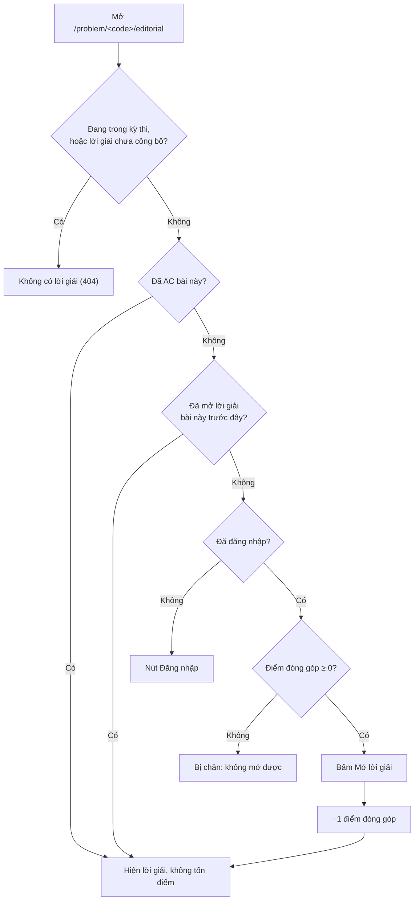

# Lời giải (editorial)

> Đọc lời giải của một bài khi bị bí (và cái giá phải trả nếu chưa giải được), hoặc viết, công bố lời giải cho bài của bạn, kể cả sinh bản nháp bằng AI với lệnh `generate_editorials`.
>
> ⏱ ~5 phút (đọc) · ~20 phút (viết) · 👤 Người giải bài, người ra đề, quản trị viên · 🔑 Đọc: tài khoản LCOJ; viết: quyền sửa bài (`judge.edit_own_problem` và là tác giả/curator của bài)

Mỗi bài tập trên LCOJ có thể có **một** lời giải (editorial): bài viết Markdown giải thích ý tưởng, cách làm, độ phức tạp và code mẫu. Trang này gồm hai phần:

- **[Đọc lời giải](#doc-loi-giai)** dành cho người giải bài: tìm lời giải ở đâu, khi nào xem được, mở lời giải tốn gì.
- **[Viết lời giải](#viet-loi-giai)** dành cho người ra đề và quản trị viên: ai được viết, viết ở đâu, các trường cần điền, mẫu trình bày và cách sinh bản nháp bằng AI.

## Trước khi bắt đầu

- [ ] **Để đọc:** bạn đã đăng nhập. Khách vẫn mở được trang lời giải nhưng nội dung bị làm mờ và không mở ra được.
- [ ] **Để đọc:** bạn đã thực sự thử giải bài. Mở lời giải của bài chưa giải được sẽ **trừ điểm đóng góp** (xem [Blog, bình luận và báo lỗi](/learn/community)).
- [ ] **Để viết:** tài khoản của bạn sửa được bài đó (xem [Quản lý bài tập](/setter/managing-problems) và [Phân quyền](/admin/permissions)).
- [ ] **Để viết:** bạn biết Markdown cơ bản. Công thức toán cùng dòng viết trong `~...~`, riêng dòng viết trong `$$...$$`.

## Đọc lời giải {#doc-loi-giai}

### Tìm lời giải ở đâu

Lời giải của bài có mã `<code>` nằm ở `/problem/<code>/editorial` (ví dụ `https://luyencode.net/problem/aplusb/editorial`). Tiêu đề trang có dạng **Hướng dẫn giải của &lt;tên bài&gt;** (*Editorial for &lt;tên bài&gt;*).

Có ba lối vào:

1. **Trang bài tập:** thanh bên phải có liên kết **Đọc lời giải** (*Read editorial*), ngay dưới **Tất cả bài nộp** / **Bài nộp tốt nhất**.
2. **Danh sách bài** (`/problems/`): cột cuối có biểu tượng quyển sách. Dấu tích xanh là bài đã có lời giải công khai, bấm vào để mở; dấu trừ xám là chưa có. Bấm tiêu đề cột để sắp theo cột này, hoặc tích ô **Có lời giải** (*Has editorial*) trong khung tìm kiếm để chỉ hiện bài có lời giải.
3. **Trang kỳ thi đã kết thúc:** bảng bài có thêm cột **Lời giải** (*Editorials*) khi ít nhất một bài công khai trong kỳ thi đã có lời giải công khai.

### Khi nào xem được lời giải

Trang lời giải chỉ mở được khi **tất cả** điều kiện sau đều đúng:

| Điều kiện | Chi tiết |
|---|---|
| Bạn xem được bài đó | Bài riêng tư hoặc bài bạn không có quyền xem thì lời giải cũng bị ẩn. |
| Lời giải đã công bố | Lời giải được bật **hiển thị công khai** và **ngày công bố** đã qua. Người có quyền `judge.see_private_solution` hoặc người sửa được bài thì xem được cả khi chưa công bố. |
| Bạn **không** đang tham gia kỳ thi nào | Khi bạn đang trong một kỳ thi (bất kỳ kỳ thi nào, không chỉ kỳ thi chứa bài này), mọi trang lời giải đều báo **Không có lời giải** (*No such editorial*) và liên kết **Đọc lời giải** biến mất. Rời kỳ thi hoặc chờ kỳ thi kết thúc để xem lại. |

::: info "Đã giải" nghĩa là gì?
Bạn được tính là **đã giải** một bài khi có ít nhất một bài nộp cho bài đó đạt kết quả `AC` (Accepted). Xem thêm ở [Nộp bài và chấm bài](/learn/submissions).
:::

### Mở lời giải

Nếu bạn **đã giải** bài, lời giải hiện ra ngay, không tốn gì.

Nếu **chưa giải**, nội dung lời giải bị làm mờ, kèm khung cảnh báo **Lời giải này đang bị ẩn cho đến khi bạn chọn mở ra.** (*This editorial is hidden until you reveal it.*). Để mở:

1. Đọc kỹ cảnh báo. Khung ghi rõ: **Mở lời giải này trước khi giải được bài sẽ làm giảm điểm đóng góp của bạn 1 điểm. Mức trừ này chỉ áp dụng một lần cho mỗi bài.**
2. Bấm nút **Mở lời giải** (*Reveal solution*).
3. Nội dung hiện ra, và điểm đóng góp của bạn bị trừ **1 điểm**.



Quy tắc cần nhớ:

- **Mỗi bài chỉ bị trừ một lần.** Mở lại lời giải của bài đã mở trước đó không bị trừ thêm.
- **Điểm trừ không được hoàn lại**, kể cả khi sau đó bạn tự giải được bài.
- **Điểm âm thì không mở được.** Nếu điểm đóng góp của bạn **dưới 0**, khung cảnh báo hiện dòng *You cannot reveal this editorial while your contribution score is negative.* (câu này hiện chưa được dịch nên vẫn là tiếng Anh) và không có nút mở. Điểm đúng bằng 0 vẫn mở được (và xuống −1 sau khi mở).
- **Khách** thấy dòng **Bạn phải đăng nhập để mở lời giải này.** kèm nút **Đăng nhập**.
- Trên luyencode.net, mức trừ là 1 điểm (giá trị mặc định của `VNOJ_CP_EDITORIAL_REVEAL`). Xem [Cấu hình site](/reference/settings).

::: warning Dùng lời giải có trách nhiệm
Khi bạn chưa giải bài, đầu trang lời giải luôn có khung đỏ: **Chỉ dùng lời giải này khi không có ý tưởng, và đừng copy-paste code từ lời giải này. Hãy tôn trọng người ra đề và người viết lời giải.** cùng dòng **Nộp một lời giải chính thức trước khi tự giải là một hành động có thể bị ban.** Hãy đọc để hiểu ý tưởng, rồi tự viết code.
:::

### Bình luận dưới lời giải

Cuối trang lời giải có khu vực bình luận riêng, tách biệt với bình luận dưới đề bài. Khu vực này được tải tự động khi bạn mở trang và tuân theo đúng các quy tắc bình luận chung (số bài đã giải tối thiểu, điểm đóng góp ≥ −20, bỏ phiếu, khoá bình luận; xem [Blog, bình luận và báo lỗi](/learn/community)).

::: danger Cẩn thận lộ ý tưởng
Bình luận hiện ra **ngay cả khi lời giải còn bị làm mờ**. Nếu chưa muốn biết ý tưởng, đừng cuộn xuống. Khi bình luận, đừng dán code lời giải hoàn chỉnh.
:::

Bình luận dưới lời giải cũng chịu cùng điều kiện truy cập như lời giải: ai không xem được lời giải (chưa công bố, đang trong kỳ thi) thì cũng không xem được bình luận.

## Viết lời giải {#viet-loi-giai}

### Ai được viết lời giải

Lời giải gắn với bài, nên ai **sửa được bài** thì viết được lời giải:

- Có quyền `judge.edit_own_problem` **và** là tác giả hoặc curator của bài; hoặc
- Có thêm `judge.edit_all_problem` (mọi bài), hay `judge.edit_public_problem` (mọi bài công khai).

Người sửa được bài luôn xem được lời giải của bài đó, kể cả khi chưa công bố. Để xem mọi lời giải chưa công bố mà không cần quyền sửa bài, cấp quyền **Xem lời giải ẩn** (`judge.see_private_solution`). Xem [Phân quyền](/admin/permissions).

### Các trường của lời giải

| Trường (vi / en) | Ý nghĩa |
|---|---|
| **Hiển thị công khai** (*public visibility*) | Bật thì lời giải được công bố khi tới ngày công bố. Tắt thì chỉ người sửa được bài và người có `see_private_solution` xem được. Mặc định: tắt. |
| **Ngày công bố** (*publish date*) | Bắt buộc. Lời giải công khai chỉ hiện với mọi người **sau** thời điểm này. Dùng để hẹn giờ công bố, ví dụ sau khi kỳ thi kết thúc. |
| **Tác giả** (*authors*) | Những người viết lời giải, hiện ở đầu trang dạng **Tác giả:** / **Các tác giả:** (*Author:* / *Authors:*). Có thể để trống. |
| **Nội dung lời giải** (*editorial content*) | Bắt buộc. Markdown, có khung xem trước. |

Nội dung hỗ trợ Markdown đầy đủ như đề bài: khối code có tô màu cú pháp, bảng, hình ảnh, công thức toán:

| Loại | Cú pháp | Ví dụ |
|---|---|---|
| Công thức cùng dòng | `~...~` | `~O(n \log n)~` |
| Công thức riêng dòng | `$$...$$` | `$$dp_i = \max_{j < i} (dp_j + a_i)$$` |

::: warning `$...$` không phải công thức
Giống đề bài, `$a + b$` sẽ hiện nguyên văn kèm dấu `$`. Luôn dùng `~a + b~` cho công thức cùng dòng.
:::

### Cách 1: Viết trên site (khuyến nghị) {#cach-1-viet-tren-site}

1. Mở trang bài, bấm **Sửa đề bài** (*Edit problem*) ở thanh bên phải (URL: `/problem/<code>/edit`).
2. Cuộn xuống cuối form, tới mục **Lời giải** (*Editorial*).
3. Điền **Nội dung lời giải**, chọn **Ngày công bố**, thêm **Tác giả** nếu cần.
4. Tích **Hiển thị công khai** nếu muốn công bố (hoặc để trống khi còn là bản nháp).
5. Bấm **Cập nhật** (*Update*). Site chuyển về trang bài.
6. Mở `/problem/<code>/editorial` để kiểm tra cách hiển thị.

::: info Ngày công bố trên site chỉ có ngày
Ô **Ngày công bố** trên site chỉ chọn được **ngày**, không có giờ; lời giải được công bố từ đầu ngày đó. Cần hẹn đúng giờ (ví dụ ngay khi kỳ thi kết thúc) thì dùng trang quản trị.
:::

Để xoá lời giải, tích ô **Xoá** (*Delete*) trong mục **Lời giải** rồi bấm **Cập nhật**.

### Cách 2: Trang quản trị Django

1. Vào `/admin/`, mở **Problems** rồi chọn bài. (Trên trang lời giải, người sửa được bài còn thấy liên kết **[Chỉnh sửa]** ở góc phải, dẫn thẳng tới trang này.)
2. Cuộn xuống mục **Lời giải** (*Solutions*) ở cuối trang. Nếu bài chưa có lời giải, bấm liên kết thêm lời giải ở cuối mục.
3. Điền các trường như trên. Ở đây **Ngày công bố** có cả ngày và giờ.
4. Bấm **Save**.

### Công bố lời giải cùng kỳ thi

Sau kỳ thi, người sửa được kỳ thi có nút **Make All Problems Public** (nút này chưa được dịch) ở mục **Danh sách bài** (*Problems*) trên trang kỳ thi. Nút này:

- Công khai mọi bài riêng tư trong kỳ thi (bạn phải sửa được các bài đó);
- Với mỗi bài bạn sửa được, bật **Hiển thị công khai** cho lời giải đang ẩn và đặt **Ngày công bố** là thời điểm hiện tại. Bài đã công khai từ trước cũng được công bố lời giải.

Xem [Quản lý bài tập](/setter/managing-problems) để biết thêm về việc công khai bài.

### Mẫu lời giải khuyên dùng {#mau-loi-giai}

Một lời giải tốt dẫn người đọc từ ý tưởng tới code, để họ có thể dừng lại ngay khi đủ gợi ý:

````markdown
## Ý tưởng

Nhận xét chính trong một hai câu, chưa lộ toàn bộ cách làm.
Ví dụ: đáp án chỉ phụ thuộc vào ~\gcd~ của cả dãy.

## Cách làm

### Subtask 1 (~n \le 1000~)

Duyệt mọi cặp ~(i, j)~, độ phức tạp ~O(n^2)~.

### Subtask 2 (không có ràng buộc thêm)

Mô tả thuật toán tối ưu, từng bước. Có công thức thì viết riêng dòng:

$$dp_i = \max_{j < i} (dp_j + a_i)$$

## Độ phức tạp

- Thời gian: ~O(n \log n)~
- Bộ nhớ: ~O(n)~

## Code mẫu

```cpp
#include <bits/stdc++.h>
using namespace std;

int main() {
    // ...
}
```
````

Gợi ý:

- Viết **ý tưởng** trước, code sau cùng: nhiều người chỉ cần gợi ý là tự giải được.
- Chia theo **subtask** nếu bài có subtask, từ cách đơn giản tới cách tối ưu.
- Nêu các **trường hợp đặc biệt** (tràn số, ~n = 1~, ...) gây nhiều lỗi `WA`.
- Code mẫu nên là code đã `AC` trên chính bài đó.

### Sinh bản nháp bằng AI (`generate_editorials`)

Lệnh quản trị `generate_editorials` gửi đề bài cùng vài bài nộp `AC` lên một API chat tương thích OpenAI và lưu lời giải tiếng Việt được sinh ra. Tham khảo đầy đủ các tuỳ chọn ở [Lệnh quản trị](/reference/management-commands#generate-editorials).

::: danger Lời giải được công bố ngay lập tức
Lệnh lưu lời giải với **Hiển thị công khai** bật sẵn và **Ngày công bố** là lúc chạy lệnh, tức là người dùng thấy ngay, **không** qua bước duyệt nào. Nội dung do AI viết có thể sai. Luôn chạy `--dry-run` trước, và sau khi sinh thật thì kiểm tra ngay từng lời giải (tắt **Hiển thị công khai** nếu cần sửa).
:::

**Yêu cầu**

- Chạy trong thư mục `dmoj/` bằng `./scripts/manage.py` (lệnh chạy trong container `site`).
- Biến môi trường `OPENAI_API_KEY` (bắt buộc) và `OPENAI_BASE_URL` (tuỳ chọn, cho endpoint tương thích OpenAI khác) phải có **trong container `site`**. Mặc định `docker-compose.yml` không nạp hai biến này. Hãy truyền cho từng lần chạy qua `COMPOSE_EXEC_FLAGS`, hoặc thêm vào `environment/site.env` rồi tạo lại container (xem [Biến môi trường](/operate/environment)).
- Model mặc định là `mimo-v2-flash`. Nếu dùng endpoint khác, đổi bằng `--model`.
- Gói `openai` và `pydantic` đã được cài sẵn trong image Docker.

**Các bước**

1. Xem trước một bài, không lưu gì:

   ```sh
   COMPOSE_EXEC_FLAGS="-e OPENAI_API_KEY=<key> -e OPENAI_BASE_URL=<url>" \
     ./scripts/manage.py generate_editorials --problem aplusb --dry-run --verbose
   ```

2. Đọc phần xem trước trong log (khoảng 500 ký tự đầu của nội dung).
3. Sinh thật cho bài đó (bỏ `--dry-run`), hoặc cho nhiều bài bằng `--limit N`.
4. Mở `/problem/<code>/editorial` để đọc lại, rồi sửa nội dung trên site hoặc trang quản trị như ở [Cách 1](#cach-1-viet-tren-site).

**Lệnh bỏ qua những bài nào**

- Bài **không công khai**.
- Bài **đã có lời giải** (lệnh không ghi đè lời giải bạn đã viết).
- Bài không có bài nộp `AC` phù hợp để làm mẫu. Lệnh lấy tối đa 3 bài nộp `AC` mới nhất, ưu tiên của những người khác nhau; code dài quá 1000 ký tự bị cắt bớt trước khi gửi đi. Hiện lệnh chỉ dùng bài nộp bằng ngôn ngữ có tên đúng là `C`; bài nộp C++, C11, ... không được dùng, dù log gọi chúng là bài nộp "C/C++".

**Kết quả trông như thế nào**

Nội dung sinh ra có các mục cố định bằng tiếng Việt: **Hiểu bài toán**, **Các cách tiếp cận** (mỗi cách một mục `### Cách <tên>` có code, độ phức tạp, giải thích), **Phân tích độ phức tạp** (bảng), **Bài học kinh nghiệm**, **Lỗi thường gặp**. Tác giả được đặt là người dùng `admin` (hoặc superuser đầu tiên), sau đó là **chủ của các bài nộp được lấy làm mẫu**.

::: tip Sau khi sinh
- Xoá hoặc chỉnh danh sách **Tác giả** nếu người có bài nộp làm mẫu không muốn đứng tên.
- Kiểm tra lại độ phức tạp và code: AI hay nhầm ở các bài cần chứng minh.
- Đưa nội dung về [mẫu khuyên dùng](#mau-loi-giai) nếu muốn thống nhất phong cách.
:::

## Sự cố thường gặp

| Triệu chứng | Cách khắc phục |
|---|---|
| Trang lời giải báo **Không có lời giải** | Bài chưa có lời giải, lời giải chưa bật **Hiển thị công khai**, chưa tới **Ngày công bố**, hoặc bạn đang tham gia một kỳ thi. Rời kỳ thi rồi thử lại. |
| Không thấy liên kết **Đọc lời giải** trên trang bài | Cùng các nguyên nhân như trên: liên kết chỉ hiện khi bạn xem được lời giải và không đang trong kỳ thi. |
| Không có nút **Mở lời giải**, chỉ có dòng tiếng Anh về *contribution score is negative* | Điểm đóng góp của bạn đang âm. Tăng điểm bằng bình luận hữu ích hoặc báo lỗi tốt (xem [Blog, bình luận và báo lỗi](/learn/community)), hoặc tự giải bài. |
| Bấm **Mở lời giải** thì hiện **Không thể mở lời giải lúc này. Vui lòng thử lại.** | Tải lại trang rồi bấm lại. Nếu lần trước đã được ghi nhận, bạn không bị trừ điểm lần hai. |
| Người ra đề bị hỏi mở lời giải của chính bài mình | Cơ chế làm mờ áp dụng cho mọi người chưa AC bài, kể cả người sửa được bài. Nộp code chuẩn để AC trước, nếu không bấm mở vẫn bị trừ điểm. |
| Lời giải hẹn giờ công bố sớm hơn dự kiến | Ô ngày trên site không có giờ. Đặt lại **Ngày công bố** kèm giờ trong trang quản trị. |
| `generate_editorials` báo `OPENAI_API_KEY environment variable not set` | Biến chưa có trong container `site`. Truyền qua `COMPOSE_EXEC_FLAGS` hoặc thêm vào `environment/site.env` rồi tạo lại container. |
| `generate_editorials` báo `Problem '<code>' not found or already has editorial` | Mã bài sai hoặc bài chưa công khai. Bài đã có lời giải thì log báo `Editorial already exists`. Xoá lời giải cũ trước nếu muốn sinh lại. |
| `generate_editorials` báo `Insufficient AC C/C++ solutions` | Bài không có bài nộp `AC` nào bằng ngôn ngữ tên `C` (xem mục bỏ qua ở trên). Nộp một lời giải chuẩn bằng C, hoặc viết lời giải thủ công. |

## Tiếp theo

- [Quản lý bài tập](/setter/managing-problems): tạo bài, viết đề, công khai bài.
- [Blog, bình luận và báo lỗi](/learn/community): điểm đóng góp được tính thế nào.
- [Lệnh quản trị](/reference/management-commands#generate-editorials): đầy đủ tuỳ chọn của `generate_editorials`.
- [Phân quyền](/admin/permissions): cấp quyền sửa bài và `see_private_solution`.
- [Cấu hình site](/reference/settings): `VNOJ_CP_EDITORIAL_REVEAL` và các thiết lập điểm đóng góp.
