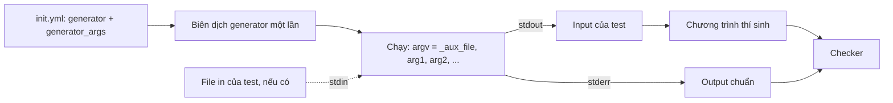

# Generator

**Generator** là chương trình tạo ra input và output chuẩn của một test ngay khi judge cần đến. Thay vì lưu các file test lớn, bạn chỉ cần lưu một chương trình nhỏ cùng các tham số của nó.

::: warning Chỉ dùng được với init.yml tự viết
Trình sửa test trên web không có lựa chọn generator. Muốn dùng generator, hãy bật **manually managed** (quản lý test thủ công) cho bài trong admin và tự viết `init.yml`, đặt mã nguồn generator trong thư mục bài (xem [Cấu trúc bài tập](/setter/problem-format)).
:::

## Judge chạy generator như thế nào



1. Judge biên dịch generator (bản đã biên dịch được lưu cache).
2. Với mỗi test cần đến, judge chạy generator **một lần** với tham số của test đó.
3. Mọi thứ generator in ra **stdout** trở thành **input** của test.
4. Mọi thứ generator in ra **stderr** trở thành **output chuẩn** của test.
5. Nếu test có file `in`, nội dung file đó được đưa vào **stdin** của generator.

Vì input và output chuẩn đến từ **cùng một lần chạy**, đáp án in ra stderr phải được tính từ đúng những giá trị đã in ra stdout.

::: warning Generator phải cho kết quả cố định
Generator được chạy lại mỗi lần chấm một bài nộp. Nếu dùng seed theo thời gian (`srand(time(0))`), mỗi bài nộp sẽ gặp bộ test khác nhau. Luôn lấy seed từ tham số.
:::

::: danger Không in thông tin debug ra stderr
stderr **chính là** output chuẩn. Bất kỳ dòng chữ thừa nào in ra đó đều khiến mọi bài nộp bị sai.
:::

Nếu generator thoát với mã khác 0, bị crash hoặc vượt giới hạn, bài nộp sẽ bị Internal Error.

## Key `generator`

Key `generator` có ba cách viết.

**1. Một file:**

```yaml
generator: gen.cpp
```

**2. Danh sách file** (file đầu tiên là file chính, các file còn lại là file phụ như header):

```yaml
generator: [gen.cpp, utils.h]
```

**3. Một object:**

```yaml
generator:
  source: gen.cpp        # hoặc danh sách: [gen.cpp, utils.h]
  language: CPP17
  flags: ['-DLOCAL_GEN']
  compiler_time_limit: 60
  time_limit: 10
  memory_limit: 262144
```

| Key | Mặc định | Ý nghĩa |
|---|---|---|
| `source` | bắt buộc | File generator, hoặc danh sách file. Tính từ thư mục bài. |
| `language` | tự nhận | Ngôn ngữ biên dịch. File `.cpp`/`.cc` dùng phiên bản C++ mới nhất có sẵn (CPP20, CPP17, ...), file `.c` dùng C11 hoặc C, các file khác nhận theo đuôi file. |
| `flags` | không có | Cờ biên dịch thêm. |
| `compiler_time_limit` | `30` | Giới hạn thời gian biên dịch, tính bằng giây. |
| `time_limit` | `20` | Giới hạn thời gian cho một lần chạy generator, tính bằng giây. |
| `memory_limit` | `524288` | Giới hạn bộ nhớ cho một lần chạy generator, tính bằng KB. |
| `args` | không có | Tham số mặc định cho các test không có `generator_args`. |

Các giá trị mặc định lấy từ cấu hình judge (`generator_compiler_time_limit`, `generator_time_limit`, `generator_memory_limit`). Chỉ generator C và C++ mới được gồm nhiều file.

## Tham số generator

Truyền tham số cho từng test bằng `generator_args`:

```yaml
generator: gen.cpp
test_cases:
- {generator_args: [false, 123, "a b"], points: 10}
- {generator_args: [true, 456], points: 20}
- {points: 30}
```

Mỗi giá trị được chuyển thành chuỗi bằng hàm `str()` của Python, nên `true` trong YAML thành `"True"` và `123` thành `"123"`. Khi đó `argv` của chương trình là:

| Test | `argv[0]` | `argv[1]` | `argv[2]` | `argv[3]` |
|---|---|---|---|---|
| 1 | `_aux_file` | `False` | `123` | `a b` |
| 2 | `_aux_file` | `True` | `456` | |
| 3 | `_aux_file` | | | |

`argv[0]` luôn là tên chương trình `_aux_file`; **tham số đầu tiên của bạn là `argv[1]`**.

## Ví dụ hoàn chỉnh

Đề bài: đọc `n` số nguyên và in ra tổng của chúng.

**init.yml:**

```yaml
generator:
  source: gen.cpp
  time_limit: 5
test_cases:
- {generator_args: [10, 100, 1], points: 20}
- {generator_args: [1000, 1000000, 2], points: 30}
- {generator_args: [200000, 1000000000, 3], points: 50}
```

Ba tham số lần lượt là `n`, giá trị lớn nhất và seed ngẫu nhiên.

**gen.cpp:**

```cpp
#include <cstdlib>
#include <iostream>
#include <random>
#include <vector>

int main(int argc, char* argv[]) {
    // argv[0] là "_aux_file"; generator_args bắt đầu từ argv[1].
    int n = std::atoi(argv[1]);
    int max_value = std::atoi(argv[2]);
    unsigned seed = std::strtoul(argv[3], nullptr, 10);

    // Seed cố định lấy từ tham số: lần nào cũng sinh ra đúng test này.
    std::mt19937 rng(seed);
    std::uniform_int_distribution<int> dist(0, max_value);

    // Sinh các giá trị một lần và giữ lại.
    std::vector<int> a(n);
    long long sum = 0;
    for (int& x : a) {
        x = dist(rng);
        sum += x;
    }

    // Input -> stdout
    std::cout << n << '\n';
    for (int i = 0; i < n; i++) {
        std::cout << a[i] << (i + 1 < n ? ' ' : '\n');
    }

    // Output chuẩn -> stderr, tính từ đúng các giá trị trên
    std::cerr << sum << '\n';
    return 0;
}
```

## Generator dùng testlib

[testlib](https://github.com/VNOI-Admin/testlib) đã được cài trên judge tại `/usr/include/testlib.h`. Hàm `registerGen` khởi tạo `rnd` của testlib từ các tham số dòng lệnh, nên kết quả luôn cố định.

```cpp
#include "testlib.h"
#include <iostream>
#include <vector>

int main(int argc, char* argv[]) {
    registerGen(argc, argv, 1);

    int n = atoi(argv[1]);
    std::vector<int> a(n);
    long long sum = 0;
    for (int& x : a) {
        x = rnd.next(1, 100);
        sum += x;
    }

    std::cout << n << '\n';
    for (int i = 0; i < n; i++) {
        std::cout << a[i] << (i + 1 < n ? ' ' : '\n');
    }
    std::cerr << sum << '\n';
}
```

```yaml
generator:
  source: gen.cpp
  compiler_time_limit: 60
test_cases:
- {generator_args: [10], points: 50}
- {generator_args: [100000], points: 50}
```

Biên dịch testlib có thể chậm, nên hãy tăng `compiler_time_limit` nếu bị quá thời gian biên dịch. Bạn cũng có thể dùng bản header riêng bằng cách liệt kê nó: `source: [gen.cpp, testlib.h]`.

## Generator riêng cho từng test

`generator` cũng có thể đặt ở từng test (hoặc từng batch), ghi đè generator ở cấp ngoài cùng:

```yaml
test_cases:
- generator: gen_small.cpp
  generator_args: [10]
  points: 30
- generator: gen_large.cpp
  generator_args: [100000]
  points: 70
```

## Kết hợp generator và file

- Nếu test có **cả** `in` và `out`, generator không chạy cho test đó.
- Nếu test chỉ có `in`, generator chạy với file đó làm stdin, còn stdout và stderr được dùng như bình thường. Cách này cho phép bạn lưu tham số của generator trong các file nhỏ thay vì `generator_args`.

```yaml
archive: data.zip
generator: gen.cpp
test_cases:
- {in: sample.in, out: sample.out, points: 0}   # file có sẵn, không dùng generator
- {generator_args: [50, 1000, 7], points: 100}   # sinh bằng generator
```

## Vì sao nên dùng generator?

- **Tiết kiệm dung lượng:** không phải lưu và đồng bộ các file test lớn tới mọi judge.
- **Dễ thay đổi:** sửa generator hoặc tham số thay vì sinh lại file.
- **Đáp án nhất quán:** output chuẩn được tính bởi chính chương trình đã tạo ra input.

Xem `generator/ds3` trong [Ví dụ bài tập](/setter/examples) để thấy một bài thật dùng generator.
