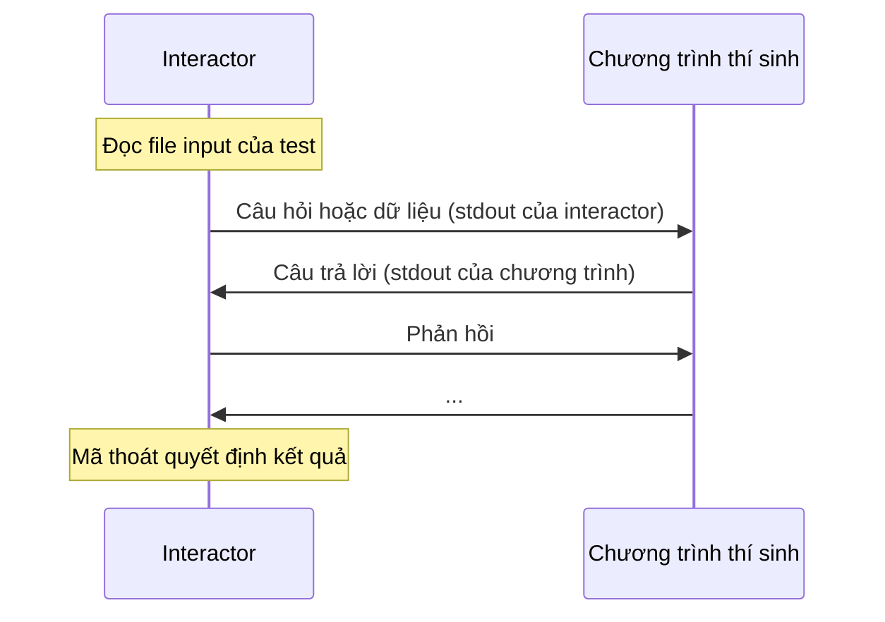

# Grader

**Grader** quyết định cách chạy chương trình của thí sinh ở mỗi test: chương trình đọc gì, trao đổi với ai và kết quả được quyết định ra sao. Hầu hết các bài dùng grader chuẩn, đưa file input vào stdin rồi chuyển stdout cho [checker](/setter/checkers). Bạn chỉ cần grader khác cho bài tương tác, bài cài đặt hàm kiểu IOI, bài chỉ nộp output, hoặc cách chấm thật sự đặc biệt.

::: tip Checker hay grader?
Nếu chỉ cần quyết định output có đúng hay không (ví dụ bài có nhiều đáp án đúng), [checker](/setter/checkers) là đủ. Chỉ dùng grader khác khi chương trình cần được chạy theo cách khác.
:::

## Các loại grader

| Grader | Key trong `init.yml` | Lựa chọn trên web | Dùng cho |
|---|---|---|---|
| Chuẩn | không có | **Standard** | Bài thông thường (stdin/stdout, hoặc file với `file_io`). |
| Tương tác native | `interactive` | **Interactive** | Bài tương tác với interactor C++. |
| Chữ ký hàm | `signature_grader` | **Function Signature Grading (IOI-style)** | Thí sinh cài đặt hàm thay vì viết `main`. |
| Chỉ nộp output | `output_only` | **Output Only** | Thí sinh nộp file output thay vì code. |
| Grader Python tùy chỉnh | `custom_judge` | không có | Interactor viết bằng Python hoặc logic chấm hoàn toàn tùy chỉnh. |
| Communication | `communication` | không có | Một chương trình quản lý (manager) trao đổi với một hoặc nhiều bản chạy của bài nộp (kiểu CMS). |

Nếu `init.yml` có nhiều key trong số này, judge dùng key đầu tiên theo thứ tự: `custom_judge`, `signature_grader`, `interactive`, `output_only`, `communication`, cuối cùng là grader chuẩn.

Các grader không có lựa chọn trên web cần `init.yml` tự viết cho bài được bật **manually managed** (quản lý test thủ công) (xem [Cấu trúc bài tập](/setter/problem-format)).

## Grader chuẩn

Grader mặc định. Với mỗi test, judge:

1. Chạy chương trình với input của test qua stdin.
2. Thu stdout (tối đa `output_limit_length`).
3. Nếu chương trình kết thúc bình thường, chạy checker trên output.

Nếu chương trình phải đọc/ghi file thay vì stdin/stdout, đặt `file_io`:

```yaml
file_io:
  input: post.inp
  output: post.out
test_cases:
- {in: post.inp, out: post.out, points: 1}
```

Trên web, đây là **IO Method: Sử dụng file** kèm hai ô **Input from file** và **Output to file**.

## Chấm tương tác native (`interactive`) {#cham-tuong-tac-native}

Chương trình của thí sinh trao đổi với một **interactor**, là chương trình do bạn viết (thường bằng C++ với testlib). Stdout của interactor được nối vào stdin của chương trình, và stdout của chương trình được nối vào stdin của interactor.



Trong `init.yml`:

```yaml
unbuffered: true
archive: seed2.zip
interactive:
  files: interactor.cpp
  type: testlib
  lang: CPP20
test_cases:
- {in: seed2.1.in, points: 50}
- {in: seed2.2.in, points: 50}
```

Trên web, chọn **Interactive** và tải lên interactor `.cpp`; LCOJ tự ghi `files`, `type: testlib` và `lang: CPP20`.

**Các key trong `interactive`:**

| Key | Mặc định | Ý nghĩa |
|---|---|---|
| `files` | bắt buộc | File mã nguồn interactor, hoặc danh sách file. Tính từ thư mục bài. |
| `type` | `default` | `default`, `testlib` hoặc `coci`: cách gọi interactor và cách đọc mã thoát. |
| `lang` | tự nhận theo đuôi file | Ngôn ngữ biên dịch interactor. |
| `flags` | không có | Cờ biên dịch thêm. |
| `compiler_time_limit` | mặc định của judge | Giới hạn thời gian biên dịch, tính bằng giây. |
| `preprocessing_time` | `2` | Số giây interactor được thêm so với giới hạn thời gian của bài. |
| `memory_limit` | `524288` | Giới hạn bộ nhớ của interactor, tính bằng KB. |
| `args_format_string` | tùy `type` | Thứ tự tham số tùy chỉnh. |
| `unbuffered` | `true` | Chạy interactor với output không buffer. |

**Tham số và kết quả của interactor:**

| `type` | Tham số | Kết quả |
|---|---|---|
| `default` | `input_file answer_file` | Mã thoát 0 = đúng, 1 = sai. |
| `testlib` | `input_file log_file answer_file` | Cùng mã thoát như [checker testlib](/setter/checkers#cac-loai-checker) (0 AC, 1 WA, 2 PE, 7 điểm thành phần). |
| `coci` | `input_file answer_file` | Giống `testlib`, dùng `partial A/B` cho điểm thành phần. |

`answer_file` chứa nội dung file `out` của test (rỗng nếu test không có).

::: warning Flush output
Key `unbuffered: true` ở cấp ngoài cùng làm output của **thí sinh** không bị buffer. Trình sửa test trên web không đặt key này, nên với bài tạo trên site, hãy ghi rõ trong đề rằng thí sinh phải flush sau mỗi dòng (`fflush(stdout)`, `cout << endl`, `sys.stdout.flush()`, ...). Interactor của bạn cũng luôn phải flush.
:::

### Ví dụ: interactor testlib

Thí sinh phải đoán một số bí mật từ 1 đến 100 trong tối đa 10 lượt. File input chứa số bí mật.

```cpp
#include "testlib.h"
#include <iostream>

int main(int argc, char* argv[]) {
    registerInteraction(argc, argv);

    int secret = inf.readInt();   // đọc từ file input
    for (int attempt = 1; attempt <= 10; attempt++) {
        int guess = ouf.readInt(1, 100);   // đọc từ thí sinh
        if (guess == secret) {
            std::cout << "Correct!" << std::endl;
            quitf(_ok, "found in %d attempts", attempt);
        }
        std::cout << (guess < secret ? "Higher" : "Lower") << std::endl;
    }
    quitf(_wa, "too many attempts");
}
```

## Chấm theo chữ ký hàm (`signature_grader`) {#cham-theo-chu-ky-ham}

Dành cho bài kiểu IOI. Thí sinh cài đặt một hoặc nhiều hàm; file **entry** của bạn chứa `main`, đọc input, gọi các hàm của thí sinh rồi in output. Output sau đó được checker chấm như bình thường.

```yaml
signature_grader:
  entry: handler.cpp
  header: header.h
test_cases:
- {in: 1.in, out: 1.out, points: 50}
- {in: 2.in, out: 2.out, points: 50}
```

**Các key:**

| Key | Ý nghĩa |
|---|---|
| `entry` | File chứa `main` (C hoặc C++). |
| `header` | Header khai báo các hàm thí sinh phải cài đặt. |
| `allow_main` | Không bắt buộc, mặc định `false`. Nếu `true`, giữ nguyên hàm `main` của thí sinh. |
| `java` | Cho bài nộp Java: `{entry: <file>}`. |

Cách hoạt động:

1. Judge thêm `#include "<header>"` vào đầu bài nộp.
2. Nếu không đặt `allow_main`, judge thêm cả `#define main main_<ngẫu_nhiên>`, để hàm `main` mà thí sinh viết để thử ở máy không bị trùng.
3. Bài nộp, header và file entry được biên dịch cùng nhau **bằng ngôn ngữ của bài nộp**, có định nghĩa `SIGNATURE_GRADER`. Vì vậy entry viết bằng C++ chỉ dùng được với bài nộp C++; hãy viết entry bằng C nếu cần hỗ trợ cả bài nộp C.

**Ngôn ngữ hỗ trợ:** C, C11, CPP03, CPP11, CPP14, CPP17, CPP20, CPPTHEMIS, CLANG, CLANGX, và Java (JAVA, JAVA8 đến JAVA17, cần key `java`).

Trên web, chọn **Function Signature Grading (IOI-style)**, tải lên file entry `.cpp` và header `.h`, và điền `{"allow_main": true}` vào **tham số grader** nếu cần.

::: info
Khi dùng `signature_grader`, `output_prefix_length` mặc định là `0`, nên thí sinh không thấy output của chương trình entry.
:::

### Ví dụ

**header.h:**

```cpp
#ifndef HEADER_H
#define HEADER_H
long long sum(int n, const int a[]);
#endif
```

**handler.cpp** (entry):

```cpp
#include "header.h"
#include <cstdio>

int a[200000];

int main() {
    int n;
    std::scanf("%d", &n);
    for (int i = 0; i < n; i++) std::scanf("%d", &a[i]);
    std::printf("%lld\n", sum(n, a));   // gọi hàm của thí sinh
    return 0;
}
```

**Bài nộp của thí sinh:**

```cpp
long long sum(int n, const int a[]) {
    long long s = 0;
    for (int i = 0; i < n; i++) s += a[i];
    return s;
}
```

## Bài chỉ nộp output (`output_only`)

Thí sinh không nộp code. Thay vào đó, họ chọn ngôn ngữ dành cho bài chỉ nộp output và tải lên một file zip chứa mỗi test một file, đặt tên đúng như file `out` của test đó. Mỗi file được checker chấm như thể chương trình đã in ra nó.

```yaml
output_only: true
test_cases:
- {in: 1.in, out: 1.out, points: 50}
- {in: 2.in, out: 2.out, points: 50}
```

Nếu zip thiếu file của test nào, test đó bị WA. Trên web, chọn **Output Only**.

## Grader Python tùy chỉnh (`custom_judge`) {#grader-python-tuy-chinh}

Grader tùy chỉnh là một file Python trong thư mục bài, định nghĩa một class tên `Grader`. Judge nạp file này cho mỗi bài nộp.

```yaml
custom_judge: grader.py
test_cases:
- {in: 1.in, points: 100}
```

### Grader tương tác bằng Python {#grader-tuong-tac-bang-python}

Loại grader tùy chỉnh dễ viết nhất: kế thừa `InteractiveGrader` và cài đặt `interact`. Judge khởi chạy chương trình và đưa cho bạn một `interactor` nối với stdin và stdout của nó.

```python
from dmoj.graders.interactive import InteractiveGrader


class Grader(InteractiveGrader):
    def interact(self, case, interactor):
        n = int(case.input_data())      # số bí mật lấy từ file input
        guesses = 0
        while True:
            guess = interactor.readint(1, 2000000000)
            guesses += 1
            if guess == n:
                interactor.writeln('OK')
                break
            interactor.writeln('FLOATS' if guess > n else 'SINKS')
        return guesses <= 31            # True = trọn điểm
```

Đặt `unbuffered: true` trong `init.yml` để thí sinh không phải tự flush.

**Các hàm của `interactor`:**

| Hàm | Ý nghĩa |
|---|---|
| `read()` | Đọc toàn bộ output còn lại. |
| `readln(strip_newline=True)` | Đọc một dòng. |
| `readtoken(delim=None)` | Đọc một token. |
| `readint(lo=-inf, hi=inf, delim=None)` | Đọc một số nguyên; nếu không phải số nguyên hoặc nằm ngoài `[lo, hi]`, test bị WA. |
| `readfloat(lo=-inf, hi=inf, delim=None)` | Tương tự với số thực. |
| `write(val)` | Gửi `str(val)` cho chương trình (flush ngay). |
| `writeln(val)` | Gửi `str(val)` kèm xuống dòng. |
| `close()` | Đóng stdin của chương trình. |

Các hàm `read*` trả về `bytes`. `interact` trả về boolean hoặc `CheckerResult` (xem [Checker](/setter/checkers#checker-viet-bang-python)). Nếu chương trình đóng output sớm, việc đọc dừng lại và test bị WA.

### Grader tùy chỉnh hoàn toàn

Với các trường hợp khác, kế thừa `StandardGrader` và ghi đè `grade(self, case)`, hàm này phải trả về một `Result`. Các thuộc tính hữu ích:

| Tên | Ý nghĩa |
|---|---|
| `case.position` | Vị trí của test, bắt đầu từ 0. |
| `case.points` | Điểm của test. |
| `case.input_data()` | Nội dung file input (bytes). |
| `case.output_data()` | Nội dung output chuẩn (bytes). |
| `self.binary` | Bài nộp đã biên dịch; `self.binary.launch(...)` để chạy. |
| `self.problem.time_limit`, `self.problem.memory_limit` | Giới hạn của bài. |
| `self.source` | Mã nguồn bài nộp (bytes). |

Ví dụ: chương trình phải in lại đúng dòng nó nhận được.

```python
import subprocess

from dmoj.graders.standard import StandardGrader
from dmoj.result import Result


class Grader(StandardGrader):
    def grade(self, case):
        result = Result(case)
        case_input = b'Hello, World!\n'

        # Chạy chương trình
        self._current_proc = self.binary.launch(
            time=self.problem.time_limit,
            memory=self.problem.memory_limit,
            stdin=subprocess.PIPE,
            stdout=subprocess.PIPE,
            stderr=subprocess.PIPE,
        )
        output, error = self._current_proc.communicate(case_input)
        self.binary.populate_result(error, result, self._current_proc)

        # Chấm output
        if output == case_input:
            if result.result_flag == Result.AC:
                result.points = case.points
        else:
            result.result_flag |= Result.WA
            result.feedback = 'Wrong!'

        return result
```

Các trường của `Result` có thể đặt: `result_flag` (`Result.AC`, `Result.WA`, `Result.TLE`, ...), `points`, `feedback`, `extended_feedback` và `proc_output`.

Bạn cũng có thể chỉ ghi đè những phần nhỏ hơn, như `check_result(self, case, result)`. Ví dụ `grader/shortest1` trong [Ví dụ bài tập](/setter/examples) làm như vậy.

## Bài dạng communication (`communication`)

Chương trình **manager** do bạn viết đọc input của test qua stdin và trao đổi với một hoặc nhiều bản chạy của chương trình thí sinh qua các named pipe (FIFO). Với mỗi bản chạy, manager nhận hai đường dẫn làm tham số: pipe từ bản chạy đó gửi tới và pipe gửi tới bản chạy đó.

```yaml
communication:
  manager:
    files: manager.cpp
  num_processes: 2
  type: cms
test_cases:
- {in: 1.in, points: 100}
```

| Key | Mặc định | Ý nghĩa |
|---|---|---|
| `manager.files` | bắt buộc | File mã nguồn manager hoặc danh sách file. |
| `manager.lang`, `manager.flags`, `manager.compiler_time_limit`, `manager.memory_limit` | | Giống như với interactor. |
| `num_processes` | `1` | Số bản chạy của bài nộp. |
| `type` | `default` | Cách đọc kết quả của manager, giống [các loại checker](/setter/checkers#cac-loai-checker). |
| `signature` | không có | Không bắt buộc: `{entry, header, allow_main}` như `signature_grader`, để biên dịch bài nộp cùng một stub. |

Tổng thời gian chạy của mọi bản chạy phải nằm trong giới hạn thời gian.
