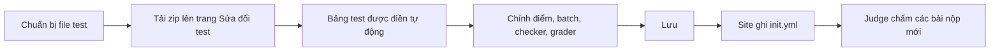

# Quản lý bài tập

> Tạo một bài tập, viết đề bằng Markdown, tải test data lên, chọn checker/grader rồi nộp thử để kiểm tra bài.
>
> ⏱ ~30 phút · 👤 Người ra đề · 🔑 `judge.add_problem` (tạo), `judge.edit_own_problem` (sửa)

LCOJ cho phép tạo bài tập, viết đề và tải test data lên ngay trên giao diện web. Trang này hướng dẫn toàn bộ quy trình, từ một bài tập trống đến khi bài sẵn sàng cho mọi người giải trên luyencode.net.

::: tip Ai được làm việc này?
- Tạo bài cần quyền `judge.add_problem`.
- Sửa bài cần quyền `judge.edit_own_problem` **và** phải là tác giả (author) hoặc người phụ trách (curator) của bài (hoặc có quyền `judge.edit_all_problem`).
- Chấm lại cần quyền `judge.rejudge_submission`; chấm lại hàng loạt cần thêm `judge.rejudge_submission_lot`.

Xem [Phân quyền](/admin/permissions) để biết cách cấp các quyền này.
:::

## Trước khi bắt đầu

- [ ] Tài khoản của bạn có các quyền nêu ở trên (hỏi quản trị viên nếu chưa có).
- [ ] Đã có đề bài, lời giải chuẩn và bộ test (các cặp file input/output).
- [ ] Đã chọn một **mã bài** (ví dụ `aplusb`): chữ thường, chữ số, dấu gạch dưới.

Quy trình tổng quát:


## Dữ liệu bài tập được lưu ở đâu

Mỗi bài có một thư mục riêng, đặt tên theo mã bài. Thư mục này chứa `init.yml` (cấu hình cho judge), file zip test data và các file phụ trợ (checker, interactor, header, ...).

### Với Docker (khuyến nghị)

Dữ liệu bài tập nằm trong `dmoj/problems/` và được mount vào container thành `/problems/`. Cấu hình mặc định đã đặt sẵn:

```python
DMOJ_PROBLEM_DATA_ROOT = '/problems/'
```

Không cần cấu hình thêm.

### Với bare metal

Trong `local_settings.py`, trỏ `DMOJ_PROBLEM_DATA_ROOT` tới thư mục mà các judge cũng đọc được:

```python
DMOJ_PROBLEM_DATA_ROOT = '/home/lcoj/problems/'
```

::: warning
Judge phải thấy đúng các file mà site thấy. Nếu judge không đọc được `<mã_bài>/init.yml` thì bài nộp cho bài đó sẽ không chấm được. Xem [Cài đặt judge](/operate/judge-setup).
:::

## Tạo bài tập

Có ba cách tạo bài.

### Cách 1: Tạo trên site (khuyến nghị)

1. Mở **Danh sách bài** và bấm tab **Tạo bài mới** (URL: `/problems/create`).
2. Điền form (xem [Các thông số của bài](#cac-thong-so-cua-bai) bên dưới). Ô đề bài đã được điền sẵn đề mẫu lấy từ cấu hình site.
3. Bấm **Tạo**. Bạn được thêm vào làm **curator** của bài, và mọi ngôn ngữ được đánh dấu "include in problem" sẽ tự động được cho phép.
4. Site chuyển sang trang bài tập. Thanh bên phải lúc này có **Sửa đề bài**, **Delete problem** (xóa bài) và **Sửa đổi test**.

::: info
Bài mới tạo ở chế độ riêng tư (chưa công khai) cho tới khi quản trị viên bật công khai, nên bạn có thể chuẩn bị xong xuôi trước khi ai đó nhìn thấy.
:::

### Cách 2: Django admin

1. Vào `/admin/` và mở **Problems**.
2. Bấm **Add problem**.
3. Điền các trường. Form admin có thêm vài trường so với form trên site: **creators** (tác giả), **curators**, **publicly visible**, **manually managed**, **allowed languages**, **banned users**, ...
4. Bấm **Save**, rồi **View on site**.

::: warning
Trong admin, nhớ thêm chính mình vào **creators** hoặc **curators**. Nếu không, bạn sẽ không sửa được bài sau này (trừ khi có quyền `judge.edit_all_problem`).
:::

### Cách 3: Nhập gói Codeforces Polygon

Nếu bài đã có trên [Polygon](https://polygon.codeforces.com/), bạn có thể nhập vào:

1. Ở trang `/problems/create`, bấm **Import problem from Codeforces Polygon package** (URL: `/problems/import-polygon`). Cần quyền `judge.import_polygon_package`.
2. Nhập mã bài mới và tải lên file zip **full package** (bản Linux) tải từ Polygon.
3. Chọn các tùy chọn như **Ignore zero-point batches**, **Ignore zero-point cases**, **Append main solution to tutorial**, và ghép ngôn ngữ đề trên Polygon với ngôn ngữ của site.
4. Gửi form. Bộ nhập sẽ tạo bài, đề, test data và checker (checker C++ viết bằng testlib, hoặc interactor C++ với bài tương tác).

Để cập nhật một bài đã có từ gói Polygon mới hơn, dùng `/problem/<mã_bài>/update-polygon`.

::: info
Bộ nhập chuyển đề LaTeX sang Markdown bằng `pandoc`, nên máy chủ phải cài `pandoc` (phiên bản 3.0.0 trở lên).
:::

## Các thông số của bài {#cac-thong-so-cua-bai}

| Trường | Ý nghĩa |
|---|---|
| **Mã bài** | ID duy nhất, dùng trong URL `/problem/<mã>`. Chỉ gồm chữ thường, chữ số và dấu gạch dưới (`^[a-z0-9_]+$`), tối đa 32 ký tự. Ví dụ: `aplusb`. |
| **Tên bài** | Tiêu đề hiển thị trong danh sách bài, ví dụ "Tổng hai số". |
| **Giới hạn thời gian** | Tính bằng **giây**, cho phép số lẻ như `1.5`. Nếu không có quyền `judge.high_problem_timelimit` thì không đặt được quá 5 giây. |
| **Giới hạn bộ nhớ** | Tính bằng **kilobyte**. Mặc định cho bài mới là `262144` (256 MB). |
| **Điểm** | Số điểm khi giải trọn vẹn bài. |
| **Cho phép điểm thành phần** | Nếu bật, bài nộp được điểm theo tỉ lệ test vượt qua (xem [Cách tính điểm](#cach-tinh-diem)). Form tạo bài bật sẵn tùy chọn này. |
| **Dạng bài** / **Nhóm bài** | Dùng để phân loại và lọc trong danh sách bài. |
| **File đề** | Đề dạng PDF (tùy chọn, cần quyền `judge.upload_file_statement`). |
| **Nguồn** | Nguồn gốc của bài; hãy ghi rõ nguồn gốc. |
| **Tester** | Những người được xem bài khi bài còn riêng tư nhưng không được sửa. |
| **Bài toán** | Đề bài dạng Markdown (xem bên dưới). |

## Viết đề bài

Đề bài viết bằng Markdown, có thêm một số tính năng mở rộng:

- Công thức toán, hiển thị bằng MathJax
- Khối code có tô màu cú pháp
- Bảng, hình ảnh và ~~gạch ngang~~

Trình soạn thảo có xem trước trực tiếp, hãy kiểm tra đề hiển thị đúng trước khi lưu.

### Cú pháp công thức toán

| Mục đích | Cú pháp | Ví dụ |
|---|---|---|
| Công thức cùng dòng | `~...~` | `~1 \le n \le 10^5~` |
| Công thức riêng dòng | `$$...$$` | `$$\sum_{i=1}^{n} a_i$$` |

::: warning Không dùng một dấu đô la
`$a + b$` **không** phải là công thức trên LCOJ; nó sẽ hiện nguyên văn kèm dấu `$`. Luôn dùng `~a + b~` cho công thức cùng dòng.
:::

### Mẫu đề bài hoàn chỉnh

Chép mẫu này vào ô **Bài toán** rồi thay nội dung. Không cần ghi giới hạn thời gian và bộ nhớ trong đề; chúng đã được hiển thị tự động ở thanh bên của trang bài.

````markdown
Cho hai số nguyên ~a~ và ~b~. Hãy tính tổng của chúng.

## Dữ liệu vào

Một dòng duy nhất chứa hai số nguyên ~a~ và ~b~ (~-10^9 \le a, b \le 10^9~).

## Kết quả

In ra một số nguyên duy nhất là giá trị ~a + b~.

## Chấm điểm

- Subtask 1 (~30\%~ số điểm): ~0 \le a, b \le 100~.
- Subtask 2 (~70\%~ số điểm): không có ràng buộc gì thêm.

## Ví dụ

### Dữ liệu vào

```
3 5
```

### Kết quả

```
8
```

### Giải thích

Ta có ~3 + 5 = 8~. Tổng quát, đáp án là

$$
S = a + b.
$$
````

## Quản lý test data

Test data được quản lý trong trình sửa test trên web tại `/problem/<mã_bài>/test_data` (liên kết **Sửa đổi test** trên trang bài). Khi bạn lưu, site tự động sinh file `init.yml` cho judge.



### Bước 1: Chuẩn bị file zip

Đưa toàn bộ file input và output vào một file zip. Trình sửa test tự nhận ra các kiểu đặt tên sau:

| Kiểu | File input | File output |
|---|---|---|
| Thông dụng / Themis | `aplusb.1.in`, `1.inp` | `aplusb.1.out`, `1.ok`, `1.ans` |
| CMS | `input.1` | `output.1` |
| Polygon | `01` | `01.a` |

Ví dụ với bài `aplusb`:

```
aplusb.1.in
aplusb.1.out
aplusb.2.in
aplusb.2.out
aplusb.3.in
aplusb.3.out
```

::: tip
- Dùng một kiểu đặt tên cho cả file zip. Input và output được sắp xếp tự nhiên (1, 2, 10) rồi ghép cặp theo thứ tự.
- Mỗi file zip tối đa 100 MB.
- Nếu không có quyền `judge.create_mass_testcases`, mỗi bài có tối đa 100 test (trình sửa sẽ cảnh báo khi vượt 50).
:::

### Bước 2: Tải file zip lên

1. Trên trang bài, bấm **Sửa đổi test**.
2. Ở ô **Tập tin dữ liệu nén dạng zip**, chọn file zip. Nếu chỉ có các file rời, bấm **or click here to build zip file** để chọn nhiều file hoặc cả thư mục; trình duyệt sẽ tự nén giúp bạn.
3. Bảng test được điền tự động. Một thông báo màu vàng (**Các test đã được điền tự động!**) nhắc rằng bảng **chưa được lưu**.

### Bước 3: Kiểm tra bảng test

Mỗi dòng là một mục:

| Cột | Ý nghĩa |
|---|---|
| **Kiểu** | **Test đơn**, **Bắt đầu nhóm test** hoặc **Hết nhóm test**. |
| **Tập tin đầu vào** / **Tập tin đầu ra** | Tên file trong zip. Tên không có trong zip sẽ được tô nổi bật. |
| **Điểm** | Điểm của test đơn, hoặc điểm của cả batch ở dòng **Bắt đầu nhóm test**. |
| **Pretest?** | Chỉ staff mới thấy. Đánh dấu test là pretest. |
| **Xoá?** | Xóa dòng khi lưu. |

Để tạo một subtask (batch):

1. Thêm dòng **Bắt đầu nhóm test** và đặt điểm cho cả subtask.
2. Thêm các dòng **Test đơn** của subtask ngay bên dưới (để trống điểm).
3. Thêm dòng **Hết nhóm test**.

```
Bắt đầu nhóm test   (30 điểm)
  Test đơn          aplusb.1.in / aplusb.1.out
  Test đơn          aplusb.2.in / aplusb.2.out
Hết nhóm test
Bắt đầu nhóm test   (70 điểm)
  Test đơn          aplusb.3.in / aplusb.3.out
  ...
Hết nhóm test
```

Một batch chỉ cho điểm khi **tất cả** test trong batch đều đúng.

### Bước 4: Chọn checker {#buoc-4-chon-checker}

Danh sách **Trình chấm** (checker) gồm:

| Lựa chọn | Tên trong init.yml | Khi nào dùng |
|---|---|---|
| Mặc định (Standard) | `standard` | Mặc định. So sánh từng token, bỏ qua khoảng trắng. |
| Số thực (Floats) | `floats` | Output số thực, cho phép sai số. Đặt **precision** (số chữ số thập phân) ở ô bên cạnh. |
| Số thực (tuyệt đối) | `floatsabs` | Output số thực, chỉ xét sai số tuyệt đối. |
| Số thực (tương đối) | `floatsrel` | Output số thực, chỉ xét sai số tương đối. |
| So sánh byte | `identical` | Output phải giống từng byte. |
| Dòng với dòng | `linecount` | So sánh theo từng dòng. |
| Trình chấm ngoài | `bridged` | Chương trình checker của bạn (`.cpp`, `.pas` hoặc `.java`), tải lên ở ô **File trình chấm ngoài**. Chọn loại: Testlib, Themis, CMS, COCI, PEG hoặc DMOJ. |

Với checker testlib, bạn có thể tick thêm **Treat checker points as percentage**. Xem [Checker](/setter/checkers) để biết từng checker hoạt động thế nào và cách tự viết checker.

### Bước 5: Chọn grader

| Lựa chọn | Tác dụng |
|---|---|
| **Standard** | Chương trình đọc từ stdin và ghi ra stdout. Đặt **IO Method** là **Sử dụng file** nếu chương trình phải đọc/ghi file có tên cụ thể (ví dụ `post.inp` / `post.out`). |
| **Interactive** | Tải lên interactor C++ viết bằng testlib. |
| **Function Signature Grading (IOI-style)** | Tải lên file entry `.cpp` và file header `.h`. Trong **tham số grader**, `{"allow_main": true}` cho phép thí sinh tự viết hàm `main`. |
| **Output Only** | Thí sinh nộp file output thay vì mã nguồn. |

Xem [Grader](/setter/graders) để biết chi tiết.

### Bước 6: Lưu và kiểm tra init.yml được sinh ra

1. Bấm **Lưu**.
2. Nếu có lỗi (thiếu file, batch chưa có điểm, ...), thông báo lỗi hiện ở đầu trang và `init.yml` **không** được ghi.
3. Nếu mọi thứ ổn, liên kết **Xem YAML** xuất hiện cạnh tiêu đề (URL: `/problem/<mã_bài>/test_data/init`).

Một file `init.yml` được sinh ra điển hình:

```yaml
archive: aplusb.zip
checker: standard
test_cases:
- in: aplusb.1.in
  out: aplusb.1.out
  points: 30
- batched:
  - in: aplusb.2.in
    out: aplusb.2.out
  - in: aplusb.3.in
    out: aplusb.3.out
  points: 70
```

Định dạng file được mô tả trong [Cấu trúc bài tập](/setter/problem-format).

### Những gì trình sửa test trên web không làm được

Một số tính năng judge hỗ trợ nhưng trình sửa test không có form:

- [Generator](/setter/generators)
- Checker viết bằng Python (`checker.py`)
- Grader Python tùy chỉnh (`custom_judge`) và bài dạng communication
- Tự nhận test bằng regex

Với các trường hợp này, hãy tự viết `init.yml`:

1. Trong admin, bật **manually managed** (quản lý test thủ công) cho bài. Liên kết **Sửa đổi test** sẽ biến mất, nên site không bao giờ ghi đè file của bạn.
2. Đặt `init.yml` và mọi file mà nó tham chiếu vào thư mục bài, ví dụ `dmoj/problems/<mã_bài>/` khi dùng Docker.

## Cách tính điểm {#cach-tinh-diem}

1. Mỗi test (hoặc batch) được điểm nếu đúng. Một batch nhận điểm **nhỏ nhất** trong các test của nó, nên chỉ cần sai một test là batch được 0 điểm.
2. Điểm của bài nộp:

```
Điểm = (điểm test đạt được / tổng điểm các test) × điểm của bài
```

3. Nếu tắt **Cho phép điểm thành phần**, mọi kết quả chưa trọn điểm đều tính là 0, và judge dừng chấm ngay ở test sai đầu tiên.

**Ví dụ:** bài có 100 điểm và ba test lần lượt 1, 2, 7 điểm. Thí sinh đúng test 1 và 2, sai test 3:

```
Điểm = (1 + 2) / (1 + 2 + 7) × 100 = 30
```

## Kiểm tra kết quả: nộp thử

1. Quay lại trang bài và bấm **Gửi bài giải**.
2. Nộp một lời giải đúng và đảm bảo nó AC ở mọi test.
3. Nộp thêm vài lời giải sai hoặc chậm để chắc chắn bộ test bắt được chúng.

## Chấm lại và tính lại điểm

Sau khi sửa test data, hãy chấm lại các bài nộp cũ:

1. Trên trang bài, bấm **Quản lí submissions** (URL: `/problem/<mã_bài>/manage/submission`). Liên kết này chỉ hiện với staff có quyền chấm lại bài.
2. Ở mục **Chấm lại bài nộp**, có thể lọc theo khoảng ID (**Lọc bởi ID:**), ngôn ngữ hoặc kết quả.
3. Bấm **Chấm lại các bài nộp đã chọn** và xác nhận số lượng bài nộp.

Nút **Tính lại điểm của mọi bài nộp** trên cùng trang tính lại điểm từ kết quả đã có mà không chạy lại code (hữu ích khi đổi điểm của bài).

## Mẹo

- **Đặt tên test rõ ràng** để dễ tìm và debug.
- **Bao quát trường hợp biên**: giá trị nhỏ nhất, lớn nhất, cấu trúc đặc biệt.
- **Kiểm tra lại output chuẩn** bằng một lời giải thứ hai độc lập.
- **Thử nhiều ngôn ngữ** (C++, Python, Java) để chắc chắn giới hạn thời gian hợp lý.

## Sự cố thường gặp

| Triệu chứng | Cách khắc phục |
|---|---|
| Trình sửa test báo lỗi sau khi lưu | Đọc thông báo ở đầu trang; nó nêu rõ test nào và file nào bị thiếu. Đảm bảo mọi dòng **Bắt đầu nhóm test** đều có điểm và mỗi batch có ít nhất một test. |
| Bài nộp bị Internal Error (IE) | Kiểm tra `init.yml` đã tồn tại (**Xem YAML**). Kiểm tra quyền truy cập thư mục bài (`DMOJ_PROBLEM_DATA_ROOT`). Với custom checker và interactor, kiểm tra file biên dịch được. |
| Chấm lại không chạy | Chạy trong thư mục `dmoj/`: `docker compose ps celery`, rồi `docker compose logs -f celery`. |

## Tiếp theo

- [Cấu trúc bài tập](/setter/problem-format): ý nghĩa từng trường trong `init.yml`.
- [Checker](/setter/checkers): chọn hoặc tự viết trình chấm output.
- [Giải bài đầu tiên](/tutorials/first-problem): trải nghiệm bài của bạn từ góc nhìn người giải.
