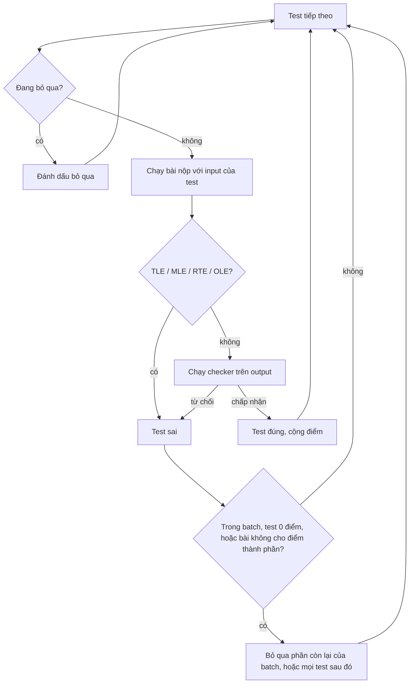

# Cấu trúc bài tập

Trang này mô tả `init.yml`, file cho judge biết cách chấm một bài.

::: tip Có cần tự viết file này không?
Thường là không. Khi bạn lưu test data trong trình sửa test trên web, LCOJ tự sinh `init.yml` (xem [Quản lý bài tập](/setter/managing-problems)). Bạn chỉ cần tự viết khi dùng tính năng mà trình sửa test không hỗ trợ, như [generator](/setter/generators) hay checker viết bằng Python. Khi đó, hãy bật **manually managed** (quản lý test thủ công) cho bài trong admin để site không ghi đè file của bạn.
:::

## Thư mục bài tập

Mỗi bài có một thư mục riêng trong thư mục dữ liệu bài tập (`dmoj/problems/` khi dùng Docker). Tên thư mục chính là mã bài:

```
dmoj/problems/
└── aplusb/
    ├── init.yml        # bắt buộc
    ├── aplusb.zip      # test data (không bắt buộc nhưng nên dùng)
    └── checker.py      # các file phụ trợ, nếu có
```

## File `init.yml`

`init.yml` là một YAML object. Key luôn cần có là `test_cases` (trừ khi test được nhận tự động, xem [bên dưới](#cach-2-tu-nhan-test-bang-regex)). Hầu hết các bài còn đặt `archive`, tên file zip chứa test data.

Ví dụ tối thiểu:

```yaml
archive: aplusb.zip
test_cases:
- {in: aplusb.1.in, out: aplusb.1.out, points: 5}
- {in: aplusb.2.in, out: aplusb.2.out, points: 20}
- {in: aplusb.3.in, out: aplusb.3.out, points: 75}
```

### Judge tìm file theo đường dẫn như thế nào

Mọi tên file trong `init.yml` đều được tìm theo cùng một cách:

1. Judge tìm file trực tiếp trong thư mục bài trước (`<mã_bài>/<tên>`).
2. Nếu không thấy và có đặt `archive`, judge tìm mục có **đúng đường dẫn đó bên trong file zip**. Ví dụ, `in: tests/1.in` là mục `tests/1.in` trong zip, không phải một thư mục nằm cạnh file zip.

Bản thân `archive` luôn tính tương đối với thư mục bài.

::: warning Chương trình phụ trợ không được đọc từ zip
Checker, generator, interactor và custom grader (`checker.py`, `gen.cpp`, `interactor.cpp`, ...) chỉ được nạp từ thư mục bài. Hãy đặt chúng cạnh `init.yml`, không để trong zip.
:::

## `test_cases`

Có hai cách chỉ định test: liệt kê từng test, hoặc để judge tự nhận bằng regex.

### Cách 1: Danh sách test

`test_cases` là một danh sách. Mỗi phần tử là một test thường hoặc một batch.

#### Test thường

Một test thường có các key:

| Key | Ý nghĩa |
|---|---|
| `in` | File input. |
| `out` | File output chuẩn. |
| `points` | Điểm của test. |

```yaml
test_cases:
- {in: aplusb.1.in, out: aplusb.1.out, points: 50}
- {in: aplusb.2.in, out: aplusb.2.out, points: 50}
```

#### Batched test cases

Một batch (subtask) gom nhiều test lại. Batch có:

| Key | Ý nghĩa |
|---|---|
| `points` | Điểm của cả batch. |
| `batched` | Danh sách test trong batch. Mỗi test có `in` và `out` (không có `points`). |
| `dependencies` | Không bắt buộc. Danh sách số thứ tự (bắt đầu từ 1) của các batch phía trước phải đúng thì batch này mới chạy. |

Một batch chỉ được điểm khi **tất cả** test trong batch đều đúng. Ngay khi một test trong batch sai, các test còn lại của batch bị bỏ qua.

Batch được đánh số 1, 2, 3, ... theo thứ tự xuất hiện; test thường (không thuộc batch) không được tính. Batch không lồng nhau được, và một batch chỉ phụ thuộc được vào các batch đứng trước nó.

```yaml
archive: tle16p4.zip
test_cases:
- {points: 0, in: tle16p4.p0.in, out: tle16p4.p0.out}
- {points: 10, in: tle16p4.p1.in, out: tle16p4.p1.out}
- points: 10          # batch 1
  batched:
  - {in: tle16p4.0.in, out: tle16p4.0.out}
  - {in: tle16p4.1.in, out: tle16p4.1.out}
- points: 10          # batch 2
  batched:
  - {in: tle16p4.2.in, out: tle16p4.2.out}
  - {in: tle16p4.3.in, out: tle16p4.3.out}
- points: 10          # batch 3
  batched:
  - {in: tle16p4.4.in, out: tle16p4.4.out}
  - {in: tle16p4.5.in, out: tle16p4.5.out}
  dependencies: [1, 2]
```

Batch 3 chỉ chạy khi batch 1 và 2 đều đúng; nếu không, các test của nó bị đánh dấu là bỏ qua.

#### Test 0 điểm

Nếu một test (hoặc batch) có `points: 0` bị sai, **mọi test phía sau đều bị bỏ qua**. Vì vậy test 0 điểm rất hợp để làm test ví dụ hoặc test kiểm tra nhanh, nhưng phải đặt đúng thứ tự.

**Sai:**

```yaml
test_cases:
- {in: case1.1.in, out: case1.1.out, points: 100}
- {in: case1.0.in, out: case1.0.out, points: 0}
```

`case1.1` chạy trước `case1.0`. Nếu chỉ `case1.0` sai, kết quả là `100/100` nhưng với trạng thái WA.

**Đúng:**

```yaml
test_cases:
- {in: case1.0.in, out: case1.0.out, points: 0}
- {in: case1.1.in, out: case1.1.out, points: 100}
```

#### Judge duyệt qua các test như thế nào



Khi bài tắt **Cho phép điểm thành phần**, site yêu cầu judge dừng ở test sai đầu tiên.

### Cách 2: Tự nhận test bằng regex {#cach-2-tu-nhan-test-bang-regex}

Nếu có đặt `archive` và các file được đặt tên theo một quy tắc thống nhất, bạn có thể để judge tự tìm test trong zip. Cách này chỉ dùng được khi có `archive`.

Regex mặc định (so khớp không phân biệt hoa thường với từng tên file trong zip):

- Input: `^(?=.*?\.in|in).*?(?:(?:^|\W)(?P<batch>\d+)[^\d\s]+)?(?P<case>\d+)[^\d\s]*$`
- Output: `^(?=.*?\.out|out).*?(?:(?:^|\W)(?P<batch>\d+)[^\d\s]+)?(?P<case>\d+)[^\d\s]*$`

Nói cách khác: tên file phải chứa `.in` (hoặc `.out`), số **cuối cùng** là số thứ tự test, và một số đứng trước nó (ngăn cách bằng ký tự không phải chữ số) nếu có là số batch.

| Tên file | Batch | Test |
|---|---|---|
| `test.1.in` | không có | 1 |
| `test-1.in` | không có | 1 |
| `test-case-1.in` | không có | 1 |
| `test-1-2.in` | 1 | 2 |
| `test-batch-1-case-2.in` | 1 | 2 |
| `1.2.in` | 1 | 2 |

Các file cùng số batch tạo thành một batch. Test không có batch dùng số thứ tự test làm vị trí, nên các file:

```
1.in
2.1.in
2.2.in
3.in
```

được chấm theo thứ tự: test 1, batch 2 (test 2.1 và 2.2), test 3.

#### Tùy chỉnh cách nhận test

Có thể đặt các key sau bên trong `test_cases`:

| Key | Ý nghĩa |
|---|---|
| `input_format` | Regex Python cho file input. Phải có nhóm tên `case`, và có thể có `batch`. |
| `output_format` | Regex Python cho file output, cùng quy tắc. |
| `case_points` | Một **danh sách** điểm, mỗi phần tử cho một test hoặc batch, theo thứ tự. |

Nếu không đặt `case_points`, mỗi test hoặc batch có số điểm bằng giá trị `points` ở cấp ngoài cùng (mặc định `1`).

```yaml
archive: data.zip
points: 10
test_cases:
  input_format: '^test-(?P<case>\d+)\.in$'
  output_format: '^test-(?P<case>\d+)\.out$'
```

Dùng `case_points`:

```yaml
archive: data.zip
test_cases:
  input_format: '^test-(?P<case>\d+)\.in$'
  output_format: '^test-(?P<case>\d+)\.out$'
  case_points: [20, 30, 50]
```

Muốn dùng regex mặc định và điểm mặc định, chỉ cần bỏ hẳn `test_cases` và giữ lại `archive`.

## Pretest

`pretest_test_cases` có cùng định dạng với danh sách `test_cases`. Pretest luôn chạy trước và được tính như test 0 điểm, nên sai một pretest sẽ dừng phần chấm còn lại. Trong kỳ thi chỉ chấm pretest, chỉ những test này được chạy. Trình sửa test trên web ghi key này khi bạn tick **Pretest?** ở một test.

## Key được kế thừa

Key đặt ở cấp ngoài cùng (hoặc ở một batch) áp dụng cho mọi test bên dưới, trừ khi test đó tự đặt giá trị riêng. Ví dụ, file sau cho mọi test 5 điểm và cùng một file output chuẩn:

```yaml
points: 5
out: correct.txt
test_cases:
- {in: 1.txt}
- {in: 2.txt}
```

Một số [ví dụ bài tập](/setter/examples) được viết theo cách này.

## Các key khác

| Key | Mặc định | Ý nghĩa |
|---|---|---|
| `checker` | `standard` | Checker dùng để so output. Có thể đặt riêng cho từng test. Xem [Checker](/setter/checkers). |
| `points` | `1` | Điểm mặc định cho các test không tự đặt điểm. |
| `output_limit_length` | `25165824` | Kích thước output tối đa, tính bằng byte (24 MiB). Vượt quá sẽ bị OLE. |
| `output_prefix_length` | `128` (`0` khi dùng `signature_grader`) | Số byte đầu của output thí sinh được lưu lại và hiển thị trong kết quả chấm. |
| `binary_data` | `false` | Nếu `true`, input và output chuẩn được dùng nguyên trạng, không chuẩn hóa ký tự xuống dòng. |
| `wall_time_factor` | `3` | Giới hạn thời gian thực (wall-clock), tính theo bội số của giới hạn thời gian. |
| `file_io` | không có | `{input: <tên>, output: <tên>}`: chương trình đọc/ghi các file này thay cho stdin và stdout. |
| `unbuffered` | `false` | Chạy chương trình với output không buffer. Cần cho bài tương tác. |
| `hints` | không có | Gợi ý cho trình chạy do trình sửa test ghi vào, như `unicode` và `nobigmath`. |
| `test_size_limit` | theo cấu hình judge | Kích thước tối đa của một file đọc từ zip, tính bằng KB. |
| `symlinks` | không có | Danh sách liên kết cần tạo trong thư mục làm việc của chương trình. |
| `generator` | không có | Sinh test bằng chương trình. Xem [Generator](/setter/generators). |
| `custom_judge`, `interactive`, `signature_grader`, `output_only`, `communication` | không có | Chọn grader khác grader chuẩn. Xem [Grader](/setter/graders). |

::: info
Tất cả các key trên đều do judge đọc ([judge-server](https://github.com/luyencode/judge-server), bản fork từ judge của DMOJ/VNOJ). Nếu viết sai tên key, judge sẽ âm thầm bỏ qua nó.
:::
