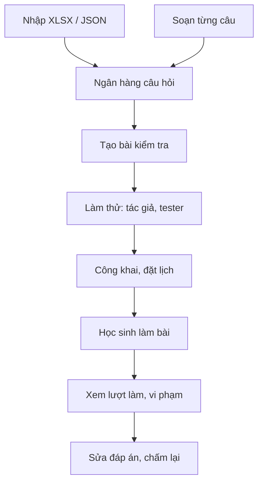

# Tạo và quản lý bài trắc nghiệm

> Hướng dẫn xây ngân hàng câu hỏi, nhập câu hỏi hàng loạt từ Excel/JSON, tạo và lên lịch bài kiểm tra, rồi theo dõi lượt làm bài, vi phạm và chấm lại.
>
> ⏱ ~30 phút · 👤 Giáo viên, người ra đề, quản trị viên · 🔑 `quiz.edit_own_quiz` hoặc `quiz.edit_all_quiz`

## Trước khi bắt đầu

- [ ] Tài khoản của bạn có quyền `edit_own_quiz` hoặc `edit_all_quiz` (xem [Quyền](#quyen-va-cach-cap-quyen)). Khi có quyền, thanh công cụ nổi của trang sẽ hiện thêm các nút **Quiz**.
- [ ] Bạn đã đọc [Làm bài trắc nghiệm](/learn/quiz) để biết học sinh sẽ thấy gì.
- [ ] Nếu muốn nhập hàng loạt: chuẩn bị Microsoft Excel, LibreOffice hoặc Google Sheets (xuất ra `.xlsx`), hoặc một trình soạn thảo cho file JSON.
- [ ] Nếu bài dành cho một lớp: tổ chức (organization) của lớp đó đã tồn tại trên LCOJ.

## Tổng quan quy trình



Hai khái niệm quan trọng:

- **Câu hỏi** nằm trong **ngân hàng câu hỏi** và có thể dùng lại ở nhiều bài kiểm tra.
- **Bài kiểm tra** (quiz) chọn các câu từ ngân hàng và gán **điểm** cùng **thứ tự** cho từng câu. Điểm thuộc về bài kiểm tra, không thuộc về câu hỏi.

## Quyền và cách cấp quyền

| Quyền (codename) | Tên hiển thị | Cho phép |
|---|---|---|
| `quiz.edit_own_quiz` | Edit own quizzes and questions | Vào ngân hàng câu hỏi, tạo câu hỏi và bài kiểm tra, nhập/xuất. Chỉ sửa được câu hỏi và bài mà mình là **người tạo** (author) hoặc **giám khảo** (curator) |
| `quiz.edit_all_quiz` | Edit all quizzes and questions | Như trên, cộng thêm quyền xem và sửa **mọi** câu hỏi và bài kiểm tra |

Superuser tự động có cả hai quyền.

Quyền theo từng đối tượng:

| Vai trò | Được gì |
|---|---|
| Người tạo (author) | Người bấm tạo được thêm tự động. Sửa được nếu có `edit_own_quiz` |
| Giám khảo (curator) | Sửa được như người tạo, nếu cũng có `edit_own_quiz` |
| Người thử (tester) | Xem và làm bài khi bài còn **ẩn**. Không sửa được |
| Người có `edit_all_quiz` | Sửa được mọi thứ |

### Cấp quyền cho giáo viên (dành cho quản trị viên)

**Cách 1: qua nhóm (khuyên dùng khi có nhiều giáo viên)**

1. Vào `/admin/auth/group/` và tạo nhóm, ví dụ `Quiz Teachers`.
2. Trong ô tìm của danh sách quyền, gõ `quiz`.
3. Chọn **Quiz | câu hỏi | Chỉnh sửa bài kiểm tra và câu hỏi của mình** (`edit_own_quiz`) rồi bấm mũi tên để thêm vào nhóm.
4. Lưu nhóm.
5. Vào `/admin/auth/user/`, mở tài khoản giáo viên, thêm nhóm ở mục **Groups** rồi lưu.

**Cách 2: cấp trực tiếp cho một người**

1. Vào `/admin/auth/user/` và mở tài khoản cần cấp.
2. Ở mục **User permissions**, tìm `quiz` và thêm quyền `edit_own_quiz` (hoặc `edit_all_quiz` cho trưởng bộ môn hay quản trị viên).
3. Lưu.

::: warning Tên quyền tiếng Việt bị dịch sai
Trong giao diện tiếng Việt, `edit_all_quiz` hiện là "Chỉnh sửa toàn bộ tổ chức". Tên đó sai: quyền này là **sửa mọi bài kiểm tra và câu hỏi**, không liên quan tới tổ chức. Hãy đối chiếu theo codename.
:::

Giáo viên **không** cần `is_staff` hay quyền admin: mọi thao tác trong trang này đều làm được trên giao diện web. Chỉ cần quyền admin nếu muốn dùng [Django admin](#dung-django-admin).

Xem thêm: [Hệ thống phân quyền](/admin/permissions).

## Các điểm truy cập

Người có quyền sẽ thấy ba nút **Quiz** trên thanh công cụ nổi của trang:

| Nút trên thanh công cụ | URL | Dùng để |
|---|---|---|
| **Ngân hàng câu hỏi** | `/quizzes/questions/` | Xem, lọc, tạo, xuất câu hỏi |
| **Import Quiz** | `/quizzes/import/` | Nhập câu hỏi từ XLSX/JSON |
| **Manage Quizzes** | `/quizzes/` | Danh sách bài kiểm tra (gồm cả bài ẩn của bạn) |

Các URL khác:

| URL | Trang |
|---|---|
| `/quizzes/questions/new` | Tạo câu hỏi mới |
| `/quizzes/questions/<id>/edit` | Sửa câu hỏi |
| `/quizzes/import/template` | Tải file mẫu `quiz-template.xlsx` |
| `/quizzes/new` | **Tạo bài kiểm tra mới** |
| `/quizzes/<mã>` | Trang bài (học sinh cũng thấy trang này) |
| `/quizzes/<mã>/edit` | Sửa bài kiểm tra |
| `/quizzes/<mã>/attempts` | Danh sách lượt làm, vi phạm, chấm lại |
| `/quizzes/<mã>/ranking` | Bảng xếp hạng |

::: tip Không có nút "Tạo bài kiểm tra"
Hiện giao diện chưa có nút dẫn tới trang tạo bài kiểm tra. Hãy gõ thẳng `/quizzes/new` vào thanh địa chỉ, hoặc tạo bài ngay khi nhập câu hỏi (tùy chọn **Cũng tạo bài kiểm tra từ các câu hỏi này**).
:::

## Ngân hàng câu hỏi

### Xem và lọc

1. Mở **Ngân hàng câu hỏi** (`/quizzes/questions/`).
2. Lọc theo ô **Tìm kiếm...** (khớp mã, tiêu đề, nội dung), **Tất cả loại**, **Tất cả danh mục**, **Tất cả cấp độ**, rồi bấm **Lọc**.

Bạn thấy câu hỏi mình tạo hoặc làm giám khảo, cộng với mọi câu có **Công khai** = **Có**. Người có `edit_all_quiz` thấy toàn bộ.

### Tạo một câu hỏi

1. Trong ngân hàng câu hỏi, bấm **Câu hỏi mới**.
2. Nhập **Mã** (chữ thường và số, ví dụ `cpploop1`).
3. Chọn một thẻ ở **Loại câu hỏi**: **Trắc nghiệm**, **Nhiều đáp án**, **Đúng / Sai** hoặc **Trả lời ngắn**.
4. Nhập **Tiêu đề** (tên ngắn để nhận ra câu trong ngân hàng; học sinh không thấy).
5. Viết **Nội dung câu hỏi**. Chuyển sang tab **Xem trước** để kiểm tra cách hiển thị.
6. Khai báo đáp án:
   - Trắc nghiệm / Nhiều đáp án: điền **Nội dung lựa chọn**, bấm **Thêm lựa chọn** nếu cần (từ 2 đến 6 lựa chọn), tích cột **Đúng** ở đáp án đúng.
   - Đúng / Sai: chọn **Đúng** hoặc **Sai**.
   - Trả lời ngắn: nhập mẫu ở **Đáp án đúng — Mẫu Regex**, bấm **Thêm mẫu** để thêm mẫu khác.
7. (Tùy chọn) Điền **Giải thích tổng quát**, **Nhóm**, **Độ khó**, **Xáo trộn lựa chọn**, **Công khai trong ngân hàng**.
8. Bấm **Lưu câu hỏi**. Bạn tự động trở thành người tạo câu hỏi.

### Các trường của câu hỏi

| Trường (nhãn tiếng Việt) | Bắt buộc | Ý nghĩa |
|---|---|---|
| **Mã** | Có | Duy nhất trong toàn hệ thống, chỉ gồm `a-z` và `0-9`, tối đa 32 ký tự. Không có gạch dưới (thông báo lỗi tiếng Việt ghi `^[a-z0-9_]+$` là sai) |
| **Loại câu hỏi** | Có | Trắc nghiệm (MC), Nhiều đáp án (MA), Đúng/Sai (TF), Trả lời ngắn (SA) |
| **Tiêu đề** | Có | Tối đa 200 ký tự, chỉ dùng trong ngân hàng |
| **Nội dung câu hỏi** | Có | Markdown, có công thức toán |
| **Lựa chọn** | MC/MA | 2–6 lựa chọn; mỗi lựa chọn có thể kèm **Giải thích** riêng (hiện qua nút **Tại sao?** ở chế độ kết quả đầy đủ) |
| **Đáp án đúng** | Có | Xem [Các loại câu hỏi và cách chấm](#cac-loai-cau-hoi-va-cach-cham) |
| **Đáp án hiển thị** | Không | Chỉ cho SA: câu trả lời dễ đọc cho học sinh xem ở trang kết quả. Để trống thì học sinh thấy mẫu regex thô |
| **Giải thích tổng quát** | Không | Markdown, hiện ở trang kết quả khi bài bật chế độ đầy đủ |
| **Nhóm** | Không | Danh mục có sẵn. Danh mục được tạo trong admin (`/admin/quiz/quizcategory/`) hoặc tự động khi nhập file |
| **Độ khó** | Có | Dễ / Trung bình / Khó (mặc định Dễ) |
| **Chiến lược chấm điểm đa đáp án** | MA | Xem bảng chiến lược bên dưới |
| **Xáo trộn lựa chọn** | Không | Mỗi học sinh thấy thứ tự lựa chọn khác nhau (MC/MA) |
| **Công khai trong ngân hàng** | Không | Mọi người có quyền soạn đều thấy và dùng được câu này trong bài của họ (nhưng không sửa được) |

Người tạo và giám khảo của **câu hỏi** chỉ chỉnh được trong [Django admin](#dung-django-admin).

### Viết nội dung: Markdown và công thức

Nội dung câu, lựa chọn và giải thích đều hỗ trợ Markdown: `**đậm**`, `*nghiêng*`, `` `code` ``, khối code có tô màu, bảng, danh sách. Công thức toán được MathJax hiển thị:

````markdown
Tính tổng ~S = \sum_{i=1}^{n} i~ với ~n = 100~.

$$
\frac{n(n+1)}{2}
$$

```cpp
for (int i = 1; i <= n; i++) s += i;
```
````

- Công thức nằm trong dòng: `~...~`
- Công thức riêng dòng: `$$...$$`

::: warning
Ghi chú ở tiêu đề cột trong file mẫu XLSX gợi ý viết `$math$`. Cú pháp dùng trên trang là `~...~` (trong dòng) và `$$...$$` (riêng dòng), giống như khi viết đề bài lập trình.
:::

## Các loại câu hỏi và cách chấm

Mỗi câu cho ra một **tỉ lệ** từ 0 đến 1. Điểm của câu = tỉ lệ × điểm của câu trong bài, làm tròn 2 chữ số thập phân. Câu bỏ trống được 0.

| Loại | Học sinh làm gì | Chấm |
|---|---|---|
| **Trắc nghiệm** (MC) | Chọn 1 lựa chọn | Đúng: 1, sai: 0 |
| **Đúng / Sai** (TF) | Chọn Đúng hoặc Sai | Đúng: 1, sai: 0 |
| **Nhiều đáp án** (MA) | Chọn nhiều lựa chọn | Theo chiến lược chấm |
| **Trả lời ngắn** (SA) | Gõ văn bản | Khớp một mẫu thì 1, không thì 0 |

### Chiến lược chấm câu nhiều đáp án

Ký hiệu: **C** = số đáp án đúng, **W** = số đáp án sai trong câu; học sinh chọn **c** đáp án đúng và **w** đáp án sai.

| Chiến lược (nhãn tiếng Việt) | Giá trị trong file | Công thức |
|---|---|---|
| **Tất cả hoặc không** (mặc định) | `all_or_nothing` / `All or nothing` | 1 nếu chọn đúng **chính xác** tập đáp án đúng, ngược lại 0 |
| **Điểm một phần có phạt** | `partial_credit` / `Partial credit` | max(0, c/C − w/W) |
| **Đúng trừ sai** | `right_minus_wrong` / `Right minus wrong` | max(0, (c − w)/C) |
| **Chỉ đúng, không phạt** | `correct_only` / `Correct only` | c/C |

**Ví dụ.** Câu có 5 lựa chọn A–E, đáp án đúng là **A, C, D** (C = 3, W = 2), câu được **3 điểm**:

| Học sinh chọn | c | w | Tất cả hoặc không | Một phần có phạt | Đúng trừ sai | Chỉ đúng |
|---|---|---|---|---|---|---|
| A, C, D | 3 | 0 | **3** | **3** | **3** | **3** |
| A, C, B | 2 | 1 | 0 | 0.5 | 1 | 2 |
| A, C, D, B | 3 | 1 | 0 | 1.5 | 2 | 3 |
| Chọn cả 5 | 3 | 2 | 0 | 0 | 1 | 3 |
| Chỉ A | 1 | 0 | 0 | 1 | 1 | 1 |

::: danger "Chỉ đúng, không phạt" có thể bị lợi dụng
Với **Chỉ đúng, không phạt**, học sinh chọn **tất cả** lựa chọn vẫn được trọn điểm và câu còn được đánh dấu là đúng. Chỉ dùng chiến lược này cho bài luyện tập.
:::

Một câu MA chỉ được tính là "đúng" (màu xanh) khi tỉ lệ bằng 1.

### Câu trả lời ngắn: mẫu regex

Mỗi mẫu được so với **toàn bộ** câu trả lời của học sinh (đã bỏ khoảng trắng đầu và cuối) bằng `re.fullmatch` của Python. Chỉ cần khớp **một** mẫu là đúng.

| Mẫu | Chấp nhận | Không chấp nhận |
|---|---|---|
| `42` | `42`, ` 42 ` | `42.0`, `x = 42` |
| `(?i)python` | `Python`, `PYTHON` | `python3` |
| `def` | `def` | `Def` (mặc định **phân biệt hoa/thường**) |
| `\d+` | `7`, `2024` | `12a` |
| `3\.14` | `3.14` | `3x14` (không có `\`, dấu `.` khớp mọi ký tự) |
| `(?i)o\(n log n\)` | `O(n log n)`, `o(N LOG N)` | `O(nlogn)` |

::: warning Không dùng ký tự `|` bên trong một mẫu
Hệ thống tách các mẫu bằng ký tự `|`, cả trong form lẫn trong XLSX. Vì vậy mẫu `(?i)(true|yes)` (dù chính hướng dẫn trên form có gợi ý) bị tách thành `(?i)(true` và `yes)` rồi báo lỗi "Invalid regex". Hãy viết **mỗi phương án thành một mẫu riêng**: `(?i)true` và `(?i)yes`. Mẫu `3|three` vẫn chạy được vì bị tách thành hai mẫu hợp lệ `3` và `three`.
:::

Ngoài ra, nhớ điền **Đáp án hiển thị** (ví dụ `Paris`) để học sinh không phải đọc regex ở trang kết quả.

## Nhập câu hỏi hàng loạt

### Quy trình nhập

1. Bấm **Import Quiz** trên thanh công cụ, hoặc mở `/quizzes/import/`.
2. Ở **File XLSX hoặc JSON**, chọn file. File có đuôi `.json` được đọc theo định dạng JSON; mọi file khác được đọc như XLSX.
3. (Tùy chọn) Tích **Cũng tạo bài kiểm tra từ các câu hỏi này**, rồi điền **Code** (mã bài) và **Quiz name** (tên bài).
4. Bấm **Tải lên và xem trước**.
5. Xem khung **Xem trước**: mỗi câu là một khối **Hàng N: [loại] tiêu đề**. Khối viền đỏ kèm danh sách lỗi là câu có lỗi. Dòng **Các danh mục sau sẽ được tạo mới** liệt kê danh mục chưa có.
6. Nếu không có lỗi, bấm **Xác nhận nhập liệu**. Nếu có lỗi, sửa file rồi tải lên lại.
7. Thấy thông báo **Đã nhập N câu hỏi.** là xong. Bạn được chuyển về ngân hàng câu hỏi, hoặc tới trang sửa bài kiểm tra nếu đã chọn tạo bài.

::: info Nhập theo kiểu "tất cả hoặc không"
Chỉ cần một câu lỗi là **không câu nào** được nhập ("Hãy sửa các lỗi trên và tải lại. Không có gì được nhập."). Khi bấm xác nhận, mọi thứ được ghi trong một giao dịch: nếu có xung đột mã phát sinh, toàn bộ lần nhập bị hủy.
:::

Bài kiểm tra được tạo qua lần nhập có cài đặt mặc định: **ẩn**, không giới hạn thời gian, không giới hạn số lượt, kết quả đầy đủ, **bật** giám sát liêm chính. Câu hỏi được xếp theo thứ tự trong file, với điểm lấy từ cột/trường điểm. Hãy mở trang sửa để hoàn thiện cài đặt trước khi công khai.

### Định dạng XLSX

Tải file mẫu ở `/quizzes/import/template` (link **Tải xuống mẫu XLSX** trong ngân hàng câu hỏi). File mẫu có sẵn danh sách thả xuống cho cột **Type**, **Level**, **Shuffle Choices**, **MA Strategy** và ghi chú ở từng tiêu đề cột.

Quy tắc chung:

- Hàng 1 là tiêu đề và **bị bỏ qua**. Dữ liệu bắt đầu từ hàng 2; hàng trống bị bỏ qua.
- Cột được đọc **theo vị trí** (A, B, C…), không theo tên. **Không chèn, xóa hay đổi thứ tự cột.**
- Chỉ sheet đang mở (active) được đọc.
- Xóa 20 câu ví dụ về Python có sẵn trong mẫu trước khi nhập. Nếu những mã đó đã có trên hệ thống, lần nhập sẽ báo lỗi trùng mã.
- Định dạng cột Q (Correct Answer) là **Text** trước khi gõ. Nếu máy dùng dấu phẩy thập phân (thiết lập vùng Việt Nam), Excel có thể biến `1,3` thành số `1.3`, và câu MA sẽ báo lỗi.

| Cột | Tiêu đề | Nội dung |
|---|---|---|
| A | Code | Bắt buộc. `a-z0-9`, tối đa 32 ký tự (tự chuyển về chữ thường) |
| B | Type | `Multiple Choice`, `Multiple Answer`, `True/False`, `Short Answer` (hoặc `MC`, `MA`, `TF`, `SA`) |
| C | Title | Bắt buộc |
| D | Question | Bắt buộc. Nội dung Markdown |
| E, G, I, K, M, O | Choice 1 … Choice 6 | Lựa chọn (MC/MA cần ít nhất 2). Bỏ trống các ô không dùng |
| F, H, J, L, N, P | Explanation 1 … Explanation 6 | Giải thích cho từng lựa chọn (tùy chọn) |
| Q | Correct Answer | MC: số thứ tự lựa chọn, **bắt đầu từ 1** (`2`). MA: danh sách phân cách bằng dấu phẩy (`1,3`). TF: `True`/`False` (cũng nhận `1`/`0`, `đúng`/`dung`/`sai`). SA: các mẫu regex phân cách bằng `\|` |
| R | Points | Điểm của câu trong bài được tạo kèm. Bỏ trống = 1. Không được âm |
| S | Category | Danh mục (xem ghi chú bên dưới) |
| T | Level | `Easy`, `Medium`, `Hard`. Bỏ trống = Easy |
| U | Explanation | Giải thích tổng quát |
| V | Shuffle Choices | `Yes` để xáo lựa chọn (cũng nhận `true`, `1`, `x`, `có`) |
| W | MA Strategy | `All or nothing`, `Partial credit`, `Right minus wrong`, `Correct only`. Bỏ trống = All or nothing |
| X | Answer Display | Chỉ cho SA: đáp án hiển thị cho học sinh |

::: warning Cột Category
Giá trị ở cột này được dùng **nguyên văn làm slug** của danh mục. Nếu slug chưa có, danh mục mới được tạo với tên suy ra từ slug (thay `-` bằng dấu cách và viết hoa chữ đầu mỗi từ). Nên dùng slug dạng `cpp-co-ban`, đừng dùng `C++ cơ bản`.
:::

**Ví dụ tối thiểu** gồm 4 câu, mỗi loại một câu. Bảng được xoay ngang: mỗi cột của bảng là một hàng trong Excel, các ô không liệt kê thì để trống.

| Cột Excel | Hàng 2 | Hàng 3 | Hàng 4 | Hàng 5 |
|---|---|---|---|---|
| A · Code | `cppmc1` | `cppma1` | `cpptf1` | `cppsa1` |
| B · Type | `Multiple Choice` | `Multiple Answer` | `True/False` | `Short Answer` |
| C · Title | `Kiểu của 7/2` | `Kiểu số nguyên` | `Chỉ số mảng` | `Giá trị 7%3` |
| D · Question | `` Trong C++, `7/2` bằng bao nhiêu? `` | `Chọn các kiểu số nguyên:` | `Mảng C++ bắt đầu từ chỉ số 0.` | `` `7 % 3` bằng bao nhiêu? `` |
| E · Choice 1 | `3.5` | `int` | | |
| F · Explanation 1 | `Đây là phép chia số thực.` | | | |
| G · Choice 2 | `3` | `double` | | |
| I · Choice 3 | `4` | `long long` | | |
| Q · Correct Answer | `2` | `1,3` | `True` | `1` |
| R · Points | `1` | `2` | `1` | `1` |
| S · Category | `cpp-co-ban` | `cpp-co-ban` | `cpp-co-ban` | `cpp-co-ban` |
| T · Level | `Easy` | `Medium` | `Easy` | `Easy` |
| U · Explanation | `Chia hai số nguyên cho kết quả nguyên.` | | | |
| V · Shuffle Choices | `Yes` | `Yes` | | |
| W · MA Strategy | | `Partial credit` | | |
| X · Answer Display | | | | `1` |

::: tip Nhập qua giao diện web bỏ qua cột Answer Display
Trang nhập `/quizzes/import/` hiện **không lưu** cột X (Answer Display). Hãy điền **Đáp án hiển thị** sau khi nhập bằng cách sửa câu hỏi, hoặc nhập bằng trang admin (`/admin/quiz/quizquestion/import/`), nơi cột này được lưu.
:::

### Định dạng JSON

File JSON là **một mảng** các đối tượng câu hỏi, mã hóa UTF-8.

| Trường | Bắt buộc | Kiểu và giá trị |
|---|---|---|
| `code` | Có | Chuỗi `a-z0-9`, tối đa 32 ký tự |
| `type` | Có | `"MC"`, `"MA"`, `"TF"`, `"SA"` |
| `title` | Có | Chuỗi |
| `content` | Có | Chuỗi Markdown |
| `choices` | MC/MA | Mảng chuỗi, hoặc mảng đối tượng `{"text": "...", "explanation": "..."}`. Tối thiểu 2 |
| `correct` | Có | MC: số nguyên, chỉ số **bắt đầu từ 0**. MA: mảng chỉ số bắt đầu từ 0, không rỗng. TF: `true` / `false` (kiểu boolean). SA: xem bên dưới |
| `points` | Không | Số ≥ 0, mặc định `1` |
| `category` | Không | Slug danh mục |
| `level` | Không | `"easy"`, `"medium"`, `"hard"` (chữ thường), mặc định `"easy"` |
| `explanation` | Không | Giải thích tổng quát |
| `shuffle` | Không | Boolean, xáo trộn lựa chọn |
| `ma_strategy` | Không | `"all_or_nothing"` (mặc định), `"partial_credit"`, `"right_minus_wrong"`, `"correct_only"` |

`correct` cho câu SA là một chuỗi hoặc một mảng, mỗi phần tử là:

- **Chuỗi**, ví dụ `"Paris"`: khớp **nguyên văn**, **không** phân biệt hoa/thường, **không** phải regex.
- **Đối tượng** `{"text": "...", "case_sensitive": false, "is_regex": false}`: đặt `is_regex: true` để dùng regex (khớp toàn bộ), `case_sensitive: true` để phân biệt hoa/thường.

::: warning Khác biệt giữa JSON và XLSX/form
- MC/MA trong JSON đánh chỉ số **từ 0**; trong XLSX và form đánh **từ 1**.
- Chuỗi SA trong JSON là **văn bản thường, không phân biệt hoa/thường**; trong XLSX và form, mỗi mẫu là **regex có phân biệt hoa/thường**.
- JSON không có trường `answer_display`.
- Nếu sau này bạn mở câu SA nhập từ JSON ra sửa và lưu trên form, đáp án sẽ bị chuyển thành mẫu regex phân biệt hoa/thường. Hãy kiểm tra lại các mẫu trước khi lưu.
:::

**Ví dụ đầy đủ** (4 câu):

```json
[
  {
    "code": "cppmc1",
    "type": "MC",
    "title": "Kiểu của 7/2",
    "content": "Trong C++, `7/2` bằng bao nhiêu?",
    "choices": [
      {"text": "3.5", "explanation": "Đây là phép chia số thực."},
      {"text": "3", "explanation": "Chia hai số nguyên cho kết quả nguyên."},
      "4"
    ],
    "correct": 1,
    "points": 1,
    "category": "cpp-co-ban",
    "level": "easy",
    "explanation": "Phép chia hai số nguyên bỏ phần thập phân.",
    "shuffle": true
  },
  {
    "code": "cppma1",
    "type": "MA",
    "title": "Kiểu số nguyên",
    "content": "Chọn các kiểu số nguyên:",
    "choices": ["int", "double", "long long"],
    "correct": [0, 2],
    "points": 2,
    "level": "medium",
    "ma_strategy": "partial_credit"
  },
  {
    "code": "cpptf1",
    "type": "TF",
    "title": "Chỉ số mảng",
    "content": "Mảng C++ bắt đầu từ chỉ số 0.",
    "correct": true
  },
  {
    "code": "cppsa1",
    "type": "SA",
    "title": "Độ phức tạp tìm kiếm nhị phân",
    "content": "Độ phức tạp của tìm kiếm nhị phân là gì?",
    "correct": ["O(log n)", {"text": "o\\(\\s*log\\s*n\\s*\\)", "is_regex": true}]
  }
]
```

### Lỗi thường gặp khi nhập

Thông báo lỗi của từng hàng hiện bằng tiếng Anh:

| Thông báo | Nguyên nhân | Cách sửa |
|---|---|---|
| `Question code is required and must match ^[a-z0-9]+$` | Thiếu mã, hoặc mã có chữ hoa, gạch dưới, dấu cách | Dùng chữ thường và số |
| `Duplicate code … in this file` | Hai hàng cùng mã | Đổi một mã |
| `Code … already exists in the question bank` | Mã đã có trên hệ thống | Đổi mã (mã là duy nhất trên toàn LCOJ) |
| `MC correct answer out of range 1-N` | Số đáp án vượt quá số lựa chọn | Kiểm tra cột Correct Answer (đánh số từ 1) |
| `MC correct must be a 0-based choice index` | JSON: `correct` không phải số nguyên hợp lệ | Dùng chỉ số từ 0 |
| `TF correct answer must be true or false` | Giá trị TF không nhận ra | Dùng `True` / `False` |
| `Invalid regex '…'` | Mẫu SA sai cú pháp, thường do có `\|` bên trong | Tách thành nhiều mẫu, escape ký tự đặc biệt |
| `Level must be one of …` | JSON: `level` viết hoa hoặc sai | Dùng `easy`/`medium`/`hard` |
| `MA strategy must be one of …` | Tên chiến lược sai | Dùng đúng giá trị trong bảng |
| `Cannot read XLSX file` / `Invalid JSON file` | File hỏng hoặc sai định dạng | Lưu lại dưới dạng `.xlsx` hoặc kiểm tra JSON |
| `JSON root must be a list of question objects` | JSON không bắt đầu bằng `[` | Bọc các câu trong một mảng |
| **Không có file đang chờ — vui lòng tải lên trước.** | Bấm xác nhận hai lần, hoặc phiên đã hết hạn | Tải file lên lại |

## Xuất câu hỏi

1. Trong **Ngân hàng câu hỏi**, tích ô ở đầu các câu cần xuất.
2. Bấm **Xuất đã chọn ra XLSX**. Bạn nhận file `quiz-questions.xlsx` cùng định dạng với file nhập.

::: info Giới hạn khi xuất
- Cột **Points** luôn là `1`, vì điểm thuộc về bài kiểm tra chứ không thuộc câu hỏi.
- Cột **Answer Display** để trống.
- Nhập lại file vừa xuất sẽ báo trùng mã. Muốn tạo bản sao, hãy đổi mã trước.
:::

## Tạo bài kiểm tra

1. Mở `/quizzes/new`.
2. Điền các trường cài đặt (xem bảng bên dưới). Chỉ **Code** và tên bài là bắt buộc.
3. Ở phần **Câu hỏi**, bấm **+ Thêm câu hỏi**, gõ để tìm câu (theo mã, tiêu đề hoặc nội dung; kết quả hiện dạng `[MC] mã: tiêu đề`) rồi chọn.
4. Nhập **Điểm** cho câu đó (mặc định 1, không được âm).
5. Lặp lại bước 3–4 cho từng câu. Kéo biểu tượng **⠿** để đổi thứ tự, bấm **✕** để bỏ một câu.
6. Bấm **Lưu bài kiểm tra**. Thông báo **Đã lưu bài kiểm tra.** hiện ra và bạn ở lại trang sửa `/quizzes/<mã>/edit`. Bạn tự động là người tạo bài.

::: warning Bài mới luôn ẩn
Chừng nào chưa tích **Hiển thị công khai**, chỉ người tạo, giám khảo, người thử và người có `edit_all_quiz` thấy được bài.
:::

### Các trường cài đặt

Một số nhãn tiếng Việt trên form bị dịch sai. Bảng dưới ghi cả nhãn tiếng Anh, nhãn tiếng Việt đang hiển thị và ý nghĩa thật.

| Nhãn tiếng Anh | Nhãn tiếng Việt đang hiện | Ý nghĩa thật |
|---|---|---|
| Quiz code | Code | Mã bài, `a-z0-9`, tối đa 32 ký tự, duy nhất. **Không đổi được** sau khi tạo |
| Quiz name | Tên đầy đủ | Tên bài, tối đa 100 ký tự |
| Description | Mô tả | Markdown, hiện trên trang bài |
| Time limit (minutes) | Giới hạn thời gian (giây): | **Số phút** cho mỗi lượt (nhãn ghi "giây" là sai). Để trống = không giới hạn |
| Maximum attempts | Số thành viên tối đa | **Số lượt nộp tối đa** mỗi học sinh. Để trống = không giới hạn |
| Shuffle questions | Lời giải | **Xáo trộn thứ tự câu hỏi** cho mỗi lượt |
| Result feedback | Phản hồi từ trình chấm | Học sinh thấy gì sau khi nộp (xem bảng bên dưới) |
| Integrity monitoring | Giám sát liêm chính | Bật hộp thoại cảnh báo, hình mờ, chặn sao chép và ghi vi phạm. Mặc định **bật** |
| Start time | Thời gian bắt đầu | Trước giờ này không ai bắt đầu được. Để trống = mở ngay |
| End time | Thời gian kết thúc | Sau giờ này không ai bắt đầu lượt mới được. Để trống = không đóng. Phải sau giờ bắt đầu |
| Publicly visible | Hiển thị công khai | Học sinh thấy và làm được bài |
| Private to organizations | Dành riêng cho tổ chức | Chỉ thành viên các tổ chức ở trường bên dưới thấy bài |
| Organizations | Tổ chức | Các tổ chức được phép |
| Curators | Giám khảo | Người cùng quản lý bài (cần có `edit_own_quiz`) |
| Testers | Người dùng thử | Làm được bài khi bài còn ẩn |

Giờ bắt đầu và kết thúc được hiểu theo múi giờ của tài khoản bạn.

Các chế độ **Phản hồi từ trình chấm**:

| Lựa chọn (tiếng Việt / tiếng Anh) | Học sinh thấy sau khi nộp |
|---|---|
| **Điểm** / Score only | Tổng điểm và câu trả lời của mình. Không có đúng/sai, không có đáp án |
| **Hiển thị kết quả đúng/sai (không có đáp án)** / Show correctness (no answer key) | Màu đúng/sai và điểm từng câu, không có đáp án |
| **Hiển thị đáp án đúng và giải thích** / Show correct answers and explanations | Đáp án đúng, giải thích từng lựa chọn và giải thích chung. **Mặc định** |

::: warning Kết quả hiện ngay sau khi nộp
Không có tùy chọn "chỉ hiện đáp án sau khi bài đóng". Với chế độ đầy đủ, học sinh nộp sớm sẽ thấy đáp án ngay và có thể chia sẻ cho người khác. Với bài thi, hãy dùng **Điểm** hoặc **Đúng/sai** trong lúc thi, rồi chuyển sang chế độ đầy đủ sau giờ kết thúc. Thay đổi này áp dụng ngay cho mọi lượt cũ.
:::

::: tip Kết hợp giờ kết thúc với giới hạn thời gian
Lượt làm có giới hạn thời gian luôn được chạy đủ thời gian, **kể cả khi đã qua giờ kết thúc**. Muốn mọi người nộp trước một mốc cố định, hãy mở bài sớm hơn giờ kết thúc ít nhất một khoảng bằng giới hạn thời gian. Ví dụ bài 45 phút đóng lúc 10:00 thì học sinh nên bắt đầu trước 9:15.
:::

### Ai thấy được bài?

| Hiển thị công khai | Dành riêng cho tổ chức | Ai thấy và làm được |
|---|---|---|
| Không | (bất kỳ) | Người tạo, giám khảo, người thử, người có `edit_all_quiz` |
| Có | Không | Mọi người (khách xem được, phải đăng nhập mới làm) |
| Có | Có | Thành viên các tổ chức đã chọn, cộng với nhóm ở hàng đầu |

::: warning
Muốn dành bài cho một lớp, phải tích **cả hai** ô **Hiển thị công khai** và **Dành riêng cho tổ chức**, rồi chọn tổ chức. Nếu chỉ tích **Dành riêng cho tổ chức** mà không công khai thì học sinh vẫn **không** thấy bài.
:::

## Xem thử bài

- **Từng câu:** trong trang soạn câu hỏi, dùng tab **Xem trước** của ô nội dung và ô giải thích.
- **Cả bài:** khi bài còn ẩn, người tạo và giám khảo tự làm thử được. Thêm đồng nghiệp vào **Người dùng thử** để họ làm thử mà không sửa được bài.

::: info
Lượt làm thử là lượt thật: nó xuất hiện trong danh sách lượt làm và **trên bảng xếp hạng**. Lượt làm chỉ xóa được trong Django admin (`/admin/quiz/quizattempt/`).
:::

## Nhân bản bài kiểm tra

1. Mở trang bài hoặc trang sửa bài, bấm **Clone quiz**.
2. Bạn được chuyển tới trang sửa của bản sao.
3. Đổi tên (mặc định là `Copy of <tên cũ>`), đặt lại lịch rồi lưu.

Bản sao có:

- **Mã** = mã cũ + số đầu tiên còn trống từ 2 đến 9 (ví dụ `midterm` → `midterm2`). Nếu cả 8 mã đã tồn tại, bạn nhận thông báo "Could not generate a unique code for the clone. Rename the original quiz first."
- Cùng mô tả, giới hạn thời gian, số lượt, xáo trộn, chế độ kết quả, giám sát, cài đặt tổ chức, giám khảo, người thử, danh sách câu hỏi, điểm và thứ tự.
- **Luôn ẩn**, **không có lịch**, người tạo chỉ còn **bạn**, và không có lượt làm nào.

Bản sao dùng **chung** câu hỏi với bài gốc, không tạo bản sao của câu hỏi. Sửa một câu sẽ ảnh hưởng cả hai bài.

## Theo dõi lượt làm và vi phạm

1. Trên trang bài, bấm **Tất cả lượt làm** (hoặc **Lần làm bài & chấm lại** trong trang sửa). URL: `/quizzes/<mã>/attempts`.
2. Bảng liệt kê mọi lượt, mới nhất ở trên: **Thành viên**, **Bắt đầu lúc**, **Trạng thái** (**đã nộp** / **đang làm bài**), **Điểm**, **Vi phạm**.
3. Bấm huy hiệu **⚠ N** ở cột **Vi phạm** để mở nhật ký: giờ xảy ra và loại sự kiện, cùng tổng số ("N vi phạm tổng cộng").
4. Bấm **xem** để mở trang kết quả của lượt đó. Giáo viên luôn thấy chế độ **đầy đủ**, bất kể cài đặt của bài.

Các loại vi phạm:

| Loại | Nhãn tiếng Việt | Nghĩa |
|---|---|---|
| `tab_switch` | Chuyển tab | Tab làm bài bị ẩn |
| `window_blur` | Mất tiêu điểm cửa sổ | Cửa sổ trình duyệt mất focus |
| `devtools` | Mở DevTools | Cửa sổ lớn hơn vùng hiển thị trên 160 px (ước đoán) |
| `print_screen` | Phím PrintScreen | Bấm PrintScreen |
| `copy_attempt` | Sao chép bài làm | Thử sao chép nội dung (nhãn đúng nghĩa là "thử sao chép") |

::: warning Đọc vi phạm một cách thận trọng
- Vi phạm **không** ảnh hưởng đến điểm; đây chỉ là tín hiệu để xem xét.
- Phát hiện DevTools là ước đoán: thanh bên trình duyệt hay mức thu phóng cũng có thể gây ra.
- Mỗi loại được ghi tối đa một lần trong 5 giây. Học sinh tắt JavaScript hoặc dùng thiết bị thứ hai thì không bị ghi nhận gì.
:::

::: info Lượt bị bỏ dở
Lượt học sinh bỏ dở vẫn hiện **đang làm bài** cho tới khi chính học sinh đó mở lại trang bài; lúc đó hệ thống mới chốt và chấm. Trong thời gian đó, lượt này không có trên bảng xếp hạng và không được chấm lại.
:::

## Chấm lại

Chấm lại tính lại điểm của **mọi lượt đã nộp** theo đáp án và điểm **hiện tại**.

1. Sửa đáp án của câu hỏi, hoặc sửa điểm trong bài kiểm tra, rồi lưu.
2. Mở `/quizzes/<mã>/attempts`.
3. Bấm **Chấm lại tất cả lần làm bài**, rồi xác nhận **Chấm lại tất cả lần nộp bài?**.
4. Thấy thông báo **Đã chấm lại N lần làm bài.** là xong. Bảng xếp hạng cập nhật ngay.

Lượt đang làm dở không cần chấm lại: chúng được chấm theo đáp án mới khi nộp.

## Sửa bài đã có người làm

Thứ tự câu hỏi và lựa chọn của mỗi lượt được **cố định lúc bắt đầu**; đáp án được lưu theo **chỉ số** lựa chọn. Vì vậy:

| Thay đổi | An toàn? | Ghi chú |
|---|---|---|
| Tên, mô tả, người thử, giám khảo | ✅ | |
| Công khai, tổ chức | ✅ | Áp dụng ngay |
| Chế độ kết quả | ✅ | Áp dụng ngay cho **mọi** lượt cũ |
| Giám sát liêm chính | ✅ | Áp dụng cho các trang tải sau khi lưu |
| Lùi giờ kết thúc | ✅ | Học sinh đã hết lượt vẫn không làm thêm được |
| Số lượt tối đa | ✅ | Áp dụng ngay |
| Giới hạn thời gian | ⚠️ | Hạn chót của các lượt **đang làm** được tính lại ngay theo giá trị mới |
| Điểm của câu | ⚠️ | Điểm cũ giữ nguyên cho tới khi **chấm lại** |
| Sửa đáp án đúng, sửa mẫu SA | ⚠️ | Cần **chấm lại** |
| Sửa chữ trong lựa chọn, giải thích | ⚠️ | An toàn nếu **không đổi nghĩa và thứ tự** |
| Thêm câu vào bài | ⚠️ | Lượt cũ không có câu mới, nhưng tổng điểm tối đa hiển thị (`X / Y`) tăng lên với mọi người |
| Bỏ câu khỏi bài | ❌ | Lượt cũ vẫn hiện câu đó; khi chấm lại, câu đó được 0 điểm |
| Đổi thứ tự, thêm hoặc xóa lựa chọn | ❌ | Đáp án cũ trỏ tới sai lựa chọn |
| Đổi loại câu hỏi | ❌ | Đáp án cũ không còn hợp lệ |
| Xáo trộn câu hỏi, xáo trộn lựa chọn | ✅ | Chỉ áp dụng cho lượt mới |

::: danger Câu hỏi dùng chung
Một câu hỏi có thể nằm trong nhiều bài. Sửa nó là sửa ở **mọi** bài dùng nó. Muốn đổi mạnh tay, hãy tạo câu mới với mã mới, rồi thay trong bài kiểm tra.
:::

## Dùng Django admin

Quản trị viên (tài khoản có `is_staff` và quyền model tương ứng) có thể quản lý mọi thứ trong admin, ở nhóm **Quiz**:

| Trang admin | Dùng khi cần |
|---|---|
| `/admin/quiz/quiz/` | Sửa **người tạo** (authors) của bài, sửa câu hỏi dạng bảng inline (có cột **order**), hành động **Clone selected quizzes** |
| `/admin/quiz/quizquestion/` | Sửa **người tạo** và **giám khảo** của câu hỏi; nút **Nhập câu hỏi** (`/admin/quiz/quizquestion/import/`) nhập XLSX/JSON **có lưu Answer Display** |
| `/admin/quiz/quizcategory/` | Tạo, sửa danh mục (**Nhóm**) |
| `/admin/quiz/quizattempt/` | Xem câu trả lời từng lượt, xóa lượt làm thử |
| `/admin/quiz/quizviolation/` | Tra cứu toàn bộ vi phạm theo loại |

Trong trang sửa bài trên web, quản trị viên còn thấy link **Sửa bài kiểm tra này ở admin panel để có nhiều tùy chỉnh hơn**.

::: warning
- Admin **không** kiểm tra người tạo/giám khảo: người có quyền sửa model trong admin sửa được **mọi** bài.
- Trong admin, `choices` và `correct_answers` là JSON thô. `choices` có dạng `[{"text": "...", "explanation": "..."}]`. `correct_answers`: MC là chỉ số từ 0, TF là `0` (Đúng) hoặc `1` (Sai), MA là mảng chỉ số từ 0, SA là mảng mẫu regex. Nhập sai sẽ làm hỏng việc chấm. Nên dùng form trên web.
:::

## Kiểm tra kết quả

- [ ] Bài xuất hiện ở `/quizzes/` khi đăng nhập bằng một tài khoản học sinh (hoặc tài khoản trong tổ chức, với bài dành riêng cho tổ chức).
- [ ] Trang bài hiện đúng số câu, tổng điểm, giới hạn thời gian, số lượt và lịch.
- [ ] Một người thử làm hết bài, nộp, và trang kết quả hiện đúng chế độ phản hồi.
- [ ] `/quizzes/<mã>/attempts` có lượt đó; nếu bật giám sát, chuyển tab lúc làm thử phải sinh ra một vi phạm **Chuyển tab**.

## Sự cố thường gặp

| Triệu chứng | Cách xử lý |
|---|---|
| Không thấy nút **Quiz** trên thanh công cụ, `/quizzes/questions/` báo 404 | Tài khoản thiếu `edit_own_quiz` / `edit_all_quiz`. Nhờ quản trị viên cấp quyền |
| Không tìm thấy nút tạo bài kiểm tra | Mở thẳng `/quizzes/new` |
| Học sinh không thấy bài | Chưa tích **Hiển thị công khai**; hoặc bài dành riêng cho tổ chức mà học sinh chưa vào tổ chức |
| Học sinh báo **Quiz not started yet.** | Kiểm tra **Thời gian bắt đầu** và múi giờ |
| Học sinh vẫn nộp được sau giờ kết thúc | Đó là lượt có giới hạn thời gian bắt đầu trước giờ kết thúc; lượt đó được chạy đủ giờ |
| Sửa câu hỏi của người khác thì báo 404 | Bạn không phải người tạo/giám khảo của câu đó. Câu **Công khai** chỉ dùng được, không sửa được |
| Không có danh mục để chọn ở **Nhóm** | Tạo danh mục trong `/admin/quiz/quizcategory/`, hoặc khai báo ở cột Category khi nhập file |
| Lưu câu SA báo `Invalid regex` | Mẫu có `\|` hoặc dấu ngoặc chưa đóng. Tách thành nhiều mẫu, escape `.`, `(`, `)`, `+`, `*` |
| Học sinh gõ đúng mà bị chấm sai | Mẫu phân biệt hoa/thường (thêm `(?i)`), hoặc chưa escape ký tự đặc biệt. Sửa mẫu rồi **chấm lại** |
| Điểm không đổi sau khi sửa đáp án | Chưa bấm **Chấm lại tất cả lần làm bài** |
| Nhập file báo trùng mã | Mã câu hỏi là duy nhất trên toàn LCOJ. Đổi mã hoặc xóa câu mẫu khỏi file |
| Cột Answer Display không được lưu | Trang nhập trên web bỏ qua cột này. Sửa câu sau khi nhập, hoặc nhập qua admin |
| Form báo "End time must be after start time." | Giờ kết thúc phải sau giờ bắt đầu |
| Clone báo không tạo được mã | Các mã `<mã>2` … `<mã>9` đã có hết. Đổi mã gốc hoặc tự tạo bài mới |
| Lượt học sinh treo ở **đang làm bài** | Học sinh đã bỏ dở. Lượt được chốt khi học sinh mở lại trang bài |

## Tiếp theo

- [Làm bài trắc nghiệm](/learn/quiz): trải nghiệm phía học sinh.
- [Hệ thống phân quyền](/admin/permissions): cấp quyền cho giáo viên và nhóm.
