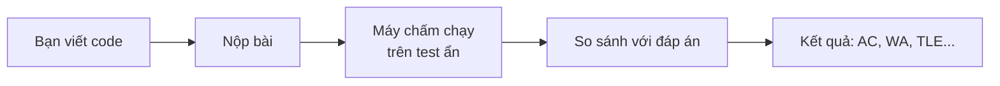
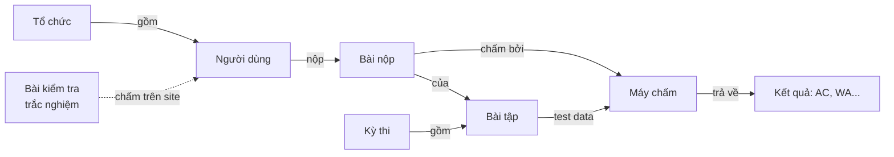

# LCOJ là gì?

**LCOJ (Luyện Code Online Judge)** là hệ thống chấm bài lập trình trực tuyến tại [luyencode.net](https://luyencode.net). Bạn đọc đề, viết chương trình, nộp lên và nhận kết quả chấm sau vài giây. Ngoài luyện tập, LCOJ còn dùng để tổ chức kỳ thi, làm bài kiểm tra trắc nghiệm và quản lý lớp học.

LCOJ là phần mềm mã nguồn mở, xây dựng dựa trên [DMOJ](https://github.com/DMOJ/online-judge) và [VNOJ](https://github.com/VNOI-Admin/OJ). Bất kỳ ai cũng có thể tự cài một bản LCOJ cho trường, lớp hay câu lạc bộ của mình.

## Hệ thống chấm bài trực tuyến là gì?

Một **online judge** (hệ thống chấm bài trực tuyến) là trang web tự động chấm chương trình của bạn. Mỗi bài tập có một bộ **test** mà bạn không nhìn thấy. Khi bạn nộp bài, hệ thống chạy chương trình trên từng test, so sánh kết quả in ra với đáp án rồi trả về **kết quả chấm**.

Ví dụ với bài "Tính tổng hai số": đề cho hai số nguyên `a` và `b`, yêu cầu in ra `a + b`.

```cpp
#include <iostream>
int main() {
    long long a, b;
    std::cin >> a >> b;
    std::cout << a + b << '\n';
}
```

Bạn nộp đoạn code trên. Máy chấm chạy nó với các test ẩn, chẳng hạn input `3 5` phải in ra `8`, input `-1000000000 -1000000000` phải in ra `-2000000000`. Nếu mọi test đều đúng, bạn nhận **Kết quả đúng (AC)**. Nếu một test in sai, bạn nhận **Kết quả sai (WA)**; nếu chạy quá lâu, bạn nhận **Quá thời gian (TLE)**.



Ý nghĩa của từng mã kết quả có tại [Mã trạng thái](/reference/status-codes).

## LCOJ có những gì?

| Tính năng | Địa chỉ trên site | Dùng để | Đọc thêm |
|---|---|---|---|
| Bài tập | `/problems/` | Luyện tập với kho bài lập trình, chấm tự động | [Nộp bài và chấm bài](/learn/submissions) |
| Kỳ thi | `/contests/` | Thi có giờ, có bảng xếp hạng, nhiều định dạng (IOI, ICPC, AtCoder, VNOJ...) | [Tham gia kỳ thi](/learn/contests) |
| Bài kiểm tra trắc nghiệm | `/quizzes/` | Câu hỏi một đáp án, đúng/sai, nhiều đáp án, trả lời ngắn; chấm ngay khi nộp | [Làm bài trắc nghiệm](/learn/quiz) |
| Thư viện đề thi | `/library/` | Đọc đề thi chính thức (PDF) dạng lật trang, vào làm bài nếu đề có kỳ thi | [Thư viện đề thi](/learn/exam-library) |
| Tổ chức | `/organizations/` | Gom người dùng thành nhóm, lớp, trường; có bài tập và kỳ thi riêng | [Tổ chức](/organize/organizations) |
| Blog, bình luận, báo lỗi | `/blogs/`, `/tickets/` | Chia sẻ bài viết, thảo luận dưới đề, báo lỗi đề bài | [Blog, bình luận và báo lỗi](/learn/community) |

## Ai dùng LCOJ?

- **Học sinh, sinh viên** luyện lập trình, ôn thi học sinh giỏi, Tin học trẻ, thi vào lớp 10 chuyên Tin, ICPC.
- **Giáo viên** tạo lớp (tổ chức), giao bài, ra đề kiểm tra lập trình và trắc nghiệm, theo dõi kết quả của học sinh.
- **Người ra đề** soạn bài tập kèm test, checker, grader.
- **Ban tổ chức** mở kỳ thi cho câu lạc bộ, trường hoặc cộng đồng.
- **Quản trị viên và người vận hành** tự cài LCOJ trên máy chủ riêng để phục vụ đơn vị của mình.

## Các khái niệm chính



- **Bài tập** (problem) gồm đề bài và bộ test. Người ra đề tải test lên và chọn cách chấm.
- **Bài nộp** (submission) là một lần bạn gửi code cho một bài tập.
- **Máy chấm** (judge) là máy chạy code trong môi trường cách ly (sandbox), trên test data của bài, rồi trả **kết quả** về website.
- **Kỳ thi** (contest) gom nhiều bài tập vào một khoảng thời gian, kèm bảng xếp hạng.
- **Tổ chức** (organization) gom người dùng lại, ví dụ một lớp học. Tổ chức có thể có bài tập và kỳ thi chỉ thành viên mới thấy.
- **Bài kiểm tra trắc nghiệm** (quiz) là phần riêng: câu hỏi lấy từ ngân hàng câu hỏi, được website chấm trực tiếp, không cần máy chấm.

Định nghĩa đầy đủ của các thuật ngữ có tại [Thuật ngữ](/start/glossary).

## Chọn lộ trình của bạn

| Bạn là | Đọc trước | Sau đó |
|---|---|---|
| **Học sinh, người luyện tập** | [Tài khoản và đăng nhập](/learn/account), [Nộp bài và chấm bài](/learn/submissions) | [Tham gia kỳ thi](/learn/contests), [Làm bài trắc nghiệm](/learn/quiz), [Mã trạng thái](/reference/status-codes) |
| **Người ra đề** | [Ra đề đầu tiên](/tutorials/first-problem), [Quản lý bài tập](/setter/managing-problems) | [Cấu trúc bài tập](/setter/problem-format), [Checker](/setter/checkers), [Ví dụ bài tập](/setter/examples) |
| **Giáo viên, ban tổ chức kỳ thi** | [Tổ chức kỳ thi đầu tiên](/tutorials/first-contest), [Tổ chức (nhóm, lớp học)](/organize/organizations) | [Tạo và quản lý kỳ thi](/organize/contest-setup), [Các định dạng kỳ thi](/organize/contest-formats), [Tạo bài trắc nghiệm đầu tiên](/tutorials/first-quiz) |
| **Quản trị viên site** | [Hệ thống phân quyền](/admin/permissions), [Quản lý người dùng](/admin/users) | [Cấu hình giao diện và nội dung](/admin/site-config), [Rút gọn liên kết](/admin/url-shortener) |
| **Người vận hành, tự cài đặt** | [Kiến trúc hệ thống](/operate/architecture), [Cài đặt với Docker](/operate/installation) | [Cài đặt judge](/operate/judge-setup), [Vận hành hằng ngày](/operate/operations), [Cập nhật hệ thống](/operate/updating) |

::: tip Chưa biết bắt đầu từ đâu?
Nếu bạn chỉ muốn giải bài trên luyencode.net, hãy đọc [Nộp bài và chấm bài](/learn/submissions) là đủ. Các câu hỏi hay gặp được tổng hợp ở [Câu hỏi thường gặp](/start/faq).
:::

## Nguồn gốc và giấy phép

LCOJ kế thừa phần lớn mã nguồn từ **DMOJ** (hệ thống chấm bài của Canada) và **VNOJ** (bản phát triển của cộng đồng VNOI). Cảm ơn các nhóm phát triển DMOJ và VNOJ đã chia sẻ mã nguồn. Trên nền đó, LCOJ bổ sung thêm những phần như bài kiểm tra trắc nghiệm và thư viện đề thi.

Mã nguồn gồm hai repo chính: [lcoj-docker](https://github.com/luyencode/lcoj-docker) (Docker Compose, script, cấu hình) và [lcoj-site](https://github.com/luyencode/lcoj-site) (website Django). LCOJ phát hành theo giấy phép AGPL-3.0, xem [Giấy phép](/about/license).

## Cần giúp đỡ?

- Báo lỗi hoặc đặt câu hỏi: [GitHub Issues](https://github.com/luyencode/lcoj-docker/issues).
- Tham khảo thêm tại [behitek.com](https://behitek.com).
- Liên hệ đội ngũ LCOJ: [luyencode.net/about/#lien-he](https://luyencode.net/about/#lien-he). LCOJ hỗ trợ cài đặt miễn phí nếu bạn cần.
