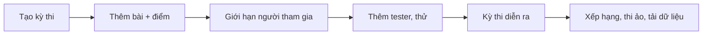

# Tổ chức kỳ thi đầu tiên

> Bạn sẽ tổ chức một kỳ thi 60 phút cho lớp học với 2–3 bài có sẵn, chỉ học sinh trong lớp vào được, rồi xem bảng xếp hạng và tải dữ liệu sau khi thi.
>
> ⏱ ~25 phút chuẩn bị (+60 phút thi) · 👤 Giáo viên, ban tổ chức · 🔑 `judge.add_contest` hoặc quản trị viên tổ chức có `judge.create_private_contest`; thêm tester cần tài khoản staff

## Bạn sẽ làm gì

- Tạo kỳ thi trên giao diện web: mã, tên, giờ bắt đầu và kết thúc, định dạng.
- Thêm 2–3 bài và đặt điểm cho từng bài.
- Giới hạn người tham gia: dành riêng cho một tổ chức (lớp) hoặc dùng mã truy cập.
- Thử kỳ thi bằng tài khoản tester trước giờ thi.
- Sau khi thi: xem bảng xếp hạng, mở tham gia ảo, tải bài nộp về.

## Trước khi bắt đầu

- [ ] Có sẵn 2–3 bài đã có test và đã nộp thử `AC` (xem [Ra đề đầu tiên](/tutorials/first-problem)). Nên để các bài ở chế độ **riêng tư**: bài công khai thì ai cũng đọc được đề mà không cần vào kỳ thi.
- [ ] Bạn có một trong hai quyền:
  - `judge.add_contest`: thấy tab **Thêm kỳ thi** ở `/contests/`; hoặc
  - là **quản trị viên của tổ chức** (lớp) và có `judge.create_private_contest`: thấy tab **Tạo kỳ thi mới** trên trang tổ chức.
- [ ] Có `judge.edit_own_contest` để sửa kỳ thi sau khi tạo.
- [ ] Nếu muốn dành kỳ thi cho một lớp: tổ chức của lớp đã tồn tại và học sinh đã tham gia tổ chức (xem [Tổ chức](/organize/organizations)).
- [ ] Một tài khoản thứ hai để làm tester, và một người có tài khoản **staff** (có thể là bạn) để thêm tester trong trang quản trị.

Xem [Phân quyền](/admin/permissions) để nhờ quản trị viên cấp các quyền trên.

## Bước 1: Tạo kỳ thi

Mục tiêu: có một kỳ thi 60 phút với mã, lịch và định dạng đúng.

1. Mở trang tạo kỳ thi theo một trong hai cách:

   | Cách | Mở ở đâu | Đặc điểm |
   |---|---|---|
   | **Trong tổ chức** (khuyên dùng cho lớp học) | `/organization/<slug>` → tab **Tạo kỳ thi mới** | Kỳ thi tự động **dành riêng cho tổ chức**. Mã kỳ thi bắt buộc bắt đầu bằng tiền tố của tổ chức (ô mã đã điền sẵn, ví dụ `lop10a_`) |
   | **Kỳ thi chung** | `/contests/` → tab **Thêm kỳ thi** (URL `/contests/new`) | Kỳ thi bình thường; giới hạn người tham gia bằng mã truy cập hoặc trong admin |

2. Điền form:

   | Ô | Giá trị ví dụ | Ghi chú |
   |---|---|---|
   | **Mã kỳ thi** | `lop10a_kt1` | Chỉ chữ thường, số và `_` (`^[a-z0-9_]+$`), tối đa 32 ký tự, duy nhất. Dùng trong URL `/contest/<mã>` |
   | **Tên kỳ thi** | `Kiểm tra 1 - Lớp 10A` | Tối đa 100 ký tự |
   | **Thời gian bắt đầu** | `2026-10-05 14:00:00` | Theo múi giờ tài khoản của bạn |
   | **Thời gian kết thúc** | `2026-10-05 15:00:00` | Tối đa 14 ngày sau giờ bắt đầu |
   | **Hiển thị công khai** | ✅ tích | **Bắt buộc** để học sinh thấy kỳ thi, kể cả kỳ thi dành riêng cho tổ chức |
   | **Chế độ hiển thị bảng điểm** | **Có thể xem** | Chọn **Ẩn khi kỳ thi đang diễn ra** nếu không muốn học sinh thấy thứ hạng lúc thi |
   | **Định dạng kỳ thi** | **IOI** (`ioi16`) hoặc **ICPC** | Xem bảng bên dưới |
   | **Mô tả** | Luật thi, ngôn ngữ được dùng… | Markdown |

   Các ô khác (**Không bình luận**, **Ẩn các thẻ đầu bài**, **Ẩn tác giả**, **Hiển thị các cài đặt của kỳ thi**) giữ mặc định. Ô **Mã truy cập** và **Kỳ thi riêng tư cho một số thành viên** dùng ở Bước 3.

::: tip Chọn định dạng: IOI hay ICPC?

| | **IOI** (`ioi16`) | **ICPC** (`icpc`) |
|---|---|---|
| Điểm mỗi bài | Cộng điểm tốt nhất của **từng subtask** qua mọi lần nộp | Điểm cao nhất của một lần nộp |
| Nộp sai | Không bị phạt | Phạt 20 phút mỗi lần nộp sai trước khi đạt điểm cao nhất |
| Bằng điểm | Đồng hạng (mặc định) | Ai tổng thời gian + phạt ít hơn xếp trên |
| Đóng băng bảng cuối giờ | Không | Có (cài trong admin) |
| Nhãn bài | 1, 2, 3 | A, B, C |
| Hợp với | Bài có **subtask**, chấm điểm từng phần, kiểm tra trên lớp | Thi đồng đội, luyện tốc độ; mỗi bài thường đặt 1 điểm |

`ioi16` tính theo batch. Nếu bài của bạn **không chia subtask**, hãy chọn **IOI (pre-2016)** (`ioi`) hoặc **Mặc định** (`default`) thay vì `ioi16`. Chi tiết: [Các định dạng kỳ thi](/organize/contest-formats).
:::

✅ **Kết quả:** form đã điền đủ phần thông tin; chưa bấm **Tạo** (bạn thêm bài ở bước tiếp theo, cùng form này).

## Bước 2: Thêm bài và điểm

Mục tiêu: kỳ thi có 3 bài với điểm và thứ tự đúng.

1. Kéo xuống phần **Danh sách bài**. Bảng có các cột **Danh sách bài**, **Điểm**, **Thứ tự của bài tập trong kỳ thi**, **Số lượng submission** và **Xoá**.
2. Ở dòng đầu, bấm ô chọn bài và gõ mã hoặc tên bài (ví dụ `aplusb`) rồi chọn. Bạn chỉ chọn được bài mà mình xem được. Với kỳ thi của tổ chức, ô chọn có hai tab **Organization problems** và **Public problems**.
3. Nhập **Điểm** (số nguyên), ví dụ `100`. Với ICPC kiểu cổ điển, đặt `1` cho mỗi bài.
4. Nhập **Thứ tự của bài tập trong kỳ thi** là `1`, `2`, `3` (không được trùng). Hoặc bấm **Switch to drag and drop mode** (nút này chưa được dịch) để sắp xếp bằng chuột; thứ tự được đánh tự động.
5. (Tuỳ chọn) **Số lượng submission**: số lần nộp tối đa cho mỗi bài; để trống là không giới hạn.
6. Cần thêm dòng thì bấm **add another** dưới bảng.
7. Bấm **Tạo**.

✅ **Kết quả:** bạn được chuyển tới trang kỳ thi `/contest/lop10a_kt1`. Bạn tự động là tác giả của kỳ thi và thấy các tab **Thông tin**, **Thống kê**, **Chỉnh sửa**. Muốn sửa lại bài hay giờ thi, bấm **Chỉnh sửa** (`/contest/<mã>/edit`), sửa rồi bấm **Cập nhật**.

## Bước 3: Giới hạn người tham gia

Mục tiêu: chỉ học sinh của lớp vào được kỳ thi. Chọn **một** trong các cách:

| Cách | Làm thế nào | Học sinh thấy gì |
|---|---|---|
| **A. Dành riêng cho tổ chức** | Nếu tạo từ trang tổ chức (Bước 1), đã xong. Nếu tạo ở `/contests/new`: vào admin (Bước 4), mục **Truy cập**, tích **Dành riêng cho tổ chức** và chọn **Tổ chức** (cần `judge.create_private_contest`) | Chỉ thành viên tổ chức thấy kỳ thi trong danh sách |
| **B. Mã truy cập** | Trong **Chỉnh sửa**, điền **Mã truy cập**, ví dụ `10a-thu-hai`, rồi **Cập nhật**. Đọc mã cho lớp lúc bắt đầu thi | Ai thấy kỳ thi cũng phải nhập mã: bấm **Tham gia kỳ thi** → ô **Hãy nhập mã truy cập của bạn:** → **Tham gia kỳ thi** |
| **C. Danh sách người dự thi** | Trong **Chỉnh sửa**, tích **Kỳ thi riêng tư cho một số thành viên**, rồi thêm tên đăng nhập vào **Các thành viên có thể tham gia kỳ thi** (dán cả danh sách rồi Enter) | Chỉ những người trong danh sách thấy kỳ thi |

Có thể kết hợp A và B: học sinh trong lớp mới thấy kỳ thi, và vẫn phải có mã mới vào được.

✅ **Kết quả:** trang kỳ thi (tab **Thông tin**) hiện đúng thiết lập; nếu có mã truy cập, phần tóm tắt luật ghi rằng cần mã truy cập để tham gia (khi bật **Hiển thị các cài đặt của kỳ thi**).

## Bước 4: Thêm tester và cài đặt nâng cao (trang quản trị)

Mục tiêu: có một tài khoản tester xem được kỳ thi trước giờ thi.

Form trên site không có ô tester. Việc này làm trong trang quản trị, cần tài khoản **staff** có `judge.edit_own_contest` (hoặc nhờ quản trị viên):

1. Mở **Chỉnh sửa** của kỳ thi, bấm dòng **Sửa contest này ở admin panel để có nhiều tùy chỉnh hơn** (chỉ hiện với staff). Hoặc mở `/admin/judge/contest/` và chọn kỳ thi.
2. Ở ô **Testers** (đầu trang), thêm tài khoản tester.
3. (Tuỳ chọn, cùng trang) các cài đặt chỉ có trong admin:

   | Ô | Khi nào dùng |
   |---|---|
   | **Số phút đóng băng** (mục **Format**) | Chỉ với ICPC/VNOJ, ví dụ `15` để đóng băng bảng 15 phút cuối. Sau khi thi phải đặt lại `0` để công bố bảng thật |
   | **Cấu hình dạng kỳ thi** | JSON tuỳ chọn của định dạng, ví dụ `{"penalty": 10}` cho ICPC |
   | **Giới hạn thời gian** (mục **Lịch**) | Mỗi thí sinh có một khung giờ riêng (ví dụ 60 phút) tính từ lúc bấm tham gia, trong khoảng bắt đầu–kết thúc. Bỏ trống cho kỳ thi giờ cố định như ở đây |
   | **Không cho phép tham gia ảo** (mục **Cài đặt**) | Tích nếu không muốn ai thi ảo sau khi kỳ thi kết thúc |
   | Cột **Một phần** trong bảng bài | Bỏ tích để bài chỉ có điểm khi đúng hết (kiểu ICPC) |

4. Bấm **Lưu lại**.

✅ **Kết quả:** tài khoản tester mở được `/contest/<mã>` dù kỳ thi chưa bắt đầu.

## Bước 5: Thử kỳ thi bằng tài khoản tester

Mục tiêu: chắc chắn đề hiển thị đúng và bài nộp được chấm.

1. Đăng nhập bằng tài khoản tester (dùng cửa sổ ẩn danh hoặc trình duyệt khác).
2. Mở `/contest/<mã>` và bấm **Theo dõi kỳ thi**. Tester và tác giả luôn vào ở chế độ theo dõi (spectate), kể cả trước giờ bắt đầu.
3. Mở từng bài trong danh sách bài của kỳ thi, đọc đề và nộp một lời giải đúng.
4. Bấm **Rời khỏi kỳ thi** khi xong.

✅ **Kết quả:** các bài nộp được chấm `AC`. Người theo dõi **không** xuất hiện trên bảng xếp hạng, nên thử bao nhiêu cũng không ảnh hưởng kết quả thi.

::: tip Kiểm tra từ góc nhìn học sinh
Đăng nhập bằng một tài khoản học sinh bình thường (không phải tester) và mở `/contests/`: kỳ thi phải hiện trong danh sách, kèm đếm ngược. Nếu không thấy, xem lại **Hiển thị công khai** và cách giới hạn ở Bước 3.
:::

## Bước 6: Chạy kỳ thi

Mục tiêu: học sinh vào thi và bạn theo dõi được diễn biến.

1. Đến giờ bắt đầu, học sinh mở `/contest/<mã>` và bấm **Tham gia kỳ thi** (nhập mã truy cập nếu có). Chưa đến giờ thì nút này chưa hiện.
2. Bạn theo dõi ở tab **Bảng xếp hạng** (`/contest/<mã>/ranking/`) và tab **Các bài nộp**.
3. Hết giờ, kỳ thi tự đóng.

✅ **Kết quả:** bảng xếp hạng cập nhật sau mỗi bài nộp được chấm (trừ khi bạn đã ẩn bảng hoặc bảng đang đóng băng).

## Bước 7: Sau kỳ thi

Mục tiêu: công bố kết quả, cho phép luyện lại và lưu trữ bài nộp.

1. **Xem bảng xếp hạng:** tab **Bảng xếp hạng**. Nếu dùng ICPC có đóng băng, vào admin đặt **Số phút đóng băng** về `0` rồi **Lưu lại** để công bố bảng thật.
2. **Mở tham gia ảo:** sau khi kỳ thi kết thúc, người chưa thi (hoặc muốn thi lại) thấy nút **Tham gia ảo** trên trang kỳ thi; mỗi lượt ảo có đủ 60 phút như thi thật. Trên bảng xếp hạng, tích **Hiển thị xếp hạng của virtual** để xem cả các lượt ảo. Nếu đã tích **Không cho phép tham gia ảo** ở Bước 4, nút này không hiện.
3. **Tải dữ liệu:** trên trang kỳ thi, ở phần **Danh sách bài**, bấm **Tải dữ liệu**. Ở trang **Tải dữ liệu kỳ thi**, giữ **Tải bài nộp?**, bấm **Chuẩn bị dữ liệu**, chờ xong rồi bấm **Tải dữ liệu đã chuẩn bị** để nhận `<mã>-data.zip`. Chi tiết: [Tải dữ liệu kỳ thi](/organize/contest-data-download).
4. (Tuỳ chọn) Muốn đưa đề vào kho luyện tập, bấm **Make All Problems Public** trên trang kỳ thi.

✅ **Kết quả:** bảng xếp hạng cuối cùng hiển thị, nút **Tham gia ảo** có trên trang kỳ thi, và bạn có file zip bài nộp của thí sinh.

## Kiểm tra kết quả

- [ ] Học sinh trong lớp thấy kỳ thi ở `/contests/`; tài khoản ngoài lớp (hoặc không có mã) không vào được.
- [ ] Tester vào được trước giờ thi và bài nộp của tester được chấm.
- [ ] Nhãn bài và cách tính điểm trên bảng xếp hạng đúng với định dạng đã chọn (1, 2, 3 với IOI; A, B, C với ICPC).
- [ ] Sau giờ thi, nút **Tham gia ảo** xuất hiện và bạn tải được file `<mã>-data.zip`.

## Sự cố thường gặp

| Triệu chứng | Nguyên nhân | Cách xử lý |
|---|---|---|
| Không thấy tab **Thêm kỳ thi** / **Tạo kỳ thi mới** | Thiếu `judge.add_contest`, hoặc không phải quản trị viên tổ chức / thiếu `judge.create_private_contest` | Nhờ quản trị viên cấp quyền |
| "Mã kỳ thi phải bắt đầu bằng `…`" | Kỳ thi của tổ chức cần tiền tố của tổ chức | Giữ tiền tố đã điền sẵn, chỉ thêm phần sau |
| "Chỉ có thể chứa các ký tự viết thường (a-z), số (0-9) và dấu gạch dưới (_)" | Mã kỳ thi có chữ hoa, `-` hoặc dấu cách | Sửa mã |
| "Thời gian diễn ra contest không được kéo dài quá 14 ngày" | Giờ kết thúc quá xa | Rút ngắn khoảng thời gian |
| "Các bài tập phải có thứ tự khác nhau." | Hai bài cùng thứ tự | Đánh số 1, 2, 3 hoặc dùng chế độ kéo thả |
| Không tìm thấy bài khi thêm | Bạn không xem được bài đó | Nhờ tác giả bài thêm bạn làm curator, hoặc chọn bài khác |
| Học sinh không thấy kỳ thi | Chưa tích **Hiển thị công khai**, hoặc học sinh chưa vào tổ chức / không có trong danh sách | Sửa theo Bước 1 và 3 |
| Học sinh thấy kỳ thi nhưng không có nút **Tham gia kỳ thi** | Chưa đến giờ bắt đầu | Chờ đến giờ; kiểm tra lại múi giờ khi đặt lịch |
| Bạn (tác giả) chỉ thấy **Theo dõi kỳ thi** | Tác giả và tester chỉ theo dõi, không thi chính thức | Đúng như thiết kế; dùng tài khoản học sinh nếu cần thi thật |
| Học sinh đọc được đề trước giờ thi | Bài đang công khai | Ẩn bài trước khi thi (admin, hành động **Ẩn bài**) |
| Bảng xếp hạng vẫn đóng băng sau khi thi | ICPC/VNOJ giữ đóng băng sau giờ kết thúc | Đặt **Số phút đóng băng** về `0` trong admin |
| Không có nút **Tải dữ liệu** | Bạn không có quyền sửa kỳ thi, hoặc tính năng bị tắt trên máy chủ | Xem [Tải dữ liệu kỳ thi](/organize/contest-data-download) |
| "Vui lòng đợi sau khi kỳ thi kết thúc để tải dữ liệu." | Kỳ thi chưa kết thúc | Chờ hết giờ rồi thử lại |

## Tiếp theo

- [Thiết lập kỳ thi](/organize/contest-setup): mọi trường cấu hình, đăng ký, luật thi, rating.
- [Các định dạng kỳ thi](/organize/contest-formats): cách tính điểm, phạt và đóng băng của từng định dạng.
- [Tổ chức](/organize/organizations): tạo lớp và quản lý thành viên.
- [Tải dữ liệu kỳ thi](/organize/contest-data-download): cấu trúc file zip bài nộp.
- [Tham gia kỳ thi](/learn/contests): trải nghiệm phía thí sinh.
