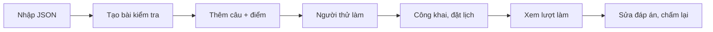

# Tạo bài trắc nghiệm đầu tiên

> Bạn sẽ tạo một bài kiểm tra trắc nghiệm 5 câu, 15 phút, có giám sát liêm chính: nhập câu hỏi từ file JSON, cho người thử làm, công khai, rồi sửa một đáp án sai và chấm lại.
>
> ⏱ ~20 phút · 👤 Giáo viên, người ra đề · 🔑 `quiz.edit_own_quiz` (hoặc `quiz.edit_all_quiz`)

## Bạn sẽ làm gì

- Nhập 5 câu hỏi (trắc nghiệm, nhiều đáp án, đúng/sai, trả lời ngắn) vào ngân hàng câu hỏi từ một file JSON.
- Tạo bài kiểm tra với giới hạn thời gian, số lượt, chế độ phản hồi và giám sát liêm chính.
- Gắn câu hỏi vào bài kèm điểm, rồi cho một người thử làm trước.
- Công khai và đặt lịch cho lớp.
- Xem lượt làm, sửa một đáp án sai và chấm lại toàn bộ.



## Trước khi bắt đầu

- [ ] Tài khoản của bạn có quyền `quiz.edit_own_quiz`. Khi có quyền, thanh công cụ nổi của trang hiện các nút **Ngân hàng câu hỏi**, **Import Quiz** và **Manage Quizzes**. Nếu không thấy, nhờ quản trị viên cấp quyền theo [Tạo và quản lý bài trắc nghiệm](/setter/quiz-authoring#quyen-va-cach-cap-quyen).
- [ ] Một tài khoản thứ hai để làm **người thử** (tester).
- [ ] (Nếu bài dành cho một lớp) tổ chức của lớp đã tồn tại trên LCOJ và học sinh đã tham gia.
- [ ] Một trình soạn thảo văn bản lưu được file UTF-8 (VS Code, Notepad++, Notepad trên Windows 10 trở lên…).

## Bước 1: Chuẩn bị file câu hỏi

Mục tiêu: có file `quiz-demo.json` gồm 5 câu hợp lệ.

1. Mở trình soạn thảo, dán nội dung dưới đây.
2. Mã câu hỏi là **duy nhất trên toàn LCOJ** và chỉ gồm `a-z0-9` (không có gạch dưới). Hãy thay mọi chữ `mytest` bằng một chuỗi riêng của bạn, ví dụ tên đăng nhập viết thường không dấu: `mytestq1` → `hieuq1`.
3. Lưu thành `quiz-demo.json`, mã hoá **UTF-8**.

```json
[
  {
    "code": "mytestq1",
    "type": "MC",
    "title": "Phép chia 7/2",
    "content": "Trong C++, biểu thức `7 / 2` có giá trị bằng bao nhiêu?",
    "choices": [
      {"text": "3.5", "explanation": "Đây là kết quả của phép chia số thực."},
      {"text": "3", "explanation": "Chia hai số nguyên thì phần thập phân bị bỏ."},
      "4"
    ],
    "correct": 1,
    "category": "cpp-co-ban",
    "level": "easy",
    "explanation": "Hai toán hạng đều là `int` nên kết quả là `int`.",
    "shuffle": true
  },
  {
    "code": "mytestq2",
    "type": "MC",
    "title": "Kiểu lưu được 10^18",
    "content": "Kiểu dữ liệu nào trong C++ lưu được số ~10^{18}~?",
    "choices": ["int", "long long", "short", "char"],
    "correct": 0,
    "category": "cpp-co-ban",
    "level": "easy",
    "explanation": "`long long` có ít nhất 64 bit, lưu được tới khoảng ~9.2 \\cdot 10^{18}~."
  },
  {
    "code": "mytestq3",
    "type": "MA",
    "title": "Kiểu số nguyên",
    "content": "Chọn **tất cả** các kiểu số nguyên trong C++:",
    "choices": ["int", "double", "long long", "float"],
    "correct": [0, 2],
    "category": "cpp-co-ban",
    "level": "medium",
    "ma_strategy": "partial_credit"
  },
  {
    "code": "mytestq4",
    "type": "TF",
    "title": "Chỉ số mảng",
    "content": "Trong C++, phần tử đầu tiên của mảng có chỉ số 0.",
    "correct": true,
    "category": "cpp-co-ban"
  },
  {
    "code": "mytestq5",
    "type": "SA",
    "title": "Thoát vòng lặp",
    "content": "Từ khoá nào trong C++ dùng để thoát ngay khỏi vòng lặp gần nhất?",
    "correct": ["break"],
    "category": "cpp-co-ban"
  }
]
```

::: warning Câu 2 cố tình sai đáp án
Ở câu `mytestq2`, `"correct": 0` trỏ tới `int` (sai); đáp án đúng là `long long` (chỉ số `1`). Lỗi này được cài sẵn để bạn thực hành **sửa đáp án và chấm lại** ở Bước 7. Đừng sửa nó bây giờ.
:::

::: tip Nhắc nhanh về định dạng JSON
- `correct` của câu MC/MA đánh chỉ số **từ 0** (trong file Excel và trên form thì đánh từ 1).
- Chuỗi đáp án của câu SA trong JSON so khớp **nguyên văn, không phân biệt hoa/thường**, nên `Break` hay ` break ` đều đúng.
- Công thức toán viết `~...~` như trong đề bài lập trình.

Muốn dùng Excel thay JSON: tải mẫu ở `/quizzes/import/template` và làm theo phần "Định dạng XLSX" trong [Tạo và quản lý bài trắc nghiệm](/setter/quiz-authoring).
:::

✅ **Kết quả:** file `quiz-demo.json` với 5 câu, các mã đã đổi tiền tố.

## Bước 2: Nhập câu hỏi vào ngân hàng

Mục tiêu: 5 câu nằm trong **Ngân hàng câu hỏi**.

1. Bấm **Import Quiz** trên thanh công cụ, hoặc mở `/quizzes/import/`.
2. Ở ô **File XLSX hoặc JSON**, chọn `quiz-demo.json`.
3. **Không** tích **Cũng tạo bài kiểm tra từ các câu hỏi này** (bạn sẽ tạo bài ở bước sau để làm quen các cài đặt).
4. Bấm **Tải lên và xem trước**.
5. Ở khung **Xem trước**, kiểm tra có 5 khối **Hàng 1** … **Hàng 5**, không khối nào viền đỏ. Dòng **Các danh mục sau sẽ được tạo mới** có thể liệt kê `cpp-co-ban`.
6. Bấm **Xác nhận nhập liệu**.

✅ **Kết quả:** thông báo **Đã nhập 5 câu hỏi.** và bạn được đưa về **Ngân hàng câu hỏi** (`/quizzes/questions/`), nơi có 5 câu mới.

## Bước 3: Tạo bài kiểm tra

Mục tiêu: một bài kiểm tra ẩn với đúng các cài đặt.

1. Mở `/quizzes/new` (giao diện chưa có nút dẫn tới trang này; hãy gõ thẳng URL).
2. Điền các ô. Vài nhãn tiếng Việt trên form đang bị dịch sai, bảng dưới ghi ý nghĩa thật:

   | Nhãn đang hiện | Ý nghĩa thật | Giá trị |
   |---|---|---|
   | **Code** | Mã bài (`a-z0-9`, duy nhất, không đổi được sau này) | `mytestquiz` (đổi tiền tố như Bước 1) |
   | **Tên đầy đủ** | Tên bài | `Kiểm tra C++ cơ bản` |
   | **Giới hạn thời gian (giây):** | Số **phút** mỗi lượt | `15` |
   | **Số thành viên tối đa** | Số lượt nộp tối đa mỗi người | `2` |
   | **Lời giải** | Xáo trộn thứ tự câu hỏi | tích |
   | **Phản hồi từ trình chấm** | Học sinh thấy gì sau khi nộp | **Hiển thị kết quả đúng/sai (không có đáp án)** |
   | **Giám sát liêm chính** | Cảnh báo, hình mờ, chặn sao chép, ghi vi phạm | tích (mặc định đã bật) |
   | **Hiển thị công khai** | Học sinh thấy bài | **để trống** (bật ở Bước 6) |
   | **Người dùng thử** | Người được làm thử khi bài còn ẩn | thêm tài khoản tester |

   Để trống **Thời gian bắt đầu** và **Thời gian kết thúc** lúc này.

::: tip Vì sao chọn "đúng/sai" thay vì "đầy đủ"?
Chế độ **Hiển thị đáp án đúng và giải thích** cho học sinh thấy đáp án **ngay khi nộp**, nên người nộp sớm có thể chia sẻ đáp án. Hãy dùng chế độ đúng/sai (hoặc **Điểm**) trong lúc thi, rồi chuyển sang chế độ đầy đủ sau giờ kết thúc.
:::

✅ **Kết quả:** form đã điền cài đặt; chưa lưu (bạn thêm câu hỏi ngay trên form này).

## Bước 4: Thêm câu hỏi và điểm

Mục tiêu: bài có 5 câu, tổng 6 điểm.

1. Ở phần **Câu hỏi**, bấm **+ Thêm câu hỏi**, gõ `mytestq1` (đã đổi tiền tố) và chọn kết quả dạng `[MC] mytestq1: Phép chia 7/2`.
2. Nhập **Điểm** theo bảng, rồi lặp lại cho 4 câu còn lại:

   | Câu | Loại | Điểm |
   |---|---|---|
   | `mytestq1` | MC | 1 |
   | `mytestq2` | MC | 1 |
   | `mytestq3` | MA (điểm một phần có phạt) | 2 |
   | `mytestq4` | TF | 1 |
   | `mytestq5` | SA | 1 |

3. Kéo biểu tượng **⠿** nếu muốn đổi thứ tự (không bắt buộc, vì đã bật xáo trộn câu hỏi).
4. Bấm **Lưu bài kiểm tra**.

✅ **Kết quả:** thông báo **Đã lưu bài kiểm tra.**, bạn ở trang sửa `/quizzes/mytestquiz/edit`. Mở `/quizzes/mytestquiz`: trang bài ghi 5 câu, tổng 6 điểm, giới hạn 15 phút, tối đa 2 lượt.

## Bước 5: Cho người thử làm bài

Mục tiêu: xác nhận học sinh thấy đúng những gì bạn muốn, trước khi công khai.

1. Đăng nhập bằng tài khoản tester (cửa sổ ẩn danh hoặc trình duyệt khác), mở `/quizzes/mytestquiz`.
2. Bấm **Bắt đầu kiểm tra**. Hộp thoại **Thông báo liêm chính học thuật** hiện ra; bấm **Tôi hiểu, bắt đầu →**.
3. Trả lời hết 5 câu. Ở câu 2, chọn `long long` (đáp án đúng thật). Thử chuyển sang tab khác một lần để tạo vi phạm.
4. Bấm **Xem lại & Nộp bài** ở câu cuối (hoặc **Nộp bài kiểm tra** ở thanh bên) và xác nhận.

✅ **Kết quả:** trang kết quả hiện **Điểm: 5 / 6** và màu đúng/sai từng câu, không có đáp án. Câu 2 bị đánh **sai** dù tester chọn đúng, do lỗi cài sẵn trong file.

::: info Lượt làm thử là lượt thật
Lượt của tester xuất hiện trong danh sách lượt làm và trên **bảng xếp hạng**. Muốn xoá, quản trị viên xoá trong `/admin/quiz/quizattempt/`.
:::

## Bước 6: Công khai và đặt lịch

Mục tiêu: lớp làm được bài trong khung giờ đã định.

1. Mở `/quizzes/mytestquiz/edit`.
2. Đặt **Thời gian bắt đầu** và **Thời gian kết thúc** (theo múi giờ tài khoản của bạn), ví dụ 14:00 và 15:00. Lượt đã bắt đầu vẫn được làm đủ 15 phút kể cả khi qua giờ kết thúc, nên dặn học sinh bắt đầu trước 14:45.
3. Tích **Hiển thị công khai**.
4. (Nếu chỉ dành cho một lớp) tích thêm **Dành riêng cho tổ chức** và chọn lớp ở **Tổ chức**. Phải tích **cả hai** ô: chỉ tích **Dành riêng cho tổ chức** thì học sinh vẫn không thấy bài.
5. Bấm **Lưu bài kiểm tra**.

✅ **Kết quả:** đăng nhập bằng một tài khoản học sinh (thuộc lớp, nếu bài dành riêng), mở `/quizzes/`: bài hiện trong danh sách; trước giờ bắt đầu, trang bài hiện **Bắt đầu trong …**.

## Bước 7: Xem lượt làm, sửa đáp án và chấm lại

Mục tiêu: phát hiện câu có đáp án sai, sửa và chấm lại mọi lượt đã nộp.

1. Trên trang bài, bấm **Tất cả lượt làm** (hoặc **Lần làm bài & chấm lại** trong trang sửa). URL: `/quizzes/mytestquiz/attempts`.
2. Bảng có các cột **Thành viên**, **Bắt đầu lúc**, **Trạng thái**, **Điểm**, **Vi phạm**. Bấm huy hiệu **⚠ N** của lượt tester để xem nhật ký; bạn sẽ thấy sự kiện **Chuyển tab**.
3. Bấm **xem** để mở kết quả của lượt đó. Giáo viên luôn thấy chế độ đầy đủ, nên dễ nhận ra câu 2 đang lấy `int` làm đáp án.
4. Sửa câu hỏi: mở **Ngân hàng câu hỏi**, bấm vào tiêu đề **Kiểu lưu được 10^18** (`mytestq2`) để mở trang sửa. Ở danh sách lựa chọn, đánh dấu cột **Đúng** ở `long long` và bỏ đánh dấu ở `int`. Bấm **Lưu câu hỏi**.
   Chỉ sửa đáp án đúng; **đừng** đổi thứ tự hay thêm/xoá lựa chọn, vì câu trả lời cũ được lưu theo vị trí lựa chọn.
5. Quay lại `/quizzes/mytestquiz/attempts`, bấm **Chấm lại tất cả lần làm bài** và xác nhận **Chấm lại tất cả lần nộp bài?**.

✅ **Kết quả:** thông báo **Đã chấm lại N lần làm bài.**; điểm lượt của tester đổi từ `5` thành `6`, và bảng xếp hạng (`/quizzes/mytestquiz/ranking`) cập nhật ngay.

::: tip Sau giờ kết thúc
Khi bài đã đóng, bạn có thể đổi **Phản hồi từ trình chấm** sang **Hiển thị đáp án đúng và giải thích** để học sinh xem lại đáp án và lời giải thích. Thay đổi áp dụng ngay cho mọi lượt cũ.
:::

## Kiểm tra kết quả

- [ ] Ngân hàng câu hỏi có 5 câu mới với tiền tố của bạn.
- [ ] `/quizzes/mytestquiz` hiện 5 câu, 6 điểm, 15 phút, tối đa 2 lượt.
- [ ] Lượt của tester có một vi phạm **Chuyển tab**.
- [ ] Sau khi chấm lại, lượt tester được 6/6.
- [ ] Học sinh (đúng lớp) thấy bài ở `/quizzes/`; tài khoản ngoài lớp không thấy nếu bài dành riêng cho tổ chức.

## Sự cố thường gặp

| Triệu chứng | Nguyên nhân | Cách xử lý |
|---|---|---|
| Không thấy nút **Import Quiz**, `/quizzes/questions/` báo 404 | Thiếu `quiz.edit_own_quiz` | Nhờ quản trị viên cấp quyền |
| `Code … already exists in the question bank` | Mã câu đã có người dùng | Đổi tiền tố `mytest` thành chuỗi khác rồi tải lại |
| `Question code is required and must match ^[a-z0-9]+$` | Mã có chữ hoa, gạch dưới hoặc dấu cách | Chỉ dùng chữ thường và số |
| `Invalid JSON file` | Thiếu dấu phẩy, ngoặc, hoặc file không phải UTF-8 | Kiểm tra lại file bằng một trình kiểm tra JSON |
| Xem trước báo lỗi và **không câu nào** được nhập | Nhập theo kiểu "tất cả hoặc không" | Sửa mọi hàng lỗi rồi tải lên lại |
| **Không có file đang chờ — vui lòng tải lên trước.** | Bấm xác nhận hai lần hoặc phiên hết hạn | Tải file lên lại |
| Không tìm được câu khi bấm **+ Thêm câu hỏi** | Gõ sai mã, hoặc câu chưa được nhập | Kiểm tra trong **Ngân hàng câu hỏi** |
| Học sinh không thấy bài | Chưa tích **Hiển thị công khai**, hoặc học sinh chưa vào tổ chức | Sửa theo Bước 6 |
| Học sinh báo **Quiz not started yet.** | Chưa tới **Thời gian bắt đầu** | Kiểm tra giờ và múi giờ |
| Đồng hồ chạy quá lâu | Nhập nhầm số giây vào ô "Giới hạn thời gian (giây):" | Ô này tính bằng **phút**: nhập `15`, không phải `900` |
| Điểm không đổi sau khi sửa đáp án | Chưa bấm **Chấm lại tất cả lần làm bài** | Chấm lại như Bước 7 |

## Tiếp theo

- [Tạo và quản lý bài trắc nghiệm](/setter/quiz-authoring): mọi loại câu hỏi, định dạng XLSX, chiến lược chấm câu nhiều đáp án, nhân bản bài.
- [Làm bài trắc nghiệm](/learn/quiz): trải nghiệm phía học sinh, cách tính xếp hạng.
- [Tổ chức](/organize/organizations): tạo lớp để giới hạn người làm bài.
- [Hệ thống phân quyền](/admin/permissions): cấp quyền soạn bài cho giáo viên.
